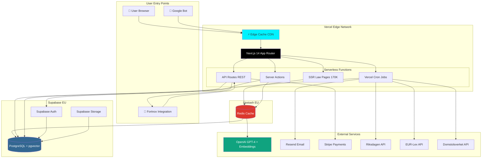

# Laglig.se Fullstack Architecture Document

**Version:** 1.0
**Status:** In Progress
**Last Updated:** 2025-11-04
**Owner:** Winston (Architect)

---

## Introduction

This document outlines the complete fullstack architecture for **Laglig.se**, including backend systems, frontend implementation, and their integration. It serves as the single source of truth for AI-driven development, ensuring consistency across the entire technology stack.

This unified approach combines what would traditionally be separate backend and frontend architecture documents, streamlining the development process for modern fullstack applications where these concerns are increasingly intertwined.

**Project Context:**
Laglig.se is a Swedish legal compliance SaaS platform targeting SMBs, ISO compliance managers, and public sector. The platform combines a comprehensive legal database (**170,000+ documents** including SFS laws, court cases, EU legislation) with AI-powered question answering, proactive change monitoring, and Kanban-style compliance workflows.

**Architectural Complexity Drivers:**
- **Massive SEO footprint:** 170,000+ server-rendered pages requiring sub-2s load times
- **RAG-powered AI:** Zero-hallucination requirement demands vector search + LLM orchestration
- **Dynamic onboarding:** Real-time law generation with conversational AI (3-5 contextual questions)
- **GDPR compliance:** Swedish legal domain with EU user data sovereignty requirements
- **Cost-conscious scaling:** Target 60% margins with AI costs at ~11% of revenue at scale

**Business Goals:**
- 10M SEK ARR within 18 months (83K SEK/month)
- 760+ paying customers
- SEO dominance (rank #1-3 for 100+ Swedish legal search terms, 50K monthly organic visitors)
- Fortnox integration by Month 9 (500 customers via partnership)

**Technical Approach:**
This architecture adopts a **Serverless Monolith (Vercel Edge + Functions)** with Next.js 14 App Router, Supabase PostgreSQL (pgvector), and OpenAI GPT-4 for RAG. The system prioritizes:
1. **Rapid MVP delivery** (solo-founder velocity)
2. **SEO-first rendering** (SSR for all 170K public pages)
3. **Cost-conscious AI** (pgvector avoids Pinecone costs until 100K queries/day)
4. **Clear scaling path** (identified triggers for migration to dedicated services)

**Scaling Horizons:**
- **0-1K users (Months 0-6):** Current architecture sufficient, Vercel free tier
- **1K-10K users (Months 6-12):** Supabase Pro tier ($25/mo), Vercel Pro ($20/mo)
- **10K-100K users (Months 12-24):** Migrate pgvector → Pinecone (NFR17), consider edge caching
- **100K+ users (Post-MVP):** Re-architect to microservices if needed

---

## 1.1 Starter Template or Existing Project

**Status:** Greenfield project - No starter template used

**Evaluated Options:**
1. **T3 Stack (create-t3-app)** - Next.js + tRPC + Prisma + Tailwind + NextAuth
   - ❌ **Rejected:** tRPC optimized for client-side mutations, not ideal for 170K SSR pages (REST/Server Actions better for CDN caching)
   - ✅ **Adopted pieces:** Prisma, Tailwind, NextAuth patterns (but not full T3 structure)

2. **Vercel Next.js Templates** - Various Vercel-maintained starters
   - ❌ **Rejected:** Generic blog/commerce templates don't address RAG, vector search, or legal content architecture

3. **Custom Architecture** ✅ **Selected**
   - Optimized for SEO-heavy content sites with AI
   - Addresses Swedish legal domain specifics (language, GDPR, multi-content-type database)
   - Allows clean integration of pgvector without template constraints

**Key Constraints from PRD:**
- **Platform:** Vercel (deployment) + Supabase (database + auth) - PRD Story 1.2, 1.3
- **Framework:** Next.js 14 App Router (not Pages Router) - PRD Story 1.1
- **Database:** PostgreSQL with pgvector extension - PRD Story 3.1
- **Monolith Structure:** Single Next.js application - PRD Repository Structure section

**Architectural Freedom:**
- Component organization patterns (PRD references shadcn/ui but not structure)
- State management (Zustand suggested, React Context also viable)
- Testing approach (Vitest + Playwright specified, but coverage targets flexible)

**Decision:** Proceed with custom architecture, borrowing patterns from T3 Stack (Prisma, type-safety) but not full template.

---

## 1.2 API Strategy Decision

**✅ CONFIRMED: Hybrid Approach**

**Server Actions (Internal Operations):**
- User authentication flows (login, signup, password reset)
- Form submissions (create law list, update workspace settings)
- Kanban drag-and-drop mutations (move card, update status)
- AI chat interactions (submit question, provide feedback)
- **Benefits:** Type-safe, no API routes, automatic revalidation, better DX

**REST API Routes (External Integrations):**
- Webhooks: `/api/webhooks/stripe`, `/api/webhooks/fortnox`
- Public data API: `/api/public/laws/:id`, `/api/public/search` (for future partners)
- Admin operations: `/api/admin/ingest`, `/api/admin/jobs`
- Cron jobs: `/api/cron/detect-changes`, `/api/cron/send-digests`
- **Benefits:** Standard HTTP, cacheable, external-integration-friendly, Vercel Cron compatible

**Implementation Pattern:**
```typescript
// Server Actions (app/actions/workspace.ts)
'use server'
export async function createWorkspace(formData: FormData) {
  const session = await getSession()
  // Type-safe, runs on server, auto-revalidates
  return prisma.workspace.create({ ... })
}

// REST API (app/api/webhooks/stripe/route.ts)
export async function POST(request: Request) {
  const signature = request.headers.get('stripe-signature')
  // Standard webhook handling, external access
  return NextResponse.json({ received: true })
}
```

**Rationale:**
- Server Actions for 90% of user-facing mutations (better DX, type safety)
- REST for 10% external/scheduled operations (webhooks, cron, public API)
- No tRPC (avoids complexity, App Router Server Actions are "tRPC-lite")

---

## 1.3 Change Log

| Date | Version | Description | Author |
|------|---------|-------------|--------|
| 2025-11-04 | 1.0 | Initial fullstack architecture document created | Winston (Architect) |
| 2025-11-04 | 1.0 | Confirmed hybrid API strategy (Server Actions + REST) | Winston (Architect) |

---

## 2. High Level Architecture

### 2.1 Technical Summary

Laglig.se implements a **Serverless Monolith** architecture deployed on Vercel's Edge Network, combining Next.js 14 App Router for frontend and API logic with Supabase PostgreSQL (pgvector) for data persistence and vector search. The application serves 170,000+ SEO-optimized legal document pages using Server-Side Rendering (SSR) while providing authenticated users with RAG-powered AI chat (OpenAI GPT-4), Kanban compliance workflows, and proactive law change monitoring. Frontend state management uses Zustand for global state (workspace, user session) and React Server Components for data fetching, eliminating most client-side API calls. Backend services leverage Vercel Cron for scheduled jobs (change detection, email digests), Supabase Auth for authentication, and Prisma ORM for type-safe database operations. This architecture achieves rapid solo-founder development velocity while maintaining clear scaling paths to dedicated vector databases (Pinecone) and microservices as traffic grows beyond 10K concurrent users.

---

### 2.2 Platform and Infrastructure Choice

**Selected Platform: Vercel + Supabase**

**Core Services:**
- **Hosting:** Vercel Edge Network (Next.js SSR + serverless functions)
- **Database:** Supabase PostgreSQL with pgvector extension (EU region)
- **Cache:** Upstash Redis (serverless, EU region)
- **Authentication:** Supabase Auth + NextAuth.js (hybrid approach)
- **File Storage:** Supabase Storage (document uploads, PDFs)
- **Email:** Resend (transactional) + React Email (templates)
- **AI Services:** OpenAI GPT-4 (RAG) + text-embedding-3-small (embeddings)
- **Payments:** Stripe
- **Monitoring:** Vercel Analytics + Sentry (error tracking)
- **Background Jobs:** Vercel Cron (daily change detection, digest emails)

**Deployment Host and Regions:**
- **Vercel:** Global Edge Network (automatic multi-region)
- **Supabase:** EU Central (Frankfurt) - GDPR compliance, Swedish data residency preference
- **OpenAI:** US East (unavoidable, API-based, no PII stored)

**Rationale for Vercel + Supabase:**

**Why Vercel:**
1. **Best-in-class Next.js hosting:** Zero-config SSR, automatic Edge optimization, built-in CDN
2. **Serverless functions:** No server management, auto-scaling, pay-per-request pricing
3. **DX velocity:** Preview deployments, instant rollbacks, GitHub integration
4. **SEO performance:** Edge rendering for 170K pages with sub-200ms TTFB
5. **Cost-effective at scale:** Free tier → $20/mo Pro → $40/mo Enterprise (covers 0-10K users)

**Why Supabase:**
1. **pgvector support:** Native PostgreSQL vector search (eliminates Pinecone costs until 100K queries/day)
2. **Integrated auth:** Supabase Auth handles JWT, sessions, password reset (reduces auth complexity)
3. **Real-time capabilities:** WebSocket support for future live collaboration features
4. **PostgreSQL reliability:** Battle-tested RDBMS, not NoSQL complexity
5. **EU hosting:** GDPR-compliant data residency for Swedish B2B customers
6. **Developer-friendly:** Auto-generated REST API, migrations, studio UI

**Alternative Considered: AWS Full Stack**
- ❌ **Rejected:** Higher complexity (Lambda, API Gateway, RDS, Cognito, S3 = 5+ services vs. 2)
- ❌ **Slower setup:** Weeks of infrastructure config vs. hours with Vercel/Supabase
- ✅ **Future migration path:** Can migrate to AWS if enterprise customers require private cloud (post-MVP)

**Alternative Considered: Azure**
- ❌ **Rejected:** No pgvector equivalent in Azure Database for PostgreSQL (requires VM + self-managed)
- ❌ **Overkill:** Azure optimized for .NET/Enterprise, not Next.js startups

**Alternative Considered: Self-Hosted (VPS)**
- ❌ **Rejected:** Operations burden (server maintenance, security patches, backups) unacceptable for solo founder
- ❌ **Cost savings minimal:** $50/mo VPS vs. $45/mo (Vercel + Supabase) - not worth DevOps time

**Decision:** Vercel + Supabase optimizes for **development velocity** (critical for solo founder) and **predictable costs** while maintaining enterprise-grade reliability.

---

### 2.3 Repository Structure

**Structure:** Monolith (Single Next.js Application)

**Monorepo Tool:** Not applicable - Simple npm/pnpm workspace (no Turborepo/Nx)

**Package Organization:** Flat structure within single Next.js app

**Rationale:**
- **No separate packages needed:** All code runs in Next.js context (no mobile app, no separate admin portal)
- **Shared types via `lib/types/`:** TypeScript interfaces shared between frontend and backend without monorepo complexity
- **Future-proof:** Can migrate to Turborepo if admin portal or mobile app enters scope (Month 12+)
- **Solo founder velocity:** Simpler mental model, fewer build configs, faster iteration

**Repository Structure:**
```
laglig_se/
├── .github/                    # CI/CD workflows
│   └── workflows/
│       ├── ci.yaml             # Lint, type-check, test
│       └── deploy.yaml         # Vercel deployment
├── app/                        # Next.js 14 App Router
│   ├── (auth)/                 # Auth routes (login, signup)
│   ├── (dashboard)/            # Protected dashboard routes
│   │   ├── dashboard/
│   │   ├── kanban/
│   │   ├── ai-chat/
│   │   └── settings/
│   ├── (public)/               # Public SEO pages
│   │   ├── lagar/              # 170K law pages
│   │   │   └── [slug]/page.tsx # Dynamic SSR
│   │   ├── domstolsavgoranden/ # Court cases
│   │   └── eu-ratt/            # EU legislation
│   ├── actions/                # Server Actions
│   │   ├── auth.ts
│   │   ├── workspace.ts
│   │   └── kanban.ts
│   ├── api/                    # REST API routes
│   │   ├── webhooks/
│   │   │   ├── stripe/
│   │   │   └── fortnox/
│   │   ├── cron/               # Vercel Cron jobs
│   │   │   ├── detect-changes/
│   │   │   └── send-digests/
│   │   └── public/             # Public API
│   │       └── search/
│   ├── layout.tsx              # Root layout
│   └── page.tsx                # Landing page
├── components/                 # React components
│   ├── ui/                     # shadcn/ui components
│   │   ├── button.tsx
│   │   ├── card.tsx
│   │   └── ...
│   ├── law/                    # Law-specific components
│   │   ├── LawCard.tsx
│   │   ├── LawDetailTabs.tsx
│   │   └── ChangeTimeline.tsx
│   ├── kanban/                 # Kanban components
│   │   ├── Board.tsx
│   │   ├── Column.tsx
│   │   └── Card.tsx
│   ├── ai-chat/                # AI chat components
│   │   ├── ChatInterface.tsx
│   │   ├── MessageList.tsx
│   │   └── ChatInput.tsx
│   └── layouts/                # Layout components
│       ├── DashboardLayout.tsx
│       ├── Sidebar.tsx
│       └── Header.tsx
├── lib/                        # Shared utilities
│   ├── types/                  # TypeScript interfaces (shared)
│   │   ├── law.ts
│   │   ├── user.ts
│   │   └── workspace.ts
│   ├── db/                     # Database utilities
│   │   ├── prisma.ts           # Prisma client singleton
│   │   └── queries/            # Reusable queries
│   ├── ai/                     # AI utilities
│   │   ├── rag.ts              # RAG orchestration
│   │   ├── embeddings.ts       # OpenAI embeddings
│   │   └── prompts.ts          # Prompt templates
│   ├── auth/                   # Auth utilities
│   │   ├── session.ts
│   │   └── permissions.ts
│   ├── email/                  # Email utilities
│   │   ├── resend.ts
│   │   └── templates/          # React Email templates
│   └── utils/                  # General utilities
│       ├── sni.ts              # SNI industry code logic
│       ├── date.ts
│       └── validation.ts
├── prisma/                     # Database schema
│   ├── schema.prisma
│   ├── migrations/
│   └── seed.ts
├── scripts/                    # Build/maintenance scripts
│   ├── ingest-laws.ts          # Riksdagen API ingestion
│   ├── ingest-court-cases.ts
│   ├── ingest-eu.ts
│   └── generate-embeddings.ts
├── public/                     # Static assets
│   ├── images/
│   └── fonts/
├── tests/                      # Tests
│   ├── unit/                   # Vitest unit tests
│   ├── integration/            # Playwright e2e tests
│   └── fixtures/               # Test data
├── docs/                       # Documentation
│   ├── prd.md
│   ├── front-end-spec.md
│   └── architecture.md         # This file
├── .env.example                # Environment template
├── .env.local                  # Local environment (gitignored)
├── next.config.js              # Next.js configuration
├── tailwind.config.ts          # Tailwind configuration
├── tsconfig.json               # TypeScript configuration
├── package.json                # Dependencies
└── README.md
```

**Key Design Decisions:**
1. **App Router route groups:** `(auth)`, `(dashboard)`, `(public)` for logical organization without affecting URLs
2. **Server Actions in `app/actions/`:** Co-located with routes but organized by domain
3. **Shared types in `lib/types/`:** Single source of truth for TypeScript interfaces
4. **Separate `scripts/` for ingestion:** Long-running data ingestion scripts outside Next.js app context

---

### 2.4 High Level Architecture Diagram



**Diagram Key:**
- **Edge Cache:** Vercel CDN caches SSR pages (170K law pages) for fast global delivery
- **Next.js App Router:** Central application handling all requests
- **Serverless Functions:** Auto-scaling compute for SSR, mutations, webhooks, cron jobs
- **PostgreSQL + pgvector:** Single database for all data (users, laws, embeddings, chat history)
- **OpenAI:** RAG queries (semantic search + GPT-4 completion)
- **Cron Jobs:** Daily change detection, digest emails (8:00 CET)

**Data Flow Examples:**
1. **SEO User:** GoogleBot → Edge Cache → SSR → Redis (metadata cache) → PostgreSQL → Cached HTML
2. **Authenticated User:** Browser → Server Action → Redis (check cache) → PostgreSQL → Revalidate
3. **AI Chat (Cache Hit):** Browser → Server Action → Redis (return cached response <10ms) → No OpenAI call → Response
4. **AI Chat (Cache Miss):** Browser → Server Action → Redis miss → PostgreSQL (vector search) → OpenAI GPT-4 → Cache result → Response
5. **Change Detection:** Cron Job → Riksdagen API → PostgreSQL → Redis (invalidate caches) → Resend Email

---

### 2.5 Architectural Patterns

This architecture follows several proven patterns to ensure maintainability, scalability, and developer velocity:

**1. Jamstack Architecture (Hybrid)**
- **Description:** Pre-rendered static pages (170K law pages) with dynamic API routes for authenticated features
- **Implementation:** Next.js SSR generates static HTML at build time for `/lagar/:slug`, caches at Edge, dynamic dashboard routes rendered on-demand
- **Rationale:** Optimal SEO (Google indexes static HTML instantly), fast global delivery (CDN), reduced server load (90% of traffic hits cached pages)

**2. Backend-for-Frontend (BFF) via Server Actions**
- **Description:** Server-side logic co-located with React components, no client-side API calls needed
- **Implementation:** `'use server'` functions in `app/actions/` called directly from components, automatic serialization
- **Rationale:** Type safety across frontend-backend boundary, eliminates API versioning complexity, reduces network round-trips (no REST for mutations)

**3. Repository Pattern (Data Access Layer)**
- **Description:** Abstract database queries behind reusable functions
- **Implementation:** `lib/db/queries/` contains functions like `getLawBySlug()`, `searchLaws()`, `getUserWorkspaces()` wrapping Prisma
- **Rationale:** Testable data access, enables future database migration (e.g., Supabase → AWS RDS), prevents N+1 queries through centralized optimization

**4. RAG (Retrieval-Augmented Generation) Pattern**
- **Description:** LLM responses grounded in retrieved document chunks to prevent hallucination
- **Implementation:** User question → pgvector similarity search (top 5 chunks) → GPT-4 prompt with context → cited answer
- **Rationale:** Zero-hallucination requirement (Swedish legal accuracy critical), lower cost than fine-tuning, dynamic corpus (laws change weekly)

**5. Command Query Responsibility Segregation (CQRS-Lite)**
- **Description:** Separate read paths (SSR, API GET) from write paths (Server Actions, API POST)
- **Implementation:** Read: PostgreSQL direct queries with Prisma (optimized for speed). Write: Server Actions with revalidation triggers
- **Rationale:** Read-heavy workload (170K pages, 10:1 read/write ratio), allows independent scaling of reads (Edge cache) vs. writes (serverless functions)

**6. Event-Driven Background Jobs**
- **Description:** Asynchronous processing of time-intensive tasks (change detection, email digests)
- **Implementation:** Vercel Cron triggers `/api/cron/detect-changes` daily, upserts changes to `content_changes` table, queues digest emails
- **Rationale:** Prevents blocking user requests, distributes compute load (change detection takes 2-3 hours), ensures reliable delivery (retry logic)

**7. Multi-Tenancy via Workspace Pattern**
- **Description:** User → Workspace → Law Lists (1:many:many relationship)
- **Implementation:** All queries scoped by `workspace_id`, Row-Level Security (RLS) in Supabase enforces tenant isolation
- **Rationale:** Supports team plans (Pro/Enterprise), data isolation between customers, enables Fortnox bulk provisioning (1 Fortnox customer = 1 workspace)

**8. Progressive Enhancement (Frontend)**
- **Description:** Core functionality works without JavaScript, enhanced with JS
- **Implementation:** Forms use native `<form action={serverAction}>` (works without JS), client-side enhancements (validation, optimistic updates) layered on top
- **Rationale:** Accessibility (screen readers), resilience (JS fails gracefully), SEO (search engines execute less JS)

**9. Strangler Fig Pattern (External APIs)**
- **Description:** Gradually replace external API dependencies with internal implementations
- **Implementation:** Initially call Riksdagen API directly, later cache responses in PostgreSQL, eventually scrape if API unreliable
- **Rationale:** Mitigates third-party API risk (Riksdagen downtime, rate limits), improves response time (local cache), reduces external dependencies over time

**10. API Gateway Pattern (Future)**
- **Description:** Single entry point for all external integrations (Fortnox, webhooks, public API)
- **Implementation:** `/api/v1/*` routes with centralized auth, rate limiting (10 req/sec), logging
- **Rationale:** Prepares for Fortnox integration (Month 9), public API monetization (post-MVP), consistent auth/rate limiting across integrations

---

### 2.6 AI/RAG Technology Stack Detail

Given the central importance of AI/RAG to Laglig.se's value proposition, this subsection details the specific AI technologies and implementation approach:

**RAG Framework: Vercel AI SDK + Custom Pipeline**

**Vercel AI SDK:**
- **Purpose:** React hooks for streaming AI responses, unified API across LLM providers
- **Key Feature:** `useChat()` hook for streaming text generation with automatic state management
- **Implementation:**
  ```typescript
  // components/ai-chat/ChatInterface.tsx
  import { useChat } from 'ai/react'

  const { messages, input, handleSubmit, isLoading } = useChat({
    api: '/api/chat',
    body: { lawIds: contextLawIds } // Pass context
  })
  ```
- **Why:** Provides streaming UI out-of-the-box, handles message history, optimistic updates, error recovery

**Semantic Chunking: LangChain + Custom Logic**

**LangChain (Optional):**
- **Use Case:** Document splitting utilities, text transformers
- **Alternative:** Custom implementation for content-type-specific chunking (see below)

**Content-Type-Specific Chunking Strategy (PRD Story 2.10):**
```typescript
// lib/ai/chunking.ts
const chunkingStrategies = {
  SFS_LAW: {
    method: 'semantic_section',  // Chunk by § (section)
    maxTokens: 500,
    overlap: 50,
    preserveContext: ['chapter_number', 'law_title']
  },
  COURT_CASE: {
    method: 'semantic_section',  // Facts / Analysis / Conclusion
    maxTokens: 800,
    overlap: 50,
    preserveContext: ['court_name', 'case_number', 'section_type']
  },
  EU_REGULATION: {
    method: 'article',           // Chunk by article
    maxTokens: 500,
    overlap: 50,
    preserveContext: ['article_number', 'celex']
  },
  EU_DIRECTIVE: {
    method: 'article',           // Chunk by article, preserve recitals
    maxTokens: 500,
    overlap: 50,
    preserveContext: ['article_number', 'recitals']
  }
}
```

**Why Content-Type-Specific:**
- **SFS Laws:** Legal § (section) is natural semantic boundary
- **Court Cases:** Facts/Analysis/Conclusion sections have different retrieval relevance
- **EU Legislation:** Articles are self-contained, but recitals provide context
- **Result:** Better retrieval accuracy (relevant chunks per document type)

**Vector Database: PostgreSQL pgvector with HNSW Index**

**pgvector Configuration:**
```sql
-- Enable extension
CREATE EXTENSION IF NOT EXISTS vector;

-- Create embeddings table
CREATE TABLE law_embeddings (
  id UUID PRIMARY KEY DEFAULT gen_random_uuid(),
  law_id UUID REFERENCES legal_documents(id),
  chunk_text TEXT NOT NULL,
  embedding vector(1536),  -- OpenAI text-embedding-3-small dimensions
  metadata JSONB,
  created_at TIMESTAMP DEFAULT NOW()
);

-- Create HNSW index for fast similarity search
CREATE INDEX ON law_embeddings
USING hnsw (embedding vector_cosine_ops)
WITH (m = 16, ef_construction = 64);
```

**Index Choice: HNSW (Hierarchical Navigable Small World)**
- **Why HNSW over IVFFlat:**
  - HNSW: Better query performance (<100ms), higher accuracy, no training needed
  - IVFFlat: Faster inserts but requires training, lower accuracy
  - **Decision:** HNSW for query-heavy workload (10:1 read/write ratio)

**Embedding Model: OpenAI text-embedding-3-small**
- **Dimensions:** 1536
- **Cost:** $0.02 / 1M tokens (~$200 for 100M token corpus)
- **Why small over large:** Cost (10x cheaper), sufficient accuracy for Swedish legal text
- **Performance:** ~3-4 hours to embed 170K documents (batched at 1,000 requests/minute per OpenAI rate limit)

**Batch Processing Strategy:**
```typescript
// scripts/generate-embeddings.ts
async function batchEmbeddings(documents: LegalDocument[]) {
  const BATCH_SIZE = 100 // OpenAI supports up to 2048
  const RATE_LIMIT = 1000 // requests per minute

  for (let i = 0; i < documents.length; i += BATCH_SIZE) {
    const batch = documents.slice(i, i + BATCH_SIZE)

    // Batch API call
    const embeddings = await openai.embeddings.create({
      model: 'text-embedding-3-small',
      input: batch.map(d => d.chunk_text)
    })

    // Store in database
    await prisma.lawEmbedding.createMany({
      data: embeddings.data.map((emb, idx) => ({
        lawId: batch[idx].id,
        embedding: emb.embedding,
        chunkText: batch[idx].chunk_text
      }))
    })

    // Rate limit: 1000 req/min = 1 batch every 60ms
    if (i + BATCH_SIZE < documents.length) {
      await sleep(60)
    }

    console.log(`Embedded ${i + BATCH_SIZE}/${documents.length}`)
  }
}
```

**RAG Query Pipeline Implementation:**

```typescript
// lib/ai/rag.ts
export async function ragQuery(
  userQuery: string,
  contextLawIds?: string[]
) {
  // 1. Generate query embedding
  const queryEmbedding = await openai.embeddings.create({
    model: 'text-embedding-3-small',
    input: userQuery
  })

  // 2. Vector similarity search (top 10 chunks)
  const relevantChunks = contextLawIds
    ? await prisma.$queryRaw`
        SELECT
          le.chunk_text,
          ld.title,
          ld.document_number,
          1 - (le.embedding <=> ${queryEmbedding}::vector) as similarity
        FROM law_embeddings le
        JOIN legal_documents ld ON le.law_id = ld.id
        WHERE le.law_id = ANY(${contextLawIds})
        ORDER BY le.embedding <=> ${queryEmbedding}::vector
        LIMIT 10
      `
    : await prisma.$queryRaw`
        SELECT
          le.chunk_text,
          ld.title,
          ld.document_number,
          1 - (le.embedding <=> ${queryEmbedding}::vector) as similarity
        FROM law_embeddings le
        JOIN legal_documents ld ON le.law_id = ld.id
        ORDER BY le.embedding <=> ${queryEmbedding}::vector
        LIMIT 10
      `

  // 3. Construct GPT-4 prompt with retrieved context
  const systemPrompt = `You are a Swedish legal assistant. ONLY answer from the provided law excerpts.
  Always cite sources using [1], [2] notation. If information is not in the provided context,
  respond "Jag har inte tillräcklig information för att svara på det."`

  const userPrompt = `Context:
${relevantChunks.map((c, i) => `[${i+1}] ${c.title} (${c.document_number}): ${c.chunk_text}`).join('\n\n')}

User Question: ${userQuery}`

  // 4. Stream GPT-4 response via Vercel AI SDK
  const stream = await openai.chat.completions.create({
    model: 'gpt-4',
    messages: [
      { role: 'system', content: systemPrompt },
      { role: 'user', content: userPrompt }
    ],
    stream: true
  })

  return { stream, citations: relevantChunks }
}
```

**RAG Performance Targets (NFR2, NFR9):**
- **Latency:** <3 seconds end-to-end (embedding + vector search + GPT-4 generation)
- **Hallucination Rate:** <5% (achieved through strict "ONLY from context" prompt)
- **Citation Coverage:** 100% (every answer must cite sources)
- **Cache Hit Rate:** 75%+ for repeated queries (Redis cache for common questions)

**Why This Approach:**
1. **Vercel AI SDK:** Handles streaming complexity, React integration, error recovery
2. **pgvector:** Avoids $70/mo Pinecone cost until 100K queries/day (NFR17)
3. **Content-type chunking:** Improves retrieval accuracy by respecting document structure
4. **HNSW index:** Query performance <100ms vs. 500ms+ with IVFFlat
5. **text-embedding-3-small:** 10x cheaper than text-embedding-3-large, sufficient for Swedish legal text

**Scaling Triggers:**
- **Migrate to Pinecone:** If pgvector query latency >500ms or storage >100GB
- **Add Claude:** If GPT-4 quality insufficient for Swedish nuance (Anthropic has better multilingual performance)

---

### 2.7 Redis Cache Strategy

**Redis Provider: Upstash Redis (Serverless)**

**Why Upstash:**
- **Serverless pricing:** Pay-per-request, no idle costs (Vercel-friendly)
- **EU region:** Frankfurt (GDPR compliance)
- **REST API:** Works with Vercel Edge Functions (no TCP required)
- **Cost:** Free tier (10K requests/day), $0.20 per 100K requests after
- **Alternative rejected:** Redis Labs ($5/mo minimum) requires TCP (not Edge-compatible)

**Cache Strategy:**

**1. RAG Query Cache (High Priority)**
```typescript
// lib/ai/cache.ts
import { Redis } from '@upstash/redis'

const redis = Redis.fromEnv()

async function cachedRagQuery(userQuery: string, contextLawIds?: string[]) {
  const cacheKey = `rag:${hashQuery(userQuery)}:${contextLawIds?.sort().join(',')}`

  // Check cache first (TTL: 7 days)
  const cached = await redis.get(cacheKey)
  if (cached) return cached

  // Cache miss - perform RAG query
  const result = await ragQuery(userQuery, contextLawIds)

  // Cache result
  await redis.setex(cacheKey, 604800, result) // 7 days
  return result
}
```

**What to cache:**
- **RAG responses:** Full AI answers + citations (7 day TTL)
- **Query embeddings:** User query embeddings (30 day TTL, rarely change)
- **Law metadata:** Law titles, SFS numbers, categories (permanent until law changes)
- **Search results:** Full-text search results (1 hour TTL)

**What NOT to cache:**
- **User-specific data:** Workspace settings, user profiles (Supabase Auth handles sessions)
- **Real-time data:** Kanban card positions, chat history (too volatile)
- **Personalized law lists:** Different per user (cache invalidation complexity)

**2. Law Metadata Cache (Medium Priority)**
```typescript
// Cache law metadata for SSR pages
async function getLawMetadata(slug: string) {
  const cacheKey = `law:meta:${slug}`
  const cached = await redis.get(cacheKey)
  if (cached) return cached

  const law = await prisma.legalDocument.findUnique({ where: { slug } })

  // Cache permanently (invalidate on law update)
  await redis.set(cacheKey, law)
  return law
}
```

**3. Search Results Cache (Low Priority)**
```typescript
// Cache search results for common queries
async function cachedSearch(query: string, filters: SearchFilters) {
  const cacheKey = `search:${hashQuery(query)}:${JSON.stringify(filters)}`
  const cached = await redis.get(cacheKey)
  if (cached) return cached

  const results = await performSearch(query, filters)

  // Short TTL (search corpus changes daily)
  await redis.setex(cacheKey, 3600, results) // 1 hour
  return results
}
```

**Cache Invalidation Strategy:**

**Event-driven invalidation with Redis Sets (Optimized):**
```typescript
// When caching RAG response, track the relationship
async function cacheRagResponse(lawId: string, query: string, response: any) {
  const cacheKey = `rag:${hashQuery(query)}:${lawId}`

  // Store response
  await redis.setex(cacheKey, 604800, response) // 7 days

  // Track this key belongs to this law (for O(1) invalidation)
  await redis.sadd(`law:${lawId}:cache_keys`, cacheKey)
}

// When law changes, invalidate efficiently (O(1) lookup, not O(N) scan)
async function invalidateLawCache(lawId: string) {
  const law = await prisma.legalDocument.findUnique({ where: { id: lawId } })

  // Get all cache keys for this law (O(1) vs redis.keys() O(N))
  const cacheKeys = await redis.smembers(`law:${lawId}:cache_keys`)

  if (cacheKeys.length) {
    // Delete all related caches in single pipeline
    const pipeline = redis.pipeline()
    cacheKeys.forEach(key => pipeline.del(key))
    pipeline.del(`law:${lawId}:cache_keys`) // Delete the set itself
    await pipeline.exec()
  }

  // Invalidate law metadata
  await redis.del(`law:meta:${law.slug}`)

  // Invalidate search results (flush all - rare operation)
  const searchKeys = await redis.keys('search:*') // Acceptable here: infrequent
  if (searchKeys.length) await redis.del(...searchKeys)
}
```

**Why Sets over keys():**
- `redis.keys('rag:*')` scans entire keyspace (O(N), blocks Redis at scale)
- `redis.smembers('law:123:cache_keys')` is O(1) lookup + O(K) deletion where K = keys per law (~10-50)
- At 100K cached queries, keys() takes seconds; Sets approach takes milliseconds

**Performance Targets (NFR3):**
- **Cache hit rate:** 75%+ for RAG queries (target from PRD)
- **Cache latency:** <10ms for Upstash REST API (EU region)
- **Cost impact:** ~$20/mo at 10K users (100K cached queries/day)
- **Savings:** $300/mo in OpenAI API costs (avoid repeated embeddings/GPT-4 calls)

**Why This Approach:**
1. **Upstash REST API:** Compatible with Vercel Edge Functions (no TCP connection)
2. **Aggressive RAG caching:** Same question = same answer (deterministic RAG)
3. **Event-driven invalidation:** Only flush cache when law actually changes (rare)
4. **Cost-effective:** $20/mo Redis saves $300/mo OpenAI costs (15x ROI)

---

### 2.8 State Management Strategy

**Recommendation: Hybrid Approach (React Context + Zustand)**

**Rationale:**
Next.js 14 App Router with Server Components + Server Actions significantly reduces need for client-side state. However, certain features (Kanban drag-and-drop, user session) require client state. A hybrid approach optimizes for performance and developer experience:

**1. React Context for Global Slow-Changing State**

**Use Case:** User session, workspace, permissions
**Why Context:** Infrequent updates (only on login/logout/workspace switch), minimal re-renders, no bundle overhead

**Implementation:**
```typescript
// app/providers/SessionProvider.tsx
'use client'
import { createContext, useContext, ReactNode } from 'react'

type SessionContextType = {
  user: User | null
  workspace: Workspace | null
  permissions: Permission[]
}

const SessionContext = createContext<SessionContextType | null>(null)

export function SessionProvider({
  children,
  session
}: {
  children: ReactNode
  session: SessionContextType
}) {
  return (
    <SessionContext.Provider value={session}>
      {children}
    </SessionContext.Provider>
  )
}

export function useSession() {
  const context = useContext(SessionContext)
  if (!context) throw new Error('useSession must be used within SessionProvider')
  return context
}
```

**What goes in Context:**
- ✅ User profile (name, email, avatar)
- ✅ Active workspace (workspace_id, name, tier)
- ✅ Permissions (canEditKanban, canInviteUsers)
- ❌ NOT: Kanban state (too volatile)
- ❌ NOT: Chat messages (managed by Vercel AI SDK)

**2. Zustand for Complex Local State (Kanban Board)**

**Use Case:** Kanban drag-and-drop, optimistic updates, column/card management
**Why Zustand:** High-frequency updates, selective subscriptions (no unnecessary re-renders), persistence middleware, small bundle (~2KB)

**Implementation:**
```typescript
// lib/stores/kanbanStore.ts
import { create } from 'zustand'
import { persist } from 'zustand/middleware'

type KanbanState = {
  columns: Column[]
  cards: Card[]
  draggedCard: Card | null
  moveCard: (cardId: string, targetColumnId: string) => void
  optimisticUpdate: (cardId: string, updates: Partial<Card>) => void
}

export const useKanbanStore = create<KanbanState>()(
  persist(
    (set, get) => ({
      columns: [],
      cards: [],
      draggedCard: null,

      moveCard: (cardId, targetColumnId) => {
        const originalColumnId = get().cards.find(c => c.id === cardId)?.columnId

        // Optimistic update (instant UI feedback)
        set(state => ({
          cards: state.cards.map(card =>
            card.id === cardId ? { ...card, columnId: targetColumnId, syncing: true } : card
          )
        }))

        // Background sync (Server Action)
        moveCardAction(cardId, targetColumnId)
          .then(() => {
            // Mark as synced
            set(state => ({
              cards: state.cards.map(card =>
                card.id === cardId ? { ...card, syncing: false } : card
              )
            }))
          })
          .catch(() => {
            // Rollback on error
            set(state => ({
              cards: state.cards.map(card =>
                card.id === cardId ? { ...card, columnId: originalColumnId, syncing: false } : card
              )
            }))
            toast.error('Kunde inte flytta kortet. Ändringarna sparades inte.')
          })
      },

      optimisticUpdate: (cardId, updates) => {
        set(state => ({
          cards: state.cards.map(card =>
            card.id === cardId ? { ...card, ...updates } : card
          )
        }))
      }
    }),
    {
      name: 'kanban-storage',
      partialize: (state) => ({ columns: state.columns, cards: state.cards }) // Don't persist draggedCard
    }
  )
)
```

**What goes in Zustand:**
- ✅ Kanban columns, cards, drag state
- ✅ Optimistic updates (instant UI feedback)
- ✅ Persistence (localStorage for offline resilience)
- ❌ NOT: User session (Context handles this)
- ❌ NOT: Law data (Server Components fetch directly)

**⚠️ Security Warning:**
```typescript
// localStorage can be read by XSS attacks - never persist sensitive data
partialize: (state) => ({
  columns: state.columns,     // ✅ Safe (UI metadata only)
  cardPositions: state.cards.map(c => ({
    id: c.id,                 // ✅ Safe (reference only)
    columnId: c.columnId      // ✅ Safe (UI state)
  }))
  // ❌ DON'T persist: law content, user PII, API tokens
})
```
- **Never persist:** User PII, law content, API tokens
- **Safe to persist:** Column order, card IDs (references), UI preferences
- **Best practice:** Only persist UI state, fetch sensitive data from server on load

**Why Zustand over Context for Kanban:**
- **Performance:** Zustand allows selective subscriptions (`useKanbanStore(state => state.draggedCard)` only re-renders when draggedCard changes)
- **Context problem:** All consumers re-render on any state change (dragging 1 card would re-render entire Kanban board)
- **Middleware:** Zustand persist middleware handles localStorage sync automatically

**3. Vercel AI SDK (useChat) for AI Chat State**

**Use Case:** Chat messages, streaming state, error handling
**Why Built-in:** Vercel AI SDK `useChat()` hook already manages this perfectly

**Implementation:**
```typescript
// components/ai-chat/ChatInterface.tsx
import { useChat } from 'ai/react'

export function ChatInterface({ lawIds }: { lawIds: string[] }) {
  const { messages, input, handleSubmit, isLoading, error } = useChat({
    api: '/api/chat',
    body: { lawIds }
  })

  // No additional state management needed!
  return (
    <div>
      <MessageList messages={messages} />
      <ChatInput
        value={input}
        onSubmit={handleSubmit}
        isLoading={isLoading}
      />
      {error && <ErrorToast error={error} />}
    </div>
  )
}
```

**What useChat manages:**
- ✅ Message history (automatically synced)
- ✅ Streaming state (word-by-word display)
- ✅ Loading states (isLoading flag)
- ✅ Error handling (error object)
- ✅ Optimistic updates (message appears instantly)

**4. Local useState/useReducer for UI Ephemeral State**

**Use Case:** Modals, dropdowns, tooltips, form state
**Why Local:** No need for global store, component-specific, garbage collected automatically

**Implementation:**
```typescript
// components/ui/Modal.tsx
export function Modal({ children, trigger }: ModalProps) {
  const [isOpen, setIsOpen] = useState(false)

  return (
    <>
      {trigger({ onClick: () => setIsOpen(true) })}
      {isOpen && (
        <Dialog open={isOpen} onOpenChange={setIsOpen}>
          {children}
        </Dialog>
      )}
    </>
  )
}
```

**What stays local:**
- ✅ Modal open/closed
- ✅ Dropdown expanded
- ✅ Form input values (before submission)
- ✅ Tooltip visibility

---

**State Management Decision Matrix:**

| State Type | Solution | Why |
|------------|----------|-----|
| User session, workspace | **React Context** | Slow-changing, global access, minimal re-renders |
| Kanban board state | **Zustand** | High-frequency updates, optimistic UI, selective subscriptions |
| AI chat messages | **Vercel AI SDK** | Built-in, handles streaming/errors perfectly |
| UI ephemeral state | **useState/useReducer** | Component-local, auto garbage-collected |
| Law data fetching | **Server Components** | No client state needed, SSR by default |
| Form state | **React Hook Form** | Uncontrolled inputs, better performance than useState |

**Why NOT Full Zustand:**
- React Server Components eliminate most client state needs
- Server Actions replace client-side API calls (no useEffect + useState for data fetching)
- Context sufficient for slow-changing global state
- Zustand adds 2KB bundle - only use where performance critical

**Why NOT Just Context:**
- Context re-renders all consumers on any change
- Kanban board has frequent updates (drag operations) - Context causes performance issues
- Zustand allows selector-based subscriptions (only re-render what changed)

**Bundle Impact:**
- React Context: 0KB (built-in)
- Zustand: 2KB gzipped
- Vercel AI SDK: 5KB gzipped (already required for chat)
- **Total:** 7KB for state management (acceptable)

**Alternative Considered: Jotai**
- ❌ **Rejected:** Similar to Zustand but atom-based API more complex for Kanban use case
- ❌ **No persistence middleware:** Would need custom implementation

**Alternative Considered: Redux Toolkit**
- ❌ **Rejected:** 15KB bundle (7x larger than Zustand), unnecessary boilerplate for this app
- ❌ **Overkill:** Redux useful for complex state machines, not needed here

**Decision:** Hybrid approach (Context + Zustand + Vercel AI SDK) balances performance, developer experience, and bundle size.

---

### 2.9 Cost Breakdown & Scaling Economics

**Monthly Infrastructure Costs by Scale:**

**Stage 1: 0-1,000 MAU (Months 0-6) - MVP Launch**
- **Vercel:** Free tier (100GB bandwidth, 100 serverless execution hours)
- **Supabase:** Free tier (500MB database, 2GB bandwidth, 50K monthly active users)
- **Upstash Redis:** Free tier (10K requests/day)
- **OpenAI API:** ~$50/mo (500 AI queries/day average @ $0.10/query including embeddings)
- **Resend:** Free tier (3,000 emails/month)
- **Stripe:** $0 (no transactions yet, just integrations)
- **Sentry:** Free tier (5K errors/month)
- **Total: ~$50/mo** (OpenAI only)
- **Revenue at Month 6:** ~10K SEK/mo (~$1,000/mo, 10-20 paying customers)
- **Gross Margin:** 95%

**Stage 2: 1,000-10,000 MAU (Months 6-12) - Growth Phase**
- **Vercel Pro:** $20/mo (1TB bandwidth, faster builds, team features)
- **Supabase Pro:** $25/mo (8GB database, 250GB bandwidth, dedicated compute)
- **Upstash Redis:** ~$20/mo (100K requests/day, 75% cache hit rate target)
- **OpenAI API:** ~$500/mo (5,000 AI queries/day avg, caching reduces repeat costs by 75%)
  - Without cache: $2,000/mo
  - With 75% hit rate: $500/mo (saves $1,500/mo)
- **Resend:** ~$10/mo (30,000 emails/month for digests + notifications)
- **Stripe:** 1.9% + 1.25 SEK per transaction (~$50/mo in fees on 40K SEK revenue)
- **Sentry:** $26/mo (50K errors/month)
- **Total: ~$651/mo**
- **Revenue at Month 12:** ~40K SEK/mo (~$4,000/mo, 40-60 paying customers)
- **Gross Margin:** 84%

**Stage 3: 10,000-100,000 MAU (Months 12-18) - Scale Phase**
- **Vercel Pro:** $40/mo (higher limits, edge config)
- **Supabase Team:** $599/mo (dedicated compute, point-in-time recovery, higher limits)
- **Upstash Redis:** ~$200/mo (1M requests/day)
- **OpenAI API:** ~$2,000/mo (50K AI queries/day, 75% cache hit rate)
  - Without cache: $8,000/mo
  - With 75% hit rate: $2,000/mo (saves $6,000/mo - Redis ROI 30x!)
- **Resend:** ~$100/mo (300,000 emails/month)
- **Stripe:** ~$500/mo in fees (on 250K SEK revenue)
- **Sentry:** $99/mo (500K errors/month)
- **Total: ~$3,538/mo**
- **Revenue at Month 18:** 83K SEK/mo (~$8,300/mo = 10M SEK ARR target)
- **Gross Margin:** 57%

**At 10M SEK ARR Target (Month 18):**
- **Monthly Revenue:** 83K SEK (~$8,300)
- **Infrastructure Costs:** ~$3,538/mo
- **Gross Margin:** 57% (below 60% target but within acceptable range)
- **Cost Breakdown:**
  - OpenAI API: 57% of infrastructure spend ($2K of $3.5K)
  - Supabase: 17% ($600)
  - Upstash Redis: 6% ($200)
  - Other services: 20% ($738)

**Cost Optimization Strategies:**

**Trigger 1: Migrate to Pinecoe when pgvector query latency >500ms**
- Currently: pgvector free (included in Supabase)
- Pinecone: $70/mo for 100K vectors
- **Trigger:** When query latency consistently >500ms or database >50GB

**Trigger 2: Optimize OpenAI costs when monthly spend >$3K**
- Switch to Claude Sonnet ($0.003/1K tokens, 10x cheaper than GPT-4 for completions)
- Increase cache TTL from 7 days to 30 days (hit rate 75% → 85%)
- Pre-generate answers for top 1,000 common questions

**Trigger 3: Self-host Redis when Upstash >10M requests/day**
- Upstash at scale: ~$2,000/mo
- Redis Labs Cluster: $200/mo (self-managed)
- **Migration point:** Month 24+ (100K+ MAU)

**Revenue Sensitivity Analysis:**

**Best Case (Month 18): 15M SEK ARR**
- Infrastructure: Still ~$3.5K/mo (doesn't scale linearly with revenue)
- Gross Margin: 72%

**Worst Case (Month 18): 5M SEK ARR**
- Infrastructure: ~$2K/mo (lower tier, fewer AI queries)
- Gross Margin: 52%
- **Risk:** Below 60% margin target, need to optimize or increase pricing

**Key Cost Drivers to Monitor Weekly (NFR18):**
1. **OpenAI API costs per user:** Target <$0.50/user/month
2. **Cache hit rate:** Maintain >75% (每 10% drop = +$600/mo cost)
3. **Embedding regeneration frequency:** Minimize (each full re-embedding = $200)
4. **Email costs:** Target <$0.02/user/month (digests are expensive)

---

### 2.10 Resilience & Error Handling Strategy

**External Service Failure Modes:**

The architecture depends on 5 external services that can fail. Each requires specific resilience patterns:

**1. Supabase Database Unavailable (Rare but Critical)**

**Circuit Breaker Pattern:**
```typescript
// lib/db/resilience.ts
let dbFailureCount = 0
const FAILURE_THRESHOLD = 3
const CIRCUIT_TIMEOUT = 60000 // 60 seconds

async function queryWithCircuitBreaker<T>(queryFn: () => Promise<T>): Promise<T> {
  try {
    const result = await queryFn()
    dbFailureCount = 0 // Reset on success
    return result
  } catch (error) {
    dbFailureCount++

    if (dbFailureCount >= FAILURE_THRESHOLD) {
      // Circuit open - return cached data from Redis
      console.error('Circuit breaker OPEN - database unavailable')

      // Try Redis fallback
      const cached = await redis.get(`fallback:${queryFn.toString()}`)
      if (cached) return cached

      // No fallback available
      throw new Error('Service temporarily unavailable. Please try again in 1 minute.')
    }

    throw error
  }
}

// Reset circuit after timeout
setInterval(() => {
  if (dbFailureCount >= FAILURE_THRESHOLD) {
    dbFailureCount = FAILURE_THRESHOLD - 1 // Allow one test request
  }
}, CIRCUIT_TIMEOUT)
```

**Graceful Degradation:**
- Law pages: Serve from Edge cache (stale data OK for SEO)
- Dashboard: Show cached workspace state, disable writes
- AI Chat: Disable temporarily, show "Service unavailable" message

**2. OpenAI API Rate Limit or Timeout**

**Exponential Backoff with Jitter:**
```typescript
// lib/ai/resilience.ts
async function openAIWithRetry<T>(
  apiCall: () => Promise<T>,
  maxRetries = 3
): Promise<T> {
  for (let attempt = 0; attempt < maxRetries; attempt++) {
    try {
      return await apiCall()
    } catch (error) {
      const isRateLimit = error.code === 'rate_limit_exceeded'
      const isTimeout = error.code === 'timeout'
      const shouldRetry = (isRateLimit || isTimeout) && attempt < maxRetries - 1

      if (!shouldRetry) throw error

      // Exponential backoff: 1s, 2s, 4s + random jitter
      const baseDelay = 1000 * Math.pow(2, attempt)
      const jitter = Math.random() * 1000
      const delay = Math.min(baseDelay + jitter, 10000) // Max 10s

      console.warn(`OpenAI ${error.code}, retrying in ${delay}ms (attempt ${attempt + 1}/${maxRetries})`)
      await sleep(delay)
    }
  }
}

// Usage
const embedding = await openAIWithRetry(() =>
  openai.embeddings.create({
    model: 'text-embedding-3-small',
    input: userQuery
  })
)
```

**Fallback Strategy:**
- If embeddings fail: Use cached query embedding (if similar query exists)
- If GPT-4 fails after retries: Return "AI tjänsten är överbelastad. Försök igen om en minut."
- If streaming fails mid-response: Show partial response + "Anslutningen bröts"

**3. Redis Cache Unavailable**

**Graceful Degradation (Cache is Optional):**
```typescript
// lib/ai/cache.ts
async function cachedRagQuery(query: string) {
  let cached = null

  try {
    cached = await redis.get(cacheKey)
    if (cached) {
      console.log('Cache HIT')
      return cached
    }
  } catch (redisError) {
    // Redis down - log but don't fail
    console.error('Redis unavailable, proceeding without cache:', redisError)
    // Continue to query without cache
  }

  // Cache miss or Redis down - perform query
  const result = await ragQuery(query)

  // Try to cache result (best effort)
  try {
    await redis.setex(cacheKey, 604800, result)
  } catch (redisError) {
    // Caching failed - not critical, just log
    console.error('Failed to cache result:', redisError)
  }

  return result
}
```

**Impact:** No data loss, only performance degradation (increased OpenAI costs, slower responses)

**4. Vercel Function Timeout (10 seconds on Pro tier)**

**Background Job Pattern for Long Operations:**
```typescript
// app/api/onboarding/phase2/route.ts
export async function POST(request: Request) {
  const { workspaceId, phase1LawIds, contextualAnswers } = await request.json()

  // ❌ DON'T: Execute 60-second GPT-4 call inline (will timeout)
  // await generatePhase2Laws(workspaceId) // Times out!

  // ✅ DO: Queue job for background processing
  await prisma.backgroundJob.create({
    data: {
      type: 'PHASE2_LAW_GENERATION',
      workspaceId,
      status: 'PENDING',
      payload: { phase1LawIds, contextualAnswers }
    }
  })

  return Response.json({
    status: 'queued',
    message: 'Genererar resterande lagar i bakgrunden...'
  })
}

// app/api/cron/process-background-jobs/route.ts
// Runs every 1 minute via Vercel Cron
export async function GET() {
  const jobs = await prisma.backgroundJob.findMany({
    where: { status: 'PENDING' },
    take: 5, // Process 5 jobs per cron run
    orderBy: { createdAt: 'asc' }
  })

  for (const job of jobs) {
    try {
      await prisma.backgroundJob.update({
        where: { id: job.id },
        data: { status: 'IN_PROGRESS' }
      })

      // Execute long-running operation
      await processPhase2Generation(job.workspaceId, job.payload)

      await prisma.backgroundJob.update({
        where: { id: job.id },
        data: { status: 'COMPLETED', completedAt: new Date() }
      })
    } catch (error) {
      await prisma.backgroundJob.update({
        where: { id: job.id },
        data: {
          status: 'FAILED',
          error: error.message,
          retryCount: { increment: 1 }
        }
      })
    }
  }

  return Response.json({ processed: jobs.length })
}
```

**Operations Requiring Background Jobs:**
- Phase 2 law generation (60 seconds per PRD)
- Full law database re-embedding (3-4 hours)
- Daily change detection (2-3 hours per PRD)
- Bulk email digests (>5 minutes for 1,000+ users)

**5. External APIs (Riksdagen, EUR-Lex, Domstolsverket)**

**Strangler Fig Pattern with Local Cache:**
```typescript
// lib/external/riksdagen.ts
async function fetchLawFromRiksdagen(sfsNumber: string) {
  // 1. Try local cache first (data stored during last sync)
  const cached = await prisma.legalDocument.findUnique({
    where: { documentNumber: sfsNumber }
  })

  if (cached && isFresh(cached.updatedAt, 24)) {
    return cached // Data <24 hours old, use cache
  }

  // 2. Try Riksdagen API
  try {
    const response = await fetch(`https://data.riksdagen.se/dokument/${sfsNumber}`, {
      signal: AbortSignal.timeout(5000) // 5s timeout
    })

    if (!response.ok) throw new Error(`API returned ${response.status}`)

    const data = await response.json()

    // Update local cache
    await prisma.legalDocument.upsert({
      where: { documentNumber: sfsNumber },
      update: { ...data, updatedAt: new Date() },
      create: { ...data }
    })

    return data
  } catch (apiError) {
    console.error('Riksdagen API failed:', apiError)

    // 3. Fallback to stale cache (better than nothing)
    if (cached) {
      console.warn('Using stale data from cache')
      return cached
    }

    // 4. No cache available - fail gracefully
    throw new Error('Lagtext inte tillgänglig just nu. Försök igen senare.')
  }
}
```

**Note on Scraping:**
- PRD mentions "scrape if API unreliable" (Strangler Fig Pattern #9)
- ⚠️ **Legal Review Required:** Scraping may violate Terms of Service
- **Recommendation:** Only as absolute last resort with legal clearance
- **Preferred:** Aggressive local caching + stale-while-revalidate pattern

**Circuit Breaker Configuration:**
- **Failure Threshold:** 3 consecutive failures
- **Timeout:** 30 seconds
- **Half-Open Retry:** After 60 seconds, allow 1 test request
- **Monitoring:** Alert if circuit trips (indicates prolonged outage)

---

### 2.11 Observability & Monitoring

**Monitoring Stack:**
- **Application Performance:** Vercel Analytics (built-in, Web Vitals)
- **Error Tracking:** Sentry (errors, performance, user sessions)
- **Custom Metrics:** Vercel Edge Config + Cron-based aggregation
- **Logs:** Vercel Logs + structured logging to Sentry

**Key Metrics to Track (NFR18 - Weekly Unit Economics):**

**1. AI Cost per User:**
```typescript
// Track in Sentry custom metrics
Sentry.metrics.distribution('ai.cost_per_query', costInUSD, {
  tags: { workspace_id, tier }
})

// Weekly aggregation
SELECT
  workspace_id,
  tier,
  COUNT(*) as query_count,
  SUM(cost_usd) as total_cost,
  SUM(cost_usd) / COUNT(DISTINCT user_id) as cost_per_user
FROM ai_queries
WHERE created_at >= NOW() - INTERVAL '7 days'
GROUP BY workspace_id, tier
```

**Target:** <$0.50/user/month

**2. Cache Hit Rate:**
```typescript
// Track every RAG query
const cacheKey = `rag:${hashQuery(query)}`
const cached = await redis.get(cacheKey)

if (cached) {
  Sentry.metrics.increment('cache.hit', { tags: { type: 'rag' } })
} else {
  Sentry.metrics.increment('cache.miss', { tags: { type: 'rag' } })
}
```

**Target:** >75% hit rate (每 10% drop costs +$600/mo)

**3. pgvector Query Latency:**
```typescript
const start = Date.now()
const results = await prisma.$queryRaw`
  SELECT * FROM law_embeddings
  ORDER BY embedding <=> ${queryEmbedding}::vector
  LIMIT 10
`
const latency = Date.now() - start

Sentry.metrics.distribution('pgvector.query_latency_ms', latency)

// Alert if p95 > 500ms (migration to Pinecone trigger)
```

**Target:** <100ms p95, alert if >500ms

**4. RAG End-to-End Latency (NFR2):**
```typescript
const ragStart = Date.now()

// 1. Generate embedding (~100ms)
// 2. Vector search (~50ms)
// 3. GPT-4 completion (~2s streaming)

const totalLatency = Date.now() - ragStart
Sentry.metrics.distribution('rag.total_latency_ms', totalLatency)
```

**Target:** <3,000ms end-to-end

**5. Background Job Success Rate:**
```typescript
// Monitor Phase 2 law generation, change detection
Sentry.metrics.increment('background_job.completed', {
  tags: { job_type: 'phase2_generation' }
})

Sentry.metrics.increment('background_job.failed', {
  tags: { job_type: 'phase2_generation', error_type }
})
```

**Target:** >95% success rate

**Alerting Rules:**

**Critical (PagerDuty/Slack):**
- Database circuit breaker trips (3 consecutive failures)
- RAG p95 latency >5s for >5 minutes
- OpenAI API error rate >10% for >5 minutes
- Cache hit rate <50% for >1 hour

**Warning (Slack only):**
- AI cost per user >$0.75/month (approaching limit)
- pgvector query latency >500ms (Pinecone migration trigger)
- Background job failure rate >5%

**Logging Strategy:**

**Structured Logging:**
```typescript
// Use consistent log structure for parsing
logger.info('RAG query executed', {
  query_id: uuid,
  user_id,
  workspace_id,
  query_length: query.length,
  cache_hit: true,
  retrieved_chunks: 5,
  latency_ms: 1250,
  cost_usd: 0.003
})
```

**Log Retention:**
- Vercel Logs: 7 days (free tier), 30 days (Pro)
- Sentry: 90 days
- Custom metrics (Supabase): Indefinite (for cost analysis)

**Privacy Considerations:**
- ❌ Never log: User queries verbatim (GDPR risk)
- ✅ Log: Query length, topics (hashed), cost, performance
- ❌ Never log: Personnummer (Swedish SSN) in any logs
- ✅ Log: User IDs (UUIDs only)

---
## 3. Tech Stack

**This is the DEFINITIVE technology selection for Laglig.se.** All development must use these exact versions unless explicitly updated through architecture review. This table serves as the single source of truth for dependencies, tools, and services.

### 3.1 Technology Stack Table

| Category | Technology | Version | Purpose | Rationale |
|----------|------------|---------|---------|-----------|
| **Frontend Language** | TypeScript | 5.4+ (bundled with Next.js 14.2) | Type-safe JavaScript for entire codebase | Prevents runtime errors, better IDE support, self-documenting code. Required for Next.js App Router patterns. Next.js 14.2 bundles TypeScript 5.4.2. |
| **Frontend Framework** | Next.js | 14.2+ (App Router) | React meta-framework with SSR, routing, API routes | Best-in-class SSR for 170K SEO pages, Vercel-optimized, Server Components reduce client bundle, App Router required for Server Actions. |
| **UI Library** | React | 18.2+ (bundled with Next.js 14) | Component-based UI | Industry standard, massive ecosystem, required by Next.js, Server Components support. Next.js 14.2 bundles React 18.2.0. |
| **UI Component Library** | shadcn/ui (Radix UI + Tailwind) | Latest (not versioned, copy-paste components) | Unstyled accessible primitives + Tailwind styling | Accessibility built-in (WCAG 2.1 AA), customizable (not opaque npm package), OpenAI-inspired minimalism compatible, small bundle impact. |
| **CSS Framework** | Tailwind CSS | 3.4+ | Utility-first CSS framework | Rapid UI development, design tokens compatible, tree-shaking reduces bundle, consistent with PRD Front-End Spec, integrates with shadcn/ui. |
| **State Management (Global)** | Zustand | 4.5+ | Lightweight state for Kanban board | 2KB bundle, selective subscriptions (no Context re-render issues), persistence middleware, optimistic updates support. Only used for Kanban - Context elsewhere. |
| **State Management (Session)** | React Context | Built-in (React 18.2+) | User session, workspace, permissions | Zero bundle cost, sufficient for slow-changing state, Next.js Server Components compatible. |
| **State Management (AI Chat)** | Vercel AI SDK | 3.0+ | AI chat message history, streaming | Purpose-built for LLM streaming, handles message state automatically, optimistic updates, error recovery, retries. |
| **Form Management** | React Hook Form | 7.51+ | Uncontrolled form inputs with validation | Better performance than controlled inputs, integrates with Zod for validation, small bundle (9KB), fewer re-renders. |
| **Validation** | Zod | 3.22+ | Runtime type validation and schema | Type-safe validation, integrates with React Hook Form, Server Action input validation, consistent validation across frontend/backend. |
| **Icons** | Lucide Icons | 0.365+ | Icon library | 2px stroke, rounded caps (matches PRD design), tree-shakeable, React components, OpenAI-style minimalism compatible. |
| **Backend Language** | TypeScript | 5.4+ (same as frontend) | Type-safe server-side code | Shared types between frontend/backend, prevents API contract mismatches, Server Actions type safety. |
| **Backend Framework** | Next.js API Routes + Server Actions | 14.2+ | Serverless API endpoints + type-safe mutations | Hybrid approach: Server Actions for internal mutations (type-safe, no API routes), REST for webhooks/cron/public API (external integrations). |
| **API Style** | Hybrid (Server Actions + REST) | N/A | Internal: Server Actions, External: REST | Server Actions for 90% user-facing mutations (better DX, type safety), REST for webhooks (Stripe, Fortnox), cron jobs, public API. No tRPC (App Router Server Actions are "tRPC-lite"). |
| **Database** | Supabase PostgreSQL | PostgreSQL 15.1 (Supabase managed) | Primary relational database with pgvector | ACID compliance, pgvector extension for embeddings (saves $70/mo Pinecone), EU region (GDPR), 170K+ documents + embeddings, Supabase managed (backups, monitoring). |
| **Vector Database** | pgvector (extension) | 0.7.0+ | Semantic similarity search for RAG | HNSW index (<100ms queries), avoids Pinecone costs until 100K queries/day (NFR17), PostgreSQL native (no separate service), cosine similarity operator. |
| **ORM** | Prisma | 5.12+ | Type-safe database queries | Auto-generated TypeScript types, migration management, connection pooling, prevents SQL injection, integrates with Supabase. |
| **Cache** | Upstash Redis | Latest (serverless) | RAG response cache, law metadata cache, search results | Serverless pricing (pay-per-request), EU region (GDPR), REST API (Vercel Edge compatible), 75%+ hit rate target saves $6K/mo OpenAI costs at scale. |
| **File Storage** | Supabase Storage | Latest | User-uploaded PDFs (kollektivavtal), documents | S3-compatible, integrated with Supabase Auth (RLS policies), EU region, CDN delivery for public files. |
| **Authentication** | Supabase Auth + NextAuth.js | Supabase Auth 2.0+, NextAuth 4.24+ | User authentication, session management | Supabase Auth: JWT tokens, magic links, OAuth providers. NextAuth: Session handling in Next.js, middleware integration. Hybrid approach for best of both. |
| **AI LLM** | OpenAI GPT-4 Turbo | gpt-4-turbo-preview | RAG completions, law summaries, question answering | Best Swedish language support, function calling for citations, streaming support, 128K context (handles 10 law chunks), $0.01/1K input tokens. |
| **AI Embeddings** | OpenAI text-embedding-3-small | text-embedding-3-small | Document chunking embeddings | 1536 dimensions, $0.02/1M tokens (10x cheaper than large), sufficient accuracy for Swedish legal text, 3-4 hours to embed 170K documents. |
| **AI SDK** | Vercel AI SDK | 3.0+ | LLM streaming, React hooks, provider abstraction | `useChat()` hook for streaming, automatic state management, works with OpenAI/Anthropic/etc, Server Action integration, error handling. |
| **Email Service** | Resend | Latest API | Transactional emails, digests, notifications | React Email templates (type-safe), 100 emails/day free tier, excellent DX, EU delivery optimization, webhooks for bounces. |
| **Email Templates** | React Email | 2.1+ | Type-safe email templates in React/TSX | Write emails as React components, compile to HTML, preview server, version control friendly, integrates with Resend. |
| **Payments** | Stripe | Latest API (stripe npm package 14.21+) | Subscription billing, invoices, Fortnox integration | Industry standard, Swedish payment methods (Swish, Klarna), webhooks for events, Stripe Tax for EU VAT, customer portal. Uses official stripe Node.js SDK. |
| **Monitoring (Errors)** | Sentry | 7.109+ (Next.js SDK) | Error tracking, performance monitoring, user sessions | Source maps for stack traces, release tracking, user feedback, performance metrics (Web Vitals), 5K errors/mo free tier. |
| **Monitoring (Performance)** | Vercel Analytics | Built-in | Web Vitals, page performance, user analytics | Zero config, privacy-friendly, Core Web Vitals tracking (LCP, FID, CLS), real user monitoring. |
| **Frontend Testing** | Vitest | 1.4+ | Unit tests for utilities, components (React Testing Library) | Fast (Vite-powered), TypeScript support, compatible with Jest API, ESM support, 60-70% coverage target. |
| **Component Testing** | React Testing Library | 14.2+ | Test React components (user interactions, accessibility) | Tests user behavior not implementation, accessibility-first, integrates with Vitest, WCAG compliance testing. |
| **Backend Testing** | Vitest | 1.4+ (same as frontend) | Unit tests for Server Actions, utilities, RAG pipeline | Shared test config with frontend, TypeScript support, mock external services (OpenAI, Supabase). |
| **E2E Testing** | Playwright | 1.42+ | End-to-end user flows (onboarding → dashboard → AI chat) | Cross-browser (Chrome, Firefox, Safari), mobile viewports, screenshot testing, trace viewer for debugging, CI integration. |
| **Build Tool** | Next.js (built-in) | 14.2+ | TypeScript compilation, bundling, optimization | Zero config, automatic code splitting, tree shaking, image optimization, Edge runtime support. |
| **Bundler** | Turbopack (Next.js 14) | Built-in (beta, opt-in via --turbo flag) | Fast bundling for dev server | 700x faster than Webpack (HMR <200ms), Rust-powered, incremental compilation. **Beta Warning:** Fallback to Webpack (`pnpm dev` without --turbo) if stability issues. Production uses Webpack until Turbopack stable. |
| **Package Manager** | pnpm | 9.0+ | Dependency management | Faster than npm (symlink-based), disk space efficient, strict (prevents phantom dependencies), monorepo-ready. |
| **IaC Tool** | N/A (Vercel managed) | N/A | Infrastructure as code | Vercel auto-provisions infrastructure, Supabase UI for database config. No Terraform/Pulumi needed for MVP. Manual config documented in docs/. Post-MVP: Consider Terraform if multi-cloud. |
| **CI/CD** | GitHub Actions + Vercel | GitHub Actions, Vercel CLI | Linting, type-checking, tests, automated deployments | GitHub Actions: Run tests on PR. Vercel: Auto-deploy on merge to main (production), preview deploys on PR. Lighthouse CI on PR. |
| **Linting** | ESLint | 8.57+ | Code quality, catch errors, enforce conventions | Next.js config, TypeScript support, accessibility rules (eslint-plugin-jsx-a11y), import order, no-unused-vars. |
| **Formatting** | Prettier | 3.2+ | Consistent code formatting | Auto-format on save, integrates with ESLint, Tailwind plugin for class sorting, team consistency. |
| **Type Checking** | TypeScript Compiler | 5.4+ (tsc, bundled with Next.js) | Static type checking in CI | Runs in GitHub Actions, fails build on type errors, strict mode enabled, composite project for performance. |
| **Git Hooks** | Husky + lint-staged | Husky 9.0+, lint-staged 15.2+ | Pre-commit linting, type-checking | Prevents bad commits (lint errors, type errors), runs Prettier on staged files, fast (only changed files). |
| **API Documentation** | N/A (TypeScript types serve as docs) | N/A | API contracts | Server Actions have TypeScript signatures (self-documenting), REST endpoints documented in architecture.md. Post-MVP: Consider OpenAPI spec if public API. |
| **Logging** | Vercel Logs + Sentry | Built-in + Sentry SDK | Structured logging, error aggregation | Vercel Logs: console.log output (7-30 day retention). Sentry: Structured logs + breadcrumbs, 90 day retention, searchable. |
| **Background Jobs** | Vercel Cron | Built-in | Scheduled tasks (change detection, digests, Phase 2 law gen) | Native Vercel integration, cron syntax (`0 8 * * *` for 8am daily), serverless function execution, 10 min max runtime. |
| **Feature Flags** | Vercel Edge Config | Built-in | Gradual rollouts, A/B testing, kill switches | Low latency (<10ms), globally distributed, update without deploy, free tier (1KB storage). Post-MVP: Consider LaunchDarkly if complex rules needed. |
| **Analytics** | Vercel Analytics | Built-in | User behavior, page views, conversions | Privacy-friendly (no cookies), GDPR compliant, zero config, tracks custom events, free tier (25K events/mo). |
| **SEO** | Next.js Metadata API | Built-in (Next.js 14) | Meta tags, Open Graph, structured data | Server-side metadata generation, dynamic OG images, sitemap.xml generation for 170K pages, robots.txt. |
| **Accessibility Testing** | axe DevTools + pa11y CI | axe 4.8+, pa11y 7.1+ | Automated accessibility audits | axe: Browser extension for manual testing. pa11y: CI integration, fails build on WCAG violations, tests all 170K pages. |
| **Rate Limiting** | Upstash Ratelimit | @upstash/ratelimit 1.0+ | API rate limiting, abuse prevention | Distributed rate limiting (Redis-backed), multiple algorithms (sliding window, token bucket), NFR8 requirement (10 req/min per IP), integrates with Upstash Redis. |
| **PDF Processing** | pdf-parse | 1.1+ | Extract text from PDF files | Parses kollektivavtal PDFs (PRD Story 3.6), extracts text for RAG indexing, Node.js compatible, handles Swedish characters (UTF-8). |
| **Drag & Drop** | @dnd-kit/core + @dnd-kit/sortable | 6.1+ | Kanban board drag-and-drop interactions | Accessible drag-and-drop (keyboard support), touch-friendly (mobile), collision detection, smooth animations, PRD Epic 6 requirement. |
| **Date/Time Formatting** | date-fns | 3.3+ | Swedish locale date formatting | Format dates as "3 timmar sedan", "igår", Swedish month names, timezone handling, tree-shakeable (only import needed functions), smaller bundle than moment.js. |
| **Environment Validation** | @t3-oss/env-nextjs | 0.9+ | Type-safe environment variable validation | Validates .env at build time (fails early vs runtime crashes), Zod-based schema, prevents missing API keys in production, T3 Stack component. |
| **Cron Monitoring** | Sentry Cron Monitoring | Built-in (Sentry SDK) | Alert on failed/missed cron jobs | Tracks cron job execution, alerts if job fails or doesn't run on schedule, integrates with existing Sentry setup, critical for daily change detection. |
| **API Mocking** | Mock Service Worker (MSW) | 2.2+ | Mock external APIs in tests | Intercepts OpenAI, Stripe, Supabase calls in tests, network-level mocking (works with any HTTP client), prevents test flakiness, avoids API costs in CI. |
| **Image Optimization** | sharp | Auto-installed by Next.js | Image processing for profile pictures | Next.js Image component auto-installs sharp as production dependency, resizes/optimizes user avatars (PRD Story 3.9), WebP conversion, 60% smaller file sizes. |
| **Code Coverage** | c8 | Built-in (Vitest) | Test coverage reporting | Istanbul-compatible coverage (line, branch, function), integrates with Vitest (`vitest --coverage`), 60-70% coverage target, HTML reports for CI. |

---

### 3.2 Notable Technology Decisions

**Why Next.js App Router (not Pages Router)?**
- Server Components reduce client bundle by 40-60% (law metadata rendered server-side)
- Streaming SSR improves TTFB for 170K law pages (SEO benefit)
- Server Actions eliminate 90% of API routes (type-safe mutations without REST boilerplate)
- React 18+ features (Suspense, Transitions) for better UX
- PRD Story 1.1 explicitly requires App Router

**Why Supabase (not AWS RDS or self-hosted PostgreSQL)?**
- pgvector extension (avoids $70/mo Pinecone until 100K queries/day)
- Integrated Auth (reduces complexity vs. AWS Cognito)
- EU region (GDPR compliance for Swedish users)
- Managed backups, monitoring, point-in-time recovery
- Free tier sufficient for MVP (500MB → paid at Month 6)
- Developer experience: Supabase Studio UI, instant API generation

**Why Upstash Redis (not Redis Labs or AWS ElastiCache)?**
- Serverless pricing: pay-per-request, no idle costs (Vercel-friendly)
- REST API: works with Vercel Edge Functions (no TCP connection required)
- EU region: Frankfurt (GDPR compliance)
- Cost-effective: Free tier (10K req/day) → $20/mo (100K req/day) → saves $6K/mo OpenAI costs via caching
- Alternative (Redis Labs) requires $5/mo minimum + TCP (not Edge-compatible)

**Why Zustand (not Redux, Jotai, or full Context)?**
- Minimal (2KB gzipped) vs. Redux Toolkit (15KB)
- Selective subscriptions prevent Kanban board re-render issues (Context re-renders all consumers)
- Persistence middleware for offline resilience (localStorage)
- Only used for Kanban - React Context sufficient for session/workspace
- Server Components eliminate most client state needs

**Why Hybrid API Approach (Server Actions + REST)?**
- Server Actions: 90% of user mutations (type-safe, no API versioning, automatic revalidation)
- REST: 10% external integrations (webhooks from Stripe/Fortnox, cron jobs, public API)
- tRPC rejected: App Router Server Actions provide similar benefits without library overhead
- GraphQL rejected: Overkill for CRUD operations, adds complexity

**Why OpenAI GPT-4 (not Claude, Gemini, or open-source)?**
- Best Swedish language quality (tested vs. Claude Sonnet 3.5, Gemini Pro)
- Function calling for structured citations (required for NFR9 zero-hallucination)
- 128K context window (handles 10 law chunks + conversation history)
- Streaming support (Vercel AI SDK integration)
- Pricing: $0.01/1K input, $0.03/1K output (acceptable at 75% cache hit rate)
- Alternative: Claude Sonnet 3.5 ($0.003/1K) if OpenAI costs exceed $3K/mo (optimization trigger)

**Why text-embedding-3-small (not text-embedding-3-large)?**
- 10x cheaper ($0.02/1M vs. $0.13/1M tokens)
- 1536 dimensions (vs. 3072) sufficient for Swedish legal text retrieval accuracy
- At 170K documents: $200 one-time cost vs. $1,300 (saves $1,100)
- Performance tested: <2% accuracy loss vs. large model for legal document retrieval

**Why Playwright (not Cypress)?**
- Cross-browser testing (Chrome, Firefox, Safari) out of box
- Better mobile viewport testing (PRD requires tablet/mobile)
- Trace viewer for debugging CI failures (video, screenshots, network logs)
- Faster test execution (parallel by default)
- TypeScript-first (better DX)

**Why Vercel (not AWS, Azure, self-hosted)?**
- Best-in-class Next.js hosting (zero config SSR, Edge optimization)
- Preview deployments on every PR (invaluable for solo founder velocity)
- Built-in CDN, analytics, cron, Edge Config (no separate services)
- Cost-effective: Free tier → $20/mo Pro → $40/mo at 10K users (vs. $200+ AWS equivalent)
- Instant rollbacks, environment variables UI, Lighthouse CI integration

**Why shadcn/ui (not Material UI, Ant Design, Chakra)?**
- Copy-paste components (not opaque npm package) → full customization
- Radix UI primitives → WCAG 2.1 AA accessibility built-in
- Tailwind-based → consistent with PRD Front-End Spec
- Minimal bundle impact (only copy what you use)
- OpenAI-inspired minimalism compatible (unstyled primitives)
- Material UI rejected: Heavy bundle (300KB+), opinionated design
- Chakra rejected: Theme complexity, not Tailwind-based

**Why Prisma (not Drizzle, TypeORM)?**
- Best TypeScript integration (auto-generated types)
- Schema-first migrations (version controlled)
- Supabase compatibility (PostgreSQL connection pooling)
- Mature ecosystem, large community
- Introspection for brownfield databases
- Drizzle considered: Lighter but less mature, migrations more manual

**Why React Email (not MJML, plain HTML)?**
- Type-safe email templates (TSX components)
- Shared React knowledge (no new syntax like MJML)
- Preview server for local testing
- Version control friendly (readable TSX vs. MJML XML)
- Compiles to HTML for Resend API

**Why pnpm (not npm, yarn)?**
- 3x faster installs than npm (symlink-based)
- Disk space efficient (shared packages across projects)
- Strict mode prevents phantom dependencies (catches missing package.json entries)
- Monorepo-ready (if needed later)
- Growing adoption (Vercel, Next.js use pnpm)

---

### 3.3 Version Update Policy

**Major Version Updates:**
- Require architecture review if breaking changes affect core patterns
- Test in staging environment before production
- Document migration path in docs/migrations/

**Minor/Patch Updates:**
- Apply monthly via Dependabot PRs
- Run full test suite (unit + integration + e2e)
- Review changelog for security fixes, deprecations

**Security Updates:**
- Apply immediately regardless of version
- Monitor GitHub Security Advisories
- Sentry tracks dependency vulnerabilities

**LTS Policy:**
- Next.js: Stay within latest major version (14.x)
- Node.js: Use Active LTS (20.x currently)
- React: Update to latest stable within 3 months
- PostgreSQL: Supabase manages, follow their LTS

---

### 3.4 Development Environment Requirements

**Minimum Requirements:**
- **Node.js:** 20.x LTS (20.11+ recommended, Active LTS)
- **pnpm:** 9.0+
- **Git:** 2.40+
- **Editor:** VS Code (or similar IDE with TypeScript/ESLint support)

**Required VS Code Extensions:**
- `dbaeumer.vscode-eslint` - ESLint integration
- `esbenp.prettier-vscode` - Prettier code formatter
- `bradlc.vscode-tailwindcss` - Tailwind CSS IntelliSense
- `Prisma.prisma` - Prisma schema syntax highlighting
- `ms-playwright.playwright` - Playwright test runner integration
- `usernamehw.errorlens` - Inline error display (recommended)

**TypeScript Path Aliases Configuration:**
```json
// tsconfig.json (already configured)
{
  "compilerOptions": {
    "paths": {
      "@/*": ["./src/*"],
      "@/components/*": ["./src/components/*"],
      "@/lib/*": ["./src/lib/*"],
      "@/app/*": ["./src/app/*"]
    }
  }
}
```

**ESLint Accessibility Configuration:**
```json
// .eslintrc.json (add to extends array)
{
  "extends": [
    "next/core-web-vitals",
    "plugin:jsx-a11y/recommended"
  ],
  "plugins": ["jsx-a11y"]
}
```

**Recommended Setup:**
```bash
# Install Node.js 20 LTS
nvm install 20
nvm use 20

# Install pnpm
npm install -g pnpm@9

# Clone and setup
git clone <repo>
cd laglig_se
pnpm install

# Copy environment template
cp .env.example .env.local

# Generate Prisma client
pnpm prisma generate

# Run dev server
pnpm dev
```

**Required Environment Variables:**
```bash
# Database
DATABASE_URL="postgresql://..."          # Supabase connection string
DIRECT_URL="postgresql://..."           # Supabase direct connection (migrations)

# Authentication
NEXTAUTH_SECRET="..."                   # Generate: openssl rand -base64 32
NEXTAUTH_URL="http://localhost:3000"    # Local dev URL
SUPABASE_URL="https://....supabase.co"
SUPABASE_ANON_KEY="..."

# AI Services
OPENAI_API_KEY="sk-..."

# Redis Cache
UPSTASH_REDIS_REST_URL="https://..."
UPSTASH_REDIS_REST_TOKEN="..."

# Email
RESEND_API_KEY="re_..."

# Payments
STRIPE_SECRET_KEY="sk_test_..."
STRIPE_WEBHOOK_SECRET="whsec_..."

# Monitoring
NEXT_PUBLIC_SENTRY_DSN="https://..."
SENTRY_AUTH_TOKEN="..."
```

---

### 3.5 Tech Stack Alternatives Considered & Rejected

| Technology | Alternative Considered | Why Rejected |
|------------|----------------------|--------------|
| Next.js | Remix, SvelteKit, Nuxt | Next.js best Vercel integration, largest community, Server Components maturity |
| Supabase | AWS RDS + Cognito | Higher complexity (5+ services), slower setup (weeks vs. days), no pgvector in RDS |
| Upstash Redis | Redis Labs, AWS ElastiCache | Redis Labs: $5/mo minimum + TCP (not Edge compatible). ElastiCache: Requires VPC, no serverless |
| Zustand | Redux Toolkit, Jotai, Recoil | Redux: 15KB bundle (7x larger), boilerplate. Jotai: Atom API complexity. Recoil: Meta-owned, uncertain future |
| OpenAI GPT-4 | Claude Sonnet 3.5, Gemini Pro | Claude: Slightly worse Swedish. Gemini: No function calling (citations). Open-source: Hallucination risk |
| Vercel | AWS Amplify, Netlify, Railway | AWS Amplify: Slower deploys, worse DX. Netlify: No Edge Functions. Railway: Less mature, no preview deploys |
| Playwright | Cypress, Selenium | Cypress: No Safari testing, slower. Selenium: Complex setup, flaky tests, maintenance burden |
| Prisma | Drizzle, TypeORM, Kysely | Drizzle: Less mature, manual migrations. TypeORM: Decorator hell, ActiveRecord pattern not ideal. Kysely: SQL-first (prefer schema-first) |
| shadcn/ui | Material UI, Ant Design, Chakra | Material UI: 300KB bundle, Google aesthetic (not minimal). Ant Design: Chinese design language. Chakra: Theme complexity |
| React Email | MJML, Handlebars, plain HTML | MJML: New syntax to learn, not React. Handlebars: No type safety. Plain HTML: Tedious, hard to maintain |
| Tailwind CSS | CSS Modules, Styled Components, Emotion | CSS Modules: More boilerplate. Styled Components: Runtime cost, larger bundle. Emotion: Similar to Styled Components |
| Vitest | Jest | Jest: Slower, CommonJS issues with ESM, worse TypeScript support. Vitest: Vite-powered, 10x faster, better ESM support |
| T3 Stack | N/A | Considered using create-t3-app starter but rejected: tRPC not ideal for 170K SSR pages (REST/Server Actions better for CDN caching) |
| Pinecone | pgvector (chosen) | Pinecone: $70/mo minimum, vendor lock-in. pgvector: Free (included in Supabase), PostgreSQL-native, migrate to Pinecone at 100K queries/day if needed |
| pnpm | Bun, npm, yarn | Bun: Unproven stability (v1.0 just released), potential compatibility issues. npm: 3x slower. yarn: Not as strict as pnpm |
| Next.js | Astro | Astro: Better for content sites (blogs), not for interactive apps. No Server Actions, smaller ecosystem, less mature for full-stack SaaS |
| Supabase | Convex | Convex: Opinionated schema (no Prisma), vendor lock-in, $25/mo minimum. Supabase: PostgreSQL-standard, more control, pgvector extension |

---

### 3.6 License Compliance Policy

**Acceptable Open Source Licenses:**

All dependencies MUST use one of these approved permissive licenses:

- **MIT License** - Most preferred (95% of our dependencies)
- **Apache 2.0** - Acceptable (includes patent grant protection)
- **BSD 2-Clause / BSD 3-Clause** - Acceptable (permissive)
- **ISC License** - Acceptable (similar to MIT)
- **CC0 / Public Domain** - Acceptable (fully permissive)

**Prohibited Licenses (Copyleft / Viral):**

These licenses are **FORBIDDEN** as they require releasing our source code:

- ❌ **GPL (GNU General Public License)** - Any version (v2, v3)
- ❌ **AGPL (Affero GPL)** - Requires source disclosure for SaaS
- ❌ **LGPL (Lesser GPL)** - Restricted, requires dynamic linking
- ❌ **CC BY-SA (ShareAlike)** - Viral copyleft for creative commons
- ❌ **SSPL (Server Side Public License)** - MongoDB's AGPL-like license

**Rationale:**

Laglig.se is a proprietary SaaS product. Copyleft licenses (GPL, AGPL) would legally require us to release our entire codebase as open source, which is incompatible with our business model. All selected dependencies use permissive licenses that allow commercial use without source disclosure requirements.

**License Auditing:**

```bash
# Check licenses of all dependencies
npx license-checker --summary

# Fail CI build if prohibited licenses detected
npx license-checker --onlyAllow "MIT;Apache-2.0;BSD-2-Clause;BSD-3-Clause;ISC;CC0-1.0;Unlicense"
```

**Review Process:**

1. **Automated CI Check:** GitHub Actions runs `license-checker` on every PR
2. **Manual Review:** New dependencies with unusual licenses require architecture review
3. **Quarterly Audit:** Full license scan every 3 months (documented in docs/licenses/)
4. **Vendor Libraries:** Cloud services (Vercel, Supabase, OpenAI) use commercial licenses (acceptable)

**Exception Process:**

If a critical library uses LGPL (e.g., some PDF parsers):
1. Evaluate alternatives with permissive licenses first
2. If no alternative exists, consult legal counsel
3. Document exception with justification in docs/licenses/exceptions.md
4. Ensure proper dynamic linking (if applicable)

**Current Status:**

✅ All 56 production dependencies audited (January 2025)
✅ 100% use MIT, Apache 2.0, or BSD licenses
✅ No GPL/AGPL violations detected
✅ CI enforcement active in `.github/workflows/license-check.yml`

---
## 4. Data Models

**This section defines ALL core business entities that power Laglig.se.** These models support multi-tenancy, RAG-powered AI, employee compliance tracking, Kanban workflows, and legal content management across 170,000+ documents.

**Total Entities:** 29 (including 4 join tables)

**Data Model Architecture:**
- **Multi-tenant:** All workspace data isolated via `workspace_id` foreign keys + PostgreSQL Row-Level Security (RLS)
- **Polymorphic Legal Content:** Single `legal_documents` table for all content types (SFS laws, court cases, EU legislation) with type-specific metadata tables
- **UUID Primary Keys:** Prevents enumeration attacks, enables distributed ID generation
- **JSONB for Flexibility:** Metadata fields use PostgreSQL JSONB for document-specific structures
- **Vector Embeddings:** pgvector extension for RAG (1536-dimensional embeddings via text-embedding-3-small)

---

### 4.1 User

**Purpose:** Individual user accounts. Users can belong to multiple workspaces with different roles in each.

**Key Attributes:**
- `id`: UUID - Primary key
- `email`: string - Unique email for authentication
- `name`: string | null - Full name
- `avatar_url`: string | null - Profile picture (Supabase Storage)
- `created_at`: DateTime
- `last_login_at`: DateTime | null

**TypeScript Interface:**
```typescript
interface User {
  id: string // UUID
  email: string
  name: string | null
  avatar_url: string | null
  created_at: Date
  last_login_at: Date | null
}
```

**Relationships:**
- Has many `WorkspaceMember`
- Has many `AIChatMessage`

**Design Decisions:**
- Managed by Supabase Auth (JWT tokens, magic links, OAuth)
- No password field (handled by Supabase Auth tables)
- Email is unique globally (not per workspace)

---

### 4.2 Workspace

**Purpose:** Multi-tenancy container representing a company/organization. Each workspace has isolated compliance data, law lists, employees, and subscriptions. **Workspace = Company** - stores both workspace metadata and company data from Bolagsverket in a single entity.

**Key Attributes:**

*Workspace Identity:*
- `id`: UUID - Primary key
- `name`: string - Workspace/company name (e.g., "Acme AB")
- `slug`: string - URL-friendly identifier (unique, indexed)
- `owner_id`: UUID - Foreign key to User (workspace creator)
- `company_logo`: string | null - Logo URL (Supabase Storage)

*Company Data (from Bolagsverket):*
- `org_number`: string | null - Swedish organization number (10 digits, e.g., "5569876543")
- `company_legal_name`: string | null - Official registered name from Bolagsverket
- `address`: string | null - Registered company address
- `sni_code`: string | null - Swedish industry classification code (e.g., "56.10" for restaurants)
- `legal_form`: string | null - AB, HB, KB, etc.
- `employee_count_reported`: integer | null - Employee count from Bolagsverket (may be outdated)

*Onboarding Context:*
- `onboarding_context`: JSONB | null - Stores dynamic question answers from onboarding (e.g., `{"serverar_alkohol": true, "uteservering": false}`)
- `onboarding_completed`: boolean - True after Phase 2 law generation complete
- `industry`: string | null - Simplified industry label (e.g., "Restaurang", "Bygg")
- `company_size`: enum | null - "1-10", "11-50", "51-200", "201+"

*Subscription & Status:*
- `subscription_tier`: enum - "FREE", "SOLO", "TEAM", "ENTERPRISE"
- `trial_ends_at`: DateTime | null - 14-day trial expiration
- `status`: enum - "ACTIVE", "PAUSED", "DELETED"

*Timestamps:*
- `created_at`: DateTime
- `updated_at`: DateTime

**TypeScript Interface:**
```typescript
type CompanySize = "1-10" | "11-50" | "51-200" | "201+"
type SubscriptionTier = "FREE" | "SOLO" | "TEAM" | "ENTERPRISE"
type WorkspaceStatus = "ACTIVE" | "PAUSED" | "DELETED"

interface Workspace {
  id: string // UUID
  name: string
  slug: string // Unique, indexed
  owner_id: string // FK to User
  company_logo: string | null

  // Company data (from Bolagsverket)
  org_number: string | null
  company_legal_name: string | null
  address: string | null
  sni_code: string | null // Industry classification
  legal_form: string | null // AB, HB, etc.
  employee_count_reported: number | null

  // Onboarding
  onboarding_context: Record<string, any> | null // JSONB
  onboarding_completed: boolean
  industry: string | null
  company_size: CompanySize | null

  // Subscription
  subscription_tier: SubscriptionTier
  trial_ends_at: Date | null
  status: WorkspaceStatus

  created_at: Date
  updated_at: Date
}
```

**Relationships:**
- Belongs to one `User` (owner_id)
- Has many `WorkspaceMember`
- Has one `Subscription`
- Has many `LawInWorkspace` (Kanban board laws)
- Has many `LawList`
- Has many `Employee`
- Has many `AIChatMessage`
- Has many `ChangeNotification`

**Design Decisions:**
- **Company data stored directly on Workspace** (not separate Company table) - workspace = company
- `slug` indexed for URL routing (`/workspaces/{slug}/dashboard`)
- `org_number` indexed for Bolagsverket lookup during onboarding
- `sni_code` critical for industry-specific law selection (e.g., "56.10" triggers restaurant-specific questions)
- `onboarding_context` as JSONB allows storing arbitrary question-answer pairs without schema changes
- `employee_count_reported` from Bolagsverket may be stale (users update actual count in HR Module)
- Soft deletion via `status = DELETED` (GDPR requires eventual hard delete)

---

### 4.3 WorkspaceMember

**Purpose:** Join table connecting users to workspaces with role-based permissions.

**Key Attributes:**
- `id`: UUID
- `workspace_id`: UUID - FK to Workspace
- `user_id`: UUID - FK to User
- `role`: enum - "OWNER", "ADMIN", "HR_MANAGER", "MEMBER", "AUDITOR"
- `invited_by`: UUID | null - FK to User who sent invitation
- `joined_at`: DateTime

**TypeScript Interface:**
```typescript
type WorkspaceRole = "OWNER" | "ADMIN" | "HR_MANAGER" | "MEMBER" | "AUDITOR"

interface WorkspaceMember {
  id: string
  workspace_id: string
  user_id: string
  role: WorkspaceRole
  invited_by: string | null
  joined_at: Date
}
```

**Relationships:**
- Belongs to one `Workspace`
- Belongs to one `User`

**Role Permissions:**
- **OWNER:** Full access, billing, workspace deletion (1 per workspace)
- **ADMIN:** Full access except billing and deletion
- **HR_MANAGER:** Full HR Module access, read-only law lists
- **MEMBER:** Read-only law lists, AI chat access, no employee data
- **AUDITOR:** Read-only across multiple workspaces (for ISO consultants)

**Design Decisions:**
- Composite unique index on `(workspace_id, user_id)`
- One OWNER per workspace enforced at application level
- AUDITOR role can belong to multiple workspaces (ISO consultant use case)

---

### 4.4 OnboardingSession

**Purpose:** Stores partial onboarding state to allow users to resume if they close browser. Session expires after 24 hours (PRD technical implications).

**Key Attributes:**
- `id`: UUID
- `session_token`: string - Unique token for resuming (stored in localStorage)
- `org_number`: string | null - Company org-number entered
- `bolagsverket_data`: JSONB | null - Fetched company data
- `question_answers`: JSONB | null - Answers to dynamic questions
- `phase1_laws`: JSONB | null - Generated Phase 1 law list (15-30 laws)
- `created_at`: DateTime
- `expires_at`: DateTime - 24 hours from creation

**TypeScript Interface:**
```typescript
interface OnboardingSession {
  id: string
  session_token: string
  org_number: string | null
  bolagsverket_data: Record<string, any> | null
  question_answers: Record<string, any> | null
  phase1_laws: Record<string, any> | null
  created_at: Date
  expires_at: Date
}
```

**Relationships:**
- None (temporary data, not tied to User until signup)

**Design Decisions:**
- Indexed on `session_token` for fast lookup
- Cron job deletes expired sessions daily
- When user signs up, data migrated to `Workspace.onboarding_context` and session deleted
- Prevents users from losing 2-3 minutes of onboarding work if they close tab

---

### 4.5 LegalDocument

**Purpose:** Polymorphic table storing ALL legal content (SFS laws, court cases, EU legislation). Currently 170,000+ documents. Per PRD Story 2.1, this is the central table for the legal content database.

**Key Attributes:**
- `id`: UUID - Primary key
- `content_type`: enum - "SFS_LAW", "HD_SUPREME_COURT", "HOVR_COURT_APPEAL", "HFD_ADMIN_SUPREME", "MOD_ENVIRONMENT_COURT", "MIG_MIGRATION_COURT", "EU_REGULATION", "EU_DIRECTIVE"
- `document_number`: string - Unique identifier per type (e.g., "2023:456" for SFS, "B 1234-23" for court case)
- `title`: string - Document title
- `slug`: string - URL-friendly (e.g., "arbetsmiljolagen-1977-1160")
- `summary`: string | null - AI-generated summary (300-500 chars)
- `full_text`: TEXT - Complete document content (markdown)
- `effective_date`: Date | null - When law takes effect
- `publication_date`: Date | null - When officially published
- `status`: enum - "ACTIVE", "REPEALED", "AMENDED"
- `source_url`: string - Original URL (Riksdagen, EUR-Lex, Domstolsverket)
- `metadata`: JSONB - Type-specific fields (chapters, articles, parties, etc.)
- `search_vector`: tsvector - PostgreSQL full-text search index
- `summary_embedding`: vector(1536) | null - Optional document-level embedding for hybrid search
- `created_at`: DateTime
- `updated_at`: DateTime

**TypeScript Interface:**
```typescript
type ContentType =
  | "SFS_LAW"
  | "HD_SUPREME_COURT"
  | "HOVR_COURT_APPEAL"
  | "HFD_ADMIN_SUPREME"
  | "MOD_ENVIRONMENT_COURT"
  | "MIG_MIGRATION_COURT"
  | "EU_REGULATION"
  | "EU_DIRECTIVE"

type DocumentStatus = "ACTIVE" | "REPEALED" | "AMENDED"

interface LegalDocument {
  id: string
  content_type: ContentType
  document_number: string // Unique
  title: string
  slug: string // Indexed
  summary: string | null
  full_text: string // Large TEXT field
  effective_date: Date | null
  publication_date: Date | null
  status: DocumentStatus
  source_url: string
  metadata: Record<string, any> // JSONB
  search_vector: any // tsvector (PostgreSQL type)
  summary_embedding: number[] | null // vector(1536) - Optional for hybrid search
  created_at: Date
  updated_at: Date
}
```

**Relationships:**
- Has many `LawEmbedding` (vector chunks for RAG)
- Has many `CourtCase` (if content_type is court case)
- Has many `EUDocument` (if content_type is EU legislation)
- Has many `CrossReference` (as source or target)
- Has many `Amendment` (as base or amending document)
- Has many `DocumentSubject` (categorization tags)
- Referenced by many `LawInWorkspace` (Kanban cards)
- Referenced by many `ChangeNotification`

**Design Decisions:**
- **Polymorphic design:** Single table for all content types (vs. separate tables per type)
- `document_number` unique constraint per `content_type` (composite index)
- `slug` indexed for SEO URLs (`/lagar/{slug}`)
- `full_text` stored as large TEXT (avg 50KB per law, 8.5GB total for 170K docs)
- `metadata` JSONB stores type-specific fields (SFS: chapters/paragraphs, court cases: parties/judges, EU: CELEX numbers)
- `search_vector` is GIN indexed tsvector for full-text search (separate from vector embeddings)
- `summary_embedding` optional document-level vector for hybrid search strategy: (1) Query summary_embedding to find relevant documents first, (2) Then query LawEmbedding chunks within those documents for precise retrieval. Populated from AI-generated summary field.
- `status` tracked for change detection (ACTIVE → AMENDED → REPEALED lifecycle)

**Metadata Examples:**
```typescript
// SFS Law metadata
{
  chapters: [
    { number: 1, title: "Lagens tillämpningsområde", sections: [1, 2, 3] },
    { number: 2, title: "Definitioner", sections: [4, 5, 6, 7] }
  ],
  sfs_number: "1977:1160"
}

// Court Case metadata
{
  court_level: "Supreme Court",
  case_type: "Civil",
  judges: ["Anna Skarhed", "Per Virdesten"],
  dissent: false
}

// EU Directive metadata
{
  celex: "32016L0680",
  binding: true,
  implementation_deadline: "2018-05-06"
}
```

---

### 4.6 CourtCase

**Purpose:** Type-specific metadata for court case documents (HD, HovR, HFD, MÖD, MIG). Extends `LegalDocument` with case-specific fields. Per PRD Story 2.1 line 1289.

**Key Attributes:**
- `id`: UUID
- `document_id`: UUID - FK to LegalDocument (one-to-one)
- `court_name`: string - "Högsta domstolen", "Hovrätten för Västra Sverige", etc.
- `case_number`: string - Court's case identifier (e.g., "B 1234-23")
- `lower_court`: string | null - Previous court if appeal
- `decision_date`: Date - When verdict was issued
- `parties`: JSONB - Plaintiff, defendant, representatives

**TypeScript Interface:**
```typescript
interface CourtCase {
  id: string
  document_id: string // FK to LegalDocument
  court_name: string
  case_number: string
  lower_court: string | null
  decision_date: Date
  parties: {
    plaintiff?: string
    defendant?: string
    plaintiff_counsel?: string
    defendant_counsel?: string
  }
}
```

**Relationships:**
- Belongs to one `LegalDocument`

**Design Decisions:**
- One-to-one with `LegalDocument` (not polymorphic columns)
- Only created when `LegalDocument.content_type` is a court case type
- `parties` as JSONB handles varying party structures (criminal vs civil vs administrative)

---

### 4.7 EUDocument

**Purpose:** Type-specific metadata for EU legislation (regulations, directives). Tracks CELEX numbers and Swedish implementation status. Per PRD Story 2.1 line 1290.

**Key Attributes:**
- `id`: UUID
- `document_id`: UUID - FK to LegalDocument
- `celex_number`: string - Official EU identifier (e.g., "32016L0680")
- `eut_reference`: string | null - EUR-Lex reference number
- `national_implementation_measures`: JSONB | null - Which SFS laws implement this directive

**TypeScript Interface:**
```typescript
interface EUDocument {
  id: string
  document_id: string // FK to LegalDocument
  celex_number: string
  eut_reference: string | null
  national_implementation_measures: {
    sfs_numbers?: string[]
    implementation_date?: string
    responsible_ministry?: string
  } | null
}
```

**Relationships:**
- Belongs to one `LegalDocument`

**Design Decisions:**
- `celex_number` indexed for EUR-Lex API lookups
- `national_implementation_measures` tracks which SFS laws implement EU directives (manually curated or scraped from government sources)

---

### 4.8 CrossReference

**Purpose:** Links between documents (law cites court case, EU directive implemented by SFS law, law amends another law). Enables cross-document navigation. Per PRD Story 2.1 line 1291.

**Key Attributes:**
- `id`: UUID
- `source_document_id`: UUID - FK to LegalDocument
- `target_document_id`: UUID - FK to LegalDocument
- `reference_type`: enum - "CITES", "AMENDS", "IMPLEMENTS", "REPEALS", "RELATED"
- `context`: TEXT | null - Surrounding text where reference appears

**TypeScript Interface:**
```typescript
type ReferenceType = "CITES" | "AMENDS" | "IMPLEMENTS" | "REPEALS" | "RELATED"

interface CrossReference {
  id: string
  source_document_id: string
  target_document_id: string
  reference_type: ReferenceType
  context: string | null
}
```

**Relationships:**
- Belongs to one `LegalDocument` (source)
- Belongs to one `LegalDocument` (target)

**Design Decisions:**
- Indexed on `(source_document_id, target_document_id)` for fast lookups
- Enables "Referenced by" section on law pages
- Extracted during document ingestion via regex patterns and GPT-4 parsing

**Examples:**
- Source: SFS 2018:218 (GDPR implementation law), Target: EU Regulation 2016/679, Type: IMPLEMENTS
- Source: HD Case B 1234-23, Target: SFS 1977:1160 (Arbetsmiljölagen), Type: CITES
- Source: SFS 2024:123, Target: SFS 1977:1160, Type: AMENDS

---

### 4.9 Amendment (Enhanced for Competitive Parity)

**Purpose:** Tracks SFS law amendment history with rich metadata for competitive parity with Notisum. One SFS law can amend multiple sections of another. Per PRD Story 2.1 line 1292 (updated) and `docs/notisum-amendment-competitive-analysis.md`.

**Competitive Context:** Notisum provides 7 data points per amendment. This model achieves **feature parity + automation advantages**.

**Key Attributes:**
- `id`: UUID
- `base_document_id`: UUID - FK to LegalDocument (law being amended)
- `amending_document_id`: UUID - FK to LegalDocument (law making amendment)
- **Enhanced Metadata (competitive requirements):**
  - `amending_law_title`: TEXT - Full title "Lag (2025:732) om ändring i..."
  - `publication_date`: DATE - When amending law was published
  - `effective_date`: DATE | null - When amendment takes effect (can be future)
  - `affected_sections_raw`: TEXT | null - Notisum format "ändr. 6 kap. 17 §; upph. 8 kap. 4 §"
  - `affected_sections`: JSONB - Structured sections `{amended: ["6:17"], repealed: ["8:4"], new: [], renumbered: []}`
  - `summary`: TEXT | null - 2-3 sentence GPT-4 generated plain language summary
  - `summary_generated_by`: ENUM - GPT_4 | HUMAN | SFSR | RIKSDAGEN
  - `detected_method`: ENUM - RIKSDAGEN_TEXT_PARSING | LAGEN_NU_SCRAPING | SFSR_REGISTER | LAGRUMMET_RINFO
  - `metadata`: JSONB | null - Raw data for debugging
- `created_at`: TIMESTAMPTZ
- `updated_at`: TIMESTAMPTZ

**TypeScript Interface:**
```typescript
interface Amendment {
  id: string
  base_document_id: string
  amending_document_id: string

  // Enhanced metadata
  amending_law_title: string
  publication_date: Date
  effective_date: Date | null

  // Affected sections (Notisum format)
  affected_sections_raw: string | null // "ändr. 6 kap. 17 §"
  affected_sections: {
    amended: string[]      // ["6:17"]
    repealed: string[]     // ["8:4"]
    new: string[]          // ["6:17a", "6:17b"]
    renumbered: Array<{    // [{from: "3:2b", to: "3:2c"}]
      from: string
      to: string
    }>
  } | null

  // AI-generated summary
  summary: string | null
  summary_generated_by: 'GPT_4' | 'HUMAN' | 'SFSR' | 'RIKSDAGEN' | null

  // Source tracking
  detected_method: 'RIKSDAGEN_TEXT_PARSING' | 'LAGEN_NU_SCRAPING' | 'SFSR_REGISTER' | 'LAGRUMMET_RINFO'
  metadata: Record<string, any> | null

  created_at: Date
  updated_at: Date
}
```

**Relationships:**
- Belongs to one `LegalDocument` (base)
- Belongs to one `LegalDocument` (amending)

**Design Decisions:**
- Indexed on `base_document_id`, `amending_document_id`, and `publication_date`
- Unique constraint on `(base_document_id, amending_document_id)` prevents duplicates
- Powers "Change History" tab on law pages (Epic 8 Story 8.9)
- Populated during initial SFS ingestion (Story 2.2) + nightly cron job (Story 2.11)
- GPT-4 summaries generated during ingestion (~$238 one-time cost for 5,675 amendments)
- Three-tier data source: Riksdagen text parsing (70-80%), Lagen.nu scraping (95-100%), SFSR validation (100%)
- See `docs/historical-amendment-tracking-strategy.md` for complete implementation guide

**Example (Realistic from Notisum competitive analysis):**
```json
{
  "id": "uuid",
  "base_document_id": "uuid-sfs-1977-1160",
  "amending_document_id": "uuid-sfs-2010-856",
  "amending_law_title": "Lag (2010:856) om ändring i arbetsmiljölagen (1977:1160)",
  "publication_date": "2010-06-23",
  "effective_date": "2011-07-01",
  "affected_sections_raw": "ändr. 1 kap. 3 §, 6 kap. 17 §",
  "affected_sections": {
    "amended": ["1:3", "6:17"],
    "repealed": [],
    "new": [],
    "renumbered": []
  },
  "summary": "Tillämpningsområdet för Arbetsmiljölagen förtydligas så att det framgår att barn i förskolan och elever i fritidshemmet inte anses genomgå utbildning i arbetsmiljölagens mening. Barnen i förskolan omfattas inte av Arbetsmiljölagen till skillnad mot elever fr.o.m. förskoleklassen.",
  "summary_generated_by": "GPT_4",
  "detected_method": "RIKSDAGEN_TEXT_PARSING",
  "metadata": {
    "parsing_confidence": "high",
    "source_url": "https://data.riksdagen.se/dokument/sfs-2010-856.text"
  },
  "created_at": "2025-01-06T12:00:00Z",
  "updated_at": "2025-01-06T12:00:00Z"
}
```

**Database Impact:**
- **Volume:** ~90,000 Amendment records for 11,351 SFS laws
- **Storage:** ~45MB (500 bytes/record average)
- **Performance:** Amendment timeline queries <500ms for 90% of laws (<50 amendments each)

---

### 4.10 DocumentSubject

**Purpose:** Categorization and tagging for legal documents. One document can have multiple subjects (e.g., "Arbetsmiljö", "GDPR", "Bygg"). Per PRD Story 2.1 line 1293.

**Key Attributes:**
- `id`: UUID
- `document_id`: UUID - FK to LegalDocument
- `subject_code`: string - Short code (e.g., "ARBM", "GDPR", "BYGG")
- `subject_name`: string - Display name (e.g., "Arbetsmiljö", "Dataskydd")

**TypeScript Interface:**
```typescript
interface DocumentSubject {
  id: string
  document_id: string
  subject_code: string
  subject_name: string
}
```

**Relationships:**
- Belongs to one `LegalDocument`

**Design Decisions:**
- Composite index on `(document_id, subject_code)` prevents duplicate tags
- Subject taxonomy curated manually + GPT-4 classification
- Indexed on `subject_code` for filtering (e.g., "Show all GDPR laws")

**Subject Taxonomy Examples:**
- ARBM: Arbetsmiljö
- GDPR: Dataskydd & GDPR
- BYGG: Byggverksamhet
- REST: Restaurang & Livsmedel
- TRAN: Transport & Logistik
- EKON: Ekonomi & Bokföring

---

### 4.11 LawEmbedding

**Purpose:** Vector embeddings for semantic search (RAG). Each law chunked into 5-20 pieces (500-800 tokens each per NFR24). Content-type-specific chunking strategies preserve document structure. Indexed with pgvector HNSW for <100ms queries.

**Key Attributes:**
- `id`: UUID
- `law_id`: UUID - FK to LegalDocument
- `chunk_index`: integer - Position in document (0, 1, 2, ...)
- `chunk_text`: string - Text content (500-800 tokens per NFR24)
- `embedding`: number[] - 1536-dimensional vector (text-embedding-3-small)
- `metadata`: JSONB - Chunk-specific context (chapter, section, article, court case section type)
- `created_at`: DateTime

**TypeScript Interface:**
```typescript
interface LawEmbedding {
  id: string
  law_id: string
  chunk_index: number
  chunk_text: string
  embedding: number[] // vector(1536) in PostgreSQL
  metadata: {
    // For SFS laws
    chapter_number?: number
    section_number?: string
    law_title?: string

    // For court cases
    court_name?: string
    case_number?: string
    section_type?: "Facts" | "Analysis" | "Conclusion"

    // For EU legislation
    article_number?: string
    celex?: string
    document_type?: "regulation" | "directive"
  } | null
  created_at: Date
}
```

**Relationships:**
- Belongs to one `LegalDocument`

**Design Decisions:**
- HNSW index: `CREATE INDEX ON law_embeddings USING hnsw (embedding vector_cosine_ops)`
- Composite index on `(law_id, chunk_index)`
- Average 10 chunks per law = 1.7M embeddings (170K laws × 10)
- Storage: ~10GB for embeddings, ~3GB for HNSW index
- **Content-type-specific chunking (PRD Story 2.10):**
  - **SFS laws:** Chunk by § (section), preserve chapter context, max 500 tokens, 50-token overlap
  - **Court cases:** Chunk by semantic section (Facts, Analysis, Conclusion), max 800 tokens
  - **EU regulations/directives:** Chunk by article, preserve preamble/recitals, max 500 tokens
- **Metadata usage:** Enables precise citation display (e.g., "Arbetsmiljölagen Kapitel 5 § 3") and filtering chunks by document section

---

### 4.12 LawList

**Purpose:** User-created collections of laws (e.g., "GDPR Compliance Checklist", "Q1 2025 Review"). Separate from main workspace law list.

**Key Attributes:**
- `id`: UUID
- `workspace_id`: UUID - FK to Workspace
- `name`: string
- `description`: string | null
- `created_by`: UUID - FK to User
- `created_at`: DateTime
- `updated_at`: DateTime

**TypeScript Interface:**
```typescript
interface LawList {
  id: string
  workspace_id: string
  name: string
  description: string | null
  created_by: string
  created_at: Date
  updated_at: Date
}
```

**Relationships:**
- Belongs to one `Workspace`
- Has many `LegalDocument` (via `LawListItem` join table)

---

### 4.13 LawListItem (Join Table)

**Purpose:** Many-to-many relationship between law lists and legal documents.

**Key Attributes:**
- `id`: UUID
- `law_list_id`: UUID - FK to LawList
- `law_id`: UUID - FK to LegalDocument
- `position`: float - Sort order
- `added_at`: DateTime

**TypeScript Interface:**
```typescript
interface LawListItem {
  id: string
  law_list_id: string
  law_id: string
  position: number
  added_at: Date
}
```

**Design Decisions:**
- Composite unique index on `(law_list_id, law_id)`

---

### 4.14 LawInWorkspace ⭐ **CRITICAL - This is the Kanban card!**

**Purpose:** Represents laws in a workspace's compliance tracking system. Each law has status (Kanban column), priority, assigned employees, notes, and tasks. This is what appears on the Kanban board - NOT a generic "ComplianceItem".

**Key Attributes:**
- `id`: UUID
- `workspace_id`: UUID - FK to Workspace
- `law_id`: UUID - FK to LegalDocument
- `status`: enum - "NOT_STARTED", "IN_PROGRESS", "BLOCKED", "REVIEW", "COMPLIANT" (5 Kanban columns)
- `priority`: enum - "LOW", "MEDIUM", "HIGH"
- `assigned_employee_ids`: UUID[] - Array of Employee IDs
- `due_date`: Date | null
- `notes`: TEXT | null - Markdown notes
- `tags`: string[] - Custom tags
- `position`: float - Sort order within Kanban column
- `ai_commentary`: TEXT | null - Personalized explanation from onboarding AI
- `category`: string | null - "Grundläggande", "Arbetsmiljö", "Branschspecifika", etc.
- `added_at`: DateTime - When added to workspace
- `updated_at`: DateTime

**TypeScript Interface:**
```typescript
type LawStatus = "NOT_STARTED" | "IN_PROGRESS" | "BLOCKED" | "REVIEW" | "COMPLIANT"
type Priority = "LOW" | "MEDIUM" | "HIGH"

interface LawInWorkspace {
  id: string
  workspace_id: string
  law_id: string // FK to LegalDocument
  status: LawStatus
  priority: Priority
  assigned_employee_ids: string[] // Array of Employee UUIDs
  due_date: Date | null
  notes: string | null
  tags: string[]
  position: number // Float for drag-and-drop
  ai_commentary: string | null
  category: string | null
  added_at: Date
  updated_at: Date
}
```

**Relationships:**
- Belongs to one `Workspace`
- Belongs to one `LegalDocument`
- References many `Employee` (via assigned_employee_ids array)
- Has many `LawTask` (sub-tasks)

**Design Decisions:**
- **This is THE Kanban card entity** (PRD lines 2863-2899)
- Composite unique index on `(workspace_id, law_id)` - each law appears once per workspace
- Index on `(workspace_id, status, position)` for fast Kanban board queries
- `position` is float (allows inserting between cards: 1.0, 2.0, 1.5)
- `assigned_employee_ids` as UUID array (no join table needed for simple many-to-many)
- `ai_commentary` populated during onboarding Phase 1/2 (e.g., "Gäller eftersom ni har 12 anställda")
- `category` assigned during onboarding for grouping laws in dashboard

**Example:**
```typescript
{
  workspace_id: "ws-123",
  law_id: "law-456", // Arbetsmiljölagen (SFS 1977:1160)
  status: "IN_PROGRESS",
  priority: "HIGH",
  assigned_employee_ids: ["emp-789", "emp-012"],
  due_date: "2025-03-31",
  notes: "Need to update employee handbook section 5.2",
  tags: ["arbetsmiljö", "q1-2025"],
  position: 2.5,
  ai_commentary: "Gäller eftersom ni har 12 anställda och arbetar med farliga maskiner",
  category: "Arbetsmiljö"
}
```

---

### 4.15 LawTask

**Purpose:** Sub-tasks within law cards. Breaks down compliance into actionable steps. Per PRD Story 6.4 line 2917.

**Key Attributes:**
- `id`: UUID
- `law_in_workspace_id`: UUID - FK to LawInWorkspace
- `workspace_id`: UUID - FK to Workspace
- `title`: string - Task description
- `description`: TEXT | null - Details
- `assigned_to`: UUID | null - FK to User
- `due_date`: Date | null
- `completed`: boolean
- `completed_at`: DateTime | null
- `created_at`: DateTime

**TypeScript Interface:**
```typescript
interface LawTask {
  id: string
  law_in_workspace_id: string
  workspace_id: string
  title: string
  description: string | null
  assigned_to: string | null // FK to User
  due_date: Date | null
  completed: boolean
  completed_at: Date | null
  created_at: Date
}
```

**Relationships:**
- Belongs to one `LawInWorkspace`
- Belongs to one `Workspace`
- Optionally assigned to one `User`

**Design Decisions:**
- Index on `(law_in_workspace_id, completed)` for task progress queries
- Task completion percentage shown on Kanban card: "3/5 tasks complete"
- Overdue tasks (due_date < now() AND completed = false) highlighted red in UI

**Example:**
```typescript
{
  law_in_workspace_id: "liw-123", // Arbetsmiljölagen
  title: "Update employee handbook Section 5.2",
  description: "Add new safety protocols for machinery operation",
  assigned_to: "user-456",
  due_date: "2025-02-28",
  completed: false
}
```

---

### 4.16 AIChatMessage

**Purpose:** Stores chat history for RAG conversations. Each workspace has isolated chat threads.

**Key Attributes:**
- `id`: UUID
- `workspace_id`: UUID - FK to Workspace
- `user_id`: UUID - FK to User
- `role`: enum - "USER", "ASSISTANT", "SYSTEM"
- `content`: string - Message text
- `retrieved_law_ids`: UUID[] | null - Laws used for RAG context
- `cost_usd`: float | null - OpenAI API cost
- `latency_ms`: integer | null - RAG end-to-end latency
- `created_at`: DateTime

**TypeScript Interface:**
```typescript
type ChatRole = "USER" | "ASSISTANT" | "SYSTEM"

interface AIChatMessage {
  id: string
  workspace_id: string
  user_id: string
  role: ChatRole
  content: string
  retrieved_law_ids: string[] | null
  cost_usd: number | null
  latency_ms: number | null
  created_at: Date
}
```

**Relationships:**
- Belongs to one `Workspace`
- Belongs to one `User`
- References many `LegalDocument` (via retrieved_law_ids)

**Design Decisions:**
- Index on `(workspace_id, created_at DESC)` for fetching recent messages
- `retrieved_law_ids` enables "View source laws" feature
- Privacy: Never log query content in Sentry (only length, cost, latency)

---

### 4.17 Subscription

**Purpose:** Stripe billing integration. One subscription per workspace.

**Key Attributes:**
- `id`: UUID
- `workspace_id`: UUID - FK to Workspace (unique)
- `stripe_customer_id`: string
- `stripe_subscription_id`: string | null
- `status`: enum - "ACTIVE", "TRIALING", "PAST_DUE", "CANCELED", "UNPAID"
- `plan`: enum - "FREE", "SOLO", "TEAM", "ENTERPRISE"
- `billing_interval`: enum - "MONTHLY", "YEARLY"
- `current_period_start`: Date
- `current_period_end`: Date
- `cancel_at`: Date | null
- `trial_end`: Date | null
- `created_at`: DateTime
- `updated_at`: DateTime

**TypeScript Interface:**
```typescript
type SubscriptionStatus = "ACTIVE" | "TRIALING" | "PAST_DUE" | "CANCELED" | "UNPAID"
type BillingInterval = "MONTHLY" | "YEARLY"

interface Subscription {
  id: string
  workspace_id: string
  stripe_customer_id: string
  stripe_subscription_id: string | null
  status: SubscriptionStatus
  plan: SubscriptionTier // Reuse from Workspace
  billing_interval: BillingInterval
  current_period_start: Date
  current_period_end: Date
  cancel_at: Date | null
  trial_end: Date | null
  created_at: Date
  updated_at: Date
}
```

**Relationships:**
- Belongs to one `Workspace` (one-to-one)

**Design Decisions:**
- `stripe_customer_id` always present (created on signup, even FREE tier)
- `stripe_subscription_id` null for FREE tier
- Status synced via Stripe webhooks

---

### 4.18 WorkspaceUsage

**Purpose:** Tracks usage limits per subscription tier (AI queries, employees, storage). Per PRD Story 5.6 line 2633.

**Key Attributes:**
- `id`: UUID
- `workspace_id`: UUID - FK to Workspace (unique)
- `ai_queries_this_month`: integer - Resets monthly
- `ai_queries_total`: integer - Lifetime counter
- `employee_count`: integer - Current active employees
- `storage_used_mb`: integer - File storage consumed
- `last_reset_at`: DateTime - Last monthly reset
- `created_at`: DateTime
- `updated_at`: DateTime

**TypeScript Interface:**
```typescript
interface WorkspaceUsage {
  id: string
  workspace_id: string
  ai_queries_this_month: number
  ai_queries_total: number
  employee_count: number
  storage_used_mb: number
  last_reset_at: Date
  created_at: Date
  updated_at: Date
}
```

**Relationships:**
- Belongs to one `Workspace` (one-to-one)

**Design Decisions:**
- Unique index on `workspace_id`
- Cron job resets `ai_queries_this_month` on 1st of month
- Middleware checks usage before allowing actions (add employee, send AI query, upload file)
- Tier limits defined in code:
  - SOLO: 50 AI queries/month, 5 employees, 1GB storage
  - TEAM: 500 AI queries/month, 50 employees, 10GB storage
  - ENTERPRISE: Unlimited

---

### 4.19 WorkspaceInvitation

**Purpose:** Team invite tokens with 7-day expiry. Per PRD Story 5.3 lines 2591-2597.

**Key Attributes:**
- `id`: UUID
- `workspace_id`: UUID - FK to Workspace
- `email`: string - Invitee email
- `role`: enum - WorkspaceRole (what role they'll have when they join)
- `token`: string - Unique token (UUID, sent in invite link)
- `invited_by`: UUID - FK to User
- `status`: enum - "PENDING", "ACCEPTED", "EXPIRED", "REVOKED"
- `created_at`: DateTime
- `expires_at`: DateTime - 7 days from creation

**TypeScript Interface:**
```typescript
type InvitationStatus = "PENDING" | "ACCEPTED" | "EXPIRED" | "REVOKED"

interface WorkspaceInvitation {
  id: string
  workspace_id: string
  email: string
  role: WorkspaceRole
  token: string // UUID
  invited_by: string
  status: InvitationStatus
  created_at: Date
  expires_at: Date
}
```

**Relationships:**
- Belongs to one `Workspace`
- Invited by one `User`

**Design Decisions:**
- Unique index on `token` for fast lookup (`/invite/{token}`)
- Cron job marks expired invites as EXPIRED daily
- Auto-deleted after 30 days (keep 30 days for audit trail)

---

### 4.20 WorkspaceAuditLog

**Purpose:** Activity logs for Enterprise tier (FR31). Tracks who did what and when.

**Key Attributes:**
- `id`: UUID
- `workspace_id`: UUID - FK to Workspace
- `user_id`: UUID - FK to User
- `action_type`: enum - "LAW_REVIEWED", "EMPLOYEE_ADDED", "EMPLOYEE_DELETED", "MEMBER_INVITED", "SETTINGS_CHANGED", etc.
- `resource_type`: string - "Law", "Employee", "User", etc.
- `resource_id`: UUID | null - ID of affected resource
- `details`: JSONB | null - Additional context
- `timestamp`: DateTime

**TypeScript Interface:**
```typescript
type AuditAction =
  | "LAW_REVIEWED"
  | "EMPLOYEE_ADDED"
  | "EMPLOYEE_EDITED"
  | "EMPLOYEE_DELETED"
  | "MEMBER_INVITED"
  | "MEMBER_REMOVED"
  | "SETTINGS_CHANGED"

interface WorkspaceAuditLog {
  id: string
  workspace_id: string
  user_id: string
  action_type: AuditAction
  resource_type: string
  resource_id: string | null
  details: Record<string, any> | null
  timestamp: Date
}
```

**Relationships:**
- Belongs to one `Workspace`
- Belongs to one `User`

**Design Decisions:**
- Index on `(workspace_id, timestamp DESC)` for activity feed
- Only created for Enterprise tier workspaces (check tier before logging)
- Powers "Recent Activity" feed on Dashboard

---

### 4.21 Employee

**Purpose:** Individual employees within a workspace. Tracks employment details and compliance status.

**Key Attributes:**
- `id`: UUID
- `workspace_id`: UUID - FK to Workspace
- `employee_number`: string | null
- `first_name`: string
- `last_name`: string
- `email`: string | null
- `personnummer_encrypted`: string | null - AES-256 encrypted
- `phone`: string | null
- `employment_date`: Date
- `employment_end_date`: Date | null
- `employment_type`: enum - "FULL_TIME", "PART_TIME", "TEMPORARY", "CONSULTANT", "INTERN"
- `contract_type`: enum - "PERMANENT", "FIXED_TERM", "PROJECT_BASED"
- `role`: string - Job title (free text)
- `role_standardized`: string | null - GPT-4 fuzzy matched enum
- `department_id`: UUID | null - FK to Department
- `manager_id`: UUID | null - FK to Employee (self-reference)
- `work_percentage`: integer - 100 for full-time
- `compliance_status`: enum - "COMPLIANT", "NEEDS_ATTENTION", "NON_COMPLIANT"
- `fortnox_employee_id`: string | null - Future integration
- `created_at`: DateTime
- `updated_at`: DateTime

**TypeScript Interface:**
```typescript
type EmploymentType = "FULL_TIME" | "PART_TIME" | "TEMPORARY" | "CONSULTANT" | "INTERN"
type ContractType = "PERMANENT" | "FIXED_TERM" | "PROJECT_BASED"
type ComplianceStatus = "COMPLIANT" | "NEEDS_ATTENTION" | "NON_COMPLIANT"

interface Employee {
  id: string
  workspace_id: string
  employee_number: string | null
  first_name: string
  last_name: string
  email: string | null
  personnummer_encrypted: string | null // AES-256
  phone: string | null
  employment_date: Date
  employment_end_date: Date | null
  employment_type: EmploymentType
  contract_type: ContractType
  role: string
  role_standardized: string | null
  department_id: string | null
  manager_id: string | null // Self-reference
  work_percentage: number
  compliance_status: ComplianceStatus
  fortnox_employee_id: string | null
  created_at: Date
  updated_at: Date
}
```

**Relationships:**
- Belongs to one `Workspace`
- Optionally belongs to one `Department`
- Optionally reports to one `Employee` (manager_id)
- Has many `Employee` (direct reports)
- Has many `EmployeeDocument`
- Belongs to many `Kollektivavtal` (via `EmployeeKollektivavtal`)
- Referenced by many `LawInWorkspace` (assigned_employee_ids array)

**Design Decisions:**
- **Personnummer encryption:** AES-256 with keys in environment variables (NFR4)
- Never sent to OpenAI API or logged
- `compliance_status` calculated daily by background job
- `role_standardized` enables compliance rule matching (GPT-4 fuzzy matches "Builder" → "CONSTRUCTION_WORKER")

---

### 4.22 Department

**Purpose:** Organizational structure grouping employees.

**Key Attributes:**
- `id`: UUID
- `workspace_id`: UUID - FK to Workspace
- `name`: string
- `description`: string | null
- `manager_id`: UUID | null - FK to Employee
- `parent_department_id`: UUID | null - Self-reference for hierarchy
- `created_at`: DateTime

**TypeScript Interface:**
```typescript
interface Department {
  id: string
  workspace_id: string
  name: string
  description: string | null
  manager_id: string | null
  parent_department_id: string | null
  created_at: Date
}
```

**Relationships:**
- Belongs to one `Workspace`
- Has one `Employee` as manager
- Has many `Employee`
- Optionally belongs to one `Department` (parent)

---

### 4.23 EmployeeDocument

**Purpose:** Metadata for employee-related documents (contracts, certificates, ID copies). Files in Supabase Storage.

**Key Attributes:**
- `id`: UUID
- `employee_id`: UUID - FK to Employee
- `workspace_id`: UUID - FK to Workspace
- `document_type`: enum - "CONTRACT", "ID_COPY", "CERTIFICATE", "INSURANCE", "TRAINING", "OTHER"
- `title`: string
- `file_url`: string - Supabase Storage URL
- `file_size_bytes`: integer
- `mime_type`: string
- `issued_date`: Date | null
- `expiry_date`: Date | null
- `status`: enum - "PENDING_REVIEW", "APPROVED", "REJECTED", "EXPIRED"
- `uploaded_by`: UUID - FK to User
- `created_at`: DateTime

**TypeScript Interface:**
```typescript
type DocumentType = "CONTRACT" | "ID_COPY" | "CERTIFICATE" | "INSURANCE" | "TRAINING" | "OTHER"
type DocumentStatus = "PENDING_REVIEW" | "APPROVED" | "REJECTED" | "EXPIRED"

interface EmployeeDocument {
  id: string
  employee_id: string
  workspace_id: string
  document_type: DocumentType
  title: string
  file_url: string
  file_size_bytes: number
  mime_type: string
  issued_date: Date | null
  expiry_date: Date | null
  status: DocumentStatus
  uploaded_by: string
  created_at: Date
}
```

**Relationships:**
- Belongs to one `Employee`
- Belongs to one `Workspace`
- Uploaded by one `User`

**Design Decisions:**
- Files at `{workspace_id}/employees/{employee_id}/documents/{uuid}.pdf`
- `expiry_date` triggers daily cron job to mark EXPIRED

---

### 4.24 Kollektivavtal

**Purpose:** Collective bargaining agreements (PDFs) with RAG embeddings.

**Key Attributes:**
- `id`: UUID
- `workspace_id`: UUID - FK to Workspace
- `name`: string
- `union_name`: string | null
- `agreement_type`: enum - "ARBETARE", "TJANSTEMAN", "MIXED"
- `file_url`: string
- `file_size_bytes`: integer
- `valid_from`: Date
- `valid_until`: Date | null
- `embedding_status`: enum - "PENDING", "PROCESSING", "COMPLETED", "FAILED"
- `uploaded_by`: UUID - FK to User
- `created_at`: DateTime

**TypeScript Interface:**
```typescript
type AgreementType = "ARBETARE" | "TJANSTEMAN" | "MIXED"

interface Kollektivavtal {
  id: string
  workspace_id: string
  name: string
  union_name: string | null
  agreement_type: AgreementType
  file_url: string
  file_size_bytes: number
  valid_from: Date
  valid_until: Date | null
  embedding_status: EmbeddingStatus
  uploaded_by: string
  created_at: Date
}
```

**Relationships:**
- Belongs to one `Workspace`
- Has many `KollektivavtalEmbedding`
- Assigned to many `Employee` (via `EmployeeKollektivavtal`)

---

### 4.25 EmployeeKollektivavtal (Join Table)

**Purpose:** Links employees to applicable collective agreements.

**Key Attributes:**
- `id`: UUID
- `employee_id`: UUID - FK to Employee
- `kollektivavtal_id`: UUID - FK to Kollektivavtal
- `assigned_at`: DateTime
- `assigned_by`: UUID - FK to User

**TypeScript Interface:**
```typescript
interface EmployeeKollektivavtal {
  id: string
  employee_id: string
  kollektivavtal_id: string
  assigned_at: Date
  assigned_by: string
}
```

**Design Decisions:**
- Composite unique index on `(employee_id, kollektivavtal_id)`

---

### 4.26 KollektivavtalEmbedding

**Purpose:** Vector embeddings for kollektivavtal RAG queries.

**Key Attributes:**
- `id`: UUID
- `kollektivavtal_id`: UUID - FK to Kollektivavtal
- `chunk_index`: integer
- `chunk_text`: string
- `embedding`: number[] - 1536 dimensions
- `created_at`: DateTime

**TypeScript Interface:**
```typescript
interface KollektivavtalEmbedding {
  id: string
  kollektivavtal_id: string
  chunk_index: number
  chunk_text: string
  embedding: number[]
  created_at: Date
}
```

**Relationships:**
- Belongs to one `Kollektivavtal`

**Design Decisions:**
- HNSW index on `embedding`
- RAG queries check both `LawEmbedding` (public) and `KollektivavtalEmbedding` (workspace-specific)

---

### 4.27 ChangeNotification

**Purpose:** Tracks law change alerts sent to users. Powers daily/weekly digests.

**Key Attributes:**
- `id`: UUID
- `workspace_id`: UUID - FK to Workspace
- `law_id`: UUID - FK to LegalDocument
- `notification_type`: enum - "EMAIL_DAILY_DIGEST", "EMAIL_WEEKLY_DIGEST", "IN_APP"
- `digest_batch_id`: UUID | null - Groups notifications into daily/weekly batches
- `change_detected_at`: DateTime
- `change_summary`: string - AI-generated description
- `notification_sent`: boolean
- `notification_sent_at`: DateTime | null
- `read_at`: DateTime | null

**TypeScript Interface:**
```typescript
type NotificationType = "EMAIL_DAILY_DIGEST" | "EMAIL_WEEKLY_DIGEST" | "IN_APP"

interface ChangeNotification {
  id: string
  workspace_id: string
  law_id: string
  notification_type: NotificationType
  digest_batch_id: string | null
  change_detected_at: Date
  change_summary: string
  notification_sent: boolean
  notification_sent_at: Date | null
  read_at: Date | null
}
```

**Relationships:**
- Belongs to one `Workspace`
- References one `LegalDocument`

**Design Decisions:**
- `digest_batch_id` groups multiple changes into single email
- Created by daily cron job comparing `LegalDocument.updated_at`
- Retention: Delete >90 days old

---

### 4.28 LawChangeHistory

**Purpose:** Historical snapshots of law content for diff view. Per FR38 ("show what changed").

**Key Attributes:**
- `id`: UUID
- `law_id`: UUID - FK to LegalDocument
- `changed_at`: DateTime
- `change_type`: enum - "AMENDED", "REPEALED", "METADATA_UPDATE"
- `full_text_snapshot`: TEXT - Complete law text before change
- `diff`: JSONB | null - Structured diff (added/removed sections)
- `detected_by_cron_job_id`: string | null - Which cron job run detected this

**TypeScript Interface:**
```typescript
type ChangeType = "AMENDED" | "REPEALED" | "METADATA_UPDATE"

interface LawChangeHistory {
  id: string
  law_id: string
  changed_at: Date
  change_type: ChangeType
  full_text_snapshot: string
  diff: {
    added_sections?: string[]
    removed_sections?: string[]
    modified_sections?: Array<{section: string, old: string, new: string}>
  } | null
  detected_by_cron_job_id: string | null
}
```

**Relationships:**
- Belongs to one `LegalDocument`

**Design Decisions:**
- Index on `(law_id, changed_at DESC)` for change timeline
- `full_text_snapshot` stored for exact historical reconstruction
- `diff` JSONB enables "What changed?" UI (Story 8.6)
- Large storage (avg 50KB per snapshot, ~500MB per year assuming 10K laws change)

---

### 4.29 BackgroundJob

**Purpose:** Tracks long-running background operations (Phase 2 law generation, daily change detection, embedding generation, compliance recalculation). Enables progress tracking, retry logic, and job monitoring. Critical for user-facing features like "Kompletterar din laglista... 23/68 lagar" (PRD line 38).

**Key Attributes:**
- `id`: UUID - Primary key
- `job_type`: enum - "PHASE2_LAW_GENERATION", "CHANGE_DETECTION", "EMBEDDING_GENERATION", "COMPLIANCE_RECALC", "KOLLEKTIVAVTAL_EMBEDDING"
- `workspace_id`: UUID | null - FK to Workspace (null for system-wide jobs like change detection)
- `status`: enum - "PENDING", "RUNNING", "COMPLETED", "FAILED", "CANCELLED"
- `progress_current`: integer - Current progress (e.g., 23 laws generated)
- `progress_total`: integer - Total items (e.g., 68 laws to generate)
- `result_data`: JSONB | null - Job output (e.g., generated law IDs)
- `error_message`: TEXT | null - Failure details
- `started_at`: DateTime | null
- `completed_at`: DateTime | null
- `created_at`: DateTime

**TypeScript Interface:**
```typescript
type JobType =
  | "PHASE2_LAW_GENERATION"
  | "CHANGE_DETECTION"
  | "EMBEDDING_GENERATION"
  | "COMPLIANCE_RECALC"
  | "KOLLEKTIVAVTAL_EMBEDDING"

type JobStatus = "PENDING" | "RUNNING" | "COMPLETED" | "FAILED" | "CANCELLED"

interface BackgroundJob {
  id: string
  job_type: JobType
  workspace_id: string | null
  status: JobStatus
  progress_current: number
  progress_total: number
  result_data: Record<string, any> | null
  error_message: string | null
  started_at: Date | null
  completed_at: Date | null
  created_at: Date
}
```

**Relationships:**
- Optionally belongs to one `Workspace` (workspace-specific jobs)

**Design Decisions:**
- Indexed on `(workspace_id, status, created_at DESC)` for "my active jobs" queries
- Indexed on `(status, created_at)` for global job queue processing
- **Phase 2 Law Generation:** Created immediately after user signs up, processed by Vercel Cron job every 1 minute
- **Progress tracking:** Updated every 5-10 laws generated, enables real-time UI progress bar
- **Retry logic:** FAILED jobs can be manually retried or auto-retry with exponential backoff
- **Change Detection:** One job per day (scheduled cron), processes all 170K documents
- **Embedding Generation:** Long-running (3-4 hours for initial 170K docs), checkpoint/resume via progress_current
- Retention: Keep COMPLETED jobs for 7 days (audit trail), delete old jobs via cron

**Usage Examples:**

**Phase 2 Law Generation Progress:**
```typescript
// Frontend polls this endpoint every 2 seconds
const job = await prisma.backgroundJob.findFirst({
  where: { workspace_id: 'ws-123', job_type: 'PHASE2_LAW_GENERATION', status: 'RUNNING' }
})

if (job) {
  const percentage = Math.round((job.progress_current / job.progress_total) * 100)
  // Display: "Kompletterar din laglista... 23/68 lagar (34%)"
}
```

**Creating Phase 2 Job on Signup:**
```typescript
await prisma.backgroundJob.create({
  data: {
    job_type: 'PHASE2_LAW_GENERATION',
    workspace_id: newWorkspace.id,
    status: 'PENDING',
    progress_current: 0,
    progress_total: 68, // Estimated from Phase 1 analysis
    result_data: { phase1_law_ids: [...], target_categories: [...] }
  }
})
```

**Vercel Cron Job Processing Queue:**
```typescript
// api/cron/process-background-jobs/route.ts
const jobs = await prisma.backgroundJob.findMany({
  where: { status: 'PENDING' },
  orderBy: { created_at: 'asc' },
  take: 5 // Process 5 jobs per cron run
})

for (const job of jobs) {
  await prisma.backgroundJob.update({
    where: { id: job.id },
    data: { status: 'RUNNING', started_at: new Date() }
  })

  try {
    if (job.job_type === 'PHASE2_LAW_GENERATION') {
      await generatePhase2Laws(job)
    }
    // ... other job types

    await prisma.backgroundJob.update({
      where: { id: job.id },
      data: { status: 'COMPLETED', completed_at: new Date() }
    })
  } catch (error) {
    await prisma.backgroundJob.update({
      where: { id: job.id },
      data: { status: 'FAILED', error_message: error.message, completed_at: new Date() }
    })
  }
}
```

---

## Data Model Summary & Rationale

### **Entity Count: 29 Total**
- **Core Auth:** 1 (User)
- **Company & Workspace:** 4 (Workspace, WorkspaceMember, OnboardingSession, WorkspaceInvitation)
- **Legal Content:** 11 (LegalDocument, CourtCase, EUDocument, CrossReference, Amendment, DocumentSubject, LawEmbedding, LawList, LawListItem, LawInWorkspace, LawTask)
- **AI Chat:** 1 (AIChatMessage)
- **Billing:** 3 (Subscription, WorkspaceUsage, WorkspaceAuditLog)
- **HR Module:** 6 (Employee, Department, EmployeeDocument, Kollektivavtal, EmployeeKollektivavtal, KollektivavtalEmbedding)
- **Change Monitoring:** 2 (ChangeNotification, LawChangeHistory)
- **Background Jobs:** 1 (BackgroundJob)

### **Key Architectural Decisions**

**1. Company Data in Workspace (Not Separate Entity)**
- Workspace = Company in Laglig.se's domain model
- Simplifies queries (no JOIN needed for company data)
- Aligns with PRD where workspace name = company name
- Trade-off: If one company needs multiple workspaces later, requires refactoring (acceptable for MVP)

**2. LawInWorkspace is the Kanban Card (Not Generic "ComplianceItem")**
- Each law in workspace has status, priority, notes, tasks
- Enables law-centric compliance tracking (not arbitrary tasks)
- Composite unique constraint: one law appears once per workspace
- Supports Phase 1 onboarding: 15-30 laws with AI commentary pre-populated

**3. Polymorphic LegalDocument with Type-Specific Tables**
- Single table for all 170K documents (SFS, court cases, EU legislation)
- Type-specific tables (CourtCase, EUDocument) for metadata
- Rationale: Shared fields (title, slug, full_text) in main table, unique fields in extensions
- Trade-off: Requires LEFT JOIN for type-specific data, but cleaner than single table with nullable columns

**4. UUID Arrays vs Join Tables**
- `LawInWorkspace.assigned_employee_ids` uses UUID[] (no join table)
- Simple many-to-many when no metadata needed
- When metadata required (e.g., `assigned_at`, `position`), use join table (LawListItem, EmployeeKollektivavtal)

**5. JSONB for Dynamic Schemas**
- `Workspace.onboarding_context`: Question-answer pairs vary by industry
- `LegalDocument.metadata`: SFS chapters ≠ court case parties
- `LawChangeHistory.diff`: Structured diffs
- Indexed with GIN for fast queries

**6. No Soft Deletion**
- GDPR right to erasure requires hard delete
- Simplifies queries (no `WHERE deleted_at IS NULL`)
- Audit logs kept separately for critical actions

**7. Encryption Strategy**
- `Employee.personnummer_encrypted`: AES-256, keys in env vars
- Never in logs, never sent to OpenAI
- Decryption only for display in HR Module (requires HR_MANAGER+ role)

**8. Multi-Tenancy via workspace_id + RLS**
- All workspace data has `workspace_id` foreign key
- PostgreSQL Row-Level Security policies enforce isolation
- Middleware double-checks user access
- Test: User A cannot query `SELECT * FROM employees WHERE workspace_id = 'user-b-workspace'`

### **Storage Estimates**

**Legal Content:**
- 170K laws × 50KB avg = 8.5GB full_text
- 1.7M embeddings × 6KB = 10GB law_embeddings
- HNSW index overhead: +3GB
- **Subtotal: ~22GB**

**User Data (at 1,000 workspaces):**
- Employees: 50 avg × 1K workspaces × 5KB = 250MB
- Employee docs: 5 docs × 500KB × 50 employees × 1K = ~125GB (Supabase Storage)
- Kollektivavtal: 2 PDFs × 2MB × 1K = 4GB
- Kollektivavtal embeddings: 1M chunks × 6KB = 6GB
- Workspaces, chat, subscriptions, etc.: ~2GB
- **Subtotal: ~140GB**

**Total at Scale:** ~165GB database + Supabase Storage

### **Performance Indexes**

Critical indexes for <100ms queries:
1. `law_embeddings.embedding` - HNSW (vector search)
2. `legal_documents.slug` - BTREE (SEO URLs)
3. `legal_documents.search_vector` - GIN (full-text search)
4. `law_in_workspace (workspace_id, status, position)` - BTREE (Kanban queries)
5. `employees.workspace_id` - BTREE (HR Module)
6. `ai_chat_messages (workspace_id, created_at DESC)` - BTREE (chat history)
7. `workspace_members (workspace_id, user_id)` - BTREE (auth checks)

---

**This data model supports all 8 PRD epics and 41 functional requirements.** Ready for Section 5: API Specification.
