# 2. High Level Architecture

## 2.1 Technical Summary

Laglig.se implements a **Serverless Monolith** architecture deployed on Vercel's Edge Network, combining Next.js 16 App Router for frontend and API logic with Supabase PostgreSQL (pgvector) for data persistence and vector search. The application serves 170,000+ SEO-optimized legal document pages using Server-Side Rendering (SSR) while providing authenticated users with RAG-powered AI chat (OpenAI GPT-4), Kanban compliance workflows, and proactive law change monitoring. Frontend state management uses Zustand for global state (workspace, user session) and React Server Components for data fetching, eliminating most client-side API calls. Backend services leverage Vercel Cron for scheduled jobs (change detection, email digests), Supabase Auth for authentication, and Prisma ORM for type-safe database operations. This architecture achieves rapid solo-founder development velocity while maintaining clear scaling paths to dedicated vector databases (Pinecone) and microservices as traffic grows beyond 10K concurrent users.

---

## 2.2 Platform and Infrastructure Choice

**Selected Platform: Vercel + Supabase**

**Core Services:**

- **Hosting:** Vercel Edge Network (Next.js SSR + serverless functions)
- **Database:** Supabase PostgreSQL with pgvector extension (EU region)
- **Cache:** Upstash Redis (serverless, EU region)
- **Authentication:** Supabase Auth + NextAuth.js (hybrid approach)
- **File Storage:** Supabase Storage (document uploads, PDFs)
- **Email:** Resend (transactional) + React Email (templates)
- **AI Services:** OpenAI GPT-4 (RAG) + text-embedding-3-small (embeddings)
- **Payments:** Stripe
- **Monitoring:** Vercel Analytics + Sentry (error tracking)
- **Background Jobs:** Vercel Cron (daily change detection, digest emails)

**Deployment Host and Regions:**

- **Vercel:** Global Edge Network (automatic multi-region)
- **Supabase:** EU Central (Frankfurt) - GDPR compliance, Swedish data residency preference
- **OpenAI:** US East (unavoidable, API-based, no PII stored)

**Rationale for Vercel + Supabase:**

**Why Vercel:**

1. **Best-in-class Next.js hosting:** Zero-config SSR, automatic Edge optimization, built-in CDN
2. **Serverless functions:** No server management, auto-scaling, pay-per-request pricing
3. **DX velocity:** Preview deployments, instant rollbacks, GitHub integration
4. **SEO performance:** Edge rendering for 170K pages with sub-200ms TTFB
5. **Cost-effective at scale:** Free tier → $20/mo Pro → $40/mo Enterprise (covers 0-10K users)

**Why Supabase:**

1. **pgvector support:** Native PostgreSQL vector search (eliminates Pinecone costs until 100K queries/day)
2. **Integrated auth:** Supabase Auth handles JWT, sessions, password reset (reduces auth complexity)
3. **Real-time capabilities:** WebSocket support for future live collaboration features
4. **PostgreSQL reliability:** Battle-tested RDBMS, not NoSQL complexity
5. **EU hosting:** GDPR-compliant data residency for Swedish B2B customers
6. **Developer-friendly:** Auto-generated REST API, migrations, studio UI

**Alternative Considered: AWS Full Stack**

- ❌ **Rejected:** Higher complexity (Lambda, API Gateway, RDS, Cognito, S3 = 5+ services vs. 2)
- ❌ **Slower setup:** Weeks of infrastructure config vs. hours with Vercel/Supabase
- ✅ **Future migration path:** Can migrate to AWS if enterprise customers require private cloud (post-MVP)

**Alternative Considered: Azure**

- ❌ **Rejected:** No pgvector equivalent in Azure Database for PostgreSQL (requires VM + self-managed)
- ❌ **Overkill:** Azure optimized for .NET/Enterprise, not Next.js startups

**Alternative Considered: Self-Hosted (VPS)**

- ❌ **Rejected:** Operations burden (server maintenance, security patches, backups) unacceptable for solo founder
- ❌ **Cost savings minimal:** $50/mo VPS vs. $45/mo (Vercel + Supabase) - not worth DevOps time

**Decision:** Vercel + Supabase optimizes for **development velocity** (critical for solo founder) and **predictable costs** while maintaining enterprise-grade reliability.

---

## 2.3 Repository Structure

**Structure:** Monolith (Single Next.js Application)

**Monorepo Tool:** Not applicable - Simple npm/pnpm workspace (no Turborepo/Nx)

**Package Organization:** Flat structure within single Next.js app

**Rationale:**

- **No separate packages needed:** All code runs in Next.js context (no mobile app, no separate admin portal)
- **Shared types via `lib/types/`:** TypeScript interfaces shared between frontend and backend without monorepo complexity
- **Future-proof:** Can migrate to Turborepo if admin portal or mobile app enters scope (Month 12+)
- **Solo founder velocity:** Simpler mental model, fewer build configs, faster iteration

**Repository Structure:**

```
laglig_se/
├── .github/                    # CI/CD workflows
│   └── workflows/
│       ├── ci.yaml             # Lint, type-check, test
│       └── deploy.yaml         # Vercel deployment
├── app/                        # Next.js 16 App Router
│   ├── (auth)/                 # Auth routes (login, signup)
│   ├── (dashboard)/            # Protected dashboard routes
│   │   ├── dashboard/
│   │   ├── kanban/
│   │   ├── ai-chat/
│   │   └── settings/
│   ├── (public)/               # Public SEO pages
│   │   ├── lagar/              # 170K law pages
│   │   │   └── [slug]/page.tsx # Dynamic SSR
│   │   ├── domstolsavgoranden/ # Court cases
│   │   └── eu-ratt/            # EU legislation
│   ├── actions/                # Server Actions
│   │   ├── auth.ts
│   │   ├── workspace.ts
│   │   └── kanban.ts
│   ├── api/                    # REST API routes
│   │   ├── webhooks/
│   │   │   ├── stripe/
│   │   │   └── fortnox/
│   │   ├── cron/               # Vercel Cron jobs
│   │   │   ├── detect-changes/
│   │   │   └── send-digests/
│   │   └── public/             # Public API
│   │       └── search/
│   ├── layout.tsx              # Root layout
│   └── page.tsx                # Landing page
├── components/                 # React components
│   ├── ui/                     # shadcn/ui components
│   │   ├── button.tsx
│   │   ├── card.tsx
│   │   └── ...
│   ├── law/                    # Law-specific components
│   │   ├── LawCard.tsx
│   │   ├── LawDetailTabs.tsx
│   │   └── ChangeTimeline.tsx
│   ├── kanban/                 # Kanban components
│   │   ├── Board.tsx
│   │   ├── Column.tsx
│   │   └── Card.tsx
│   ├── ai-chat/                # AI chat components
│   │   ├── ChatInterface.tsx
│   │   ├── MessageList.tsx
│   │   └── ChatInput.tsx
│   └── layouts/                # Layout components
│       ├── DashboardLayout.tsx
│       ├── Sidebar.tsx
│       └── Header.tsx
├── lib/                        # Shared utilities
│   ├── types/                  # TypeScript interfaces (shared)
│   │   ├── law.ts
│   │   ├── user.ts
│   │   └── workspace.ts
│   ├── db/                     # Database utilities
│   │   ├── prisma.ts           # Prisma client singleton
│   │   └── queries/            # Reusable queries
│   ├── ai/                     # AI utilities
│   │   ├── rag.ts              # RAG orchestration
│   │   ├── embeddings.ts       # OpenAI embeddings
│   │   └── prompts.ts          # Prompt templates
│   ├── auth/                   # Auth utilities
│   │   ├── session.ts
│   │   └── permissions.ts
│   ├── email/                  # Email utilities
│   │   ├── resend.ts
│   │   └── templates/          # React Email templates
│   └── utils/                  # General utilities
│       ├── sni.ts              # SNI industry code logic
│       ├── date.ts
│       └── validation.ts
├── prisma/                     # Database schema
│   ├── schema.prisma
│   ├── migrations/
│   └── seed.ts
├── scripts/                    # Build/maintenance scripts
│   ├── ingest-laws.ts          # Riksdagen API ingestion
│   ├── ingest-court-cases.ts
│   ├── ingest-eu.ts
│   └── generate-embeddings.ts
├── public/                     # Static assets
│   ├── images/
│   └── fonts/
├── tests/                      # Tests
│   ├── unit/                   # Vitest unit tests
│   ├── integration/            # Playwright e2e tests
│   └── fixtures/               # Test data
├── docs/                       # Documentation
│   ├── prd.md
│   ├── front-end-spec.md
│   └── architecture.md         # This file
├── .env.example                # Environment template
├── .env.local                  # Local environment (gitignored)
├── next.config.js              # Next.js configuration
├── tailwind.config.ts          # Tailwind configuration
├── tsconfig.json               # TypeScript configuration
├── package.json                # Dependencies
└── README.md
```

**Key Design Decisions:**

1. **App Router route groups:** `(auth)`, `(dashboard)`, `(public)` for logical organization without affecting URLs
2. **Server Actions in `app/actions/`:** Co-located with routes but organized by domain
3. **Shared types in `lib/types/`:** Single source of truth for TypeScript interfaces
4. **Separate `scripts/` for ingestion:** Long-running data ingestion scripts outside Next.js app context

---

## 2.4 High Level Architecture Diagram

```mermaid
graph TB
    subgraph "User Entry Points"
        User[👤 User Browser]
        GoogleBot[🤖 Google Bot]
        Fortnox[🔧 Fortnox Integration]
    end

    subgraph "Vercel Edge Network"
        EdgeCache[⚡ Edge Cache CDN]
        NextJS[Next.js 16 App Router]

        subgraph "Serverless Functions"
            SSR[SSR Law Pages 170K]
            ServerActions[Server Actions]
            APIRoutes[API Routes REST]
            CronJobs[Vercel Cron Jobs]
        end
    end

    subgraph "Supabase EU"
        PostgreSQL[(PostgreSQL + pgvector)]
        SupabaseAuth[Supabase Auth]
        SupabaseStorage[Supabase Storage]
    end

    subgraph "Upstash EU"
        Redis[(Redis Cache)]
    end

    subgraph "External Services"
        OpenAI[OpenAI GPT-4 + Embeddings]
        Resend[Resend Email]
        Stripe[Stripe Payments]
        Riksdagen[Riksdagen API]
        EURLex[EUR-Lex API]
        Domstol[Domstolsverket API]
    end

    User --> EdgeCache
    GoogleBot --> EdgeCache
    Fortnox --> APIRoutes

    EdgeCache --> NextJS
    NextJS --> SSR
    NextJS --> ServerActions
    NextJS --> APIRoutes
    NextJS --> CronJobs

    SSR --> Redis
    Redis --> PostgreSQL
    ServerActions --> Redis
    Redis --> OpenAI
    APIRoutes --> PostgreSQL
    APIRoutes --> Stripe
    APIRoutes --> Fortnox

    CronJobs --> Riksdagen
    CronJobs --> EURLex
    CronJobs --> Domstol
    CronJobs --> PostgreSQL
    CronJobs --> Resend

    ServerActions --> SupabaseAuth
    SupabaseAuth --> PostgreSQL
    SupabaseStorage --> PostgreSQL

    style EdgeCache fill:#00f2ff
    style NextJS fill:#000000,color:#ffffff
    style PostgreSQL fill:#336791,color:#ffffff
    style Redis fill:#DC382D,color:#ffffff
    style OpenAI fill:#10a37f,color:#ffffff
```



**Diagram Key:**

- **Edge Cache:** Vercel CDN caches SSR pages (170K law pages) for fast global delivery
- **Next.js App Router:** Central application handling all requests
- **Serverless Functions:** Auto-scaling compute for SSR, mutations, webhooks, cron jobs
- **PostgreSQL + pgvector:** Single database for all data (users, laws, embeddings, chat history)
- **OpenAI:** RAG queries (semantic search + GPT-4 completion)
- **Cron Jobs:** Daily change detection, digest emails (8:00 CET)

**Data Flow Examples:**

1. **SEO User:** GoogleBot → Edge Cache → SSR → Redis (metadata cache) → PostgreSQL → Cached HTML
2. **Authenticated User:** Browser → Server Action → Redis (check cache) → PostgreSQL → Revalidate
3. **AI Chat (Cache Hit):** Browser → Server Action → Redis (return cached response <10ms) → No OpenAI call → Response
4. **AI Chat (Cache Miss):** Browser → Server Action → Redis miss → PostgreSQL (vector search) → OpenAI GPT-4 → Cache result → Response
5. **Change Detection:** Cron Job → Riksdagen API → PostgreSQL → Redis (invalidate caches) → Resend Email

---

## 2.5 Architectural Patterns

This architecture follows several proven patterns to ensure maintainability, scalability, and developer velocity:

**1. Jamstack Architecture (Hybrid)**

- **Description:** Pre-rendered static pages (170K law pages) with dynamic API routes for authenticated features
- **Implementation:** Next.js SSR generates static HTML at build time for `/lagar/:slug`, caches at Edge, dynamic dashboard routes rendered on-demand
- **Rationale:** Optimal SEO (Google indexes static HTML instantly), fast global delivery (CDN), reduced server load (90% of traffic hits cached pages)

**2. Backend-for-Frontend (BFF) via Server Actions**

- **Description:** Server-side logic co-located with React components, no client-side API calls needed
- **Implementation:** `'use server'` functions in `app/actions/` called directly from components, automatic serialization
- **Rationale:** Type safety across frontend-backend boundary, eliminates API versioning complexity, reduces network round-trips (no REST for mutations)

**3. Repository Pattern (Data Access Layer)**

- **Description:** Abstract database queries behind reusable functions
- **Implementation:** `lib/db/queries/` contains functions like `getLawBySlug()`, `searchLaws()`, `getUserWorkspaces()` wrapping Prisma
- **Rationale:** Testable data access, enables future database migration (e.g., Supabase → AWS RDS), prevents N+1 queries through centralized optimization

**4. RAG (Retrieval-Augmented Generation) Pattern**

- **Description:** LLM responses grounded in retrieved document chunks to prevent hallucination
- **Implementation:** User question → pgvector similarity search (top 5 chunks) → GPT-4 prompt with context → cited answer
- **Rationale:** Zero-hallucination requirement (Swedish legal accuracy critical), lower cost than fine-tuning, dynamic corpus (laws change weekly)

**5. Command Query Responsibility Segregation (CQRS-Lite)**

- **Description:** Separate read paths (SSR, API GET) from write paths (Server Actions, API POST)
- **Implementation:** Read: PostgreSQL direct queries with Prisma (optimized for speed). Write: Server Actions with revalidation triggers
- **Rationale:** Read-heavy workload (170K pages, 10:1 read/write ratio), allows independent scaling of reads (Edge cache) vs. writes (serverless functions)

**6. Event-Driven Background Jobs**

- **Description:** Asynchronous processing of time-intensive tasks (change detection, email digests)
- **Implementation:** Vercel Cron triggers `/api/cron/detect-changes` daily, upserts changes to `content_changes` table, queues digest emails
- **Rationale:** Prevents blocking user requests, distributes compute load (change detection takes 2-3 hours), ensures reliable delivery (retry logic)

**7. Multi-Tenancy via Workspace Pattern**

- **Description:** User → Workspace → Law Lists (1:many:many relationship)
- **Implementation:** All queries scoped by `workspace_id`, Row-Level Security (RLS) in Supabase enforces tenant isolation
- **Rationale:** Supports team plans (Pro/Enterprise), data isolation between customers, enables Fortnox bulk provisioning (1 Fortnox customer = 1 workspace)

**8. Progressive Enhancement (Frontend)**

- **Description:** Core functionality works without JavaScript, enhanced with JS
- **Implementation:** Forms use native `<form action={serverAction}>` (works without JS), client-side enhancements (validation, optimistic updates) layered on top
- **Rationale:** Accessibility (screen readers), resilience (JS fails gracefully), SEO (search engines execute less JS)

**9. Strangler Fig Pattern (External APIs)**

- **Description:** Gradually replace external API dependencies with internal implementations
- **Implementation:** Initially call Riksdagen API directly, later cache responses in PostgreSQL, eventually scrape if API unreliable
- **Rationale:** Mitigates third-party API risk (Riksdagen downtime, rate limits), improves response time (local cache), reduces external dependencies over time

**10. API Gateway Pattern (Future)**

- **Description:** Single entry point for all external integrations (Fortnox, webhooks, public API)
- **Implementation:** `/api/v1/*` routes with centralized auth, rate limiting (10 req/sec), logging
- **Rationale:** Prepares for Fortnox integration (Month 9), public API monetization (post-MVP), consistent auth/rate limiting across integrations

---

## 2.6 AI/RAG Technology Stack Detail

Given the central importance of AI/RAG to Laglig.se's value proposition, this subsection details the specific AI technologies and implementation approach:

**RAG Framework: Vercel AI SDK + Custom Pipeline**

**Vercel AI SDK:**

- **Purpose:** React hooks for streaming AI responses, unified API across LLM providers
- **Key Feature:** `useChat()` hook for streaming text generation with automatic state management
- **Implementation:**

  ```typescript
  // components/ai-chat/ChatInterface.tsx
  import { useChat } from 'ai/react'

  const { messages, input, handleSubmit, isLoading } = useChat({
    api: '/api/chat',
    body: { lawIds: contextLawIds }, // Pass context
  })
  ```

- **Why:** Provides streaming UI out-of-the-box, handles message history, optimistic updates, error recovery

**Semantic Chunking: LangChain + Custom Logic**

**LangChain (Optional):**

- **Use Case:** Document splitting utilities, text transformers
- **Alternative:** Custom implementation for content-type-specific chunking (see below)

**Content-Type-Specific Chunking Strategy (PRD Story 2.10):**

```typescript
// lib/ai/chunking.ts
const chunkingStrategies = {
  SFS_LAW: {
    method: 'semantic_section', // Chunk by § (section)
    maxTokens: 500,
    overlap: 50,
    preserveContext: ['chapter_number', 'law_title'],
  },
  COURT_CASE: {
    method: 'semantic_section', // Facts / Analysis / Conclusion
    maxTokens: 800,
    overlap: 50,
    preserveContext: ['court_name', 'case_number', 'section_type'],
  },
  EU_REGULATION: {
    method: 'article', // Chunk by article
    maxTokens: 500,
    overlap: 50,
    preserveContext: ['article_number', 'celex'],
  },
  EU_DIRECTIVE: {
    method: 'article', // Chunk by article, preserve recitals
    maxTokens: 500,
    overlap: 50,
    preserveContext: ['article_number', 'recitals'],
  },
}
```

**Why Content-Type-Specific:**

- **SFS Laws:** Legal § (section) is natural semantic boundary
- **Court Cases:** Facts/Analysis/Conclusion sections have different retrieval relevance
- **EU Legislation:** Articles are self-contained, but recitals provide context
- **Result:** Better retrieval accuracy (relevant chunks per document type)

**Vector Database: PostgreSQL pgvector with HNSW Index**

**pgvector Configuration:**

```sql
-- Enable extension
CREATE EXTENSION IF NOT EXISTS vector;

-- Create embeddings table
CREATE TABLE law_embeddings (
  id UUID PRIMARY KEY DEFAULT gen_random_uuid(),
  law_id UUID REFERENCES legal_documents(id),
  chunk_text TEXT NOT NULL,
  embedding vector(1536),  -- OpenAI text-embedding-3-small dimensions
  metadata JSONB,
  created_at TIMESTAMP DEFAULT NOW()
);

-- Create HNSW index for fast similarity search
CREATE INDEX ON law_embeddings
USING hnsw (embedding vector_cosine_ops)
WITH (m = 16, ef_construction = 64);
```

**Index Choice: HNSW (Hierarchical Navigable Small World)**

- **Why HNSW over IVFFlat:**
  - HNSW: Better query performance (<100ms), higher accuracy, no training needed
  - IVFFlat: Faster inserts but requires training, lower accuracy
  - **Decision:** HNSW for query-heavy workload (10:1 read/write ratio)

**Embedding Model: OpenAI text-embedding-3-small**

- **Dimensions:** 1536
- **Cost:** $0.02 / 1M tokens (~$200 for 100M token corpus)
- **Why small over large:** Cost (10x cheaper), sufficient accuracy for Swedish legal text
- **Performance:** ~3-4 hours to embed 170K documents (batched at 1,000 requests/minute per OpenAI rate limit)

**Batch Processing Strategy:**

```typescript
// scripts/generate-embeddings.ts
async function batchEmbeddings(documents: LegalDocument[]) {
  const BATCH_SIZE = 100 // OpenAI supports up to 2048
  const RATE_LIMIT = 1000 // requests per minute

  for (let i = 0; i < documents.length; i += BATCH_SIZE) {
    const batch = documents.slice(i, i + BATCH_SIZE)

    // Batch API call
    const embeddings = await openai.embeddings.create({
      model: 'text-embedding-3-small',
      input: batch.map((d) => d.chunk_text),
    })

    // Store in database
    await prisma.lawEmbedding.createMany({
      data: embeddings.data.map((emb, idx) => ({
        lawId: batch[idx].id,
        embedding: emb.embedding,
        chunkText: batch[idx].chunk_text,
      })),
    })

    // Rate limit: 1000 req/min = 1 batch every 60ms
    if (i + BATCH_SIZE < documents.length) {
      await sleep(60)
    }

    console.log(`Embedded ${i + BATCH_SIZE}/${documents.length}`)
  }
}
```

**RAG Query Pipeline Implementation:**

```typescript
// lib/ai/rag.ts
export async function ragQuery(userQuery: string, contextLawIds?: string[]) {
  // 1. Generate query embedding
  const queryEmbedding = await openai.embeddings.create({
    model: 'text-embedding-3-small',
    input: userQuery,
  })

  // 2. Vector similarity search (top 10 chunks)
  const relevantChunks = contextLawIds
    ? await prisma.$queryRaw`
        SELECT
          le.chunk_text,
          ld.title,
          ld.document_number,
          1 - (le.embedding <=> ${queryEmbedding}::vector) as similarity
        FROM law_embeddings le
        JOIN legal_documents ld ON le.law_id = ld.id
        WHERE le.law_id = ANY(${contextLawIds})
        ORDER BY le.embedding <=> ${queryEmbedding}::vector
        LIMIT 10
      `
    : await prisma.$queryRaw`
        SELECT
          le.chunk_text,
          ld.title,
          ld.document_number,
          1 - (le.embedding <=> ${queryEmbedding}::vector) as similarity
        FROM law_embeddings le
        JOIN legal_documents ld ON le.law_id = ld.id
        ORDER BY le.embedding <=> ${queryEmbedding}::vector
        LIMIT 10
      `

  // 3. Construct GPT-4 prompt with retrieved context
  const systemPrompt = `You are a Swedish legal assistant. ONLY answer from the provided law excerpts.
  Always cite sources using [1], [2] notation. If information is not in the provided context,
  respond "Jag har inte tillräcklig information för att svara på det."`

  const userPrompt = `Context:
${relevantChunks.map((c, i) => `[${i + 1}] ${c.title} (${c.document_number}): ${c.chunk_text}`).join('\n\n')}

User Question: ${userQuery}`

  // 4. Stream GPT-4 response via Vercel AI SDK
  const stream = await openai.chat.completions.create({
    model: 'gpt-4',
    messages: [
      { role: 'system', content: systemPrompt },
      { role: 'user', content: userPrompt },
    ],
    stream: true,
  })

  return { stream, citations: relevantChunks }
}
```

**RAG Performance Targets (NFR2, NFR9):**

- **Latency:** <3 seconds end-to-end (embedding + vector search + GPT-4 generation)
- **Hallucination Rate:** <5% (achieved through strict "ONLY from context" prompt)
- **Citation Coverage:** 100% (every answer must cite sources)
- **Cache Hit Rate:** 75%+ for repeated queries (Redis cache for common questions)

**Why This Approach:**

1. **Vercel AI SDK:** Handles streaming complexity, React integration, error recovery
2. **pgvector:** Avoids $70/mo Pinecone cost until 100K queries/day (NFR17)
3. **Content-type chunking:** Improves retrieval accuracy by respecting document structure
4. **HNSW index:** Query performance <100ms vs. 500ms+ with IVFFlat
5. **text-embedding-3-small:** 10x cheaper than text-embedding-3-large, sufficient for Swedish legal text

**Scaling Triggers:**

- **Migrate to Pinecone:** If pgvector query latency >500ms or storage >100GB
- **Add Claude:** If GPT-4 quality insufficient for Swedish nuance (Anthropic has better multilingual performance)

---

## 2.7 Redis Cache Strategy

**Redis Provider: Upstash Redis (Serverless)**

**Why Upstash:**

- **Serverless pricing:** Pay-per-request, no idle costs (Vercel-friendly)
- **EU region:** Frankfurt (GDPR compliance)
- **REST API:** Works with Vercel Edge Functions (no TCP required)
- **Cost:** Free tier (10K requests/day), $0.20 per 100K requests after
- **Alternative rejected:** Redis Labs ($5/mo minimum) requires TCP (not Edge-compatible)

**Cache Strategy:**

**1. RAG Query Cache (High Priority)**

```typescript
// lib/ai/cache.ts
import { Redis } from '@upstash/redis'

const redis = Redis.fromEnv()

async function cachedRagQuery(userQuery: string, contextLawIds?: string[]) {
  const cacheKey = `rag:${hashQuery(userQuery)}:${contextLawIds?.sort().join(',')}`

  // Check cache first (TTL: 7 days)
  const cached = await redis.get(cacheKey)
  if (cached) return cached

  // Cache miss - perform RAG query
  const result = await ragQuery(userQuery, contextLawIds)

  // Cache result
  await redis.setex(cacheKey, 604800, result) // 7 days
  return result
}
```

**What to cache:**

- **RAG responses:** Full AI answers + citations (7 day TTL)
- **Query embeddings:** User query embeddings (30 day TTL, rarely change)
- **Law metadata:** Law titles, SFS numbers, categories (permanent until law changes)
- **Search results:** Full-text search results (1 hour TTL)

**What NOT to cache:**

- **User-specific data:** Workspace settings, user profiles (Supabase Auth handles sessions)
- **Real-time data:** Kanban card positions, chat history (too volatile)
- **Personalized law lists:** Different per user (cache invalidation complexity)

**2. Law Metadata Cache (Medium Priority)**

```typescript
// Cache law metadata for SSR pages
async function getLawMetadata(slug: string) {
  const cacheKey = `law:meta:${slug}`
  const cached = await redis.get(cacheKey)
  if (cached) return cached

  const law = await prisma.legalDocument.findUnique({ where: { slug } })

  // Cache permanently (invalidate on law update)
  await redis.set(cacheKey, law)
  return law
}
```

**3. Search Results Cache (Low Priority)**

```typescript
// Cache search results for common queries
async function cachedSearch(query: string, filters: SearchFilters) {
  const cacheKey = `search:${hashQuery(query)}:${JSON.stringify(filters)}`
  const cached = await redis.get(cacheKey)
  if (cached) return cached

  const results = await performSearch(query, filters)

  // Short TTL (search corpus changes daily)
  await redis.setex(cacheKey, 3600, results) // 1 hour
  return results
}
```

**Cache Invalidation Strategy:**

**Event-driven invalidation with Redis Sets (Optimized):**

```typescript
// When caching RAG response, track the relationship
async function cacheRagResponse(lawId: string, query: string, response: any) {
  const cacheKey = `rag:${hashQuery(query)}:${lawId}`

  // Store response
  await redis.setex(cacheKey, 604800, response) // 7 days

  // Track this key belongs to this law (for O(1) invalidation)
  await redis.sadd(`law:${lawId}:cache_keys`, cacheKey)
}

// When law changes, invalidate efficiently (O(1) lookup, not O(N) scan)
async function invalidateLawCache(lawId: string) {
  const law = await prisma.legalDocument.findUnique({ where: { id: lawId } })

  // Get all cache keys for this law (O(1) vs redis.keys() O(N))
  const cacheKeys = await redis.smembers(`law:${lawId}:cache_keys`)

  if (cacheKeys.length) {
    // Delete all related caches in single pipeline
    const pipeline = redis.pipeline()
    cacheKeys.forEach((key) => pipeline.del(key))
    pipeline.del(`law:${lawId}:cache_keys`) // Delete the set itself
    await pipeline.exec()
  }

  // Invalidate law metadata
  await redis.del(`law:meta:${law.slug}`)

  // Invalidate search results (flush all - rare operation)
  const searchKeys = await redis.keys('search:*') // Acceptable here: infrequent
  if (searchKeys.length) await redis.del(...searchKeys)
}
```

**Why Sets over keys():**

- `redis.keys('rag:*')` scans entire keyspace (O(N), blocks Redis at scale)
- `redis.smembers('law:123:cache_keys')` is O(1) lookup + O(K) deletion where K = keys per law (~10-50)
- At 100K cached queries, keys() takes seconds; Sets approach takes milliseconds

**Performance Targets (NFR3):**

- **Cache hit rate:** 75%+ for RAG queries (target from PRD)
- **Cache latency:** <10ms for Upstash REST API (EU region)
- **Cost impact:** ~$20/mo at 10K users (100K cached queries/day)
- **Savings:** $300/mo in OpenAI API costs (avoid repeated embeddings/GPT-4 calls)

**Why This Approach:**

1. **Upstash REST API:** Compatible with Vercel Edge Functions (no TCP connection)
2. **Aggressive RAG caching:** Same question = same answer (deterministic RAG)
3. **Event-driven invalidation:** Only flush cache when law actually changes (rare)
4. **Cost-effective:** $20/mo Redis saves $300/mo OpenAI costs (15x ROI)

---

## 2.8 State Management Strategy

**Recommendation: Hybrid Approach (React Context + Zustand)**

**Rationale:**
Next.js 16 App Router with Server Components + Server Actions significantly reduces need for client-side state. However, certain features (Kanban drag-and-drop, user session) require client state. A hybrid approach optimizes for performance and developer experience:

**1. React Context for Global Slow-Changing State**

**Use Case:** User session, workspace, permissions
**Why Context:** Infrequent updates (only on login/logout/workspace switch), minimal re-renders, no bundle overhead

**Implementation:**

```typescript
// app/providers/SessionProvider.tsx
'use client'
import { createContext, useContext, ReactNode } from 'react'

type SessionContextType = {
  user: User | null
  workspace: Workspace | null
  permissions: Permission[]
}

const SessionContext = createContext<SessionContextType | null>(null)

export function SessionProvider({
  children,
  session
}: {
  children: ReactNode
  session: SessionContextType
}) {
  return (
    <SessionContext.Provider value={session}>
      {children}
    </SessionContext.Provider>
  )
}

export function useSession() {
  const context = useContext(SessionContext)
  if (!context) throw new Error('useSession must be used within SessionProvider')
  return context
}
```

**What goes in Context:**

- ✅ User profile (name, email, avatar)
- ✅ Active workspace (workspace_id, name, tier)
- ✅ Permissions (canEditKanban, canInviteUsers)
- ❌ NOT: Kanban state (too volatile)
- ❌ NOT: Chat messages (managed by Vercel AI SDK)

**2. Zustand for Complex Local State (Kanban Board)**

**Use Case:** Kanban drag-and-drop, optimistic updates, column/card management
**Why Zustand:** High-frequency updates, selective subscriptions (no unnecessary re-renders), persistence middleware, small bundle (~2KB)

**Implementation:**

```typescript
// lib/stores/kanbanStore.ts
import { create } from 'zustand'
import { persist } from 'zustand/middleware'

type KanbanState = {
  columns: Column[]
  cards: Card[]
  draggedCard: Card | null
  moveCard: (cardId: string, targetColumnId: string) => void
  optimisticUpdate: (cardId: string, updates: Partial<Card>) => void
}

export const useKanbanStore = create<KanbanState>()(
  persist(
    (set, get) => ({
      columns: [],
      cards: [],
      draggedCard: null,

      moveCard: (cardId, targetColumnId) => {
        const originalColumnId = get().cards.find(
          (c) => c.id === cardId
        )?.columnId

        // Optimistic update (instant UI feedback)
        set((state) => ({
          cards: state.cards.map((card) =>
            card.id === cardId
              ? { ...card, columnId: targetColumnId, syncing: true }
              : card
          ),
        }))

        // Background sync (Server Action)
        moveCardAction(cardId, targetColumnId)
          .then(() => {
            // Mark as synced
            set((state) => ({
              cards: state.cards.map((card) =>
                card.id === cardId ? { ...card, syncing: false } : card
              ),
            }))
          })
          .catch(() => {
            // Rollback on error
            set((state) => ({
              cards: state.cards.map((card) =>
                card.id === cardId
                  ? { ...card, columnId: originalColumnId, syncing: false }
                  : card
              ),
            }))
            toast.error('Kunde inte flytta kortet. Ändringarna sparades inte.')
          })
      },

      optimisticUpdate: (cardId, updates) => {
        set((state) => ({
          cards: state.cards.map((card) =>
            card.id === cardId ? { ...card, ...updates } : card
          ),
        }))
      },
    }),
    {
      name: 'kanban-storage',
      partialize: (state) => ({ columns: state.columns, cards: state.cards }), // Don't persist draggedCard
    }
  )
)
```

**What goes in Zustand:**

- ✅ Kanban columns, cards, drag state
- ✅ Optimistic updates (instant UI feedback)
- ✅ Persistence (localStorage for offline resilience)
- ❌ NOT: User session (Context handles this)
- ❌ NOT: Law data (Server Components fetch directly)

**⚠️ Security Warning:**

```typescript
// localStorage can be read by XSS attacks - never persist sensitive data
partialize: (state) => ({
  columns: state.columns, // ✅ Safe (UI metadata only)
  cardPositions: state.cards.map((c) => ({
    id: c.id, // ✅ Safe (reference only)
    columnId: c.columnId, // ✅ Safe (UI state)
  })),
  // ❌ DON'T persist: law content, user PII, API tokens
})
```

- **Never persist:** User PII, law content, API tokens
- **Safe to persist:** Column order, card IDs (references), UI preferences
- **Best practice:** Only persist UI state, fetch sensitive data from server on load

**Why Zustand over Context for Kanban:**

- **Performance:** Zustand allows selective subscriptions (`useKanbanStore(state => state.draggedCard)` only re-renders when draggedCard changes)
- **Context problem:** All consumers re-render on any state change (dragging 1 card would re-render entire Kanban board)
- **Middleware:** Zustand persist middleware handles localStorage sync automatically

**3. Vercel AI SDK (useChat) for AI Chat State**

**Use Case:** Chat messages, streaming state, error handling
**Why Built-in:** Vercel AI SDK `useChat()` hook already manages this perfectly

**Implementation:**

```typescript
// components/ai-chat/ChatInterface.tsx
import { useChat } from 'ai/react'

export function ChatInterface({ lawIds }: { lawIds: string[] }) {
  const { messages, input, handleSubmit, isLoading, error } = useChat({
    api: '/api/chat',
    body: { lawIds }
  })

  // No additional state management needed!
  return (
    <div>
      <MessageList messages={messages} />
      <ChatInput
        value={input}
        onSubmit={handleSubmit}
        isLoading={isLoading}
      />
      {error && <ErrorToast error={error} />}
    </div>
  )
}
```

**What useChat manages:**

- ✅ Message history (automatically synced)
- ✅ Streaming state (word-by-word display)
- ✅ Loading states (isLoading flag)
- ✅ Error handling (error object)
- ✅ Optimistic updates (message appears instantly)

**4. Local useState/useReducer for UI Ephemeral State**

**Use Case:** Modals, dropdowns, tooltips, form state
**Why Local:** No need for global store, component-specific, garbage collected automatically

**Implementation:**

```typescript
// components/ui/Modal.tsx
export function Modal({ children, trigger }: ModalProps) {
  const [isOpen, setIsOpen] = useState(false)

  return (
    <>
      {trigger({ onClick: () => setIsOpen(true) })}
      {isOpen && (
        <Dialog open={isOpen} onOpenChange={setIsOpen}>
          {children}
        </Dialog>
      )}
    </>
  )
}
```

**What stays local:**

- ✅ Modal open/closed
- ✅ Dropdown expanded
- ✅ Form input values (before submission)
- ✅ Tooltip visibility

---

**State Management Decision Matrix:**

| State Type              | Solution                | Why                                                            |
| ----------------------- | ----------------------- | -------------------------------------------------------------- |
| User session, workspace | **React Context**       | Slow-changing, global access, minimal re-renders               |
| Kanban board state      | **Zustand**             | High-frequency updates, optimistic UI, selective subscriptions |
| AI chat messages        | **Vercel AI SDK**       | Built-in, handles streaming/errors perfectly                   |
| UI ephemeral state      | **useState/useReducer** | Component-local, auto garbage-collected                        |
| Law data fetching       | **Server Components**   | No client state needed, SSR by default                         |
| Form state              | **React Hook Form**     | Uncontrolled inputs, better performance than useState          |

**Why NOT Full Zustand:**

- React Server Components eliminate most client state needs
- Server Actions replace client-side API calls (no useEffect + useState for data fetching)
- Context sufficient for slow-changing global state
- Zustand adds 2KB bundle - only use where performance critical

**Why NOT Just Context:**

- Context re-renders all consumers on any change
- Kanban board has frequent updates (drag operations) - Context causes performance issues
- Zustand allows selector-based subscriptions (only re-render what changed)

**Bundle Impact:**

- React Context: 0KB (built-in)
- Zustand: 2KB gzipped
- Vercel AI SDK: 5KB gzipped (already required for chat)
- **Total:** 7KB for state management (acceptable)

**Alternative Considered: Jotai**

- ❌ **Rejected:** Similar to Zustand but atom-based API more complex for Kanban use case
- ❌ **No persistence middleware:** Would need custom implementation

**Alternative Considered: Redux Toolkit**

- ❌ **Rejected:** 15KB bundle (7x larger than Zustand), unnecessary boilerplate for this app
- ❌ **Overkill:** Redux useful for complex state machines, not needed here

**Decision:** Hybrid approach (Context + Zustand + Vercel AI SDK) balances performance, developer experience, and bundle size.

---

## 2.9 Cost Breakdown & Scaling Economics

**Monthly Infrastructure Costs by Scale:**

**Stage 1: 0-1,000 MAU (Months 0-6) - MVP Launch**

- **Vercel:** Free tier (100GB bandwidth, 100 serverless execution hours)
- **Supabase:** Free tier (500MB database, 2GB bandwidth, 50K monthly active users)
- **Upstash Redis:** Free tier (10K requests/day)
- **OpenAI API:** ~$50/mo (500 AI queries/day average @ $0.10/query including embeddings)
- **Resend:** Free tier (3,000 emails/month)
- **Stripe:** $0 (no transactions yet, just integrations)
- **Sentry:** Free tier (5K errors/month)
- **Total: ~$50/mo** (OpenAI only)
- **Revenue at Month 6:** ~10K SEK/mo (~$1,000/mo, 10-20 paying customers)
- **Gross Margin:** 95%

**Stage 2: 1,000-10,000 MAU (Months 6-12) - Growth Phase**

- **Vercel Pro:** $20/mo (1TB bandwidth, faster builds, team features)
- **Supabase Pro:** $25/mo (8GB database, 250GB bandwidth, dedicated compute)
- **Upstash Redis:** ~$20/mo (100K requests/day, 75% cache hit rate target)
- **OpenAI API:** ~$500/mo (5,000 AI queries/day avg, caching reduces repeat costs by 75%)
  - Without cache: $2,000/mo
  - With 75% hit rate: $500/mo (saves $1,500/mo)
- **Resend:** ~$10/mo (30,000 emails/month for digests + notifications)
- **Stripe:** 1.9% + 1.25 SEK per transaction (~$50/mo in fees on 40K SEK revenue)
- **Sentry:** $26/mo (50K errors/month)
- **Total: ~$651/mo**
- **Revenue at Month 12:** ~40K SEK/mo (~$4,000/mo, 40-60 paying customers)
- **Gross Margin:** 84%

**Stage 3: 10,000-100,000 MAU (Months 12-18) - Scale Phase**

- **Vercel Pro:** $40/mo (higher limits, edge config)
- **Supabase Team:** $599/mo (dedicated compute, point-in-time recovery, higher limits)
- **Upstash Redis:** ~$200/mo (1M requests/day)
- **OpenAI API:** ~$2,000/mo (50K AI queries/day, 75% cache hit rate)
  - Without cache: $8,000/mo
  - With 75% hit rate: $2,000/mo (saves $6,000/mo - Redis ROI 30x!)
- **Resend:** ~$100/mo (300,000 emails/month)
- **Stripe:** ~$500/mo in fees (on 250K SEK revenue)
- **Sentry:** $99/mo (500K errors/month)
- **Total: ~$3,538/mo**
- **Revenue at Month 18:** 83K SEK/mo (~$8,300/mo = 10M SEK ARR target)
- **Gross Margin:** 57%

**At 10M SEK ARR Target (Month 18):**

- **Monthly Revenue:** 83K SEK (~$8,300)
- **Infrastructure Costs:** ~$3,538/mo
- **Gross Margin:** 57% (below 60% target but within acceptable range)
- **Cost Breakdown:**
  - OpenAI API: 57% of infrastructure spend ($2K of $3.5K)
  - Supabase: 17% ($600)
  - Upstash Redis: 6% ($200)
  - Other services: 20% ($738)

**Cost Optimization Strategies:**

**Trigger 1: Migrate to Pinecoe when pgvector query latency >500ms**

- Currently: pgvector free (included in Supabase)
- Pinecone: $70/mo for 100K vectors
- **Trigger:** When query latency consistently >500ms or database >50GB

**Trigger 2: Optimize OpenAI costs when monthly spend >$3K**

- Switch to Claude Sonnet ($0.003/1K tokens, 10x cheaper than GPT-4 for completions)
- Increase cache TTL from 7 days to 30 days (hit rate 75% → 85%)
- Pre-generate answers for top 1,000 common questions

**Trigger 3: Self-host Redis when Upstash >10M requests/day**

- Upstash at scale: ~$2,000/mo
- Redis Labs Cluster: $200/mo (self-managed)
- **Migration point:** Month 24+ (100K+ MAU)

**Revenue Sensitivity Analysis:**

**Best Case (Month 18): 15M SEK ARR**

- Infrastructure: Still ~$3.5K/mo (doesn't scale linearly with revenue)
- Gross Margin: 72%

**Worst Case (Month 18): 5M SEK ARR**

- Infrastructure: ~$2K/mo (lower tier, fewer AI queries)
- Gross Margin: 52%
- **Risk:** Below 60% margin target, need to optimize or increase pricing

**Key Cost Drivers to Monitor Weekly (NFR18):**

1. **OpenAI API costs per user:** Target <$0.50/user/month
2. **Cache hit rate:** Maintain >75% (每 10% drop = +$600/mo cost)
3. **Embedding regeneration frequency:** Minimize (each full re-embedding = $200)
4. **Email costs:** Target <$0.02/user/month (digests are expensive)

---

## 2.10 Resilience & Error Handling Strategy

**External Service Failure Modes:**

The architecture depends on 5 external services that can fail. Each requires specific resilience patterns:

**1. Supabase Database Unavailable (Rare but Critical)**

**Circuit Breaker Pattern:**

```typescript
// lib/db/resilience.ts
let dbFailureCount = 0
const FAILURE_THRESHOLD = 3
const CIRCUIT_TIMEOUT = 60000 // 60 seconds

async function queryWithCircuitBreaker<T>(
  queryFn: () => Promise<T>
): Promise<T> {
  try {
    const result = await queryFn()
    dbFailureCount = 0 // Reset on success
    return result
  } catch (error) {
    dbFailureCount++

    if (dbFailureCount >= FAILURE_THRESHOLD) {
      // Circuit open - return cached data from Redis
      console.error('Circuit breaker OPEN - database unavailable')

      // Try Redis fallback
      const cached = await redis.get(`fallback:${queryFn.toString()}`)
      if (cached) return cached

      // No fallback available
      throw new Error(
        'Service temporarily unavailable. Please try again in 1 minute.'
      )
    }

    throw error
  }
}

// Reset circuit after timeout
setInterval(() => {
  if (dbFailureCount >= FAILURE_THRESHOLD) {
    dbFailureCount = FAILURE_THRESHOLD - 1 // Allow one test request
  }
}, CIRCUIT_TIMEOUT)
```

**Graceful Degradation:**

- Law pages: Serve from Edge cache (stale data OK for SEO)
- Dashboard: Show cached workspace state, disable writes
- AI Chat: Disable temporarily, show "Service unavailable" message

**2. OpenAI API Rate Limit or Timeout**

**Exponential Backoff with Jitter:**

```typescript
// lib/ai/resilience.ts
async function openAIWithRetry<T>(
  apiCall: () => Promise<T>,
  maxRetries = 3
): Promise<T> {
  for (let attempt = 0; attempt < maxRetries; attempt++) {
    try {
      return await apiCall()
    } catch (error) {
      const isRateLimit = error.code === 'rate_limit_exceeded'
      const isTimeout = error.code === 'timeout'
      const shouldRetry = (isRateLimit || isTimeout) && attempt < maxRetries - 1

      if (!shouldRetry) throw error

      // Exponential backoff: 1s, 2s, 4s + random jitter
      const baseDelay = 1000 * Math.pow(2, attempt)
      const jitter = Math.random() * 1000
      const delay = Math.min(baseDelay + jitter, 10000) // Max 10s

      console.warn(
        `OpenAI ${error.code}, retrying in ${delay}ms (attempt ${attempt + 1}/${maxRetries})`
      )
      await sleep(delay)
    }
  }
}

// Usage
const embedding = await openAIWithRetry(() =>
  openai.embeddings.create({
    model: 'text-embedding-3-small',
    input: userQuery,
  })
)
```

**Fallback Strategy:**

- If embeddings fail: Use cached query embedding (if similar query exists)
- If GPT-4 fails after retries: Return "AI tjänsten är överbelastad. Försök igen om en minut."
- If streaming fails mid-response: Show partial response + "Anslutningen bröts"

**3. Redis Cache Unavailable**

**Graceful Degradation (Cache is Optional):**

```typescript
// lib/ai/cache.ts
async function cachedRagQuery(query: string) {
  let cached = null

  try {
    cached = await redis.get(cacheKey)
    if (cached) {
      console.log('Cache HIT')
      return cached
    }
  } catch (redisError) {
    // Redis down - log but don't fail
    console.error('Redis unavailable, proceeding without cache:', redisError)
    // Continue to query without cache
  }

  // Cache miss or Redis down - perform query
  const result = await ragQuery(query)

  // Try to cache result (best effort)
  try {
    await redis.setex(cacheKey, 604800, result)
  } catch (redisError) {
    // Caching failed - not critical, just log
    console.error('Failed to cache result:', redisError)
  }

  return result
}
```

**Impact:** No data loss, only performance degradation (increased OpenAI costs, slower responses)

**4. Vercel Function Timeout (10 seconds on Pro tier)**

**Background Job Pattern for Long Operations:**

```typescript
// app/api/onboarding/phase2/route.ts
export async function POST(request: Request) {
  const { workspaceId, phase1LawIds, contextualAnswers } = await request.json()

  // ❌ DON'T: Execute 60-second GPT-4 call inline (will timeout)
  // await generatePhase2Laws(workspaceId) // Times out!

  // ✅ DO: Queue job for background processing
  await prisma.backgroundJob.create({
    data: {
      type: 'PHASE2_LAW_GENERATION',
      workspaceId,
      status: 'PENDING',
      payload: { phase1LawIds, contextualAnswers },
    },
  })

  return Response.json({
    status: 'queued',
    message: 'Genererar resterande lagar i bakgrunden...',
  })
}

// app/api/cron/process-background-jobs/route.ts
// Runs every 1 minute via Vercel Cron
export async function GET() {
  const jobs = await prisma.backgroundJob.findMany({
    where: { status: 'PENDING' },
    take: 5, // Process 5 jobs per cron run
    orderBy: { createdAt: 'asc' },
  })

  for (const job of jobs) {
    try {
      await prisma.backgroundJob.update({
        where: { id: job.id },
        data: { status: 'IN_PROGRESS' },
      })

      // Execute long-running operation
      await processPhase2Generation(job.workspaceId, job.payload)

      await prisma.backgroundJob.update({
        where: { id: job.id },
        data: { status: 'COMPLETED', completedAt: new Date() },
      })
    } catch (error) {
      await prisma.backgroundJob.update({
        where: { id: job.id },
        data: {
          status: 'FAILED',
          error: error.message,
          retryCount: { increment: 1 },
        },
      })
    }
  }

  return Response.json({ processed: jobs.length })
}
```

**Operations Requiring Background Jobs:**

- Phase 2 law generation (60 seconds per PRD)
- Full law database re-embedding (3-4 hours)
- Daily change detection (2-3 hours per PRD)
- Bulk email digests (>5 minutes for 1,000+ users)

**5. External APIs (Riksdagen, EUR-Lex, Domstolsverket)**

**Strangler Fig Pattern with Local Cache:**

```typescript
// lib/external/riksdagen.ts
async function fetchLawFromRiksdagen(sfsNumber: string) {
  // 1. Try local cache first (data stored during last sync)
  const cached = await prisma.legalDocument.findUnique({
    where: { documentNumber: sfsNumber },
  })

  if (cached && isFresh(cached.updatedAt, 24)) {
    return cached // Data <24 hours old, use cache
  }

  // 2. Try Riksdagen API
  try {
    const response = await fetch(
      `https://data.riksdagen.se/dokument/${sfsNumber}`,
      {
        signal: AbortSignal.timeout(5000), // 5s timeout
      }
    )

    if (!response.ok) throw new Error(`API returned ${response.status}`)

    const data = await response.json()

    // Update local cache
    await prisma.legalDocument.upsert({
      where: { documentNumber: sfsNumber },
      update: { ...data, updatedAt: new Date() },
      create: { ...data },
    })

    return data
  } catch (apiError) {
    console.error('Riksdagen API failed:', apiError)

    // 3. Fallback to stale cache (better than nothing)
    if (cached) {
      console.warn('Using stale data from cache')
      return cached
    }

    // 4. No cache available - fail gracefully
    throw new Error('Lagtext inte tillgänglig just nu. Försök igen senare.')
  }
}
```

**Note on Scraping:**

- PRD mentions "scrape if API unreliable" (Strangler Fig Pattern #9)
- ⚠️ **Legal Review Required:** Scraping may violate Terms of Service
- **Recommendation:** Only as absolute last resort with legal clearance
- **Preferred:** Aggressive local caching + stale-while-revalidate pattern

**Circuit Breaker Configuration:**

- **Failure Threshold:** 3 consecutive failures
- **Timeout:** 30 seconds
- **Half-Open Retry:** After 60 seconds, allow 1 test request
- **Monitoring:** Alert if circuit trips (indicates prolonged outage)

---

## 2.11 Observability & Monitoring

**Monitoring Stack:**

- **Application Performance:** Vercel Analytics (built-in, Web Vitals)
- **Error Tracking:** Sentry (errors, performance, user sessions)
- **Custom Metrics:** Vercel Edge Config + Cron-based aggregation
- **Logs:** Vercel Logs + structured logging to Sentry

**Key Metrics to Track (NFR18 - Weekly Unit Economics):**

**1. AI Cost per User:**

```typescript
// Track in Sentry custom metrics
Sentry.metrics.distribution('ai.cost_per_query', costInUSD, {
  tags: { workspace_id, tier }
})

// Weekly aggregation
SELECT
  workspace_id,
  tier,
  COUNT(*) as query_count,
  SUM(cost_usd) as total_cost,
  SUM(cost_usd) / COUNT(DISTINCT user_id) as cost_per_user
FROM ai_queries
WHERE created_at >= NOW() - INTERVAL '7 days'
GROUP BY workspace_id, tier
```

**Target:** <$0.50/user/month

**2. Cache Hit Rate:**

```typescript
// Track every RAG query
const cacheKey = `rag:${hashQuery(query)}`
const cached = await redis.get(cacheKey)

if (cached) {
  Sentry.metrics.increment('cache.hit', { tags: { type: 'rag' } })
} else {
  Sentry.metrics.increment('cache.miss', { tags: { type: 'rag' } })
}
```

**Target:** >75% hit rate (每 10% drop costs +$600/mo)

**3. pgvector Query Latency:**

```typescript
const start = Date.now()
const results = await prisma.$queryRaw`
  SELECT * FROM law_embeddings
  ORDER BY embedding <=> ${queryEmbedding}::vector
  LIMIT 10
`
const latency = Date.now() - start

Sentry.metrics.distribution('pgvector.query_latency_ms', latency)

// Alert if p95 > 500ms (migration to Pinecone trigger)
```

**Target:** <100ms p95, alert if >500ms

**4. RAG End-to-End Latency (NFR2):**

```typescript
const ragStart = Date.now()

// 1. Generate embedding (~100ms)
// 2. Vector search (~50ms)
// 3. GPT-4 completion (~2s streaming)

const totalLatency = Date.now() - ragStart
Sentry.metrics.distribution('rag.total_latency_ms', totalLatency)
```

**Target:** <3,000ms end-to-end

**5. Background Job Success Rate:**

```typescript
// Monitor Phase 2 law generation, change detection
Sentry.metrics.increment('background_job.completed', {
  tags: { job_type: 'phase2_generation' },
})

Sentry.metrics.increment('background_job.failed', {
  tags: { job_type: 'phase2_generation', error_type },
})
```

**Target:** >95% success rate

**Alerting Rules:**

**Critical (PagerDuty/Slack):**

- Database circuit breaker trips (3 consecutive failures)
- RAG p95 latency >5s for >5 minutes
- OpenAI API error rate >10% for >5 minutes
- Cache hit rate <50% for >1 hour

**Warning (Slack only):**

- AI cost per user >$0.75/month (approaching limit)
- pgvector query latency >500ms (Pinecone migration trigger)
- Background job failure rate >5%

**Logging Strategy:**

**Structured Logging:**

```typescript
// Use consistent log structure for parsing
logger.info('RAG query executed', {
  query_id: uuid,
  user_id,
  workspace_id,
  query_length: query.length,
  cache_hit: true,
  retrieved_chunks: 5,
  latency_ms: 1250,
  cost_usd: 0.003,
})
```

**Log Retention:**

- Vercel Logs: 7 days (free tier), 30 days (Pro)
- Sentry: 90 days
- Custom metrics (Supabase): Indefinite (for cost analysis)

**Privacy Considerations:**

- ❌ Never log: User queries verbatim (GDPR risk)
- ✅ Log: Query length, topics (hashed), cost, performance
- ❌ Never log: Personnummer (Swedish SSN) in any logs
- ✅ Log: User IDs (UUIDs only)

---
