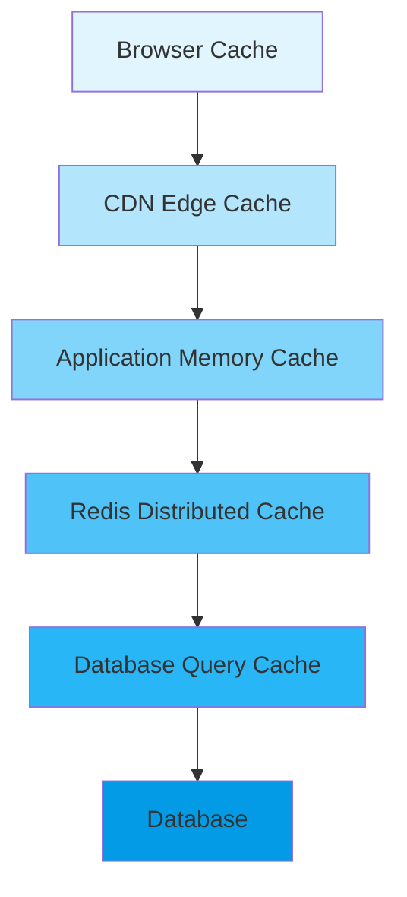

# 22. Performance Architecture

## 22.1 Overview

This document defines the performance architecture principles, patterns, and requirements for Laglig.se. It serves as the authoritative reference for all performance-related decisions and implementations across the platform.

**Status:** ACTIVE - All new development must comply with these standards  
**Last Updated:** January 2025  
**Review Cycle:** Quarterly  

### Purpose

Performance is not a feature - it's a fundamental requirement. This architecture ensures:
- Sub-second response times for all user interactions
- Scalability to handle 100x current load
- Consistent performance across all platform features
- Cost-effective resource utilization

### Performance Philosophy

> "Every millisecond counts. A 100ms delay costs 1% in user satisfaction."

We optimize for:
1. **User-perceived performance** over technical metrics
2. **Consistency** over peak performance
3. **Simplicity** over clever optimizations
4. **Measurability** over assumptions

---

## 22.2 Performance Requirements

### 22.2.1 Response Time Requirements

All operations MUST meet these response time targets:

| Operation Type | Target (P50) | Target (P95) | Maximum (P99) | Measurement Point |
|---------------|--------------|--------------|---------------|-------------------|
| Static Page Load | 200ms | 500ms | 1s | First Contentful Paint |
| Dynamic Page Navigation | 300ms | 800ms | 1.5s | Time to Interactive |
| API Response (Cached) | 50ms | 100ms | 200ms | Server Response Time |
| API Response (Database) | 100ms | 300ms | 500ms | Server Response Time |
| Document Load (First) | 500ms | 1s | 2s | Content Visible |
| Document Load (Cached) | 100ms | 200ms | 500ms | Content Visible |
| Search Results | 200ms | 500ms | 1s | Results Displayed |
| Modal Open | 100ms | 300ms | 500ms | Modal Interactive |
| Form Submit | 200ms | 500ms | 1s | Success Feedback |
| Real-time Update | 100ms | 200ms | 500ms | UI Updated |

### 22.2.2 Scalability Requirements

The platform MUST support:
- **Concurrent Users:** 10,000 active sessions
- **Daily Active Users:** 100,000
- **Documents:** 1,000,000+ legal documents
- **API Requests:** 1,000 requests/second sustained
- **Database Connections:** 100 concurrent connections
- **Cache Size:** 100GB distributed cache
- **CDN Bandwidth:** 10TB/month

### 22.2.3 Resource Budgets

Every feature MUST operate within these budgets:

```yaml
performance_budgets:
  javascript:
    initial_bundle: 300KB    # Compressed
    lazy_loaded: 100KB       # Per chunk
    total_size: 1MB          # All code
  
  css:
    critical: 20KB           # Inline critical CSS
    total: 100KB            # All stylesheets
  
  images:
    hero: 100KB             # Above fold
    standard: 50KB          # Per image
    icons: 10KB             # SVG sprites
  
  api:
    payload_size: 100KB     # Per response
    query_complexity: 100   # GraphQL complexity
    database_queries: 10    # Per request
  
  rendering:
    fps: 60                 # Animations
    paint_time: 16ms        # Per frame
    reflow_count: 3         # Per interaction
```

---

## 22.3 Caching Architecture

### 22.3.1 Multi-Layer Cache Strategy



### 22.3.2 Cache Configuration

```typescript
// Cache TTL Configuration (in seconds)
export const CACHE_TTL = {
  // Static content - long cache
  LEGAL_DOCUMENTS: 86400,        // 24 hours - legal text rarely changes
  DOCUMENT_METADATA: 3600,       // 1 hour - metadata updates occasionally
  PUBLIC_PAGES: 3600,            // 1 hour - public content
  
  // Workspace data - medium cache
  WORKSPACE_MEMBERS: 3600,       // 1 hour - membership changes infrequently
  WORKSPACE_SETTINGS: 1800,      // 30 minutes - settings occasionally updated
  USER_PREFERENCES: 1800,        // 30 minutes - preferences stable
  
  // Dynamic data - short cache
  LAW_LISTS: 300,               // 5 minutes - lists change frequently
  TASK_COLUMNS: 300,            // 5 minutes - column structure stable
  COMPLIANCE_STATS: 300,         // 5 minutes - stats update regularly
  
  // Real-time data - minimal cache
  TASKS: 60,                    // 1 minute - highly dynamic
  COMMENTS: 30,                 // 30 seconds - real-time updates
  NOTIFICATIONS: 10,            // 10 seconds - near real-time
  
  // Session data
  SESSION: 900,                 // 15 minutes - security balance
  CSRF_TOKEN: 3600,            // 1 hour - security token
} as const

// Cache invalidation tags
export const CACHE_TAGS = {
  DOCUMENTS: 'documents',
  WORKSPACE: (id: string) => `workspace-${id}`,
  USER: (id: string) => `user-${id}`,
  LAW_LIST: (id: string) => `law-list-${id}`,
  TASK: (id: string) => `task-${id}`,
} as const
```

### 22.3.3 Cache Implementation Patterns

#### Server-Side Caching (Next.js)

```typescript
import { unstable_cache } from 'next/cache'
import { redis } from '@/lib/cache/redis'

// Pattern 1: Next.js Data Cache
export const getCachedData = unstable_cache(
  async (id: string) => {
    // Expensive operation
    return await fetchFromDatabase(id)
  },
  ['cache-key'],
  {
    revalidate: CACHE_TTL.LAW_LISTS,
    tags: [CACHE_TAGS.DOCUMENTS]
  }
)

// Pattern 2: Redis Distributed Cache
export async function getCachedWithRedis<T>(
  key: string,
  fetcher: () => Promise<T>,
  ttl: number
): Promise<T> {
  // Check Redis first
  const cached = await redis.get(key)
  if (cached) {
    return JSON.parse(cached)
  }
  
  // Fetch and cache
  const data = await fetcher()
  await redis.setex(key, ttl, JSON.stringify(data))
  return data
}

// Pattern 3: Multi-layer with fallback
export async function getWithMultiLayer<T>(
  key: string,
  fetcher: () => Promise<T>,
  options: CacheOptions
): Promise<T> {
  // L1: Memory cache (fastest)
  const memCached = memoryCache.get(key)
  if (memCached) return memCached
  
  // L2: Redis (distributed)
  const redisCached = await redis.get(key)
  if (redisCached) {
    const data = JSON.parse(redisCached)
    memoryCache.set(key, data, options.memTTL)
    return data
  }
  
  // L3: Database (source of truth)
  const data = await fetcher()
  
  // Populate all cache layers
  await redis.setex(key, options.redisTTL, JSON.stringify(data))
  memoryCache.set(key, data, options.memTTL)
  
  return data
}
```

#### Client-Side Caching (SWR)

```typescript
import useSWR from 'swr'

// Pattern 1: Standard SWR caching
export function useDocumentData(id: string) {
  return useSWR(
    id ? `/api/documents/${id}` : null,
    fetcher,
    {
      revalidateOnFocus: false,
      revalidateOnReconnect: false,
      dedupingInterval: 30000,      // 30 seconds
      refreshInterval: 0,            // No polling
      shouldRetryOnError: true,
      errorRetryCount: 3,
      errorRetryInterval: 1000,
    }
  )
}

// Pattern 2: Optimistic updates
export function useOptimisticData(key: string, fetcher: Fetcher) {
  const { data, error, mutate } = useSWR(key, fetcher)
  
  const updateOptimistic = async (
    optimisticData: any,
    updateFn: () => Promise<any>
  ) => {
    // Update UI immediately
    await mutate(optimisticData, false)
    
    try {
      // Perform actual update
      const result = await updateFn()
      // Revalidate with server data
      await mutate(result)
    } catch (error) {
      // Rollback on error
      await mutate()
      throw error
    }
  }
  
  return { data, error, updateOptimistic }
}
```

### 22.3.4 Cache Invalidation Strategy

```typescript
// Intelligent cache invalidation
export class CacheInvalidator {
  // Invalidate related caches on mutation
  async invalidateDocument(documentId: string) {
    const tags = [
      CACHE_TAGS.DOCUMENTS,
      `document-${documentId}`,
      'browse-results',
      'search-results'
    ]
    
    await Promise.all([
      revalidateTag(tags),
      redis.del(`document:${documentId}`),
      cdn.purge(`/documents/${documentId}`)
    ])
  }
  
  // Cascade invalidation for related data
  async invalidateWorkspace(workspaceId: string) {
    const patterns = [
      `workspace:${workspaceId}:*`,
      `law-lists:${workspaceId}:*`,
      `tasks:${workspaceId}:*`
    ]
    
    for (const pattern of patterns) {
      await redis.delPattern(pattern)
    }
    
    revalidatePath('/dashboard')
    revalidatePath('/laglistor')
    revalidatePath('/tasks')
  }
  
  // Smart invalidation with dependencies
  async invalidateTask(taskId: string, workspaceId: string) {
    // Invalidate specific task
    await redis.del(`task:${taskId}`)
    
    // Invalidate affected aggregations
    await redis.del(`workspace:${workspaceId}:stats`)
    await redis.del(`workspace:${workspaceId}:activity`)
    
    // Keep unaffected data cached
    // DON'T invalidate: workspace members, settings, etc.
  }
}
```

---

## 22.4 Database Optimization

### 22.4.1 Required Indexes

Every table MUST have appropriate indexes:

```sql
-- Law List Items (70k+ rows)
CREATE INDEX idx_law_list_items_list_id ON law_list_items(law_list_id);
CREATE INDEX idx_law_list_items_position ON law_list_items(position);
CREATE INDEX idx_law_list_items_status ON law_list_items(compliance_status);
CREATE INDEX idx_law_list_items_responsible ON law_list_items(responsible_user_id);
CREATE INDEX idx_law_list_items_list_position ON law_list_items(law_list_id, position);
CREATE INDEX idx_law_list_items_list_status ON law_list_items(law_list_id, compliance_status);

-- Tasks
CREATE INDEX idx_tasks_workspace_column ON tasks(workspace_id, column_id);
CREATE INDEX idx_tasks_workspace_assignee ON tasks(workspace_id, assignee_id);
CREATE INDEX idx_tasks_due_date ON tasks(due_date) WHERE due_date IS NOT NULL;
CREATE INDEX idx_tasks_position ON tasks(column_id, position);

-- Legal Documents (1M+ rows)
CREATE INDEX idx_documents_content_type ON legal_documents(content_type);
CREATE INDEX idx_documents_status_date ON legal_documents(status, effective_date DESC);
CREATE INDEX idx_documents_search ON legal_documents USING gin(search_vector);

-- Workspace Members
CREATE INDEX idx_members_workspace ON workspace_members(workspace_id);
CREATE INDEX idx_members_user ON workspace_members(user_id);
```

### 22.4.2 Query Optimization Patterns

```typescript
// ANTI-PATTERN: Deep nested queries (N+1 problem)
// ❌ DON'T DO THIS
const tasks = await prisma.task.findMany({
  include: {
    list_item_links: {
      include: {
        law_list_item: {
          include: {
            document: true  // 4 levels deep!
          }
        }
      }
    }
  }
})

// PATTERN: Separate optimized queries
// ✅ DO THIS
const tasks = await prisma.task.findMany({
  where: { workspace_id },
  take: 50,  // Always paginate
  include: {
    column: { select: { name: true, color: true } },
    assignee: { select: { name: true, avatar_url: true } }
  }
})

// Fetch related data separately for visible items only
const visibleTaskIds = tasks.slice(0, 10).map(t => t.id)
const documents = await prisma.$queryRaw`
  SELECT t.id, d.title, d.document_number
  FROM tasks t
  JOIN task_list_item_links tl ON t.id = tl.task_id
  JOIN law_list_items li ON tl.law_list_item_id = li.id
  JOIN legal_documents d ON li.document_id = d.id
  WHERE t.id = ANY(${visibleTaskIds})
`

// PATTERN: Use database views for complex queries
// Create materialized view for commonly accessed data
await prisma.$executeRaw`
  CREATE MATERIALIZED VIEW compliance_summary AS
  SELECT 
    workspace_id,
    COUNT(*) as total_items,
    COUNT(*) FILTER (WHERE compliance_status = 'UPPFYLLD') as compliant,
    AVG(CASE WHEN compliance_status = 'UPPFYLLD' THEN 100 ELSE 0 END) as compliance_rate
  FROM law_list_items lli
  JOIN law_lists ll ON lli.law_list_id = ll.id
  GROUP BY workspace_id;
  
  CREATE INDEX idx_compliance_summary_workspace 
  ON compliance_summary(workspace_id);
`

// PATTERN: Connection pool retry for high concurrency
export async function withRetry<T>(
  operation: () => Promise<T>,
  maxRetries: number = 3
): Promise<T> {
  for (let i = 0; i <= maxRetries; i++) {
    try {
      return await operation()
    } catch (error) {
      if (i === maxRetries) throw error
      if (error.code === 'P2024') {  // Pool timeout
        await new Promise(r => setTimeout(r, 100 * Math.pow(2, i)))
        continue
      }
      throw error
    }
  }
}
```

### 22.4.3 Database Connection Management

```typescript
// Optimal Prisma configuration
export const prisma = new PrismaClient({
  datasources: {
    db: {
      url: process.env.DATABASE_URL + '?pgbouncer=true&connection_limit=10'
    }
  },
  log: process.env.NODE_ENV === 'development' 
    ? ['query', 'error', 'warn'] 
    : ['error'],
})

// Read replica for heavy queries
export const prismaRead = new PrismaClient({
  datasources: {
    db: {
      url: process.env.DATABASE_READ_URL
    }
  }
})

// Use read replica for expensive operations
export async function getHeavyData() {
  return prismaRead.legalDocument.findMany({
    where: { /* complex filters */ },
    take: 1000
  })
}
```

---

## 22.5 Client-Side Performance

### 22.5.1 Code Splitting Requirements

All applications MUST implement code splitting:

```typescript
// Route-based splitting (automatic in Next.js)
// pages/dashboard.tsx - separate bundle
// pages/settings.tsx - separate bundle

// Component-based splitting for heavy components
const HeavyModal = dynamic(
  () => import('@/components/HeavyModal'),
  { 
    loading: () => <Skeleton />,
    ssr: false  // Don't SSR modals
  }
)

// Library splitting
const MarkdownEditor = dynamic(
  () => import('@/components/MarkdownEditor'),
  { loading: () => <div>Loading editor...</div> }
)

// Conditional loading
const AdminPanel = dynamic(
  () => import('@/components/AdminPanel'),
  { 
    loading: () => null,
    ssr: false 
  }
)

// Use only when user is admin
{user.isAdmin && <AdminPanel />}
```

### 22.5.2 Virtual Scrolling for Large Lists

```typescript
import { useVirtualizer } from '@tanstack/react-virtual'

export function VirtualList({ items }: { items: any[] }) {
  const parentRef = useRef<HTMLDivElement>(null)
  
  const virtualizer = useVirtualizer({
    count: items.length,
    getScrollElement: () => parentRef.current,
    estimateSize: () => 80,
    overscan: 5,  // Render 5 items outside viewport
  })
  
  return (
    <div ref={parentRef} className="h-[600px] overflow-auto">
      <div style={{ height: virtualizer.getTotalSize() }}>
        {virtualizer.getVirtualItems().map(virtualItem => (
          <div
            key={virtualItem.key}
            style={{
              position: 'absolute',
              top: 0,
              transform: `translateY(${virtualItem.start}px)`,
            }}
          >
            <ListItem item={items[virtualItem.index]} />
          </div>
        ))}
      </div>
    </div>
  )
}
```

### 22.5.3 Optimistic UI Updates

```typescript
// All mutations MUST use optimistic updates
export function useOptimisticMutation() {
  const [isPending, setIsPending] = useState(false)
  
  const mutate = async (optimisticData: any, serverAction: () => Promise<any>) => {
    setIsPending(true)
    
    // Update UI immediately
    updateLocalState(optimisticData)
    
    try {
      const result = await serverAction()
      // Confirm with server data
      updateLocalState(result)
    } catch (error) {
      // Rollback on error
      rollbackLocalState()
      toast.error('Update failed')
    } finally {
      setIsPending(false)
    }
  }
  
  return { mutate, isPending }
}
```

### 22.5.4 Progressive Enhancement

```typescript
// Load critical content first, enhance progressively
export function DocumentViewer({ documentId }: { documentId: string }) {
  const [content, setContent] = useState<'summary' | 'full'>('summary')
  
  // Load summary immediately
  const { data: summary } = useSWR(
    `/api/documents/${documentId}/summary`,
    fetcher
  )
  
  // Load full content on demand
  const { data: fullContent } = useSWR(
    content === 'full' ? `/api/documents/${documentId}/full` : null,
    fetcher
  )
  
  return (
    <div>
      {/* Always show summary first */}
      {summary && <DocumentSummary data={summary} />}
      
      {/* Progressive enhancement */}
      {content === 'summary' && (
        <button onClick={() => setContent('full')}>
          Load Full Document
        </button>
      )}
      
      {/* Full content when requested */}
      {content === 'full' && fullContent && (
        <DocumentFull data={fullContent} />
      )}
    </div>
  )
}
```

---

## 22.6 API Performance

### 22.6.1 API Response Requirements

All API endpoints MUST:
- Return response in <300ms (P95)
- Include caching headers
- Implement pagination for lists
- Support field selection
- Include performance timing headers

```typescript
// API middleware for performance
export async function performanceMiddleware(
  req: Request,
  res: Response,
  next: NextFunction
) {
  const start = Date.now()
  
  // Add request ID for tracing
  req.id = generateRequestId()
  
  // Override res.json to add timing
  const originalJson = res.json
  res.json = function(data: any) {
    const duration = Date.now() - start
    
    // Add performance headers
    res.set({
      'X-Response-Time': `${duration}ms`,
      'X-Request-ID': req.id,
      'X-Cache': res.locals.cacheHit ? 'HIT' : 'MISS'
    })
    
    // Log slow requests
    if (duration > 1000) {
      logger.warn('Slow API request', {
        path: req.path,
        duration,
        requestId: req.id
      })
    }
    
    return originalJson.call(this, data)
  }
  
  next()
}
```

### 22.6.2 Pagination Pattern

```typescript
// Standard pagination for all list endpoints
interface PaginatedRequest {
  page?: number
  limit?: number
  sortBy?: string
  sortOrder?: 'asc' | 'desc'
  cursor?: string  // For cursor-based pagination
}

interface PaginatedResponse<T> {
  data: T[]
  pagination: {
    page: number
    limit: number
    total: number
    totalPages: number
    hasNext: boolean
    hasPrev: boolean
    nextCursor?: string
  }
  _performance: {
    queryTime: number
    totalTime: number
  }
}

export async function paginatedEndpoint<T>(
  req: Request,
  fetcher: (params: PaginationParams) => Promise<T[]>
): Promise<PaginatedResponse<T>> {
  const start = Date.now()
  
  const { page = 1, limit = 50, sortBy, sortOrder, cursor } = req.query
  
  // Enforce maximum limit
  const safeLimit = Math.min(limit, 100)
  
  const queryStart = Date.now()
  const [data, total] = await Promise.all([
    fetcher({ page, limit: safeLimit, sortBy, sortOrder, cursor }),
    getTotalCount()
  ])
  const queryTime = Date.now() - queryStart
  
  return {
    data,
    pagination: {
      page,
      limit: safeLimit,
      total,
      totalPages: Math.ceil(total / safeLimit),
      hasNext: page * safeLimit < total,
      hasPrev: page > 1,
      nextCursor: generateCursor(data)
    },
    _performance: {
      queryTime,
      totalTime: Date.now() - start
    }
  }
}
```

### 22.6.3 Field Selection Pattern

```typescript
// Allow clients to request only needed fields
export async function selectiveEndpoint(req: Request) {
  const { fields } = req.query
  
  // Parse requested fields
  const requestedFields = fields 
    ? fields.split(',').filter(isAllowedField)
    : DEFAULT_FIELDS
  
  // Build Prisma select object
  const select = requestedFields.reduce((acc, field) => {
    acc[field] = true
    return acc
  }, {})
  
  const data = await prisma.document.findMany({
    select,
    take: 50
  })
  
  return data
}
```

---

## 22.7 Infrastructure & Deployment

### 22.7.1 CDN Configuration

All static assets MUST be served from CDN:

```typescript
// Next.js configuration
export default {
  images: {
    domains: ['cdn.laglig.se'],
    loader: 'custom',
    path: 'https://cdn.laglig.se'
  },
  
  assetPrefix: process.env.NODE_ENV === 'production' 
    ? 'https://cdn.laglig.se' 
    : '',
  
  async headers() {
    return [
      {
        source: '/:all*(svg|jpg|jpeg|png|webp|gif|ico|woff|woff2)',
        headers: [
          {
            key: 'Cache-Control',
            value: 'public, max-age=31536000, immutable'
          }
        ]
      },
      {
        source: '/_next/static/:path*',
        headers: [
          {
            key: 'Cache-Control',
            value: 'public, max-age=31536000, immutable'
          }
        ]
      }
    ]
  }
}
```

### 22.7.2 Edge Function Deployment

Performance-critical functions deploy to edge:

```typescript
// app/api/edge/[...route].ts
export const runtime = 'edge'
export const preferredRegion = ['arn1', 'fra1', 'iad1']  // Multi-region

export async function GET(request: Request) {
  // Check edge cache
  const cache = caches.default
  const cacheKey = new Request(request.url, request)
  const cachedResponse = await cache.match(cacheKey)
  
  if (cachedResponse) {
    return cachedResponse
  }
  
  // Fetch from origin
  const response = await fetchFromOrigin(request)
  
  // Cache at edge
  const cacheResponse = response.clone()
  event.waitUntil(
    cache.put(cacheKey, cacheResponse)
  )
  
  return response
}
```

### 22.7.3 Database Read Replicas

Configure read replicas for read-heavy operations:

```yaml
# Infrastructure configuration
database:
  primary:
    region: eu-north-1
    instance: db.t3.large
    storage: 100GB
    
  replicas:
    - region: eu-north-1
      instance: db.t3.medium
      purpose: analytics
      
    - region: eu-central-1
      instance: db.t3.medium
      purpose: read-heavy-queries
      
  configuration:
    max_connections: 200
    shared_buffers: 256MB
    effective_cache_size: 1GB
    work_mem: 4MB
    maintenance_work_mem: 64MB
```

---

## 22.8 Monitoring & Observability

### 22.8.1 Required Metrics

All applications MUST track:

```typescript
// Performance metrics to track
export const REQUIRED_METRICS = {
  // Response times
  api_response_time: Histogram,
  database_query_time: Histogram,
  cache_hit_rate: Counter,
  
  // User experience
  page_load_time: Histogram,
  time_to_interactive: Histogram,
  first_contentful_paint: Histogram,
  
  // System health
  memory_usage: Gauge,
  cpu_usage: Gauge,
  connection_pool_size: Gauge,
  
  // Business metrics
  slow_requests: Counter,
  failed_requests: Counter,
  timeout_errors: Counter,
}

// Implementation example
import { metrics } from '@/lib/monitoring'

export async function trackedOperation() {
  const timer = metrics.api_response_time.startTimer()
  
  try {
    const result = await performOperation()
    timer({ status: 'success' })
    return result
  } catch (error) {
    timer({ status: 'error' })
    metrics.failed_requests.inc()
    throw error
  }
}
```

### 22.8.2 Performance Budgets

Automated monitoring of performance budgets:

```typescript
// Performance budget monitoring
export class PerformanceBudgetMonitor {
  async checkBudgets() {
    const violations = []
    
    // Check bundle size
    const bundleSize = await getBundleSize()
    if (bundleSize > BUDGETS.javascript.initial_bundle) {
      violations.push({
        type: 'bundle_size',
        actual: bundleSize,
        budget: BUDGETS.javascript.initial_bundle
      })
    }
    
    // Check response times
    const p95ResponseTime = await getP95ResponseTime()
    if (p95ResponseTime > 300) {
      violations.push({
        type: 'response_time',
        actual: p95ResponseTime,
        budget: 300
      })
    }
    
    // Alert on violations
    if (violations.length > 0) {
      await alertTeam(violations)
    }
    
    return violations
  }
}
```

### 22.8.3 Real User Monitoring (RUM)

```typescript
// Client-side performance monitoring
export function initRUM() {
  // Web Vitals
  onCLS(metric => sendMetric('CLS', metric))
  onFID(metric => sendMetric('FID', metric))
  onLCP(metric => sendMetric('LCP', metric))
  onFCP(metric => sendMetric('FCP', metric))
  onTTFB(metric => sendMetric('TTFB', metric))
  
  // Custom metrics
  measureUserJourney('law-modal-open', {
    start: 'click',
    end: 'modal-interactive'
  })
  
  // Error tracking
  window.addEventListener('error', (event) => {
    trackError({
      message: event.message,
      source: event.filename,
      lineno: event.lineno,
      colno: event.colno,
      error: event.error
    })
  })
}
```

---

## 22.9 Performance Testing

### 22.9.1 Required Performance Tests

All features MUST include performance tests:

```typescript
// Playwright performance test example
test('Law modal opens within 1 second', async ({ page }) => {
  const startTime = Date.now()
  
  await page.click('[data-testid="law-item"]')
  await page.waitForSelector('[role="dialog"]')
  
  const loadTime = Date.now() - startTime
  
  expect(loadTime).toBeLessThan(1000)
  
  // Capture performance metrics
  const metrics = await page.evaluate(() => ({
    FCP: performance.getEntriesByName('first-contentful-paint')[0]?.startTime,
    LCP: performance.getEntriesByName('largest-contentful-paint')[0]?.startTime,
    CLS: performance.getEntriesByName('cumulative-layout-shift')[0]?.value,
  }))
  
  expect(metrics.FCP).toBeLessThan(500)
  expect(metrics.LCP).toBeLessThan(1000)
  expect(metrics.CLS).toBeLessThan(0.1)
})
```

### 22.9.2 Load Testing Requirements

```yaml
# K6 load test configuration
scenarios:
  average_load:
    executor: 'constant-arrival-rate'
    rate: 100           # 100 requests per second
    timeUnit: '1s'
    duration: '5m'
    preAllocatedVUs: 50
    
  spike_test:
    executor: 'ramping-arrival-rate'
    startRate: 10
    timeUnit: '1s'
    preAllocatedVUs: 100
    stages:
      - duration: '30s', target: 10
      - duration: '30s', target: 200  # Spike
      - duration: '30s', target: 10
      
  stress_test:
    executor: 'ramping-vus'
    startVUs: 0
    stages:
      - duration: '2m', target: 100
      - duration: '5m', target: 100
      - duration: '2m', target: 200
      - duration: '5m', target: 200
      - duration: '2m', target: 0
      
thresholds:
  http_req_duration: ['p(95)<500']  # 95% of requests under 500ms
  http_req_failed: ['rate<0.1']     # Error rate under 10%
```

---

## 22.10 Developer Guidelines

### 22.10.1 Performance Checklist

Before deploying any feature:

- [ ] Response time <300ms (P95)
- [ ] No N+1 queries
- [ ] Appropriate caching implemented
- [ ] Pagination for lists >20 items
- [ ] Optimistic UI for mutations
- [ ] Loading states for async operations
- [ ] Error boundaries implemented
- [ ] Bundle size within budget
- [ ] Performance tests written
- [ ] Monitoring configured

### 22.10.2 Common Anti-Patterns to Avoid

```typescript
// ❌ ANTI-PATTERN: Loading everything
const allDocuments = await prisma.document.findMany()

// ✅ PATTERN: Paginate
const documents = await prisma.document.findMany({
  take: 50,
  skip: offset
})

// ❌ ANTI-PATTERN: Synchronous operations blocking UI
const result = await heavyComputation()

// ✅ PATTERN: Use Web Workers
const worker = new Worker('compute.js')
worker.postMessage(data)
worker.onmessage = (e) => setResult(e.data)

// ❌ ANTI-PATTERN: Not caching expensive operations
const data = await complexDatabaseQuery()

// ✅ PATTERN: Cache appropriately
const data = await getCachedOrFetch(
  'cache-key',
  () => complexDatabaseQuery(),
  { ttl: 300 }
)

// ❌ ANTI-PATTERN: Deep component nesting causing re-renders
<Parent>
  <Child1>
    <Child2>
      <Child3 data={frequentlyChangingData} />
    </Child2>
  </Child1>
</Parent>

// ✅ PATTERN: Use memo and optimize structure
const MemoizedChild3 = memo(Child3)
<Parent>
  <MemoizedChild3 data={frequentlyChangingData} />
</Parent>
```

### 22.10.3 Performance Review Process

All PRs must pass performance review:

1. **Automated Checks**
   - Bundle size analysis
   - Lighthouse CI scores
   - Performance test suite
   - Query complexity analysis

2. **Manual Review**
   - Check for caching implementation
   - Verify pagination usage
   - Review query optimization
   - Confirm monitoring setup

3. **Performance Impact Statement**
   ```markdown
   ## Performance Impact
   - **Bundle Size Change:** +2KB (within budget)
   - **New API Endpoints:** 2 (both <300ms P95)
   - **Database Queries:** 3 optimized queries with indexes
   - **Caching:** 5-minute TTL on law list data
   - **Expected Load:** 100 req/s peak
   ```

---

## 22.11 Migration Strategy

### For Existing Features

1. **Audit Current Performance**
   - Measure current response times
   - Identify bottlenecks
   - Document baseline metrics

2. **Implement Quick Wins**
   - Add missing indexes
   - Implement basic caching
   - Fix obvious N+1 queries

3. **Systematic Optimization**
   - Refactor to pagination
   - Add proper caching layers
   - Implement optimistic UI

4. **Validate Improvements**
   - Compare against baseline
   - Run load tests
   - Monitor in production

### Priority Order

1. **P0: Critical User Paths**
   - Law list modal opening
   - Task page loading
   - Document viewing

2. **P1: High-Frequency Operations**
   - Workspace switching
   - Navigation
   - Search

3. **P2: Supporting Features**
   - Settings
   - Reports
   - Analytics

---

## 22.12 References

### External Resources
- [Web Vitals](https://web.dev/vitals/)
- [Next.js Performance](https://nextjs.org/docs/advanced-features/measuring-performance)
- [Prisma Performance](https://www.prisma.io/docs/guides/performance-and-optimization)
- [Redis Caching Patterns](https://redis.io/docs/manual/patterns/)

### Internal Documents
- [Architecture Overview](./2-high-level-architecture.md)
- [Caching Strategy](./21-caching-strategy.md)
- [Database Schema](./9-database-design.md)
- [API Design](./11-backend-architecture.md)

### Performance Tools
- **Monitoring:** Sentry, Vercel Analytics
- **Testing:** Playwright, K6, Lighthouse
- **Profiling:** Chrome DevTools, React DevTools
- **Analysis:** Bundle Analyzer, Query Analyzer

---

## Appendix A: Performance Configurations

### Next.js Configuration

```javascript
// next.config.js - Optimized for performance
module.exports = {
  // Optimize images
  images: {
    formats: ['image/avif', 'image/webp'],
    minimumCacheTTL: 31536000,
  },
  
  // Optimize compilation
  swcMinify: true,
  compiler: {
    removeConsole: process.env.NODE_ENV === 'production',
  },
  
  // Optimize caching
  experimental: {
    staleTimes: {
      dynamic: 300,
      static: 600,
    },
  },
  
  // Headers for caching
  async headers() {
    return [
      {
        source: '/:path*',
        headers: [
          {
            key: 'X-DNS-Prefetch-Control',
            value: 'on'
          }
        ]
      }
    ]
  }
}
```

### Vercel Configuration

```json
{
  "functions": {
    "app/api/edge/*.ts": {
      "runtime": "edge",
      "maxDuration": 10
    },
    "app/api/*.ts": {
      "maxDuration": 30
    }
  },
  "crons": [
    {
      "path": "/api/cache/warm",
      "schedule": "*/5 * * * *"
    }
  ]
}
```

---

**End of Performance Architecture Document**