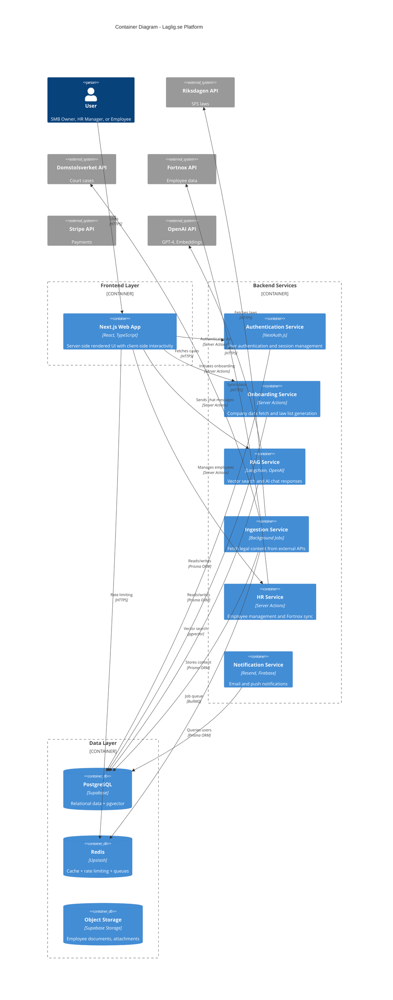
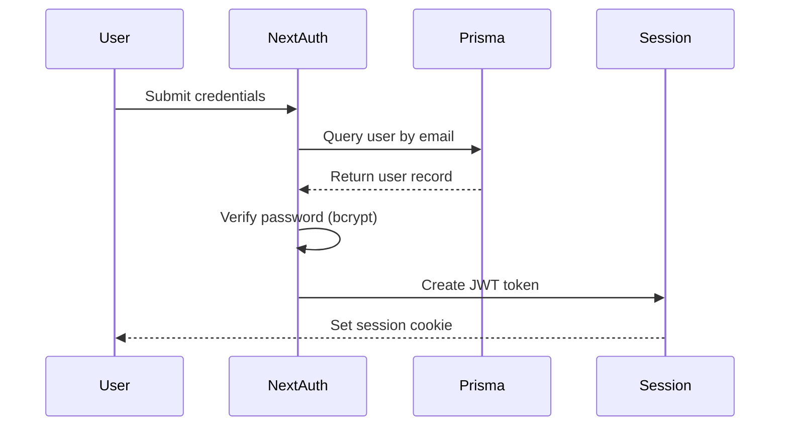
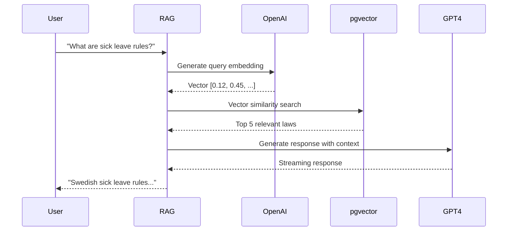
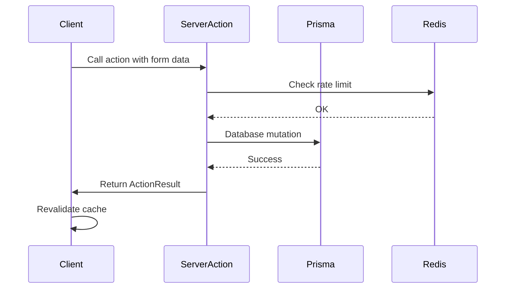
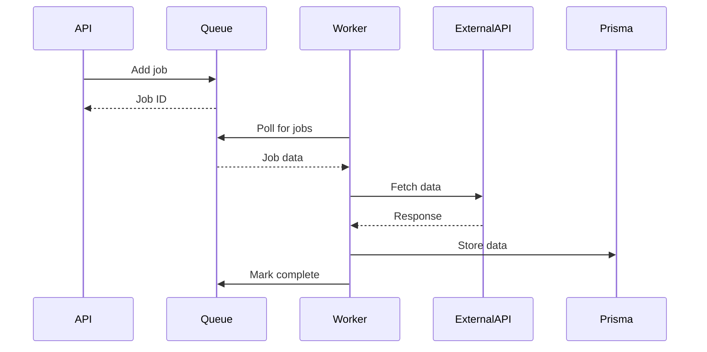

# 6. Components

## 6.1 Component Architecture Overview

Laglig.se follows a **modular component architecture** with clear separation between frontend UI components, backend services, and shared infrastructure layers. This design enables:

1. **Independent scaling** - Frontend and backend can scale separately
2. **Team autonomy** - Frontend and backend teams can work in parallel
3. **Testability** - Each component can be tested in isolation
4. **Maintainability** - Clear boundaries prevent tight coupling

**Architecture Style:** Serverless microservices with shared database (Supabase PostgreSQL)

---

## 6.2 High-Level Component Diagram



---

## 6.3 Frontend Components

### 6.3.1 Authentication Components

**Responsibility:** User sign-in, sign-up, password reset, and session management

**Key Interfaces:**

- `<SignInForm />` - Credential-based login form
- `<SignUpForm />` - New user registration form
- `<GoogleSignInButton />` - OAuth 2.0 Google sign-in
- `<PasswordResetForm />` - Forgot password flow

**Dependencies:**

- NextAuth.js (authentication library)
- `app/actions/auth.ts` (Server Actions)
- Zustand auth store (client-side session state)

**Technology Stack:**

- React Server Components (forms)
- Server Actions for mutations
- TailwindCSS for styling
- React Hook Form for validation

**Location:** `app/(auth)/*` routes

---

### 6.3.2 Onboarding Wizard Component

**Responsibility:** Multi-step onboarding flow to generate personalized law list (Epic 4, Stories 4.1-4.4b)

**Key Interfaces:**

- `<OnboardingWizard />` - Root wizard component with step navigation
- `<OrgNumberInput />` - Organization number input with Bolagsverket validation (Story 4.1)
- `<CompanyUrlInput />` - Optional website URL for context scraping (enhanced personalization)
- `<DynamicQuestionCard />` - AI-driven contextual questions (3-5 max) (Story 4.2b)
- `<StreamingLawList />` - Real-time law generation with fade-in animations (Story 4.4)
- `<Phase1Preview />` - Shows 15-30 high-priority laws pre-signup (Story 4.3)
- `<Phase2Progress />` - Background generation of 45-65 additional laws post-signup (Story 4.4b)
- `<WorkspaceSetupStep />` - Workspace creation, invite team members

**Two-Phase Generation (Story 4.3, 4.4b):**

- **Phase 1 (Pre-Signup):** 15-30 high-priority laws shown immediately
- **Phase 2 (Post-Signup):** 45-65 additional laws generated in background
- **Total:** 60-80 laws matching Notisum's comprehensiveness

**Dependencies:**

- `app/actions/onboarding.ts` (Server Actions)
- Zustand onboarding store (step state, answers)
- `lib/external-apis/bolagsverket.ts` (company data fetch)
- GPT-4 for Phase 2 AI-powered generation

**State Management:**

```typescript
interface OnboardingState {
  currentStep: number
  companyInfo: {
    orgNumber: string
    name: string
    sniCode: string
    employeeCount: number
  }
  contextualAnswers: Record<string, boolean>
  lawListPhase1: string[] // Rule-based
  lawListPhase2: string[] // AI-generated
}
```

**Technology Stack:**

- React Server Components + Client Components (for interactivity)
- Server Actions for data fetching and processing
- Zustand for wizard state
- Progress indicator component

**Location:** `app/(onboarding)/*` routes

---

### 6.3.3 Dashboard & Workspace Component

**Responsibility:** Main workspace view with navigation, quick actions, and overview cards (Epic 5)

**Key Interfaces:**

- `<WorkspaceDashboard />` - Root dashboard layout
- `<WorkspaceNav />` - Top navigation with workspace switcher
- `<QuickActionCards />` - "Ask AI", "View Laws", "Add Employee"
- `<RecentActivity />` - Recent chat messages, law updates
- `<TeamMembers />` - Active workspace members list

**Dependencies:**

- `app/actions/workspace.ts` (Server Actions)
- Zustand workspace store (current workspace, members)
- NextAuth session (user permissions)

**Technology Stack:**

- React Server Components (static content)
- Client Components for interactive elements
- Real-time updates via polling (future: WebSockets)

**Location:** `app/(workspace)/[workspaceId]/page.tsx`

---

### 6.3.4 Kanban Board Component

**Responsibility:** Drag-and-drop law compliance tracking board (Epic 6, Stories 6.2-6.8)

**Key Interfaces:**

- `<KanbanBoard />` - Root board with 5 columns: Not Started, In Progress, Blocked, Review, Compliant (Story 6.2)
- `<KanbanColumn />` - Single status column with draggable cards
- `<LawCard />` - Draggable law card (FR26, Story 6.3):
  - Compact variant (list view)
  - Standard Kanban card (with priority badge, assignee avatars)
  - Expanded modal variant (full details)
- `<CardDetailModal />` - Full card view (Story 6.3):
  - AI summary (200 words)
  - Priority dropdown (High/Medium/Low)
  - Assigned employees multi-select
  - Due date picker
  - Notes textarea (markdown)
  - Tags input
- `<TaskList />` - Task management within card (Story 6.4)
- `<BulkActionsToolbar />` - Multi-card operations (Story 6.8)
- `<FilterBar />` - Filter by category, priority, assignee, tags (Story 6.6)

**Dependencies:**

- `app/actions/kanban.ts` (Server Actions for mutations)
- `@dnd-kit/core` (drag-and-drop library)
- Zustand kanban store (optimistic updates)

**State Management:**

```typescript
interface KanbanState {
  cards: Record<string, LawInWorkspace[]> // Keyed by status
  selectedCard: string | null
  draggedCard: string | null
  optimisticUpdates: Map<string, Partial<LawInWorkspace>>
}
```

**Technology Stack:**

- Client Component (requires interactivity)
- @dnd-kit/core for drag-and-drop
- Optimistic UI updates with Zustand
- Server Actions for persistence

**Location:** `app/(workspace)/[workspaceId]/kanban/page.tsx`

---

### 6.3.5 AI Chat Interface Component

**Responsibility:** Conversational AI assistant for Swedish legal queries (Epic 3)

**Key Interfaces:**

- `<AIChatWidget />` - Floating chat widget (accessible from all pages)
- `<ChatMessageList />` - Scrollable message history
- `<ChatMessage />` - Single message bubble (user or AI)
- `<ChatInput />` - Text input with send button
- `<LawReferencePills />` - Clickable law references in AI responses
- `<StreamingIndicator />` - Typing indicator during AI response

**Dependencies:**

- `app/actions/ai-chat.ts` (Server Actions with streaming)
- Vercel AI SDK (`useChat` hook)
- Zustand chat store (message history)

**Streaming Implementation:**

```typescript
import { useChat } from 'ai/react'

const { messages, input, handleInputChange, handleSubmit, isLoading } = useChat(
  {
    api: '/api/chat', // Server Action endpoint
    onError: (error) => {
      toast.error('AI chat error: ' + error.message)
    },
  }
)
```

**Technology Stack:**

- Client Component (real-time streaming)
- Vercel AI SDK for streaming responses
- Server Actions for backend integration
- Markdown rendering for formatted responses

**Location:** `components/ai-chat/AIChatWidget.tsx` (global)

---

### 6.3.6 SEO Law Pages Component

**Responsibility:** Public law detail pages optimized for SEO (Epic 2.5)

**Key Interfaces:**

- `<LawDetailPage />` - Full law page with metadata, full text, related content
- `<LawMetadata />` - SFS number, effective date, status badge
- `<LawFullText />` - Formatted legal text with section navigation
- `<RelatedLaws />` - Cross-referenced SFS laws
- `<RelatedCourtCases />` - Court cases citing this law
- `<AmendmentTimeline />` - Visual timeline of amendments
- `<ShareButton />` - Social sharing functionality

**Dependencies:**

- Supabase (direct database read via Prisma)
- Static generation with ISR (Incremental Static Regeneration)

**SEO Optimization:**

- Server-Side Rendering (SSR)
- JSON-LD structured data
- Open Graph meta tags
- Canonical URLs
- Sitemap generation

**Technology Stack:**

- React Server Components (no client JS needed)
- ISR with 1-hour revalidation
- Markdown rendering (if needed)

**Location:** `app/(public)/lagar/[lawSlug]/page.tsx`

---

### 6.3.7 HR Module Component

**Responsibility:** Employee management and Fortnox integration (Epic 6)

**Key Interfaces:**

- `<EmployeeList />` - Table of all employees with filters
- `<EmployeeForm />` - Add/edit employee form
- `<FortnoxSyncButton />` - One-click Fortnox sync
- `<CollectiveAgreementSelector />` - Assign kollektivavtal to employees
- `<EmployeeDocuments />` - Upload/view employee-specific documents
- `<DepartmentManagement />` - Organize employees by department

**Dependencies:**

- `app/actions/hr.ts` (Server Actions)
- `lib/external-apis/fortnox.ts` (Fortnox API client)
- Supabase Storage (document uploads)

**Technology Stack:**

- Server Components for lists
- Client Components for forms and file uploads
- Server Actions for mutations
- React Hook Form for validation

**Location:** `app/(workspace)/[workspaceId]/hr/*` routes

---

### 6.3.8 Change Monitoring Component

**Responsibility:** Display detected law changes and manage notifications (Epic 8, Stories 8.1-8.5)

**Key Interfaces:**

- `<ChangeNotificationList />` - List of detected changes with priority badges (Story 8.1)
- `<ChangeNotificationCard />` - Individual change card with AI summary (Story 8.1)
- `<PriorityBadge />` - Visual indicators 🔴/🟡/🟢 for High/Medium/Low (Story 8.1)
- `<DiffViewer />` - GitHub-style visual diff for amendments (Story 8.2)
- `<NotificationBell />` - In-app notification indicator with badge count (Story 8.5)
- `<ChangeDetailModal />` - Full diff view with business impact analysis
- `<NotificationSettings />` - Configure email/push preferences
- `<LawSubscriptionManager />` - Subscribe to specific laws

**Diff Viewer Features (Story 8.2):**

- Side-by-side comparison (desktop) / stacked (mobile)
- Red background for deletions, green for additions
- Line-through for removed text, underline for added
- AI summary in plain Swedish
- "Mark as Reviewed" button

**Dependencies:**

- `app/actions/notifications.ts` (Server Actions)
- `diff` npm package for text comparison
- Background job results (cron-triggered change detection)

**Technology Stack:**

- Server Components for lists
- Client Components for diff viewer and settings
- Real-time updates via polling (check for new changes every 5 minutes)

**Location:** `app/(workspace)/[workspaceId]/changes/*` routes

---

### 6.3.9 Additional UI Components

**Responsibility:** Reusable UI components used across multiple features

**Key Components:**

**Drag-and-Drop System (Stories 3.4-3.7, 6.5):**

- `<DraggableWrapper />` - Makes any component draggable
- `<DropZone />` - Target area for dropped items
- Supports: Law cards, Employee cards, Task cards, PDFs
- Library: `@dnd-kit/core` or `react-beautiful-dnd`

**Context Pills (AI Chat):**

- `<LawContextPill />` - Shows dragged law in chat context (Story 3.4)
- `<EmployeeContextPill />` - Shows dragged employee (Story 3.5)
- `<TaskContextPill />` - Shows dragged task (Story 3.6)
- `<DocumentContextPill />` - Shows dragged PDF (Story 3.7)

**Common UI Patterns:**

- `<ToastNotification />` - Success/error/info messages
- `<SkeletonLoader />` - Content loading placeholders
- `<ProgressBar />` - Determinate progress indicator
- `<ConfirmationModal />` - Destructive action confirmation
- `<MultiSelectDropdown />` - Used for categories, tags, employees
- `<DatePicker />` - Swedish format (YYYY-MM-DD)
- `<MarkdownTextarea />` - Rich text with preview

**Location:** `components/ui/*`

---

## 6.4 Backend Services

### 6.4.1 Authentication Service

**Responsibility:** User authentication, session management, and authorization

**Key Interfaces:**

- `signInAction()` - Credential-based sign in
- `signUpAction()` - New user registration
- `signOutAction()` - End session
- `getServerSession()` - Retrieve current session server-side

**Dependencies:**

- NextAuth.js (authentication library)
- Prisma (user storage)
- bcrypt (password hashing)

**Technology Stack:**

- NextAuth.js with JWT strategy
- Prisma adapter for database persistence
- Google OAuth provider

**Authentication Flow:**



**Location:** `lib/auth.ts`, `app/api/auth/[...nextauth]/route.ts`

---

### 6.4.2 Onboarding Service

**Responsibility:** Generate personalized law lists based on company context

**Key Interfaces:**

- `fetchCompanyDataAction()` - Fetch from Bolagsverket API
- `scrapeCompanyWebsiteAction()` - Extract context from company website (optional)
- `startOnboardingAction()` - Create session + Phase 1 law list
- `saveContextualAnswersAction()` - Store Phase 2 answers
- `generateFinalLawListAction()` - GPT-4 Phase 2 generation with website context

**Dependencies:**

- `lib/external-apis/bolagsverket.ts`
- OpenAI GPT-4 (for Phase 2)
- Prisma (onboarding session storage)

**Phase 1 Logic (Rule-Based):**

```typescript
function generateLawListPhase1(
  sniCode: string,
  employeeCount: number
): string[] {
  const baseLaws = [
    'SFS 1977:1160', // Arbetsmiljölagen (ALL companies)
    'SFS 1982:80', // Anställningsskyddslag (ALL companies)
    'SFS 1982:80', // LAS (ALL companies)
  ]

  // Add laws based on employee count
  if (employeeCount >= 10) {
    baseLaws.push('SFS 1976:580') // Medbestämmandelagen (MBL)
  }

  // Add laws based on SNI code (industry)
  if (sniCode.startsWith('56')) {
    // Restaurant industry
    baseLaws.push('SFS 2006:804') // Livsmedelslagen
  }

  return baseLaws
}
```

**Website Context Scraping & AI Segmentation:**

```typescript
async function scrapeAndAnalyzeCompanyWebsite(
  url: string
): Promise<WebsiteContext> {
  // Scrape company website content
  const response = await fetch(url)
  const html = await response.text()

  // Extract text content from HTML (strip tags, get meaningful text)
  const textContent = extractTextFromHTML(html)

  // Extract structured data: menus, services, products, about page
  const structuredContent = {
    services: extractServices(html),
    products: extractProducts(html),
    aboutText: extractAboutSection(html),
    careers: extractCareersInfo(html),
  }

  // Use GPT-4 to analyze and segment the company
  const segmentationPrompt = `
Analyze this company website content and extract key business characteristics:

Website text: ${textContent.substring(0, 5000)}
Services: ${structuredContent.services}
Products: ${structuredContent.products}

Identify and return as JSON:
1. Primary business activities
2. Customer type (B2B/B2C/both)
3. Industry segment refinements beyond SNI code
4. Special regulatory areas (alcohol, healthcare, finance, etc.)
5. Employee-related signals (hiring, benefits mentioned, etc.)
6. International operations
7. Data processing activities (forms, user accounts, etc.)
8. Environmental/sustainability focus
9. Any compliance mentions (ISO, certifications, etc.)
  `

  const analysis = await openai.chat.completions.create({
    model: 'gpt-4-turbo',
    messages: [{ role: 'user', content: segmentationPrompt }],
    response_format: { type: 'json_object' },
  })

  const websiteContext = JSON.parse(analysis.choices[0].message.content)

  // Cache the analysis for future use
  await redis.set(`website-analysis:${url}`, JSON.stringify(websiteContext), {
    ex: 86400,
  })

  return websiteContext
}
```

**Phase 2 Logic (AI-Generated with Website Context):**

```typescript
async function generateLawListPhase2(
  companyContext: CompanyContext,
  contextualAnswers: Record<string, boolean>,
  websiteContext?: WebsiteContext
): Promise<string[]> {
  const prompt = `
Based on this Swedish company profile:
- Industry: ${companyContext.sniCode}
- Employees: ${companyContext.employeeCount}
- Answers: ${JSON.stringify(contextualAnswers)}
- Website signals: ${JSON.stringify(websiteContext)}

Generate a prioritized list of 50-80 relevant SFS laws.
Include e-commerce laws if online sales detected.
Include alcohol laws if restaurant/bar detected.
Return as JSON array of SFS numbers: ["SFS 1977:1160", ...]
  `

  const response = await openai.chat.completions.create({
    model: 'gpt-4-turbo',
    messages: [{ role: 'user', content: prompt }],
    response_format: { type: 'json_object' },
  })

  return JSON.parse(response.choices[0].message.content).laws
}
```

**Location:** `app/actions/onboarding.ts`, `lib/onboarding/*.ts`

---

### 6.4.3 RAG Service

**Responsibility:** Vector search and AI chat response generation (Epic 3)

**Key Interfaces:**

- `retrieveRelevantLaws()` - Semantic search via pgvector
- `generateAIResponse()` - GPT-4 response with context
- `streamAIResponse()` - Streaming chat responses

**Dependencies:**

- Supabase pgvector (vector database)
- OpenAI Embeddings (text-embedding-3-small)
- OpenAI GPT-4 (chat completion)
- Langchain (RAG orchestration)

**Vector Search Flow:**



**Embedding Generation:**

```typescript
async function generateEmbedding(text: string): Promise<number[]> {
  const response = await openai.embeddings.create({
    model: 'text-embedding-3-small',
    input: text,
  })

  return response.data[0].embedding
}
```

**Vector Search Query:**

```sql
SELECT
  ld.id,
  ld.title,
  ld.summary,
  le.chunk_text,
  1 - (le.embedding <=> $1::vector) AS similarity
FROM law_embeddings le
JOIN legal_documents ld ON le.document_id = ld.id
WHERE 1 - (le.embedding <=> $1::vector) > 0.7
ORDER BY similarity DESC
LIMIT 5
```

**Location:** `lib/rag/*.ts`, `lib/vector-search.ts`

---

### 6.4.4 Ingestion Service

**Responsibility:** Background jobs to fetch legal content from external APIs (Epic 2)

**Key Interfaces:**

- `ingestAllSFS()` - Fetch 11,351 SFS laws from Riksdagen
- `ingestCourtCases()` - Fetch court cases from Domstolsverket
- `generateEmbeddings()` - Batch embedding generation
- `trackIngestionProgress()` - Update BackgroundJob status

**Dependencies:**

- `lib/external-apis/riksdagen.ts`
- `lib/external-apis/domstolsverket.ts`
- BullMQ (job queue)
- Redis (queue persistence)

**Job Queue Architecture:**

```typescript
// Producer (API endpoint)
await ingestionQueue.add('ingest-sfs', {
  force_full_refresh: false,
})

// Consumer (background worker)
const worker = new Worker('ingestion-queue', async (job) => {
  if (job.name === 'ingest-sfs') {
    await ingestAllSFS()
  } else if (job.name === 'ingest-court-cases') {
    await ingestCourtCases()
  }
})
```

**Progress Tracking:**

```typescript
await prisma.backgroundJob.update({
  where: { id: jobId },
  data: {
    status: 'RUNNING',
    progress_current: 5000,
    progress_total: 11351,
  },
})
```

**Location:** `lib/ingestion/*.ts`, `api/cron/ingest-worker/route.ts`

---

### 6.4.5 Change Detection Service

**Responsibility:** Daily cron jobs to detect new/amended/repealed laws (Epic 8)

**Key Interfaces:**

- `detectSFSChanges()` - Compare current vs Riksdagen API
- `detectCourtCaseChanges()` - Check for new court cases
- `notifySubscribers()` - Send change notifications to users

**Dependencies:**

- `lib/external-apis/riksdagen.ts`
- `lib/external-apis/domstolsverket.ts`
- Notification Service

**Change Detection Logic:**

```typescript
async function detectSFSChanges() {
  const storedLaws = await prisma.legalDocument.findMany({
    where: { content_type: 'SFS_LAW' },
    select: { document_number: true, updated_at: true },
  })

  const latestLaws = await riksdagenClient.fetchSFSList(1, 100)

  for (const law of latestLaws) {
    const stored = storedLaws.find(
      (l) => l.document_number === `SFS ${law.beteckning}`
    )

    if (!stored) {
      // New law detected
      await createChangeNotification({
        type: 'NEW_LAW',
        document_number: `SFS ${law.beteckning}`,
      })
    } else if (law.publicerad > stored.updated_at.toISOString()) {
      // Amendment detected
      await createChangeNotification({
        type: 'LAW_AMENDED',
        document_number: `SFS ${law.beteckning}`,
      })
    }
  }
}
```

**Cron Schedule (Vercel Cron):**

```json
{
  "crons": [
    {
      "path": "/api/cron/detect-sfs-changes",
      "schedule": "0 2 * * *"
    },
    {
      "path": "/api/cron/detect-court-case-changes",
      "schedule": "30 2 * * *"
    }
  ]
}
```

**Location:** `lib/change-detection/*.ts`, `api/cron/detect-*/route.ts`

---

### 6.4.6 Notification Service

**Responsibility:** Send email and push notifications to users

**Key Interfaces:**

- `sendChangeNotificationEmail()` - Email about law changes
- `sendWorkspaceInviteEmail()` - Team invitation
- `sendPushNotification()` - Browser/mobile push

**Dependencies:**

- Resend (email service)
- Firebase Cloud Messaging (push notifications)
- Prisma (user preferences)

**Email Templates:**

```typescript
const changeNotificationTemplate = {
  subject: 'Legal Update: {{lawTitle}} has been amended',
  body: `
    <h2>Law Change Detected</h2>
    <p>{{lawTitle}} ({{documentNumber}}) was amended on {{changeDate}}.</p>
    <p><a href="{{lawUrl}}">View changes</a></p>
  `,
}
```

**Technology Stack:**

- Resend API (email delivery)
- React Email (email templates)
- Firebase SDK (push notifications)

**Location:** `lib/notifications/*.ts`

---

### 6.4.7 HR Service

**Responsibility:** Employee management and Fortnox synchronization (Epic 6)

**Key Interfaces:**

- `createEmployee()` - Add new employee
- `syncFortnoxEmployees()` - Sync from Fortnox API
- `attachCollectiveAgreement()` - Link kollektivavtal
- `uploadEmployeeDocument()` - Store employee files

**Dependencies:**

- `lib/external-apis/fortnox.ts`
- Supabase Storage (file uploads)
- Prisma (employee records)

**Fortnox Sync Logic:**

```typescript
async function syncFortnoxEmployees(workspaceId: string) {
  const fortnoxEmployees = await fortnoxClient.fetchEmployees(workspaceId)

  for (const emp of fortnoxEmployees) {
    await prisma.employee.upsert({
      where: {
        workspace_id_fortnox_id: {
          workspace_id: workspaceId,
          fortnox_id: emp.EmployeeId,
        },
      },
      create: {
        workspace_id: workspaceId,
        first_name: emp.FirstName,
        last_name: emp.LastName,
        email: emp.Email,
        fortnox_id: emp.EmployeeId,
        employment_type: 'FULL_TIME',
        status: 'ACTIVE',
      },
      update: {
        first_name: emp.FirstName,
        last_name: emp.LastName,
        email: emp.Email,
      },
    })
  }
}
```

**Location:** `app/actions/hr.ts`, `lib/hr/*.ts`

---

### 6.4.8 Subscription Service

**Responsibility:** Stripe subscription management and billing (Epic 7)

**Key Interfaces:**

- `createCheckoutSession()` - Start Stripe checkout
- `handleWebhook()` - Process Stripe webhooks
- `updateSubscription()` - Upgrade/downgrade plan
- `cancelSubscription()` - End subscription

**Dependencies:**

- Stripe SDK
- Prisma (subscription records)

**Webhook Events:**

- `checkout.session.completed` → Create subscription
- `customer.subscription.updated` → Update tier
- `customer.subscription.deleted` → Mark cancelled
- `invoice.paid` → Update billing status
- `invoice.payment_failed` → Notify user

**Technology Stack:**

- Stripe SDK
- Webhook signature verification
- Idempotency keys for retries

**Location:** `lib/stripe/*.ts`, `api/webhooks/stripe/route.ts`

---

## 6.5 Shared Infrastructure Components

### 6.5.1 Database Layer (Prisma ORM)

**Responsibility:** Type-safe database access with automatic migrations

**Key Interfaces:**

- `prisma.legalDocument.findMany()`
- `prisma.workspace.create()`
- `prisma.$transaction()` (atomic operations)

**Technology:** Prisma ORM with PostgreSQL (Supabase)

**Location:** `lib/prisma.ts`, `prisma/schema.prisma`

---

### 6.5.2 Cache Layer (Redis)

**Responsibility:** 3-tier caching strategy (Section 2.7)

**Key Interfaces:**

- `redis.get(key)`
- `redis.set(key, value, { ex: ttl })`
- `redis.incr(key)` (rate limiting counters)

**Technology:** Upstash Redis (serverless)

**Location:** `lib/redis.ts`

---

### 6.5.3 External API Clients

**Responsibility:** Type-safe wrappers for external services

**Components:**

- `RiksdagenClient` - SFS law fetching
- `DomstolsverketClient` - Court case fetching
- `FortnoxClient` - Employee sync
- `BolagsverketClient` - Company data
- `StripeClient` - Payment processing

**Location:** `lib/external-apis/*.ts` (documented in Section 5.8)

---

### 6.5.4 File Storage (Supabase Storage)

**Responsibility:** Store employee documents and attachments

**Key Interfaces:**

- `storage.upload(bucket, path, file)`
- `storage.download(bucket, path)`
- `storage.getPublicUrl(bucket, path)`

**Buckets:**

- `employee-documents` - HR files (contracts, certificates)
- `workspace-files` - General workspace uploads
- `court-case-attachments` - PDF judgments

**Technology:** Supabase Storage (S3-compatible)

**Location:** `lib/storage.ts`

---

## 6.6 Component Interaction Patterns

### 6.6.1 Server Actions Pattern

**Used by:** Auth, Onboarding, Kanban, AI Chat, HR

**Flow:**



**Benefits:**

- No API boilerplate
- Type-safe end-to-end
- Automatic revalidation

---

### 6.6.2 Background Job Pattern

**Used by:** Ingestion, Change Detection, Embedding Generation

**Flow:**



**Benefits:**

- Async processing
- Retry logic
- Progress tracking

---
