# Epic 21 — Lagefterlevnadskontroll Brownfield Enhancement Architecture

**Status:** Draft v1 — awaiting PO review
**Author:** Winston (Architect) — 2026-04-22
**Supersedes/supplements:** `docs/architecture/` (sharded, existing)
**Inputs:**
- `docs/lagefterlevnadskontroll-brief.md` (strategic brief)
- `docs/prd-lagefterlevnadskontroll.md` (PRD with 14 stories)

---

## 1. Introduction

This document is the architectural blueprint for **Epic 21 — Lagefterlevnadskontroll MVP** in Laglig.se. It supplements (does not replace) the existing sharded architecture under `docs/architecture/` and resolves the five pre-story decisions flagged in the PRD's §7.

**Relationship to existing architecture:** Every architectural choice here is grounded in patterns already present in the codebase. Where a new pattern is introduced (canonical-JSON hashing, immutability guard), it is additive and isolated under `lib/compliance-audit/`. Nothing in the existing Laglig stack is replaced, reconfigured, or deprecated.

### 1.1 Existing Project Analysis

**Current project state (verified by reading the codebase 2026-04-22):**

- **Primary purpose:** Swedish legal-register SaaS with laglistor, kravpunkter, linked artifacts, tasks, lagbevakning, AI chat.
- **Current tech stack (from `docs/architecture/3-tech-stack.md`):** Next.js 16 (App Router, Turbopack default) + React 19, TypeScript 5.5+, Prisma 5.12+, Supabase PostgreSQL 15.1 (pgvector), Supabase Storage for files, Supabase Auth + NextAuth, Upstash Redis for selective caching, Anthropic Claude via Vercel AI SDK 5.0+, shadcn/ui + Tailwind 3.4+, SWR for client-side caching, **puppeteer-core 24.40+ with @sparticuz/chromium 143+ already in production for HTML→PDF**, Vitest + Playwright for testing, Vercel for hosting.
- **Architecture style:** Next.js monolith with Server Actions for 90% of mutations, REST only for webhooks/cron. Server Components by default; SWR on interactive surfaces. Workspace-scoped multi-tenancy enforced at every mutation boundary (`withWorkspace()` wrapper observed in all `app/actions/*.ts`). Role-based permissions via simple string-typed matrix at `lib/auth/permissions.ts`.
- **Deployment method:** Vercel auto-deploy on merge to `main`; Prisma migrations via `prisma migrate deploy` pre-deploy; preview deploys on PR.

**Available documentation:**

- Tech stack table (`docs/architecture/3-tech-stack.md`) — definitive, versioned
- Coding standards (`docs/architecture/17-coding-standards.md`)
- Unified project structure (`docs/architecture/12-unified-project-structure.md`)
- Existing epic shards (1–20) under `docs/prd/`
- Permissions matrix with inline table (`lib/auth/permissions.ts` JSDoc)
- Auto-memory at `~/.claude/.../memory/` documenting kravpunkter, linked-artifacts, AI chat patterns

**Identified constraints (verified):**

- Schema additions must be additive-only (brownfield CR2); no existing column dropped or retyped.
- Server Actions are the canonical mutation surface; REST only for webhooks, cron, and public API. No new REST endpoints introduced for cycle module.
- Permissions extension must follow the existing string-union `Permission` type + `ROLE_PERMISSIONS` matrix pattern in `lib/auth/permissions.ts`.
- Activity logging goes through the existing thin helper at `lib/services/activity-logger.ts` — no new logging framework.
- File storage is **Supabase Storage**, accessed via `storageClient.storage.from(BUCKET_NAME)` pattern (observed in `app/actions/files.ts:1207, 1635`).
- License policy (tech stack §3.6): new dependencies must be MIT, Apache 2.0, BSD, or ISC. GPL/AGPL/LGPL/SSPL forbidden.
- Vercel serverless function limits: `maxDuration` default 10s (Hobby), up to 300s (Pro). PDF generation must respect this — async pattern for large cycles.

### 1.2 Change Log

| Change | Date | Version | Description | Author |
|---|---|---|---|---|
| Initial draft | 2026-04-22 | 0.1 | Brownfield architecture addendum for Epic 21 | Winston |

---

## 2. Enhancement Scope and Integration Strategy

### 2.1 Enhancement Overview

- **Enhancement Type:** New Feature Addition (significant impact)
- **Scope:** New `ComplianceAuditCycle` aggregate + child entities (Item, Finding, EvidenceSnapshot, Report), new routes under `/laglistor/kontroller`, new components under `components/features/compliance-audit/`, new server actions under `app/actions/compliance-audit-*.ts`, minor additions to `lib/auth/permissions.ts`, and a new seal-hash + canonical-JSON subsystem under `lib/compliance-audit/`.
- **Integration Impact:** Significant by surface area (new models, new route tree, new UI components), low by existing-code modification (only a single nullable column on `Task`, a single new permission scope string, extension of the activity-type label map).

### 2.2 Integration Approach

- **Code integration strategy:** New code is isolated in two new namespaces — `app/actions/compliance-audit-*.ts` and `components/features/compliance-audit/**` — plus `lib/compliance-audit/` for pure logic. No existing file is touched except:
  - `prisma/schema.prisma` — additive schema (5 new tables, 4 new enums, 1 nullable column on `Task`).
  - `lib/auth/permissions.ts` — adds one entry to the `Permission` union + one entry each in `OWNER` and `ADMIN` role arrays + one new convenience function.
  - `components/features/activity/*` (the Swedish label map for new entity types — additive map keys only).
- **Database integration:** Additive Prisma migration, reversible. All new tables use existing ID (UUID), timestamp (`created_at`, `updated_at`), and workspace-scope conventions. Foreign keys reference existing tables (`LawList`, `LawListItem`, `LawListItemRequirement`, `Task`, `User`, `Workspace`) via `onDelete: Restrict` for cycle-adjacent entities to prevent cascade surprises.
- **API integration:** No new REST routes. All mutations are Server Actions following the `withWorkspace()` + `hasPermission()` + Zod-validate + Prisma-txn + `revalidatePath()` pattern observed across all existing `app/actions/*.ts`. One new Route Handler exclusively for PDF downloads (returns `application/pdf` bytes).
- **UI integration:** Reuses existing shadcn/ui primitives (Card, Button, Dialog, Tabs, Dropdown, Badge, Switch, Checkbox), the existing `compliance-detail-table` grouped layout as the scope-selector substrate, `StatusBadge` for bedömning visualization, and `LinkedArtifactsPanel` (read-mostly) for evidence display inside cycle item drawers.

### 2.3 Compatibility Requirements

- **Existing API compatibility:** No existing Server Action signature changes. No SWR key changes. No API-route contract changes. Verified by search — no existing file references cycle entities.
- **Database schema compatibility:** Migration is additive (5 `CREATE TABLE`, 4 `CREATE TYPE`, 1 `ALTER TABLE tasks ADD COLUMN compliance_finding_id UUID NULL`). Rollback = drop-in-reverse. No data migration required for existing rows.
- **UI/UX consistency:** All new UI uses existing tokens (colour, typography, spacing). Swedish copy follows the tone of existing `/laglistor` surfaces. No changes to existing screens except a small "Öppna kontroller (N)" link in the `/laglistor` header if a cycle is active.
- **Performance impact:** Module runs on its own route (`/laglistor/kontroller`); no additional queries on the main `/laglistor` page. NFR5 ceiling (<5% degradation on main page) is easily met — the integration is effectively zero-cost on existing hot paths.

---

## 3. Tech Stack

### 3.1 Existing Technology Stack (consumed by Epic 21)

| Category | Current Technology | Version | Usage in Enhancement | Notes |
|---|---|---|---|---|
| Frontend framework | Next.js (App Router) | 16 | Route tree, RSC, Server Actions, Route Handler for PDF | Server Actions are the ONLY mutation surface |
| UI framework | React | 19 | All components | Server Components default, client components only where interaction needed |
| UI primitives | shadcn/ui + Radix + Tailwind | Latest / 3.4+ | Card, Button, Dialog, Tabs, Dropdown, Badge, Switch, Checkbox, Drawer | Zero new UI-library additions |
| State mgmt (client) | SWR | Latest | Cycle list, cycle detail, items, findings, linked artifacts | Keys centralised in `lib/swr-keys/compliance-audit.ts` |
| ORM | Prisma | 5.12+ | All new models | Follow existing UUID + timestamp + workspace-scope conventions |
| DB | Supabase PostgreSQL | 15.1 | 5 new tables, 4 new enums, 1 altered table | No extensions needed (no pgvector for this module) |
| File storage | Supabase Storage | Latest | PDF revisionsrapport + HTML archive | Existing bucket pattern; new path prefix `compliance-audit-reports/{workspace_id}/{cycle_id}/` |
| HTML→PDF | puppeteer-core + @sparticuz/chromium | 24.40+ / 143+ | Revisionsrapport PDF rendering | **Reuse existing pattern from `lib/documents/tiptap-to-pdf.ts`** — no new dependency |
| Validation | Zod | 3.22+ | All Server Action inputs | Standard pattern |
| Testing (unit) | Vitest | 1.4+ | Server actions, canonicalize, seal hash, renderer | 80% coverage target per PRD NFR7 |
| Testing (E2E) | Playwright | 1.42+ | Cycle creation → bedömning → sign-off → seal → PDF flow | One golden-path test in MVP |
| Date formatting | date-fns | 3.3+ | Swedish-locale timestamps in PDF + UI | Existing pattern |

### 3.2 New Technology Additions

| Technology | Version | Purpose | Rationale | Integration Method |
|---|---|---|---|---|
| `canonicalize` (RFC 8785 JCS) | Latest stable (npm `canonicalize`) | Deterministic JSON serialisation for seal-hash input | Seal-hash must be reproducible across time, runtime, and future Node versions. RFC 8785 is the standard for canonical JSON. MIT-licensed (license policy compliant), <5KB, zero runtime deps. Alternative `json-canonicalize` (same RFC) is equivalent; either works. | Single import in `lib/compliance-audit/canonicalize.ts`. Thin wrapper with golden-fixture test. |

**Only ONE new dependency** is introduced — the canonicalization library. SHA-256 uses Node built-in `crypto.createHash('sha256')` (no new dependency). HTML→PDF reuses existing Puppeteer stack. PDF file storage reuses Supabase Storage. All other needs are met by the existing tech stack.

---

## 4. Data Models and Schema Changes

### 4.1 New Data Models

#### ComplianceAuditCycle

**Purpose:** Aggregate root for a single run of a compliance audit cycle. Owns the scope definition, lifecycle state, and seal metadata.
**Integration:** FK to `LawList` (single laglista per cycle) and `User` (lead auditor + created_by + sealed_by). Workspace-scoped like every other primary aggregate.

**Key attributes:**

- `id: String @id @default(uuid())`
- `workspace_id: String` — FK to Workspace
- `law_list_id: String` — FK to LawList (restrict on delete)
- `name: String`
- `scope_definition: Json` — `{kind: 'all' | 'groups' | 'items', groupIds?, itemIds?}`
- `audit_type: AuditType` — enum `INTERN | EXTERN`
- `scheduled_start: DateTime`
- `scheduled_end: DateTime`
- `law_change_cutoff_date: DateTime` — amendment scope boundary
- `status: ComplianceCycleStatus` — enum `PLANERAD | PAGAENDE | AVSLUTAD | SEALED | ARKIVERAD`
- `lead_auditor_user_id: String` — FK to User
- `sealed_at: DateTime?`
- `sealed_by_user_id: String?` — FK to User
- `seal_hash: String?` — SHA-256 hex, 64 chars
- `created_at, updated_at, deleted_at: DateTime`
- `created_by_user_id: String` — FK to User

**Relationships:**

- With existing: `LawList` (many cycles per list), `Workspace` (many cycles per workspace), `User` (three nullable/non-nullable user references).
- With new: `ComplianceAuditItem[]` (1:N, cascade on soft-delete), `ComplianceFinding[]` (1:N), `ComplianceEvidenceSnapshot[]` (1:N), `ComplianceAuditReport[]` (1:N — one per generation event, latest is current).

#### ComplianceAuditItem

**Purpose:** Per-law materialised row inside a cycle. Frozen at cycle start — additions/removals to the source laglista do not mutate the cycle's item set.
**Integration:** FK to `ComplianceAuditCycle` (owner) and `LawListItem` (source, restrict on delete — the source law cannot be deleted while a cycle item references it).

**Key attributes:**

- `id, cycle_id, law_list_item_id`
- `efterlevnadsbedomning: EfterlevnadsBedomning?` — enum `UPPFYLLD | DELVIS | EJ_UPPFYLLD | EJ_TILLAMPLIG`
- `motivering: String?` — @db.Text
- `reviewed_at, reviewed_by_user_id: DateTime? / String?`
- `signed_off_at, signed_off_by_user_id: DateTime? / String?`
- `kravpunkter_snapshot: Json?` — frozen copy of requirement state at materialisation time
- `created_at, updated_at`

**Relationships:** FK to Cycle (cascade on cycle delete) and LawListItem (restrict). Reverse relations to `ComplianceFinding[]` and `ComplianceEvidenceSnapshot[]` via `law_list_item_id` query (no direct FK needed for the latter).

#### ComplianceFinding

**Purpose:** Structured finding (avvikelse/observation/förbättring) against the cycle or a specific item/kravpunkt.
**Integration:** FK to Cycle; optional FK to `LawListItem` and `LawListItemRequirement`; optional FK to `Task` (the auto-spawned corrective action).

**Key attributes:**

- `id, cycle_id, law_list_item_id?, requirement_id?`
- `type: FindingType` — enum `AVVIKELSE | OBSERVATION | FORBATTRING`
- `severity: FindingSeverity?` — enum `MAJOR | MINOR`, required only for AVVIKELSE (enforced at Server Action level via Zod `.refine`)
- `title: String`
- `description: String @db.Text`
- `root_cause: String? @db.Text`
- `corrective_action_task_id: String?` — FK to Task
- `due_date: DateTime?`
- `closed_at: DateTime?`
- `closed_by_user_id: String?`
- `created_at, updated_at`

**Relationships:** FK to Cycle (cascade), optional FKs to LawListItem/Requirement (set null), optional FK to Task (set null — finding survives deletion of task, loses linkage).

#### ComplianceEvidenceSnapshot

**Purpose:** Frozen evidence reference captured at seal time. Holds the exact SHA-256 of the file/document bytes that were presented.
**Integration:** FK to Cycle + optional FK to LawListItem/Requirement + polymorphic reference to either `WorkspaceFile` or `WorkspaceDocument` (not both).

**Key attributes:**

- `id, cycle_id, law_list_item_id?, requirement_id?`
- `evidence_kind: EvidenceKind` — enum `FILE | DOCUMENT`
- `evidence_file_id: String?` — FK to WorkspaceFile (set null)
- `evidence_document_id: String?` — FK to WorkspaceDocument (set null)
- `evidence_sha256: String` — hex, 64 chars
- `captured_at: DateTime @default(now())`

**Constraint:** CHECK — exactly one of `evidence_file_id` or `evidence_document_id` is non-null (enforced at Prisma schema level with a check constraint via raw migration, mirroring the existing `RequirementEvidenceLink` XOR pattern in the brief).

**Relationships:** FK to Cycle (cascade); set-null FKs on file and document so that file/document deletion does not orphan (but is blocked — see §6 below).

#### ComplianceAuditReport

**Purpose:** Persisted output of the revisionsrapport render — HTML + PDF storage paths + full reproducible manifest.
**Integration:** FK to Cycle; stores Supabase Storage paths.

**Key attributes:**

- `id, cycle_id`
- `report_kind: ReportKind` — enum `COMPLETE | SEALED` (one report per kind per cycle; on regeneration, overwrite the row for that kind)
- `generated_at: DateTime @default(now())`
- `pdf_storage_path: String?` — `compliance-audit-reports/{workspace_id}/{cycle_id}/sealed-{timestamp}.pdf`
- `html_storage_path: String?` — same path convention, `.html` suffix
- `manifest: Json` — the canonical JSON that was hashed (for SEALED) or the equivalent content bundle (for COMPLETE). Supports offline audit trail even if bucket is purged.

**Relationships:** FK to Cycle (cascade).

### 4.2 Modified Existing Models

#### Task (add one column)

- `compliance_finding_id: String? @db.Uuid` — nullable back-reference for cycle-originated tasks.
- One new index: `@@index([compliance_finding_id])` (for the reverse lookup on finding detail view).

**Nothing else on Task changes.** Existing task server actions (`app/actions/tasks.ts`, `app/actions/task-modal.ts`) do not require modification — they continue to treat `compliance_finding_id` as opaque passthrough.

### 4.3 Schema Integration Strategy

**Database changes required:**

- **New tables:** `compliance_audit_cycles`, `compliance_audit_items`, `compliance_findings`, `compliance_evidence_snapshots`, `compliance_audit_reports`.
- **New enums (4):** `AuditType`, `ComplianceCycleStatus`, `EfterlevnadsBedomning`, `FindingType`, `FindingSeverity`, `EvidenceKind`, `ReportKind`. (Counted functionally; actual `CREATE TYPE` statements for those that become Prisma enums.)
- **Modified tables:** `tasks` — single `ADD COLUMN compliance_finding_id UUID NULL` + index.
- **New indexes:** `compliance_audit_cycles(workspace_id, status)`, `compliance_audit_items(cycle_id, signed_off_at)`, `compliance_findings(cycle_id, type)`, `compliance_evidence_snapshots(cycle_id)`, `tasks(compliance_finding_id)`, `compliance_audit_reports(cycle_id, report_kind)`.
- **Migration strategy:** Single Prisma migration `20260423_add_compliance_audit_cycle`. Rollback = drop-new-tables + drop-column in reverse order; safe because no existing rows reference the new structures at deploy time.

**Backward compatibility:**

- No existing query plan is affected; new tables are invisible to legacy code paths.
- `Task` column is nullable — no backfill required; all existing tasks keep `NULL`.
- Rollback of the migration restores the prior schema exactly; rollback of the application code is independent (feature is behind new routes and new permission).

---

## 5. Component Architecture

### 5.1 New Components

#### `lib/compliance-audit/canonicalize.ts`

**Responsibility:** Produce a deterministic JSON string from a `CycleSealInput` object using the `canonicalize` (RFC 8785) library.
**Integration points:** Consumed by `seal-hash.ts` only. Pure function, no side effects, no DB access.
**Key interfaces:** `canonicalizeCycleSealInput(input: CycleSealInput): string`
**Dependencies:**
- Existing: none
- New: `canonicalize` npm package

#### `lib/compliance-audit/seal-hash.ts`

**Responsibility:** Compute SHA-256 over the canonicalized payload. Export the hex digest.
**Integration points:** Called once per seal, inside the seal transaction.
**Key interfaces:** `computeSealHash(input: CycleSealInput): string` (returns 64-char hex).
**Dependencies:** `canonicalize.ts` + Node built-in `crypto`. Unit tests use a golden fixture to detect drift across future PRs.

#### `lib/compliance-audit/cycle-guards.ts`

**Responsibility:** Enforce immutability of sealed cycles at the server-action boundary. Raises `CycleSealedError` (new error class) if a mutation is attempted on a sealed or archived cycle.
**Integration points:** Called at the entry of every mutation Server Action in `app/actions/compliance-audit-*.ts`.
**Key interfaces:** `assertCycleEditable(tx: PrismaTransactionClient | typeof prisma, cycleId: string): Promise<void>`. Accepts a Prisma transaction client to participate in the calling action's transaction (lock-safe reads).
**Dependencies:** Prisma client only.

#### `lib/compliance-audit/cycle-materialisation.ts`

**Responsibility:** Resolve `scope_definition_json` into concrete `LawListItem` ids and create `ComplianceAuditItem` rows + frozen kravpunkter snapshots inside a Prisma transaction.
**Integration points:** Called by `createCycle` → `materialiseCycleItems` transition in `app/actions/compliance-audit-cycle.ts`.
**Key interfaces:** `materialiseCycleItems(tx, cycleId): Promise<{ itemCount: number }>`
**Dependencies:** Prisma.

#### `lib/compliance-audit/revisionsrapport-renderer.ts`

**Responsibility:** Produce a deterministic HTML string for the revisionsrapport. Reuses the typographic conventions from `lib/documents/tiptap-to-pdf.ts` (Calibri/Segoe UI/Arial, 11pt body, 20pt h1, consistent spacing) but wraps a Laglig-branded revisionsrapport layout (cover page, TOC, sections, signatarer table, footer).
**Integration points:** Called by `generateCycleReport` Server Action; HTML also consumed inline by the Rapport tab in the cycle detail page for preview.
**Key interfaces:** `renderRevisionsrapport(cycle: CycleWithRelations): string`
**Dependencies:** no external libs beyond the existing date-fns for Swedish locale formatting.

#### `lib/compliance-audit/revisionsrapport-to-pdf.ts`

**Responsibility:** Render HTML → PDF bytes using `puppeteer-core + @sparticuz/chromium`. **Lifted directly from the existing `lib/documents/tiptap-to-pdf.ts` pattern** — same Puppeteer config, same Chromium bootstrap, same PDF options. Difference: the HTML is produced by the revisionsrapport renderer rather than the Tiptap-to-HTML pipeline.
**Integration points:** Called by PDF generation Server Action.
**Key interfaces:** `renderHtmlToPdf(html: string): Promise<Buffer>`
**Dependencies:** `puppeteer-core`, `@sparticuz/chromium` — both already in production.

#### `lib/compliance-audit/evidence-hash.ts`

**Responsibility:** Compute SHA-256 of the bytes of a `WorkspaceFile` (downloaded from Supabase Storage) or the canonical JSON of a `WorkspaceDocument` (Tiptap JSON + markdown + html as stored in Postgres).
**Integration points:** Called during seal transaction to populate `ComplianceEvidenceSnapshot.evidence_sha256`.
**Key interfaces:** `hashFileEvidence(fileId: string): Promise<string>`, `hashDocumentEvidence(documentId: string): Promise<string>`.
**Dependencies:** Prisma + existing Supabase Storage client pattern.

#### `app/actions/compliance-audit-cycle.ts`

**Responsibility:** Cycle CRUD + lifecycle transitions (create, list, get, update-metadata, delete-if-planerad, complete, seal, archive).
**Integration points:** Imported by `/laglistor/kontroller/**` routes. Uses existing `withWorkspace()` + `hasPermission()` wrappers. Every mutation guards via `assertCycleEditable`.
**Key interfaces:** `createCycle`, `listCyclesForWorkspace`, `getCycleById`, `updateCycleMetadata`, `softDeleteCycle`, `completeCycle`, `sealCycle`, `archiveCycle` (archive is post-MVP placeholder — kept here for scaffolding).
**Dependencies:** existing Prisma client, existing activity logger, new lib/compliance-audit/ modules.

#### `app/actions/compliance-audit-item.ts`

**Responsibility:** Item bedömning + motivering + sign-off.
**Key interfaces:** `updateItemBedomning`, `updateItemMotivering`, `signOffItem`, `unsignOffItem` (pre-complete only).
**Dependencies:** existing Prisma client, activity logger, cycle-guards.

#### `app/actions/compliance-finding.ts`

**Responsibility:** Finding CRUD + auto-spawn corrective task on AVVIKELSE creation.
**Key interfaces:** `createFinding`, `updateFinding`, `closeFinding`, `deleteFinding`, `listFindingsForCycle`.
**Dependencies:** existing Prisma, existing Task server actions (call directly — cycle-finding is a caller, not a schema dependency).

#### `app/actions/compliance-audit-report.ts`

**Responsibility:** Generate HTML + PDF report; store to Supabase Storage; upsert `ComplianceAuditReport` row.
**Key interfaces:** `generateCycleReport(cycleId, kind: 'COMPLETE' | 'SEALED')`, `downloadCycleReport(cycleId, kind)`.
**Dependencies:** revisionsrapport-renderer, revisionsrapport-to-pdf, Supabase Storage client, Prisma.

#### `components/features/compliance-audit/**`

New UI namespace. All components are Server Components by default; `'use client'` only where interaction is required (bedömning dropdowns, motivering editor, scope selector, confirm dialogs). Structure mirrors existing `components/features/document-list/legal-document-modal/**` precedent.

```
components/features/compliance-audit/
├── cycle-list/
│   ├── CycleListTable.tsx
│   ├── CycleStatusBadge.tsx
│   └── CycleProgressRing.tsx
├── cycle-creation-wizard/
│   ├── CycleCreationWizard.tsx
│   ├── CycleMetadataStep.tsx
│   ├── CycleScopeStep.tsx           # consumes scope-selector
│   └── CycleConfirmStep.tsx
├── scope-selector/
│   └── ScopeSelector.tsx            # reuses compliance-detail-table layout
├── cycle-detail/
│   ├── CycleDetailPage.tsx
│   ├── CycleDetailHeader.tsx
│   ├── CycleItemsTab.tsx
│   ├── CycleFindingsTab.tsx
│   ├── CycleRapportTab.tsx
│   └── CycleAktivitetTab.tsx
├── item-bedomning-editor/
│   ├── ItemBedomningSelect.tsx
│   ├── ItemMotiveringEditor.tsx
│   └── ItemSignOffButton.tsx
├── finding-editor/
│   ├── FindingEditor.tsx
│   ├── FindingTypeSelect.tsx
│   └── FindingSeveritySelect.tsx
├── seal-confirmation-dialog/
│   └── SealConfirmationDialog.tsx
└── revisionsrapport-view/
    └── RevisionsrapportView.tsx     # renders the HTML inline
```

### 5.2 Component Interaction Diagram

```mermaid
graph TD
    subgraph "Existing Laglig"
        LL[LawList]
        LLI[LawListItem]
        LLIR[LawListItemRequirement]
        REL[RequirementEvidenceLink]
        TASK[Task]
        AL[ActivityLog]
        PERM[lib/auth/permissions.ts]
        SBS[Supabase Storage]
        PUP[puppeteer-core + chromium]
    end

    subgraph "New: Epic 21 Data"
        CYC[ComplianceAuditCycle]
        ITM[ComplianceAuditItem]
        FND[ComplianceFinding]
        EVS[ComplianceEvidenceSnapshot]
        RPT[ComplianceAuditReport]
    end

    subgraph "New: Epic 21 Logic"
        GUARD[cycle-guards.ts]
        CANON[canonicalize.ts]
        HASH[seal-hash.ts]
        MAT[cycle-materialisation.ts]
        REND[revisionsrapport-renderer.ts]
        PDF[revisionsrapport-to-pdf.ts]
    end

    subgraph "New: Epic 21 Actions"
        ACYC[compliance-audit-cycle.ts]
        AITM[compliance-audit-item.ts]
        AFND[compliance-finding.ts]
        ARPT[compliance-audit-report.ts]
    end

    LL --> CYC
    LLI --> ITM
    LLIR -.optional.-> FND
    LLI -.optional.-> FND
    CYC --> ITM
    CYC --> FND
    CYC --> EVS
    CYC --> RPT

    FND -.auto-spawn.-> TASK
    TASK -.back-ref.-> FND

    ACYC --> GUARD
    AITM --> GUARD
    AFND --> GUARD
    ACYC --> MAT
    ACYC --> HASH
    HASH --> CANON
    ACYC --> AL
    AITM --> AL
    AFND --> AL

    ARPT --> REND
    ARPT --> PDF
    PDF --> PUP
    ARPT --> SBS
    ARPT --> RPT

    ACYC --> PERM
    AITM --> PERM
    AFND --> PERM
    ARPT --> PERM
```



---

## 6. Resolutions to Pre-Story Decisions (from PRD §7)

This is the section the PM asked for explicitly. Each decision is grounded in actual project patterns.

### 6.1 HTML→PDF stack — **RESOLVED: reuse existing Puppeteer pattern**

**Decision:** Use `puppeteer-core` 24.40+ with `@sparticuz/chromium` 143+, following the exact pattern in `lib/documents/tiptap-to-pdf.ts`.

**Rationale:**

- Already in production for Tiptap document exports. Proven to run within Vercel serverless limits. The Chromium binary from @sparticuz is pre-optimised for Vercel Lambda size constraints.
- No new dependency. No new operational surface. Licence policy already satisfied.
- Rejected alternatives:
  - `@react-pdf/renderer` — requires a React-component-tree design of the report, which means a second rendering pipeline in parallel with the HTML renderer used for the in-app preview. Maintenance cost for MVP is not justified.
  - Native `pdf-lib` — low-level PDF manipulation API. Production-grade output would take weeks to style by hand.
  - External SaaS (DocRaptor, PDFShift) — adds a vendor dependency and latency for no meaningful gain.

**Implementation note:** Extract shared Puppeteer launch logic into `lib/pdf/render-html-to-pdf.ts` (new, but thin) so both `tiptap-to-pdf.ts` and `revisionsrapport-to-pdf.ts` call the same helper. This is a zero-risk refactor doable in Story 21.12.

### 6.2 Canonical-JSON library — **RESOLVED: `canonicalize` (RFC 8785)**

**Decision:** Add a single MIT-licensed dependency — `canonicalize` npm package (RFC 8785 JSON Canonicalization Scheme, JCS).

**Rationale:**

- RFC 8785 is the published IETF standard for deterministic JSON. Chosen over hand-rolling to avoid subtle bugs in sort-order, number normalisation, and Unicode escapes.
- `canonicalize` is ~4KB minified, zero transitive deps, MIT-licensed. Licence policy §3.6 compliant.
- Alternative `json-canonicalize` is functionally equivalent — same RFC; pick whichever has been stable longest at adoption time. Pin the chosen version in `package.json` with exact (non-caret) version to prevent drift.

**Implementation note:** Wrap the library in `lib/compliance-audit/canonicalize.ts` so if we ever need to swap implementations (e.g., custom for performance), only one file changes. Unit test with a golden fixture at `lib/compliance-audit/__fixtures__/canonical-seal-input.json` → `canonical-seal-output.txt`; any schema change to cycle entities requires a deliberate fixture update PR.

### 6.3 Evidence-file-deletion policy — **RESOLVED: block deletion while referenced**

**Decision:** Mutating Server Actions on `WorkspaceFile` and `WorkspaceDocument` check for active references in `ComplianceEvidenceSnapshot` before allowing delete. If any snapshot references the file/document and its cycle is not `ARKIVERAD`, delete is blocked with a structured error listing the affected cycles.

**Rationale:**

- Seal promise is "the exact bytes we hashed remain retrievable." If the bytes disappear, the hash claim is hollow. We cannot satisfy the claim post-delete without byte-exact retention.
- Soft-delete of the file row with byte retention is a second-best alternative, but introduces orphan storage that's hard to reason about operationally. Blocking is simpler and unambiguous.
- Users still have an escape valve: archive the cycle (post-MVP state `ARKIVERAD`) releases the reference. In MVP, cycles never archive — which is acceptable; the module is <1 year old, file deletions blocked by cycle references are an edge case, not a hot path.

**Implementation note:**

- New helper `lib/compliance-audit/check-evidence-references.ts` — function `findActiveSnapshotReferences(fileId?: string, documentId?: string): Promise<CycleRef[]>`.
- Add a call to this helper at the top of the existing `deleteFile` and `deleteDocument` Server Actions. On non-empty result, return a structured error with the list of blocking cycles so the UI can surface a meaningful message ("Filen används i kontroll X, Y. Arkivera kontrollerna först.").
- Does NOT require modifying the existing `WorkspaceFile` or `WorkspaceDocument` Prisma models — the guard lives at the Server Action layer. (A database-level FK constraint would be stricter but would also break soft-delete semantics of existing file workflows. Server-layer enforcement is the right trade-off.)
- Document this in the Story 21.9 acceptance criteria as a test case.

### 6.4 Seal reversal policy — **RESOLVED: irreversible; reversal = new cycle**

**Decision:** `sealCycle` is a one-way transition. No `unsealCycle` Server Action exists. The `assertCycleEditable` guard rejects every mutation on sealed cycles.

**Rationale:**

- Aligns with PRD NFR10 and brief-level assumption. Preserves the tamper-evidence claim — if a seal can be undone, it has no legal weight.
- If a material error is discovered post-seal, the remedy is: create a new cycle with scope covering the same lagar, re-run the affected items, seal. The old sealed cycle remains untouched (read-only evidence of the error + correction).
- UI copy in the seal confirmation dialog must be unambiguous: *"Denna åtgärd kan inte ångras. Om du upptäcker fel efter fastställande måste du skapa en ny kontroll."*
- Database-level recovery (DBA intervention) is an operational concern, explicitly out of feature scope. Document the DBA runbook separately.

### 6.5 PDF storage location — **RESOLVED: Supabase Storage, new path prefix**

**Decision:** Reuse existing Supabase Storage bucket (the one used by `app/actions/files.ts`) with a new path prefix `compliance-audit-reports/{workspace_id}/{cycle_id}/`. No new bucket.

**Rationale:**

- Same storage infra, same RLS policy pattern (workspace-scoped), same backup + retention guarantees as existing evidence files. Zero new infra to configure.
- Path-based prefix gives us a clear operational boundary for monitoring, quota, and future purge policies.
- File naming convention: `report-{timestamp}-{kind}.pdf` and `report-{timestamp}-{kind}.html` — timestamp is `YYYYMMDDHHmmss` UTC; kind is `complete` or `sealed`. On regeneration, new file is uploaded; previous file is retained until cycle archive (for traceability).
- RLS policy: same pattern as existing files — workspace members can read; edit follows `tasks:edit`; delete blocked for sealed-cycle reports (mirrors §6.3).

---

## 7. API Design and Integration

Epic 21 introduces **zero new REST endpoints**. All mutations are Server Actions.

### 7.1 API Integration Strategy

- **API integration strategy:** Server Actions called from RSC pages and client components via the standard Next.js 16 App Router pattern.
- **Authentication:** Existing NextAuth + Supabase Auth session; no auth changes.
- **Versioning:** No versioning required — Server Actions are internal API, call sites are in-repo.

### 7.2 Route Handler (PDF download)

One Route Handler is added because returning binary PDF from a Server Action is awkward.

- **Endpoint:** `GET /laglistor/kontroller/[cycleId]/rapport/pdf?kind=sealed`
- **Purpose:** Stream the latest PDF for the requested cycle + kind.
- **Implementation:** Resolves `ComplianceAuditReport.pdf_storage_path`; downloads from Supabase Storage; returns with headers `Content-Type: application/pdf`, `Content-Disposition: attachment; filename="kontrollrapport-{name}-{timestamp}.pdf"`.
- **Auth:** Standard `withWorkspace()` + permission check (`hasPermission(role, 'read')`).
- **maxDuration:** 30s (more than enough for stream-through of a <10MB PDF).

---

## 8. Source Tree

### 8.1 New file organization (additions only)

```
laglig_se/
├── prisma/
│   └── schema.prisma                            # + 5 new models, 6 new enums, 1 altered field
├── app/
│   ├── actions/
│   │   ├── compliance-audit-cycle.ts            # NEW — CRUD + lifecycle
│   │   ├── compliance-audit-item.ts             # NEW — bedömning + sign-off
│   │   ├── compliance-finding.ts                # NEW — findings + task auto-spawn
│   │   ├── compliance-audit-report.ts           # NEW — report gen + download
│   │   └── __tests__/
│   │       ├── compliance-audit-cycle.test.ts   # NEW
│   │       ├── compliance-audit-item.test.ts    # NEW
│   │       ├── compliance-finding.test.ts       # NEW
│   │       └── compliance-audit-report.test.ts  # NEW
│   └── (workspace)/laglistor/kontroller/
│       ├── page.tsx                             # NEW — list view
│       ├── skapa/
│       │   └── page.tsx                         # NEW — creation wizard
│       └── [cycleId]/
│           ├── page.tsx                         # NEW — detail page with tabs
│           └── rapport/pdf/
│               └── route.ts                     # NEW — PDF download handler
├── components/features/
│   └── compliance-audit/                        # NEW — entire namespace (see §5.1)
├── lib/
│   ├── compliance-audit/                        # NEW — pure logic
│   │   ├── canonicalize.ts
│   │   ├── seal-hash.ts
│   │   ├── cycle-guards.ts
│   │   ├── cycle-materialisation.ts
│   │   ├── evidence-hash.ts
│   │   ├── revisionsrapport-renderer.ts
│   │   ├── revisionsrapport-to-pdf.ts
│   │   ├── check-evidence-references.ts
│   │   ├── errors.ts                            # CycleSealedError, etc.
│   │   └── __fixtures__/
│   │       ├── canonical-seal-input.json
│   │       └── canonical-seal-output.txt
│   ├── pdf/
│   │   └── render-html-to-pdf.ts                # NEW — shared helper (thin refactor of tiptap-to-pdf)
│   ├── swr-keys/
│   │   └── compliance-audit.ts                  # NEW — centralised cache keys
│   └── auth/permissions.ts                      # EDIT — add 'audit:seal' to Permission union + role arrays
├── components/features/activity/
│   └── activity-entity-labels.ts                # EDIT — add Swedish labels for new entity types
└── tests/e2e/
    └── compliance-audit-cycle.spec.ts           # NEW — golden-path Playwright test
```

### 8.2 Integration guidelines

- **File naming:** kebab-case for files, PascalCase for React components, camelCase for exported functions. Matches existing convention.
- **Folder organization:** New code stays within the `compliance-audit` namespace at each level (`app/actions/compliance-audit-*`, `components/features/compliance-audit/`, `lib/compliance-audit/`). Zero ambiguity about where cycle code lives.
- **Import/export patterns:** Named exports only, barrel files avoided (matches existing convention). Cross-file type imports via `@/lib/compliance-audit/types` barrel is allowed.

---

## 9. Infrastructure and Deployment Integration

### 9.1 Existing infrastructure

- **Current deployment:** Vercel auto-deploy on merge to `main`; Prisma migrate runs pre-deploy.
- **Infrastructure tools:** Vercel (hosting), Supabase (Postgres + Storage + Auth), Upstash Redis (cache, not used by this module), Resend (email), Stripe (billing), Sentry (monitoring).
- **Environments:** Production + Preview (per-PR) + local.

### 9.2 Enhancement deployment strategy

- **Deployment approach:** Single migration + single feature rollout. Migration runs once in production; code ships with `/laglistor/kontroller` route live but discoverable only via direct navigation. No feature flag required (feature invisible by default to users who don't follow the route; can be surfaced by sales/marketing when ready).
- **Infrastructure changes:** None. No new buckets, no new env vars, no new external services.
- **Pipeline integration:** Existing CI (lint, typecheck, unit, E2E, license-check) runs on every PR. Add a golden-fixture test as a blocking CI step — any drift in canonical-JSON output fails the build immediately.

### 9.3 Rollback strategy

- **Rollback method:** Revert the PR + run `prisma migrate resolve --rolled-back` + re-deploy. New tables drop cleanly because no legacy code references them. The single added column on `tasks` is nullable and NULL for all pre-existing rows — safe to drop.
- **Risk mitigation:** Migration is reviewed by Architect (me) before merge. Staging deploy precedes production by 24h for any migration that touches `tasks`.
- **Monitoring:** Sentry catches any runtime error; dashboard queries on `ActivityLog` for unexpected cycle-event spikes.

---

## 10. Coding Standards

### 10.1 Existing standards compliance

- **Code style:** TypeScript strict, no implicit any, `@/*` path aliases, kebab-case files, PascalCase React, camelCase functions, snake_case DB columns.
- **Linting rules:** ESLint with `next/core-web-vitals` + `plugin:jsx-a11y/recommended`. Husky + lint-staged pre-commit.
- **Testing patterns:** Vitest + React Testing Library + Playwright. 60–70% coverage target on existing code; MVP NFR7 bumps Epic 21 to 80% on new server actions and canonicalisation.
- **Documentation style:** Inline JSDoc only on non-obvious code. TypeScript types as primary documentation.

### 10.2 Enhancement-specific standards

- **Canonical-JSON discipline:** Any change to `CycleSealInput` type must be accompanied by a fixture update and a documented compatibility note (did this change what pre-change cycles would hash to? Almost always yes — so changes should be treated as major).
- **Immutability guard discipline:** Any new Server Action that mutates cycle-related state must call `assertCycleEditable(tx, cycleId)` at entry inside its Prisma transaction. Reviewer check: "Does this action mutate cycle data? If yes, is the guard present?"
- **Activity logging discipline:** Every cycle mutation must emit an ActivityLog row. Reviewer check covers this too.

### 10.3 Critical integration rules

- **Existing API compatibility:** No existing exported Server Action signature changes. If a refactor requires it, reject the refactor or isolate it into Story-private work.
- **Database integration:** All DB writes on cycle entities go through Prisma server actions — no raw SQL, no direct Postgres access. The only raw SQL is the check-constraint for `ComplianceEvidenceSnapshot` XOR column (done via a `execute_raw` step in the Prisma migration).
- **Error handling:** Structured error returns from Server Actions, consistent with existing `{ ok: false, error: { code, message } }` pattern. New error codes: `CYCLE_SEALED`, `EVIDENCE_REFERENCED_BY_CYCLE`, `FINDING_REQUIRES_TASK_CLOSURE`, `SIGNATURE_INCOMPLETE`.
- **Logging consistency:** Use existing `logActivity()` helper. No `console.log` in server actions (Sentry catches uncaught; `logActivity` is structured).

---

## 11. Testing Strategy

### 11.1 Integration with existing tests

- **Existing test framework:** Vitest (unit + component) + Playwright (E2E).
- **Test organization:** `app/actions/__tests__/` for server-action tests; `tests/unit/lib/**/` for library tests; `tests/e2e/` for Playwright specs.
- **Coverage requirements:** existing 60–70%; MVP NFR7 bumps Epic 21-specific code to ≥80%.

### 11.2 New testing requirements

**Unit tests (critical paths):**

- `canonicalize.ts`: golden-fixture determinism test (blocking CI).
- `seal-hash.ts`: given canonical string X, hash is Y (pure function, trivial).
- `cycle-guards.ts`: sealed cycle rejects mutation; editable cycle passes through.
- `cycle-materialisation.ts`: given a `scope_definition`, correct item set produced (all three `kind` shapes).
- `evidence-hash.ts`: file and document hashing produces stable values.
- All four Server Actions: permission checks, Zod validation, happy path + error paths.

**Integration tests:**

- Cycle create → materialise → bedömning update → finding create (+ auto-spawn task) → sign-off → complete → seal → PDF generation — wire through with real Prisma (against test DB).
- File deletion blocked while snapshot references active cycle.

**E2E tests (Playwright):**

- One golden-path: User creates cycle for a seeded laglista with 10 items → sets bedömning + motivering on every item → signs off all → clicks Complete → clicks Seal → downloads PDF → confirms PDF contains seal hash string on cover page.

**Regression tests:**

- Existing `/laglistor` main page visual + interaction regression check (Playwright screenshot diff on main table).
- Existing task system unit tests continue to pass unchanged.
- Existing activity-log rendering continues to pass unchanged.

---

## 12. Security Integration

### 12.1 Existing security measures

- **Authentication:** Supabase Auth + NextAuth hybrid. Session validated on every Server Action via `withWorkspace()` wrapper.
- **Authorization:** Role-based via `ROLE_PERMISSIONS` matrix at `lib/auth/permissions.ts`. Workspace membership verified per-action.
- **Data protection:** Supabase RLS policies on buckets; Postgres RLS for user-facing tables; TLS everywhere; secrets in Vercel env vars + Supabase Vault.
- **Security tools:** Sentry for error tracking; Snyk/Dependabot for dependency audit; Husky for pre-commit; license-checker on CI.

### 12.2 Enhancement security requirements

- **New security measures:**
  - New `Permission`: `audit:seal`. Granted to OWNER + ADMIN + (at runtime) any user who is the cycle's `lead_auditor_user_id`. Permission check at top of `sealCycle`.
  - Immutability guard (§5.1, §6.4) provides defence-in-depth: even if someone bypasses UI and calls a mutation action directly on a sealed cycle, the guard rejects.
  - Seal hash + evidence-file hashes are non-secret but user-verifiable; displayed in the UI and PDF. Hashes are NOT encrypted — they're public integrity markers.
- **Integration points:**
  - Reuse existing `withWorkspace()` + `hasPermission()` — no new auth code.
  - New permission scope threads into existing matrix. Documented inline in `permissions.ts` JSDoc.
- **Compliance requirements:**
  - GDPR: cycle data is workspace-scoped and inherits the workspace's data-retention policy. PDF files follow existing Supabase Storage retention.
  - "Tamper-evident" marketing claim: defensible with SHA-256 + RFC 8785 canonical input + immutable ActivityLog. Do NOT upgrade the claim to "tamper-proof" or "blockchain-anchored" in marketing copy — Legal review on GA copy is recommended.

### 12.3 Security testing

- **Existing security tests:** Existing Playwright E2E has basic auth/authz coverage.
- **New security test requirements:**
  - Test: user without `audit:seal` permission cannot seal (action returns permission error, no state change).
  - Test: mutation on sealed cycle rejected by guard with structured error.
  - Test: file deletion blocked while referenced by active cycle's snapshot.
  - Test: two consecutive seal computations on the same cycle yield identical hashes (determinism).
- **Penetration testing:** Not required for MVP. Add to pre-GA checklist if handling sensitive evidence for certified customers becomes the norm.

---

## 13. Architect Checklist Results Report

*[To be populated when `*execute-checklist architect-checklist` is run. Short summary: the architecture satisfies brownfield additivity, reuses existing primitives wherever possible, introduces exactly one new dependency (MIT licensed), has a clean rollback path, and resolves all five pre-story decisions from the PRD with grounded rationale.]*

---

## 14. Next Steps

### 14.1 Story Manager Handoff

Prompt for `/sm` (Bob):

> Architecture addendum is ready at `docs/architecture/epic-21-lagefterlevnadskontroll.md`. This supplements the PRD at `docs/prd-lagefterlevnadskontroll.md` with concrete resolutions to every pre-story decision the PM flagged. Key points to carry into each story draft:
>
> - Schema is additive-only — no existing table structure changes. Stories must not propose modifications to existing Prisma models beyond the single `tasks.compliance_finding_id` nullable column specified in Story 21.1.
> - All new mutations go through Server Actions wrapped with `withWorkspace()` + `hasPermission()`, matching the exact pattern in `app/actions/law-list-item-requirements.ts`. Stories must cite this pattern explicitly.
> - `assertCycleEditable(tx, cycleId)` must be called at the top of every cycle-mutation server action (Story 21.10's guard); each mutating story's ACs must explicitly verify this.
> - The new dependency `canonicalize` must land in package.json in Story 21.1 (alongside the schema migration), so later stories can rely on it.
> - PDF generation (Story 21.12) reuses the existing `lib/documents/tiptap-to-pdf.ts` pattern — the story author should extract the shared helper into `lib/pdf/render-html-to-pdf.ts` as part of this story, and note that `lib/documents/tiptap-to-pdf.ts` should be refactored in the same PR to use the helper (zero behaviour change; lint/type checks verify).
> - Story 21.9 (seal) must include a test case for file-deletion-blocked-while-referenced and for deterministic hash reproduction.
> - First story to draft: **Story 21.1** (schema foundations). All subsequent stories depend on it. See PRD §6 for full acceptance criteria template.
> - Maintain the existing system's integrity: every story's Integration Verification section must confirm that `/laglistor`, the kravpunkter editor, tasks UI, and activity feed remain functional after the story lands.

### 14.2 Developer Handoff

Prompt for `/dev` (James) when Story 21.1 is ready:

> Implementing Story 21.1 — Prisma schema foundations. Reference documents: `docs/prd-lagefterlevnadskontroll.md` §6 Story 21.1; `docs/architecture/epic-21-lagefterlevnadskontroll.md` §4 (data models) + §10 (coding standards) + §11 (testing).
>
> - Use existing Prisma conventions (UUID, timestamps, workspace scope, `onDelete` behaviour) — examine `prisma/schema.prisma` for existing `LawListItemRequirement`, `RequirementEvidenceLink`, `Task` models to mirror patterns.
> - `ComplianceEvidenceSnapshot` XOR constraint on `evidence_file_id` vs `evidence_document_id` is enforced via a raw CHECK constraint in the migration — mirror the pattern used for `RequirementEvidenceLink` if that already exists, otherwise add a raw `ALTER TABLE ... ADD CONSTRAINT` step after the Prisma-generated SQL.
> - Add `canonicalize` to package.json with an exact version pin in this story (not caret).
> - Run `pnpm build` + `npx tsc --noEmit` + `pnpm test` locally before pushing. Pre-push hook enforces `pnpm build` (see memory).
> - Do NOT modify `Task` or `WorkspaceFile`/`WorkspaceDocument` Prisma models beyond the single column addition. The evidence-deletion guard is a Server Action layer concern (Story 21.9), not a Prisma concern.
> - Story has explicit Integration Verification steps — `pnpm build` clean, `tsc --noEmit` clean, existing tests continue passing. Run these before marking the story ready for QA.

---

## 15. Summary of decisions (one-page reference)

| # | Decision | Resolution |
|---|---|---|
| 1 | HTML→PDF stack | Reuse `puppeteer-core` + `@sparticuz/chromium` (existing in prod) |
| 2 | Canonical-JSON library | Add `canonicalize` (RFC 8785 JCS), MIT, exact-version pin |
| 3 | Evidence-file-deletion policy | Block deletion at Server Action layer while referenced by active-cycle snapshot |
| 4 | Seal reversal | Irreversible; reversal = new cycle. No unseal action exposed |
| 5 | PDF storage | Existing Supabase Storage bucket, new path prefix `compliance-audit-reports/{workspace_id}/{cycle_id}/` |
| 6 | Immutability guard | `assertCycleEditable(tx, cycleId)` helper called at every cycle-mutation action entry |
| 7 | Permission scope | Add `audit:seal` to `Permission` union; grant OWNER + ADMIN; runtime lead-auditor override |
| 8 | New dependencies | **Exactly one**: `canonicalize`. Everything else reuses existing stack |
| 9 | Activity logging | Reuse existing `logActivity()` helper; new entity-type labels additive |
| 10 | Rollback | Standard Prisma migration revert; all new tables drop cleanly; `tasks.compliance_finding_id` column drops cleanly |

Epic 21 is ready for **PO validation → `*shard-prd` → SM story drafting → Dev implementation → QA gates**.
