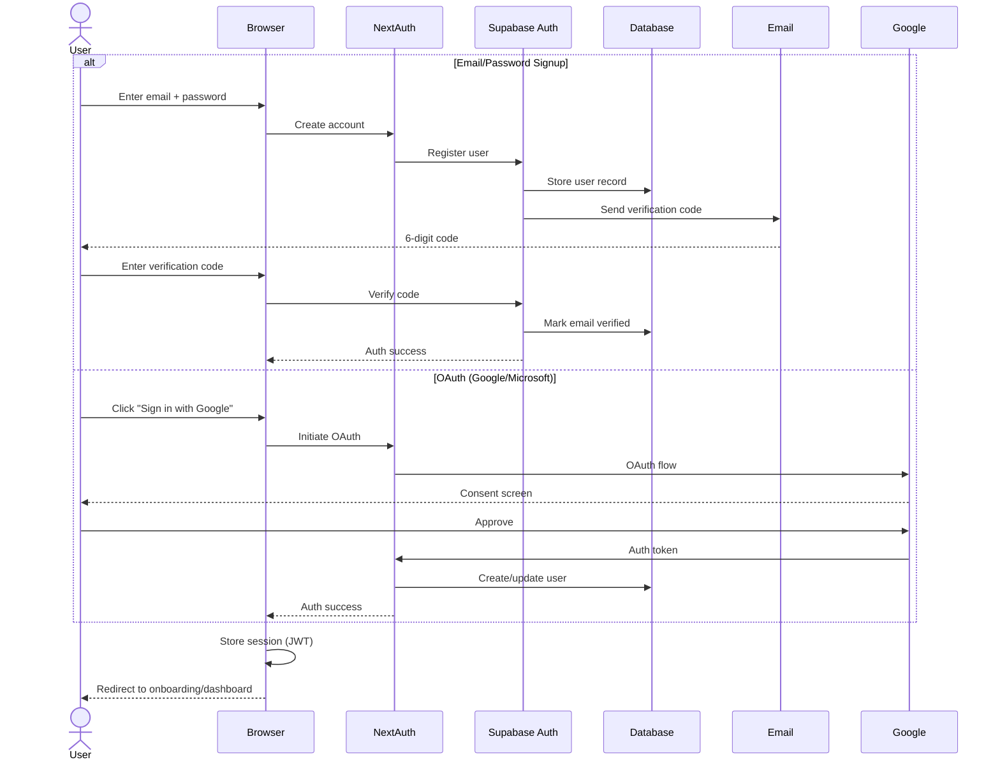
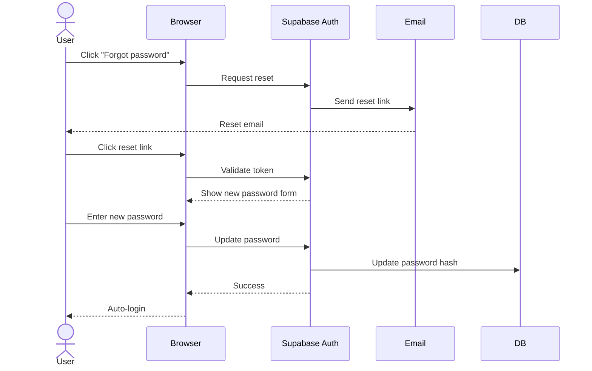
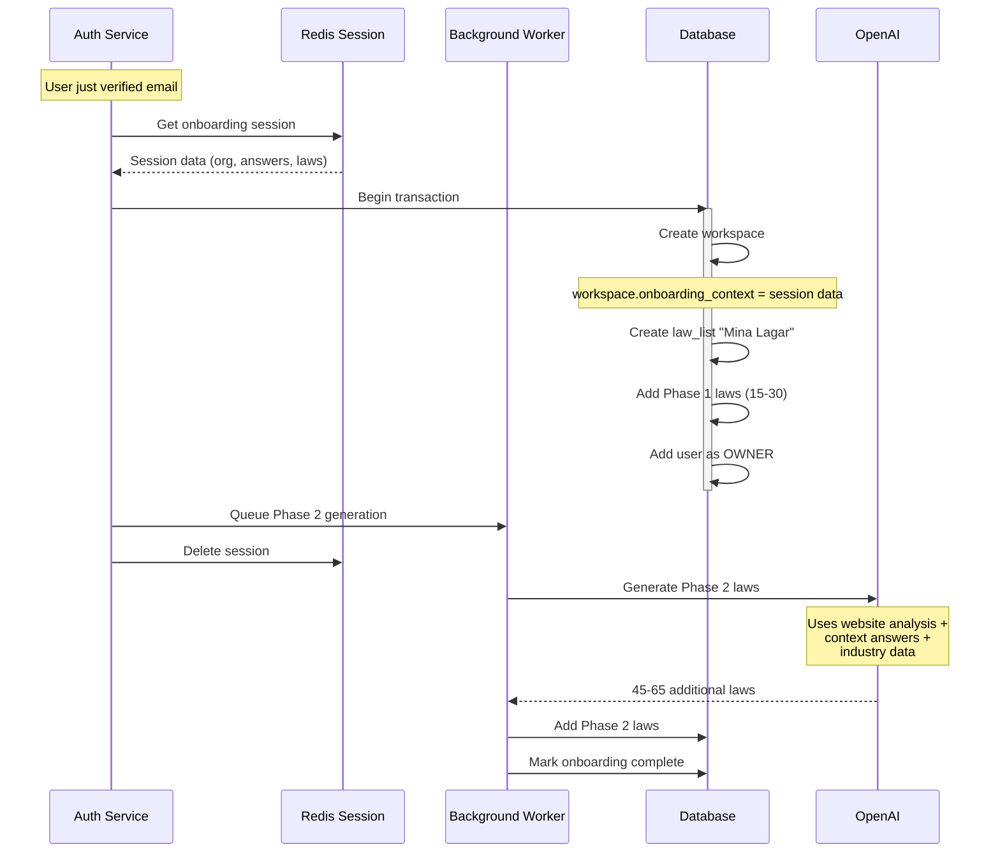
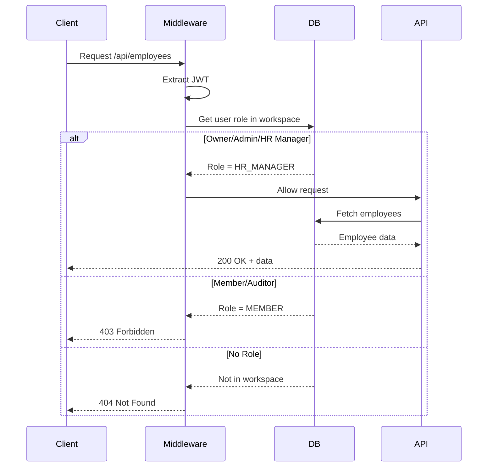

# P0 WORKFLOWS (Blocking - Required for Basic Functionality)

## 8.2 Authentication & Account Creation (Epic 1, Story 1.3)

**User Story:** User signs up with email/password or OAuth, verifies email, and accesses workspace



**Password Reset Flow:**



---

## 8.3 Workspace Creation Post-Signup (Epic 5, Story 5.1)

**User Story:** After signup, system creates workspace from session data



---

## 8.4 Role-Based Access Control (Epic 5, Story 5.2)

**User Story:** System enforces permissions based on user role



**Permission Matrix:**

```
| Feature           | Owner | Admin | HR Manager | Member | Auditor |
|-------------------|-------|-------|------------|--------|---------|
| View Laws         | ✅    | ✅    | ✅         | ✅     | ✅      |
| Edit Laws         | ✅    | ✅    | ❌         | ❌     | ❌      |
| Manage Employees  | ✅    | ✅    | ✅         | ❌     | ❌      |
| Billing           | ✅    | ❌    | ❌         | ❌     | ❌      |
| Delete Workspace  | ✅    | ❌    | ❌         | ❌     | ❌      |
```

---
