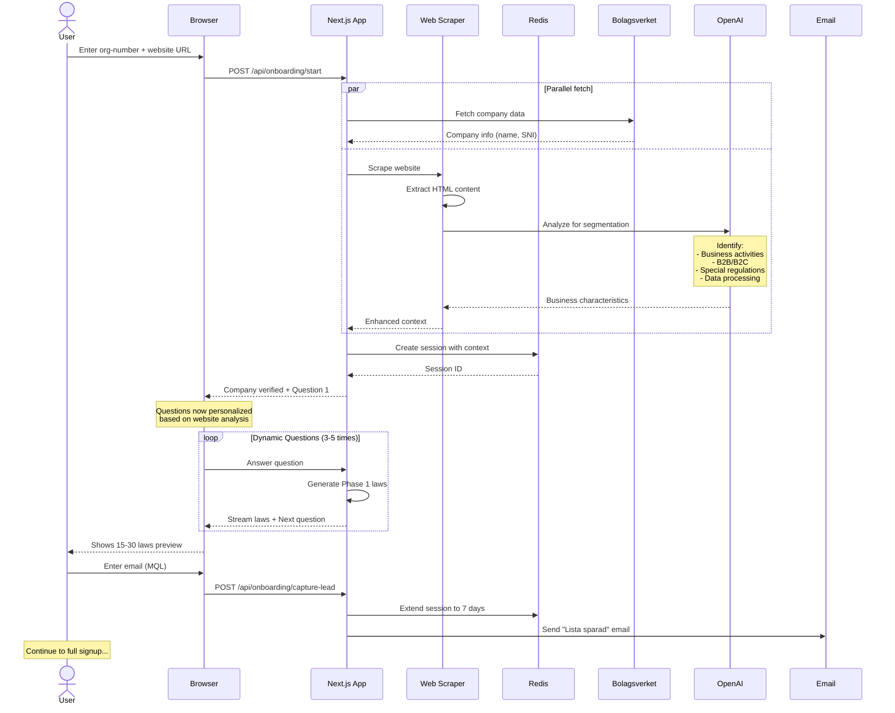
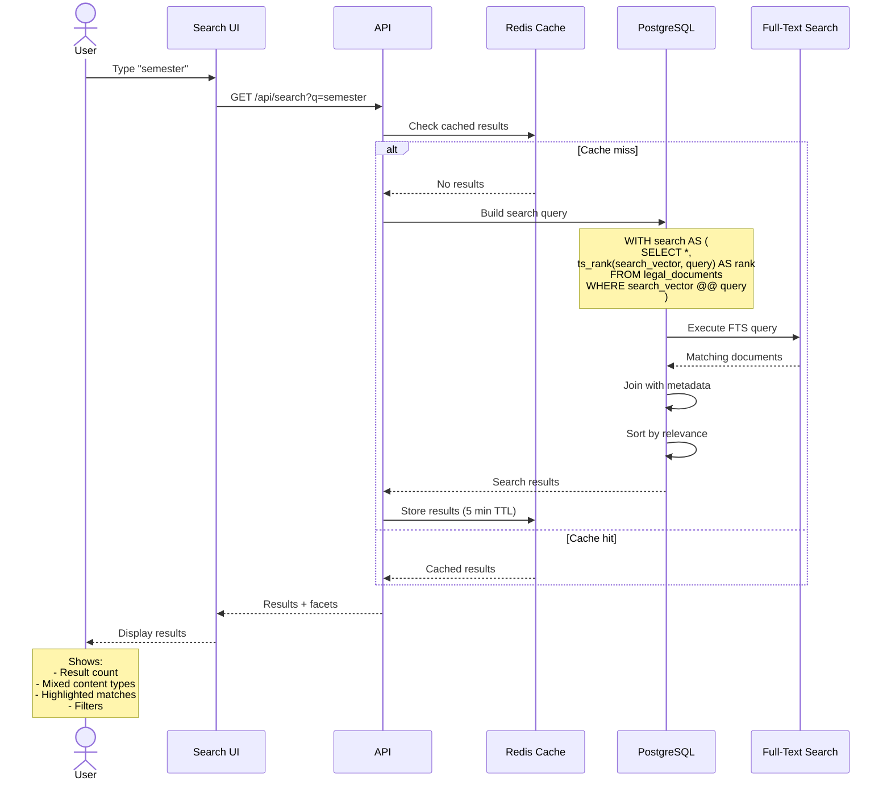
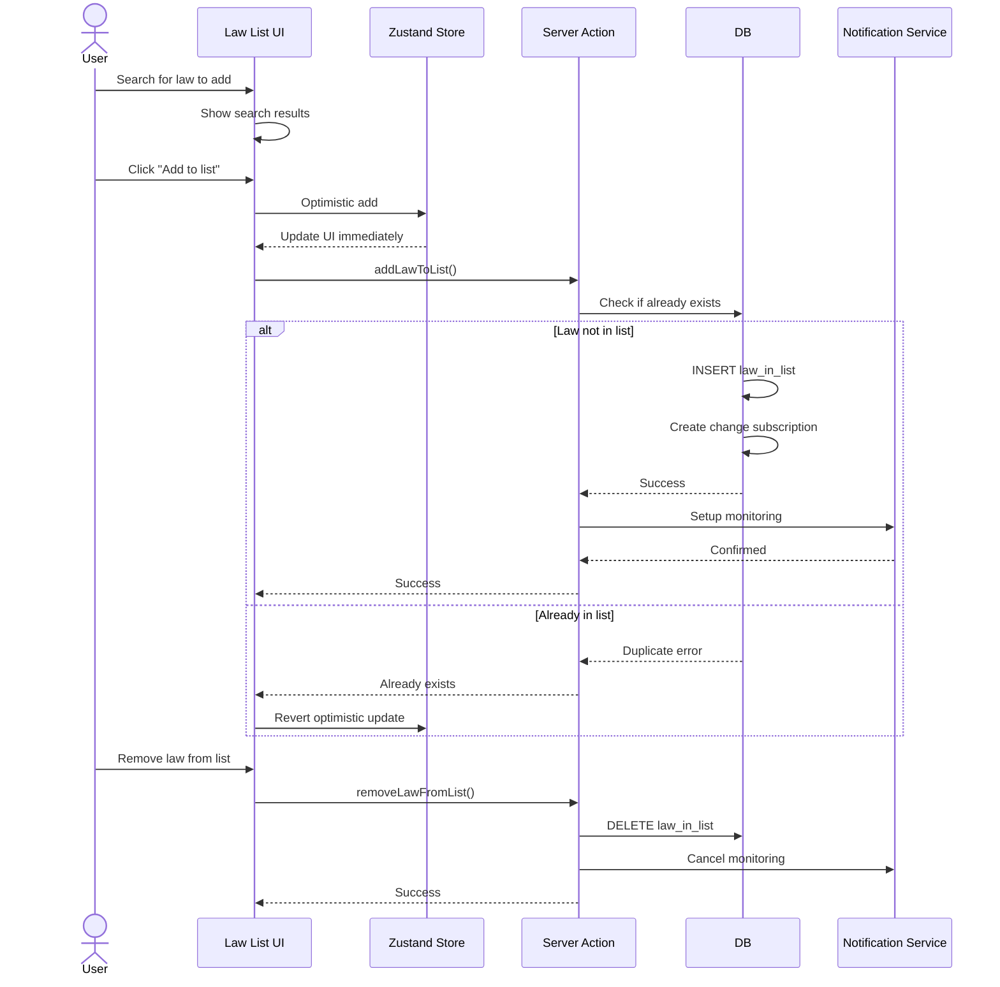
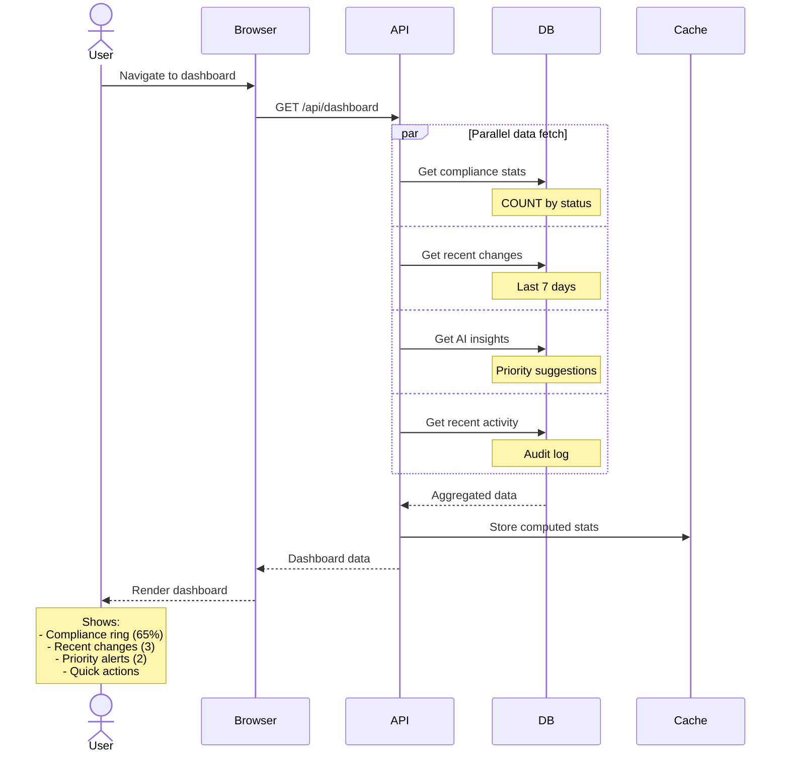
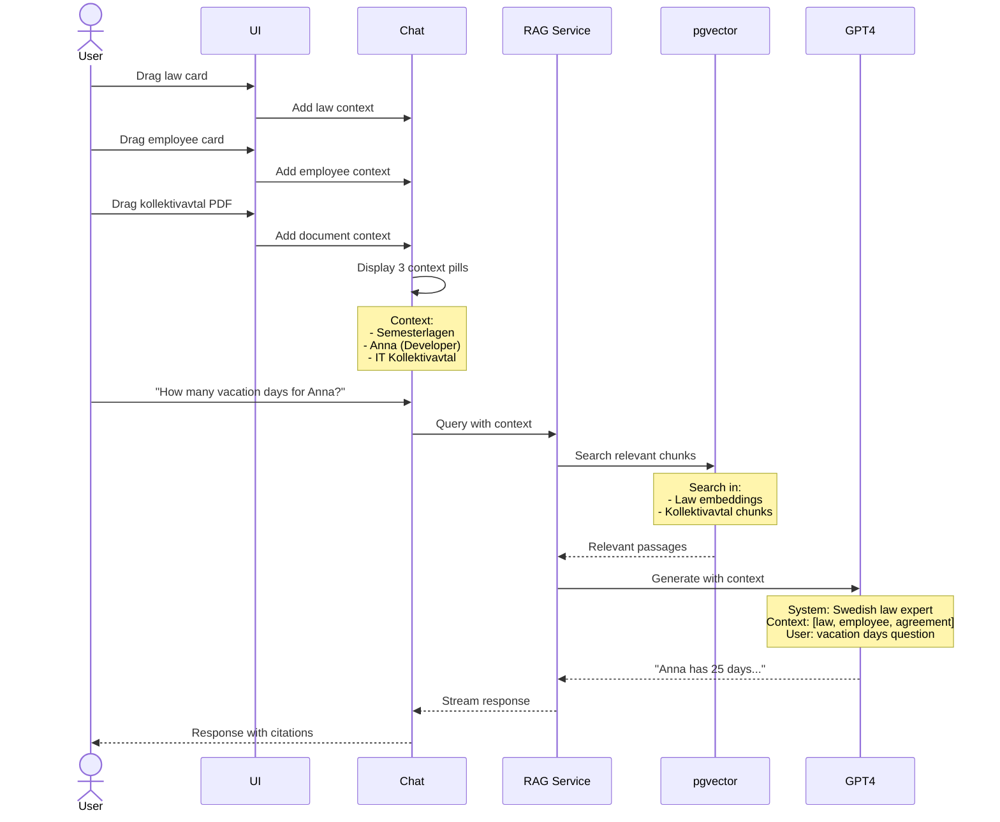
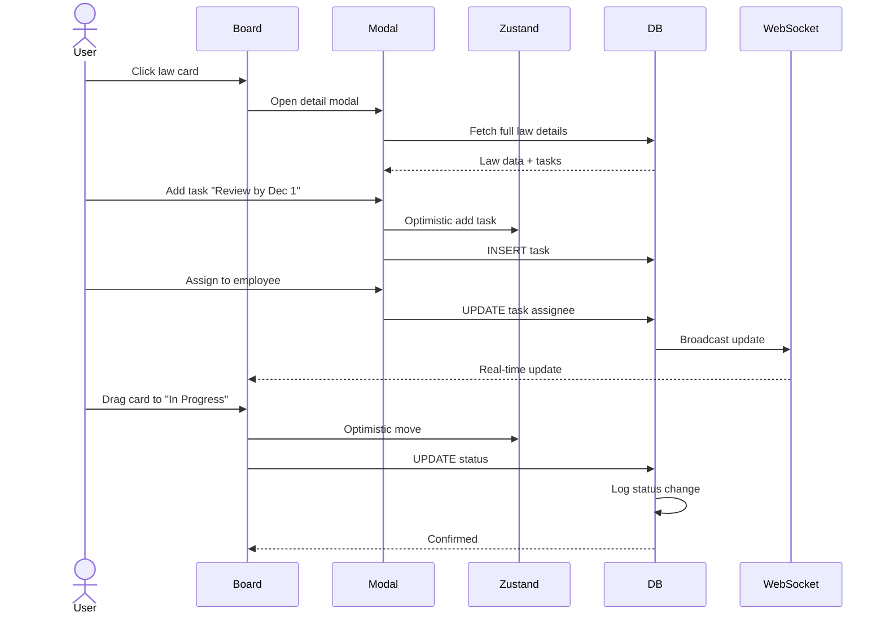
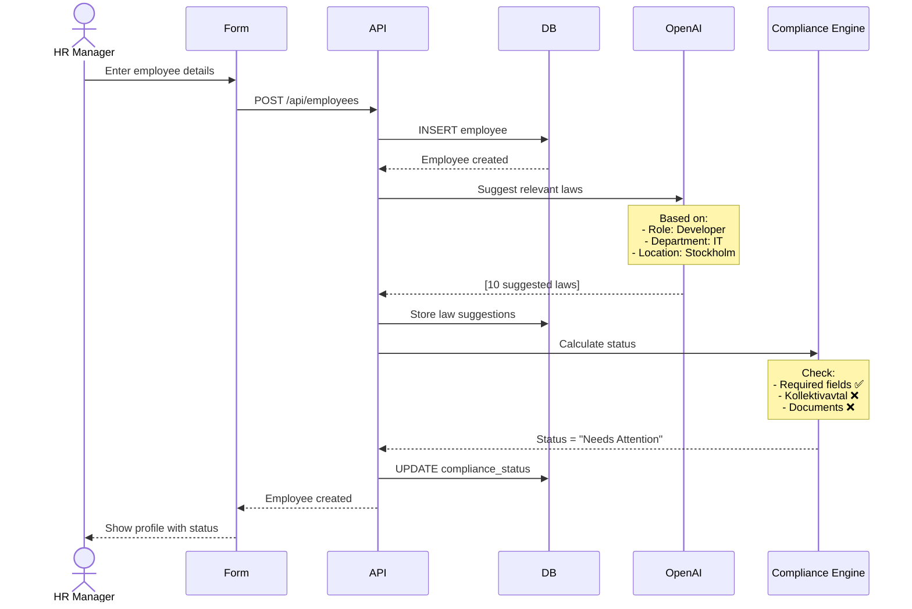
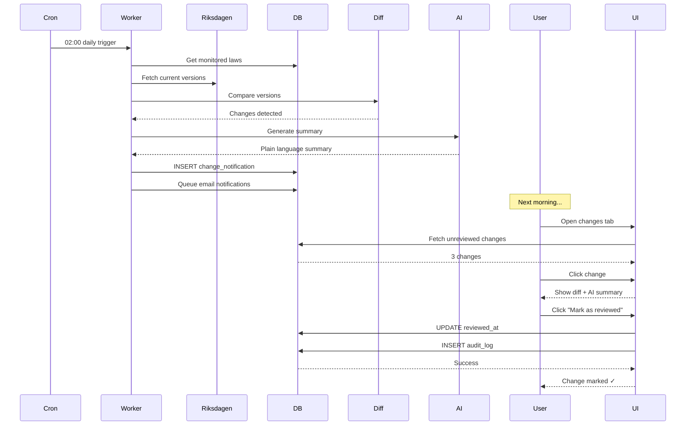

# P1 WORKFLOWS (Critical for MVP Launch)

## 8.5 Onboarding with Website Scraping (Epic 4, Stories 4.1-4.4)

**User Story:** Restaurant owner enters org-number and website URL, gets personalized law list



---

## 8.6 Search Workflow (Epic 2, Story 2.7)

**User Story:** User searches for "semester" across 170,000+ legal documents



**Search Optimizations:**

```typescript
// Weighted search ranking
const searchWeights = {
  title: 'A',        // Highest weight
  document_number: 'B',
  summary: 'C',
  full_text: 'D'     // Lowest weight
}

// Query with filters
SELECT * FROM legal_documents
WHERE
  search_vector @@ plainto_tsquery('swedish', $1)
  AND content_type = ANY($2)  -- Filter by type
  AND status = 'ACTIVE'
ORDER BY
  ts_rank(search_vector, query, 1) DESC
LIMIT 20 OFFSET $3
```

---

## 8.7 Law List Management (Epic 4, Story 4.9)

**User Story:** User adds/removes laws from their monitoring list



---

## 8.8 Dashboard View Generation (Epic 6, Story 6.1)

**User Story:** User sees personalized dashboard with compliance overview



---

## 8.9 AI Chat with Multi-Type Context (Epic 3, Stories 3.4-3.7)

**User Story:** User drags law, employee, and PDF into chat for contextual question



---

## 8.10 Kanban Board with Task Management (Epic 6, Stories 6.2-6.5)

**User Story:** User manages compliance using Kanban board with tasks



---

## 8.11 Employee CRUD & Compliance (Epic 7, Stories 7.1, 7.4)

**User Story:** HR manager adds employee and system calculates compliance



---

## 8.12 Change Detection & Review (Epic 8, Stories 8.1-8.3)

**User Story:** System detects law change, user reviews and marks as reviewed



---
