# P2 WORKFLOWS (Important but can be simplified for MVP)

## 8.13 Trial Expiration & Conversion (Epic 4, Story 4.8)

---

## 8.14 Kollektivavtal Upload & Assignment (Epic 7, Story 7.5)

---

## 8.15 Global Search (Cmd+K) (Epic 6, Story 6.9)

---

## 8.16 Usage Limit Enforcement (Epic 5, Story 5.5)

---

## 8.17 SNI Discovery Flow (Epic 2, Story 2.9)

```mermaid
sequenceDiagram
    actor User
    participant UI as Discovery Page
    participant API
    participant DB
    participant AI

    User->>UI: Enter SNI code "56.101"
    UI->>API: GET /api/discover/sni/56101

    API->>DB: Fetch pre-curated list
    Note over DB: Laws mapped to SNI codes

    alt Has curated list
        DB-->>API: 25 laws, 8 cases, 5 EU
    else No curated list
        API->>AI: Generate for SNI 56.101
        AI-->>API: Generated list
        API->>DB: Cache for future
    end

    API-->>UI: Categorized results
    UI-->>User: Three tabs
    Note over User: Lagar (25)<br/>Rättsfall (8)<br/>EU-lagstiftning (5)

    User->>UI: Click "Add all to list"
    UI->>API: Bulk add to law list
    API-->>UI: Success
```

---

## 8.18 Weekly Digest Generation (Epic 8, Story 8.7)

---
