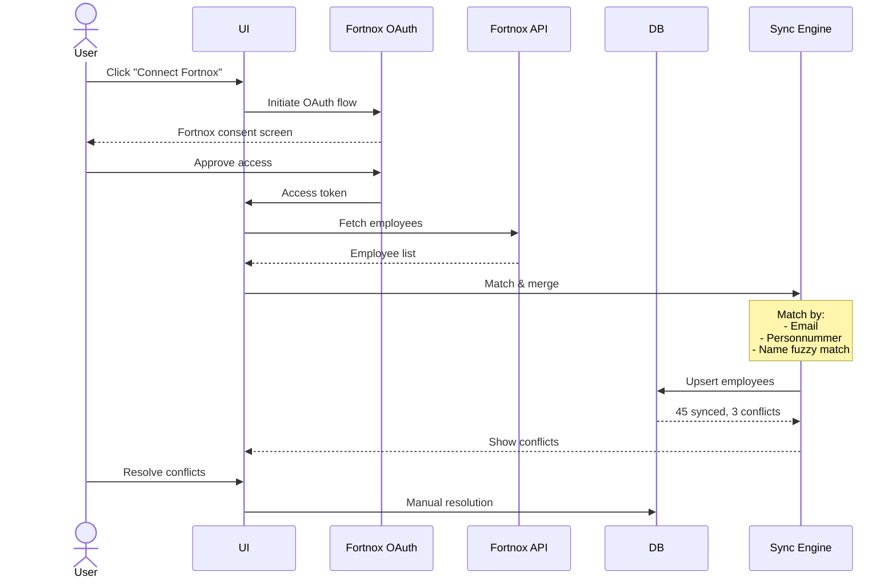
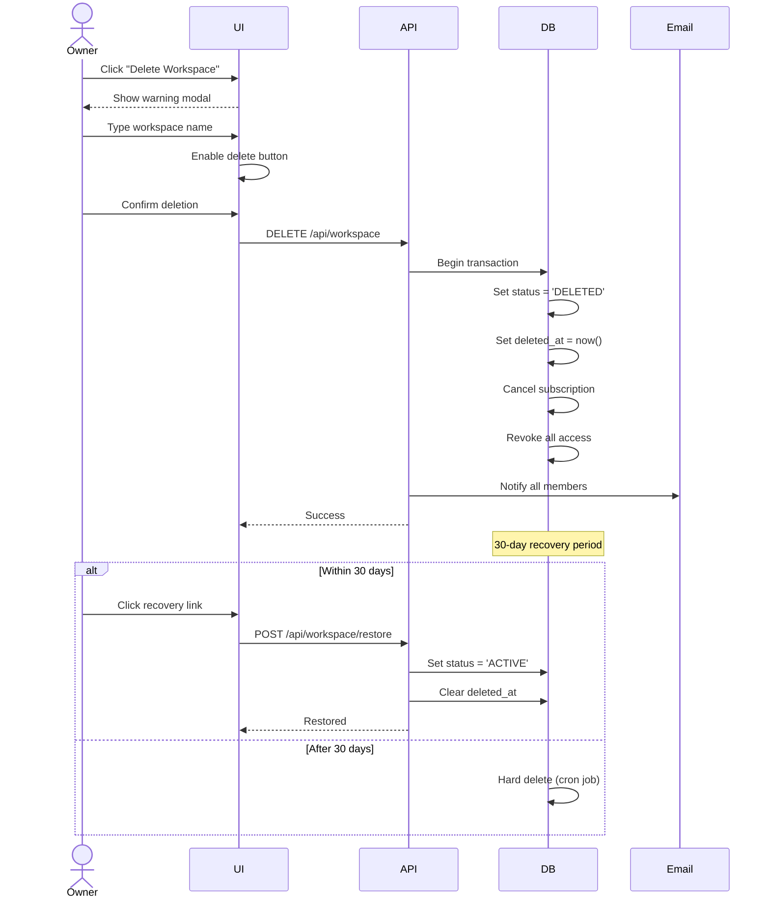

# P3 WORKFLOWS (Document now, implement Post-MVP)

## 8.19 Fortnox Employee Sync (Epic 7, Story 7.12)

```mermaid
sequenceDiagram
    actor User
    participant UI
    participant OAuth as Fortnox OAuth
    participant Fortnox as Fortnox API
    participant DB
    participant Sync as Sync Engine

    User->>UI: Click "Connect Fortnox"
    UI->>OAuth: Initiate OAuth flow
    OAuth-->>User: Fortnox consent screen

    User->>OAuth: Approve access
    OAuth->>UI: Access token

    UI->>Fortnox: Fetch employees
    Fortnox-->>UI: Employee list

    UI->>Sync: Match & merge
    Note over Sync: Match by:<br/>- Email<br/>- Personnummer<br/>- Name fuzzy match

    Sync->>DB: Upsert employees
    DB-->>Sync: 45 synced, 3 conflicts

    Sync-->>UI: Show conflicts
    User->>UI: Resolve conflicts
    UI->>DB: Manual resolution
```

---

## 8.20 Workspace Deletion & Recovery (Epic 5, Story 5.8)

```mermaid
sequenceDiagram
    actor Owner
    participant UI
    participant API
    participant DB
    participant Email

    Owner->>UI: Click "Delete Workspace"
    UI-->>Owner: Show warning modal

    Owner->>UI: Type workspace name
    UI->>UI: Enable delete button

    Owner->>UI: Confirm deletion
    UI->>API: DELETE /api/workspace

    API->>DB: Begin transaction
    DB->>DB: Set status = 'DELETED'
    DB->>DB: Set deleted_at = now()
    DB->>DB: Cancel subscription
    DB->>DB: Revoke all access

    API->>Email: Notify all members
    API-->>UI: Success

    Note over DB: 30-day recovery period

    alt Within 30 days
        Owner->>UI: Click recovery link
        UI->>API: POST /api/workspace/restore
        API->>DB: Set status = 'ACTIVE'
        API->>DB: Clear deleted_at
        API-->>UI: Restored
    else After 30 days
        DB->>DB: Hard delete (cron job)
    end
```

---
