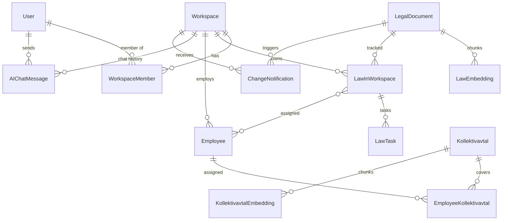

# Entity-Relationship Diagram - Laglig.se

## Complete ERD (All 29 Entities)

```mermaid
erDiagram
    %% Core Auth
    User ||--o{ WorkspaceMember : "belongs to"
    User ||--o{ AIChatMessage : "sends"
    User ||--o{ LawTask : "assigned to"
    User ||--o{ WorkspaceAuditLog : "performs actions"
    User ||--o{ EmployeeDocument : "uploads"
    User ||--o{ Kollektivavtal : "uploads"
    User ||--o{ LawList : "creates"

    %% Workspace & Multi-tenancy
    Workspace ||--o{ WorkspaceMember : "has members"
    Workspace ||--|| Subscription : "has"
    Workspace ||--|| WorkspaceUsage : "tracks usage"
    Workspace ||--o{ WorkspaceInvitation : "sends invites"
    Workspace ||--o{ WorkspaceAuditLog : "logs activity"
    Workspace ||--o{ LawInWorkspace : "tracks laws"
    Workspace ||--o{ LawList : "organizes"
    Workspace ||--o{ Employee : "employs"
    Workspace ||--o{ Department : "organizes"
    Workspace ||--o{ AIChatMessage : "contains chat"
    Workspace ||--o{ ChangeNotification : "receives notifications"
    Workspace ||--o{ Kollektivavtal : "uploads agreements"
    Workspace ||--o{ BackgroundJob : "runs jobs"

    %% Legal Content - Core
    LegalDocument ||--o{ LawEmbedding : "chunked into"
    LegalDocument ||--o| CourtCase : "has metadata"
    LegalDocument ||--o| EUDocument : "has metadata"
    LegalDocument ||--o{ CrossReference : "source of"
    LegalDocument ||--o{ CrossReference : "target of"
    LegalDocument ||--o{ Amendment : "base document"
    LegalDocument ||--o{ Amendment : "amending document"
    LegalDocument ||--o{ DocumentSubject : "categorized by"
    LegalDocument ||--o{ LawInWorkspace : "tracked in workspace"
    LegalDocument ||--o{ LawListItem : "included in lists"
    LegalDocument ||--o{ ChangeNotification : "triggers notifications"
    LegalDocument ||--o{ LawChangeHistory : "historical snapshots"

    %% Law Lists
    LawList ||--o{ LawListItem : "contains"

    %% Kanban & Compliance
    LawInWorkspace ||--o{ LawTask : "has tasks"
    LawInWorkspace }o--o{ Employee : "assigned to (array)"

    %% HR Module
    Department ||--o{ Employee : "contains"
    Department ||--o| Employee : "managed by"
    Employee ||--o| Employee : "reports to (manager)"
    Employee ||--o{ EmployeeDocument : "has documents"
    Employee ||--o{ EmployeeKollektivavtal : "assigned agreements"

    Kollektivavtal ||--o{ KollektivavtalEmbedding : "chunked into"
    Kollektivavtal ||--o{ EmployeeKollektivavtal : "assigned to employees"

    %% Entity Definitions
    User {
        uuid id PK
        string email UK
        string name
        string avatar_url
        timestamp created_at
        timestamp last_login_at
    }

    Workspace {
        uuid id PK
        string name
        string slug UK
        uuid owner_id FK
        string company_logo
        string org_number
        string company_legal_name
        string address
        string sni_code
        string legal_form
        int employee_count_reported
        jsonb onboarding_context
        boolean onboarding_completed
        string industry
        enum company_size
        enum subscription_tier
        timestamp trial_ends_at
        enum status
        timestamp created_at
        timestamp updated_at
    }

    WorkspaceMember {
        uuid id PK
        uuid workspace_id FK
        uuid user_id FK
        enum role
        uuid invited_by FK
        timestamp joined_at
    }

    OnboardingSession {
        uuid id PK
        string session_token UK
        string org_number
        jsonb bolagsverket_data
        jsonb question_answers
        jsonb phase1_laws
        timestamp created_at
        timestamp expires_at
    }

    WorkspaceInvitation {
        uuid id PK
        uuid workspace_id FK
        string email
        enum role
        string token UK
        uuid invited_by FK
        enum status
        timestamp created_at
        timestamp expires_at
    }

    Subscription {
        uuid id PK
        uuid workspace_id FK
        string stripe_customer_id
        string stripe_subscription_id
        enum status
        enum plan
        enum billing_interval
        timestamp current_period_start
        timestamp current_period_end
        timestamp cancel_at
        timestamp trial_end
        timestamp created_at
        timestamp updated_at
    }

    WorkspaceUsage {
        uuid id PK
        uuid workspace_id FK
        int ai_queries_this_month
        int ai_queries_total
        int employee_count
        int storage_used_mb
        timestamp last_reset_at
        timestamp created_at
        timestamp updated_at
    }

    WorkspaceAuditLog {
        uuid id PK
        uuid workspace_id FK
        uuid user_id FK
        enum action_type
        string resource_type
        uuid resource_id
        jsonb details
        timestamp timestamp
    }

    LegalDocument {
        uuid id PK
        enum content_type
        string document_number UK
        string title
        string slug UK
        text summary
        text full_text
        date effective_date
        date publication_date
        enum status
        string source_url
        jsonb metadata
        tsvector search_vector
        vector_1536 summary_embedding
        timestamp created_at
        timestamp updated_at
    }

    CourtCase {
        uuid id PK
        uuid document_id FK
        string court_name
        string case_number
        string lower_court
        date decision_date
        jsonb parties
    }

    EUDocument {
        uuid id PK
        uuid document_id FK
        string celex_number
        string eut_reference
        jsonb national_implementation_measures
    }

    CrossReference {
        uuid id PK
        uuid source_document_id FK
        uuid target_document_id FK
        enum reference_type
        text context
    }

    Amendment {
        uuid id PK
        uuid base_document_id FK
        uuid amending_document_id FK
        date effective_date
        text description
        jsonb sections_affected
    }

    DocumentSubject {
        uuid id PK
        uuid document_id FK
        string subject_code
        string subject_name
    }

    LawEmbedding {
        uuid id PK
        uuid law_id FK
        int chunk_index
        text chunk_text
        vector_1536 embedding
        jsonb metadata
        timestamp created_at
    }

    LawList {
        uuid id PK
        uuid workspace_id FK
        string name
        text description
        uuid created_by FK
        timestamp created_at
        timestamp updated_at
    }

    LawListItem {
        uuid id PK
        uuid law_list_id FK
        uuid law_id FK
        float position
        timestamp added_at
    }

    LawInWorkspace {
        uuid id PK
        uuid workspace_id FK
        uuid law_id FK
        enum status
        enum priority
        uuid_array assigned_employee_ids
        date due_date
        text notes
        string_array tags
        float position
        text ai_commentary
        string category
        timestamp added_at
        timestamp updated_at
    }

    LawTask {
        uuid id PK
        uuid law_in_workspace_id FK
        uuid workspace_id FK
        string title
        text description
        uuid assigned_to FK
        date due_date
        boolean completed
        timestamp completed_at
        timestamp created_at
    }

    AIChatMessage {
        uuid id PK
        uuid workspace_id FK
        uuid user_id FK
        enum role
        text content
        uuid_array retrieved_law_ids
        float cost_usd
        int latency_ms
        timestamp created_at
    }

    Employee {
        uuid id PK
        uuid workspace_id FK
        string employee_number
        string first_name
        string last_name
        string email
        string personnummer_encrypted
        string phone
        date employment_date
        date employment_end_date
        enum employment_type
        enum contract_type
        string role
        string role_standardized
        uuid department_id FK
        uuid manager_id FK
        int work_percentage
        enum compliance_status
        string fortnox_employee_id
        timestamp created_at
        timestamp updated_at
    }

    Department {
        uuid id PK
        uuid workspace_id FK
        string name
        text description
        uuid manager_id FK
        uuid parent_department_id FK
        timestamp created_at
    }

    EmployeeDocument {
        uuid id PK
        uuid employee_id FK
        uuid workspace_id FK
        enum document_type
        string title
        string file_url
        int file_size_bytes
        string mime_type
        date issued_date
        date expiry_date
        enum status
        uuid uploaded_by FK
        timestamp created_at
    }

    Kollektivavtal {
        uuid id PK
        uuid workspace_id FK
        string name
        string union_name
        enum agreement_type
        string file_url
        int file_size_bytes
        date valid_from
        date valid_until
        enum embedding_status
        uuid uploaded_by FK
        timestamp created_at
    }

    EmployeeKollektivavtal {
        uuid id PK
        uuid employee_id FK
        uuid kollektivavtal_id FK
        timestamp assigned_at
        uuid assigned_by FK
    }

    KollektivavtalEmbedding {
        uuid id PK
        uuid kollektivavtal_id FK
        int chunk_index
        text chunk_text
        vector_1536 embedding
        timestamp created_at
    }

    ChangeNotification {
        uuid id PK
        uuid workspace_id FK
        uuid law_id FK
        enum notification_type
        uuid digest_batch_id
        timestamp change_detected_at
        text change_summary
        boolean notification_sent
        timestamp notification_sent_at
        timestamp read_at
    }

    LawChangeHistory {
        uuid id PK
        uuid law_id FK
        timestamp changed_at
        enum change_type
        text full_text_snapshot
        jsonb diff
        string detected_by_cron_job_id
    }

    BackgroundJob {
        uuid id PK
        enum job_type
        uuid workspace_id FK
        enum status
        int progress_current
        int progress_total
        jsonb result_data
        text error_message
        timestamp started_at
        timestamp completed_at
        timestamp created_at
    }
```



## Simplified Core Relationships View



## Key Indexes & Constraints

```sql
-- Performance-Critical Indexes
CREATE INDEX idx_law_embeddings_hnsw ON law_embeddings USING hnsw (embedding vector_cosine_ops);
CREATE INDEX idx_legal_documents_slug ON legal_documents (slug);
CREATE INDEX idx_legal_documents_search ON legal_documents USING gin (search_vector);
CREATE INDEX idx_law_in_workspace_kanban ON law_in_workspace (workspace_id, status, position);
CREATE INDEX idx_workspace_members_lookup ON workspace_members (workspace_id, user_id);
CREATE INDEX idx_employees_workspace ON employees (workspace_id);
CREATE INDEX idx_chat_messages_recent ON ai_chat_messages (workspace_id, created_at DESC);

-- Unique Constraints
CREATE UNIQUE INDEX idx_workspace_slug ON workspaces (slug);
CREATE UNIQUE INDEX idx_legal_document_number ON legal_documents (content_type, document_number);
CREATE UNIQUE INDEX idx_law_in_workspace_unique ON law_in_workspace (workspace_id, law_id);
CREATE UNIQUE INDEX idx_workspace_members_unique ON workspace_members (workspace_id, user_id);
CREATE UNIQUE INDEX idx_onboarding_session_token ON onboarding_sessions (session_token);
CREATE UNIQUE INDEX idx_workspace_invitation_token ON workspace_invitations (token);
```
