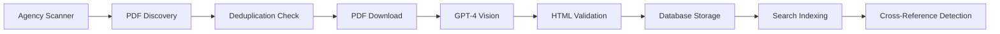

# Epic 9: Myndighetsföreskrifter Integration Pipeline

## Epic Overview

**Epic ID:** Epic 9  
**Status:** Planning  
**Priority:** High  
**Estimated Duration:** 6 sprints  
**Business Owner:** Product Team  
**Technical Lead:** Development Team

## Executive Summary

Integrate all 60+ Swedish agency regulations (myndighetsföreskrifter) into Laglig.se using the proven PDF→LLM→HTML pipeline from amendments, ensuring consistent HTML structure across all legal document types. This will make Laglig.se the only platform with complete Swedish regulatory coverage.

## Business Value

### Strategic Benefits

- **Market Leadership**: Become the only platform with complete Swedish regulatory coverage (SFS laws + all agency regulations)
- **Enterprise Critical**: Many industries must comply with agency-specific regulations (AFS for workplace safety, LIVSFS for food industry, etc.)
- **Competitive Advantage**: Major differentiator - competitors typically only have SFS laws
- **Unified Experience**: All documents (laws, amendments, agency regs) use same HTML structure for consistent rendering and search

### Target Users

- Compliance officers needing agency-specific regulations
- Legal professionals requiring comprehensive regulatory view
- Enterprises in regulated industries (construction, food, healthcare, transport)
- Government agencies needing cross-agency regulatory awareness

## Success Metrics

| Metric               | Target                     | Measurement                            |
| -------------------- | -------------------------- | -------------------------------------- |
| Agency Coverage      | 60+ agencies               | Number of active agency sources        |
| Document Volume      | 5,000+ regulations         | Total AGENCY_REGULATION documents      |
| Parsing Success Rate | 95%+                       | Successfully parsed PDFs / Total PDFs  |
| Processing Cost      | < $20/month                | Monthly LLM API costs                  |
| Search Integration   | 100% searchable            | All regulations indexed and searchable |
| HTML Consistency     | 100% compliant             | Uses .legal-document structure         |
| Update Latency       | < 24 hours (high priority) | Time from publication to availability  |

## Technical Approach

### Core Principle

Reuse the successful PDF→LLM→HTML pipeline from amendments (Story 2.29), ensuring consistent output structure.

### Key Technologies

- **PDF Processing**: Direct PDF to GPT-4 Vision (no intermediate text extraction)
- **LLM Model**: GPT-4o for multimodal PDF understanding
- **HTML Structure**: Standardized `.legal-document` classes
- **Discovery**: Web scraping, RSS feeds, lagrummet.se API
- **Storage**: PostgreSQL with proper content_type categorization

### HTML Output Standard

```html
<article class="legal-document">
  <div class="doc-metadata">
    <h1>AFS 2024:1</h1>
    <p class="doc-title">Arbetsmiljöverkets föreskrifter om...</p>
    <p class="decided-date">Beslutade: 2024-01-15</p>
  </div>

  <h4>Kapitel 1 - Allmänna bestämmelser</h4>

  <a class="paragraf" name="P1">1 §</a>
  <p>Dessa föreskrifter innehåller...</p>

  <!-- Identical structure to SFS laws -->
</article>
```

## Story Breakdown

### Story 9.1: Agency Registry & Infrastructure

**Priority:** P0 - Must Have  
**Estimated Points:** 8  
**Sprint:** 1

**Description:**  
Establish foundation for managing 60+ agency sources with configuration-driven approach.

**Acceptance Criteria:**

- [ ] All 60+ agencies from lagrummet.se registered in database
- [ ] Each agency has: id, name, code (XXFS), listing URL, active status
- [ ] Configuration system supports agency-specific settings
- [ ] Admin UI for managing agency configurations
- [ ] Monitoring dashboard shows sync status for all agencies
- [ ] Database schema includes agency_sources table with proper indices

---

### Story 9.2: PDF Discovery System

**Priority:** P0 - Must Have  
**Estimated Points:** 13  
**Sprint:** 1

**Description:**  
Build automated discovery system for finding new regulations across agency websites.

**Acceptance Criteria:**

- [ ] Web scraping extracts PDF links from agency sites
- [ ] RSS/Atom feed parsing where available
- [ ] Handles relative and absolute URLs correctly
- [ ] Deduplication by URL and content hash
- [ ] Respects agency-specific check frequency (daily/weekly/monthly)
- [ ] Rate limiting prevents overload (max 5 PDFs per agency per run)
- [ ] Discovery metrics tracked (new vs duplicate, method used)

---

### Story 9.3: PDF→LLM→HTML Pipeline (Amendment Approach)

**Priority:** P0 - Must Have  
**Estimated Points:** 8  
**Sprint:** 1

**Description:**  
Adapt the proven amendment PDF parsing pipeline for agency regulations.

**Acceptance Criteria:**

- [ ] Downloads PDF to buffer and converts to base64
- [ ] Sends directly to GPT-4 Vision (no text extraction)
- [ ] System prompt produces valid HTML only (no markdown)
- [ ] All paragraph markers use `<a class="paragraf">` format
- [ ] Section headers use `<h4>` tags consistently
- [ ] HTML passes W3C validation
- [ ] Document number extracted correctly (e.g., "AFS 2024:1")
- [ ] Stores as content_type='AGENCY_REGULATION'
- [ ] Records LLM model and token usage in metadata

---

### Story 9.4: Phase 1 - High Priority Agencies

**Priority:** P0 - Must Have  
**Estimated Points:** 13  
**Sprint:** 2

**Description:**  
Deploy the 7 most critical agencies that affect the most enterprises.

**Agencies:**

1. AFS (Arbetsmiljöverket) - Workplace safety
2. TSFS (Transportstyrelsen) - Transport
3. SOSFS (Socialstyrelsen) - Healthcare
4. LIVSFS (Livsmedelsverket) - Food safety
5. SKOLFS (Skolverket) - Education
6. SKVFS (Skatteverket) - Tax
7. KFMFS (Kronofogden) - Debt collection

**Acceptance Criteria:**

- [ ] All 7 agencies configured with verified discovery URLs
- [ ] 95%+ PDFs parse successfully to HTML
- [ ] Documents render correctly with existing .legal-document CSS
- [ ] Full-text search works on all content
- [ ] Daily sync cron job active
- [ ] New documents detected within 24 hours
- [ ] Average processing time < 10 seconds per PDF

---

### Story 9.5: Phase 2 - Medium Priority Agencies

**Priority:** P1 - Should Have  
**Estimated Points:** 13  
**Sprint:** 3

**Description:**  
Add next 15 important agencies with weekly update cycles.

**Target Agencies Include:**

- BFS (Boverket) - Building regulations
- ELSÄK-FS (Elsäkerhetsverket) - Electrical safety
- FFS (Finansinspektionen) - Financial
- IMSFS (Integritetsskyddsmyndigheten) - Privacy
- KIFS (Kemikalieinspektionen) - Chemicals
- LVFS (Läkemedelsverket) - Pharmaceuticals
- NFS (Naturvårdsverket) - Environment
- STEMFS (Energimyndigheten) - Energy
- Plus 7 additional agencies

**Acceptance Criteria:**

- [ ] 15 agencies process successfully in batch
- [ ] Parallel processing handles 5 agencies simultaneously
- [ ] Weekly sync schedule (Sundays) implemented
- [ ] 90%+ parsing success rate maintained
- [ ] LLM costs < $5/week for these agencies
- [ ] Processing completes within 2 hours

---

### Story 9.6: Phase 3 - Complete Registry

**Priority:** P2 - Nice to Have  
**Estimated Points:** 13  
**Sprint:** 4-5

**Description:**  
Add remaining ~40 agencies to achieve complete coverage.

**Acceptance Criteria:**

- [ ] All 60+ agencies from lagrummet.se integrated
- [ ] Monthly sync for low-priority agencies
- [ ] Total document count > 5,000
- [ ] System handles 60+ agency checks without timeout
- [ ] Database queries optimized (< 100ms)
- [ ] Search remains performant with full document load
- [ ] Completeness dashboard shows coverage percentage

---

### Story 9.7: Cross-Reference System

**Priority:** P1 - Should Have  
**Estimated Points:** 8  
**Sprint:** 5

**Description:**  
Link agency regulations to their authorizing SFS laws for complete regulatory picture.

**Acceptance Criteria:**

- [ ] Identifies SFS law references in agency regulations
- [ ] Creates bidirectional cross_references entries
- [ ] SFS law pages show "Related Agency Regulations" section
- [ ] Agency regulations link to authorizing laws
- [ ] Navigation works both directions
- [ ] Search results show related count
- [ ] Filter for "has agency regulations" available

---

### Story 9.8: Quality Assurance & Monitoring

**Priority:** P0 - Must Have  
**Estimated Points:** 8  
**Sprint:** 6

**Description:**  
Ensure ongoing quality, cost control, and system health monitoring.

**Acceptance Criteria:**

- [ ] Dashboard shows parsing success rate per agency
- [ ] Real-time LLM token usage tracking
- [ ] Cost per agency per month displayed
- [ ] Alert if daily cost > $5
- [ ] Email alerts for 3x failed sync attempts
- [ ] Weekly quality report generated
- [ ] Manual override for problem PDFs
- [ ] Retry failed PDFs functionality
- [ ] Monthly cost report confirms < $20 target

## Technical Implementation Details

### Agency Configuration Schema

```typescript
interface AgencySource {
  id: string // 'arbetsmiljoverket'
  name: string // 'Arbetsmiljöverket'
  code: string // 'AFS'
  listingUrl: string // Discovery URL
  discoveryMethod: 'scrape' | 'rss' | 'api'
  checkFrequency: 'daily' | 'weekly' | 'monthly'
  documentPattern: RegExp // /AFS \d{4}:\d+/
  specificPromptRules?: string // Agency-specific LLM instructions
  active: boolean
  priority: 'high' | 'medium' | 'low'
  lastChecked?: Date
  lastError?: string
  documentCount: number
}
```

### LLM Prompt Template

```typescript
const MYNDIGHETSFORESKRIFT_SYSTEM_PROMPT = (agency: AgencySource) => `
You are an expert at parsing Swedish myndighetsföreskrifter from ${agency.name}.
Convert this PDF to semantic HTML following the exact same structure as SFS laws.

CRITICAL: Output ONLY valid HTML, no markdown, no explanations.

Use this exact structure:
- <a class="paragraf" name="P{number}">{number} §</a> for ALL paragraphs
- <h4> for chapter/section headings
- <h2> for major divisions
- <i> for amendment references
- Preserve all tables, lists, and formatting

${agency.specificPromptRules || ''}

Remember: The output must render perfectly with the existing .legal-document CSS.
`
```

### Processing Pipeline



## Dependencies

- **Existing Systems:**
  - Amendment parsing pipeline (Story 2.29)
  - Legal document rendering system
  - Search infrastructure
  - `.legal-document` CSS classes

- **External Services:**
  - OpenAI GPT-4 Vision API
  - Agency websites (60+ sources)
  - lagrummet.se registry

- **Technical Requirements:**
  - PDF processing capability
  - Web scraping infrastructure
  - Cron job system
  - Redis for deduplication cache

## Risks & Mitigation

| Risk                                | Impact | Probability | Mitigation                                     |
| ----------------------------------- | ------ | ----------- | ---------------------------------------------- |
| LLM costs exceed budget             | High   | Medium      | Daily limits, batch processing, cost alerts    |
| Agency websites change structure    | Medium | High        | Flexible scraping, manual override, monitoring |
| PDF parsing quality issues          | High   | Low         | Manual review first 10 docs, quality metrics   |
| Rate limiting from agencies         | Low    | Medium      | Respectful crawling, caching, delays           |
| Storage/performance with 5000+ docs | Medium | Low         | Proper indexing, pagination, caching           |

## Implementation Timeline

```
Sprint 1 (Weeks 1-2): Infrastructure & Pipeline
  - Story 9.1: Agency Registry
  - Story 9.2: Discovery System
  - Story 9.3: PDF→LLM→HTML Pipeline

Sprint 2 (Weeks 3-4): High Priority Agencies
  - Story 9.4: Deploy 7 critical agencies
  - Initial quality validation

Sprint 3 (Weeks 5-6): Medium Priority Expansion
  - Story 9.5: Add 15 medium-priority agencies
  - Performance optimization

Sprint 4-5 (Weeks 7-10): Complete Coverage
  - Story 9.6: Add remaining 40+ agencies
  - Story 9.7: Cross-reference system

Sprint 6 (Weeks 11-12): Polish & Monitoring
  - Story 9.8: Quality assurance
  - Documentation and training
```

## Definition of Done

- [ ] All 60+ Swedish agencies integrated
- [ ] 95%+ parsing success rate achieved
- [ ] Monthly LLM costs < $20
- [ ] All regulations searchable
- [ ] HTML structure consistent with SFS laws
- [ ] Monitoring dashboard operational
- [ ] Cross-references functional
- [ ] Documentation complete
- [ ] Admin training delivered

## Notes

- Priority on reusing existing amendment parsing approach
- Focus on configuration over code - agencies differ only in config
- Emphasis on HTML structure consistency for unified rendering
- Cost control critical - must stay under $20/month
- Quality over speed - better to parse well than parse fast

---

_Epic created: 2024-01-15_  
_Last updated: 2024-01-15_  
_Status: Ready for sprint planning_
