```mermaid
graph TD
    A[Receive Daily Digest Email] --> B[Scan Subject Lines per Law List]
    B --> C{Any High Priority 🔴?}
    C -->|Yes| D[Click 'View on Laglig.se' Link]
    C -->|No| E[Archive Email, Check Next List]
    D --> F[Land on Change Detail Page]
    F --> G[Read AI Summary: 'What Changed']
    G --> H[Read Business Impact: 'Action Required by...']
    H --> I{Need More Context?}
    I -->|Yes| J[Expand 'Se juridiska detaljer']
    I -->|No| K[Click 'Visual Diff' Tab]
    J --> K
    K --> L[Review Section Changes with Highlighting]
    L --> M{Action Needed?}
    M -->|Yes| N[Click 'Ask AI for Guidance']
    M -->|No| O[Click 'Mark as Reviewed']
    N --> P[AI Chat: 'How does this affect my company?']
    P --> Q[AI Provides Specific Guidance]
    Q --> R[Export Summary or Set Reminder]
    R --> O
    O --> S[Return to All Changes Feed]
    S --> T{More Changes?}
    T -->|Yes| F
    T -->|No| U[Done - Total Time Under 5 Minutes]
```

# Laglig.se UI/UX Specification

**Version:** 1.0
**Last Updated:** 2025-11-04
**Status:** ✅ **COMPLETE** - All 10 Sections Finalized

---

## Table of Contents

1. [Introduction & Overall UX Goals](#introduction)
   - Target User Personas
   - Usability Goals
   - Design Principles

2. [Information Architecture](#2-information-architecture)
   - Sitemap
   - Navigation Structure
   - URL Structure & Breadcrumbs

3. [User Flows](#3-user-flows)
   - Flow 1: Pre-Signup Lead Generation with Org-Number + AI Analysis
   - Flow 2: Daily Change Review (5-Minute Target)
   - Flow 3: Creating Law List with Change Monitoring
   - Flow 4: AI Chat with Context Building
   - Flow 5: Exploring Law Detail Page (Layered Disclosure)

4. [Wireframes & Mockups](#4-wireframes--mockups)
   - Screen 1: Landing Page (Org-Number Entry)
   - Screen 2: Analysis In Progress (Dynamic Questioning)
   - Screen 3: Pre-Signup Law List Preview
   - Screen 4: Dashboard (Post-Signup)
   - Screen 5: Law Detail Page (Layered Disclosure)
   - Screen 6: Change Detail Page

5. [Component Library](#5-component-library) (Overview)
   - Component summaries by epic
   - Priority rankings (High/Medium/Low)
   - Technical implementation notes
   - 📄 **Detailed Component Specifications:** See [`front-end-spec-component-library.md`](./front-end-spec-component-library.md)

6. [Branding & Style Guide](#6-branding--style-guide)
   - Design Influences (OpenAI-inspired minimalism)
   - Visual Direction & Color System
   - Typography System
   - Iconography & Spacing

7. [Accessibility Requirements](#7-accessibility-requirements)
   - WCAG 2.1 AA Compliance
   - Keyboard Navigation & Screen Readers
   - Focus Management & Form Validation

8. [Responsiveness Strategy](#8-responsiveness-strategy)
   - Desktop-First Approach (B2B SaaS)
   - Breakpoint System
   - Progressive Degradation Strategy

9. [Animation & Performance](#9-animation--performance)
   - Micro-Interactions & Loading States
   - Performance Budgets (LCP, FCP, Bundle Size)
   - Optimization & Monitoring

10. [Next Steps](#10-next-steps)
    - Implementation Phases
    - Design Handoff Checklist
    - Testing & QA Strategy

---


## Introduction

This document defines the user experience goals, information architecture, user flows, and visual design specifications for Laglig.se's user interface. It serves as the foundation for visual design and frontend development, ensuring a cohesive and user-centered experience.

Laglig.se democratizes access to Swedish legal compliance by combining AI-powered plain language summaries with comprehensive legal content. Unlike competitors who assume legal expertise, we serve both novice and expert users through layered information disclosure, proactive change monitoring, and context-aware AI assistance.

### Overall UX Goals & Principles

#### Target User Personas

**Primary: SMB Owner/Manager**
- **Profile:** Runs 5-50 person company, no dedicated legal team
- **Pain Points:** "I don't know what I don't know" - unaware of compliance gaps, overwhelmed by legal language
- **Goals:** Stay compliant without hiring expensive consultants, understand changes that affect my business
- **Tech Savviness:** Moderate - comfortable with web apps, skeptical of AI "black boxes"
- **Success Metric:** Can identify compliance actions within 5 minutes of daily review

**Secondary: HR Manager**
- **Profile:** Manages employment compliance for mid-size company (50-200 employees)
- **Pain Points:** Laws change frequently (arbetsmiljö, discrimination, parental leave), hard to track what's new
- **Goals:** Proactive compliance, clear audit trails, plain language explanations for internal training
- **Tech Savviness:** High - uses multiple SaaS tools, values efficiency
- **Success Metric:** Can export change summaries for quarterly board reports

**Tertiary: ISO Compliance Manager**
- **Profile:** Manages ISO 27001/9001 certification, needs to reference legal requirements
- **Goals:** Map legal requirements to ISO controls, demonstrate due diligence to auditors
- **Pain Points:** Needs precise legal citations (not just summaries), cross-referencing between laws
- **Tech Savviness:** Very high - technical background, wants API access for integrations
- **Success Metric:** Can generate compliance evidence report in under 10 minutes

#### Usability Goals

1. **Ease of Learning:** New users (SMB Owner persona) can complete onboarding and experience "AI magic moment" within 2 minutes of signup
2. **Efficiency of Use:** Daily review of changes takes under 5 minutes - scan digest, review high-priority items, mark as reviewed
3. **Error Prevention:** Clear confirmation dialogs for destructive actions (delete law list, unsubscribe all notifications), with undo capability
4. **Memorability:** Infrequent users (quarterly compliance checks) can return without relearning - persistent onboarding tooltips, contextual help
5. **Satisfaction:** Users feel "Coolt, jag har koll!" (Cool, I've got this!) - confidence through clarity, not overwhelm

#### Design Principles

1. **Plain Swedish with Legal Transparency**
   *Rationale:* Competitors (Notisum) assume legal expertise with raw legal text only. We democratize access through AI-powered plain Swedish summaries while building trust through layered disclosure:
   - **Primary Layer (Default):** AI-generated plain Swedish explanation of "what this means" in business terms
   - **Secondary Layer (Expandable):** Full legal text with proper citations, section references, official SFS numbering
   - **Purpose:** Serve novice users (need simplicity) AND expert users (need precision), prevent "black box" AI distrust by showing sources

   *Implementation Examples:*
   - Law pages: AI summary card at top, "Visa fullständig lagtext" accordion below
   - Change notifications: Plain impact statement (1-2 sentences) + "Se juridiska detaljer" expandable section
   - AI chat responses: Conversational answer in Swedish + "Källor och fullständig lagtext" disclosure footer
   - Business impact: "This means you must update your employee handbook by Dec 1" + legal citation below

2. **Contextual Intelligence, Not Generic AI**
   *Rationale:* Generic AI chatbots give vague answers. Our drag-and-drop context builder (company info, specific laws, uploaded documents) produces tailored compliance guidance.

   *Trade-off:* Requires user to build context upfront (onboarding friction), but yields 10x more valuable responses than "Ask AI anything" approach. Progressive disclosure helps - show basic chat first, introduce context building after first question.

3. **Proactive Over Reactive**
   *Rationale:* Compliance failures happen when users don't know to check. Push value through change monitoring with AI summaries before users think to look.

   *Implementation:* Daily digest emails (08:00 CET), in-app notification badges, SMS for high-priority changes (opt-in). Never make users hunt for "what's new."

4. **Visual Hierarchy for Complex Content**
   *Rationale:* Legal documents are inherently dense. Use color-coded content types (orange=SFS laws, blue=court cases, purple=EU directives), priority badges (🔴/🟡/🟢), progressive disclosure (summaries → details) to create scannable interfaces.

   *Competitive Advantage:* Notisum shows grey text boxes with no visual hierarchy. We use GitHub-style diffs, color coding, badges for instant comprehension.

5. **Progressive Disclosure in Onboarding**
   *Rationale:* Feature-rich product risks overwhelming new users. Show AI "magic moment" immediately (paste law link → get summary), introduce advanced features gradually (law lists on day 2, context builder on day 7).

   *Assumption:* SMB Owner persona has 2-minute attention span during signup. If we don't deliver value fast, they churn before seeing full power.

### Change Log

| Date | Version | Description | Author |
|------|---------|-------------|--------|
| 2025-11-03 | 0.1 | Initial draft - Introduction, Personas, Goals, Principles | Sally (UX Expert) |

---

## Information Architecture (IA)

### Site Map / Screen Inventory


### Navigation Structure

**Primary Navigation:** Fixed top navigation bar with logo (left), main menu items (center), and account menu (right)

**Main Menu Items:**
- **Dashboard** - Default landing after login, shows personalized overview
- **AI Assistent** - Opens AI chat interface (can also be triggered from any page via floating button)
- **Lagbibliotek** (Law Library) - Browse/search all 170K+ legal content pages
- **Mina Listor** (My Lists) - Manage custom law lists with change monitoring
- **Ändringar** (Changes) - Unified feed of all detected changes across user's law lists

**Secondary Navigation:**
- **Law Detail Pages:** Tabs for AI Summary / Full Text / Change History / Related Content
- **Dashboard:** Quick-access cards for recent changes, saved searches, frequently accessed laws
- **Law Lists:** In-page tabs for Overview / Notification Settings / Activity Log

**Breadcrumb Strategy:**
- **Enable on:** Law Library (Category > Subcategory > Law), Change Detail (My Lists > List Name > Change)
- **Disable on:** Dashboard (top-level), AI Chat (conversational flow), Settings (flat hierarchy)
- **Format:** `Home > Lagbibliotek > Arbetsmiljö > Arbetsmiljölagen (1977:1160)`
- **Behavior:** Each segment clickable, truncate middle segments on mobile ("Home > ... > Current Page")

---

## User Flows

This section maps the critical user journeys through Laglig.se, focusing on the "happy path" with notes on edge cases and error handling.

### Flow 1: Pre-Signup Lead Generation with Org-Number + AI Analysis

**User Goal:** Restaurant owner discovers Laglig.se, enters org-number, answers 3-5 contextual questions, sees personalized law list generated in real-time, signs up to monitor changes

**Entry Points:** SEO landing page ("restaurang lagar sverige"), Google Ads, referral link, industry-specific pages

**Success Criteria:** User sees personalized preview of 15-30 highest-priority laws before signup (demonstrates value), signs up, then sees remaining 45-65 laws generated post-signup for complete 60-80 law compliance list

#### Flow Diagram


#### Dynamic Questioning Logic

**AI selects 3-5 questions based on context, prioritizing highest-impact legal determinants:**

**Question Selection Examples:**

1. **Always Ask (All Industries):**
   - "Hur många anställda har ni?" (0 / 1-9 / 10-24 / 25-49 / 50+)
     - Triggers: Employment laws, union representation requirements, work environment committees

2. **Industry-Triggered Questions (SNI Code):**
   - **Restaurang (SNI 56.x):**
     - "Serverar ni alkohol?" → Alkohollagen (2010:1622)
     - "Anställer ni personer under 18 år?" → Arbetstidslagen youth employment rules
     - "Har ni uteservering?" → Local ordinances, Serveringstillståndslagen

   - **Bygg (SNI 41-43):**
     - "Arbetar ni med farliga ämnen (asbest, kemikalier)?" → AFS regulations
     - "Har ni underentreprenörer?" → Skatteförfarandelagen (tax liability), Beställaransvarslagen
     - "Arbetar ni på höjd eller med tunga maskiner?" → AFS fall protection, machinery safety

   - **E-handel (SNI 47.91):**
     - "Säljer ni till privatpersoner eller företag?" → Konsumentköplagen vs. Köplagen
     - "Säljer ni till andra EU-länder?" → EU consumer protection directives
     - "Vilken typ av produkter?" (elektronik/livsmedel/kläder) → Product-specific regulations

   - **Vårdgivare (SNI 86-88):**
     - "Privat eller kommunal vårdgivare?" → Different regulatory frameworks
     - "Hanterar ni patientjournaler?" → Patientdatalagen + GDPR
     - "Har ni jour/nattarbete?" → Arbetstidslagen special scheduling rules

3. **Employee-Count-Triggered Questions:**
   - **If 1-9 employees:**
     - "Har ni kollektivavtal?" → Collective bargaining laws

   - **If 10-24 employees:**
     - "Har ni skyddsombud?" (required by law) → Track compliance gap if "No"

   - **If 25+ employees:**
     - "Har ni skyddskommitté?" (required) → Arbetsmiljöförordningen
     - "Genomför ni årlig medarbetarundersökning?" → Work environment requirements

   - **If 50+ employees:**
     - (Auto-include) MBL negotiation requirements for organizational changes

4. **Follow-Up Questions (Answer-Triggered):**
   - If answered "Ja" to "Serverar ni alkohol?":
     → "Vilken typ av serveringstillstånd?" (Fullständigt / Mellanöl & vin / Enbart öl klass II)

   - If answered "Ja" to "Har ni underentreprenörer?":
     → "Kontrollerar ni deras F-skatt och ID06?" → Add Beställaransvarslagen, own tax liability risk

**Question UI Pattern:**

```
┌──────────────────────────────────────────────┐
│ 🤖 Analyserar Restaurang Söder AB...        │
│                                              │
│ ✓ Bolagsverket: Restaurang (SNI 56.101)    │
│ ✓ Registrerad: 2018, Stockholm             │
│                                              │
│ ──────────────────────────────────────────  │
│                                              │
│ Fråga 1 av ~4:                              │
│ Hur många anställda har ni?                 │
│                                              │
│ ( ) 0  (•) 1-9  ( ) 10-24  ( ) 25-49  ( ) 50+ │
│                                              │
│ [Fortsätt →]                                │
│                                              │
│ 📋 Genererar lagar...                       │
│ ✓ Arbetsmiljölagen (1977:1160)             │
│ ✓ Arbetstidslagen (1982:673)               │
│ ✓ Semesterlagen (1977:480)                 │
│                                              │
└──────────────────────────────────────────────┘

[After answer, next question appears with new laws streaming below]

┌──────────────────────────────────────────────┐
│ Eftersom ni har 1-9 anställda:              │
│                                              │
│ Fråga 2 av ~4:                              │
│ Serverar ni alkohol?                        │
│                                              │
│ (•) Ja, vi har serveringstillstånd          │
│ ( ) Nej                                     │
│                                              │
│ [Fortsätt →]  [← Tillbaka]                 │
│                                              │
│ 📋 Lägger till specialiserade lagar...      │
│ ✓ Alkohollagen (2010:1622)                 │
│ ✓ Tobakslagen (2018:2088)                  │
│   💡 Rökfria serveringsutrymmen             │
│                                              │
└──────────────────────────────────────────────┘
```

#### Edge Cases & Error Handling

- **Invalid org-number format:** Show "Ogiltigt organisationsnummer. Använd format: XXXXXX-XXXX" with example
- **Org-number not found in Bolagsverket:** Allow manual entry: "Vi hittade ingen information. Berätta om ditt företag:" → Fallback to industry dropdown + manual context
- **Bolagsverket API slow (>5s):** Show skeleton loader "Hämtar företagsdata...", timeout after 8 seconds, fallback to manual industry selection
- **Bolagsverket API down:** Immediate fallback: "Bolagsverket svarar inte. Välj din bransch:" → Manual flow
- **User closes browser during questioning (before signup):** Save org-number + partial answers + generated laws to session storage (24-hour expiry), resume if user returns with "Fortsätt där du slutade"
- **User clicks back during questions:** Allow navigation back to previous question, preserve answers, regenerate law list based on updated context
- **Generated list has 0 laws (impossible edge case):** Fallback to "Alla Företag" baseline list (Arbetsmiljölagen, GDPR, Bokföringslagen)
- **User already has account with this org-number:** Show "Du har redan ett konto med detta org-nummer. [Logga in istället]"
- **User selects "Vet inte" for question:** Include law with "⚠️ Kan gälla dig - kontrollera" tag, allow user to review/remove post-signup
- **AI asks more than 5 questions:** Hard limit at 5 questions, then force "Analysis Complete" state (prevent interrogation fatigue)

#### Conversational Elements During Streaming

**Progressive Value Demonstration:**

1. **As user answers each question, show:**
   - Law count incrementing: "14 lagar hittills..."
   - New laws streaming in with animation (fade-in, not dump)
   - Reason tag: "Gäller eftersom ni har 12 anställda"

2. **After final question (Phase 1 - Pre-Signup):**
   - Summary screen showing TOP PRIORITY laws only:
     ```
     ✅ Analys klar! 23 högprioriterade lagar för Restaurang Söder AB

     📊 Baserat på:
     • Restaurang med 12 anställda
     • Serveringstillstånd (alkohol)
     • Skyddsombud finns
     • Stockholm

     💡 +45-65 ytterligare lagar genereras efter registrering
     📋 Totalt beräknas ~68 lagar gälla för din verksamhet

     [Skapa Gratis Konto - Se Alla ~70 Lagar →]
     ```

3. **Educational tooltips during streaming:**
   - "💡 Med 10+ anställda krävs skyddsombud enligt Arbetsmiljölagen"
   - "⚠️ Restauranger med alkoholtillstånd har särskilda ansvarskrav"

4. **Pre-signup law list preview (Phase 1 - Top 23 Laws Only):**
   - Scrollable list of 23 high-priority laws
   - Each law shows: Title, SFS number, 1-sentence AI summary, Priority badge (🔴/🟡/🟢)
   - Badge at bottom: "🔒 +45-65 mer lagar väntar efter registrering"
   - "Se fullständig AI-sammanfattning" button → Disabled with tooltip: "Skapa konto för fullständiga analyser"

5. **Post-signup completion (Phase 2 - Remaining 45-65 Laws):**
   - User lands on Dashboard, sees 23 pre-generated laws immediately
   - Progress bar at top: "Kompletterar din laglista... 23/68 lagar"
   - Streaming continues in background, new laws appear with fade-in animation
   - Categories populate: "Grundläggande (23) • Arbetsmiljö (12) • Branschspecifika (8) • GDPR & Data (5) • Ekonomi (11) • Miljö (6) • Övrigt (3)"
   - Toast notification when complete: "✅ Klar! 68 lagar i din lista är nu kompletta och aktiverade för ändringsbevakning"
   - User can interact with Dashboard during generation (not blocked)

**Phase 1 vs Phase 2 Law Prioritization:**

**Phase 1 (Pre-Signup, 15-30 Laws):**
- Show highest-impact laws to demonstrate value
- Prioritize laws with:
  - High change frequency (Arbetsmiljölagen, Diskrimineringslagen)
  - High fine risk (GDPR, Alkohollagen, Arbetsmiljölagen violations)
  - Business-critical (Bokföringslagen, Aktiebolagslagen)
  - Industry-specific (based on SNI code + question answers)

**Phase 2 (Post-Signup, 45-65 Additional Laws):**
- Comprehensive coverage, including:
  - "Nice to know" laws (lower change frequency)
  - Tangential regulations (Marknadsföringslagen, Varumärkeslagen)
  - Specialized contexts (export regulations if EU sales mentioned)
  - Preventive laws (consumer protection even if B2B focused)
  - Environmental laws (based on industry)

**Typical 60-80 Law Breakdown (Restaurant Example):**

```
Total: 68 laws

Grundläggande (23 laws) - PHASE 1
├─ Aktiebolagslagen (2005:551)
├─ Bokföringslagen (1999:1078)
├─ Årsredovisningslagen (1995:1554)
├─ Mervärdesskattelagen (1994:200)
├─ Inkomstskattelagen (1999:1229)
├─ Skatteförfarandelagen (2011:1244)
├─ GDPR / Dataskyddsförordningen
├─ ... (16 more baseline laws)

Arbetsmiljö & Arbetsrätt (15 laws) - PHASE 1 + 2
├─ Arbetsmiljölagen (1977:1160) - PHASE 1 🔴
├─ Arbetstidslagen (1982:673) - PHASE 1 🔴
├─ Semesterlagen (1977:480) - PHASE 1
├─ LAS - Lagen om anställningsskydd - PHASE 1 🟡
├─ Diskrimineringslagen (2008:567) - PHASE 1 🔴
├─ Arbetsmiljöförordningen - PHASE 2
├─ AFS 2015:4 Organisatorisk och social arbetsmiljö - PHASE 2
├─ ... (8 more employment laws)

Branschspecifika Restaurang (12 laws) - PHASE 1 + 2
├─ Alkohollagen (2010:1622) - PHASE 1 🔴
├─ Tobakslagen (2018:2088) - PHASE 1
├─ Livsmedelslagen (2006:804) - PHASE 1 🔴
├─ Serveringstillståndslagen - PHASE 1
├─ Folköls- och försäljningslagen - PHASE 2
├─ Marknadsföringslagen (2008:486) - PHASE 2
├─ ... (6 more food/hospitality laws)

GDPR & Dataskydd (5 laws) - PHASE 2
├─ Dataskyddslagen (2018:218)
├─ Patientdatalagen (only if healthcare catering)
├─ ... (3 more data protection laws)

Ekonomi & Skatter (8 laws) - PHASE 2
├─ Bokföringslagen (duplicate check)
├─ Kassaregisterlagen (2007:592)
├─ ... (6 more tax/accounting laws)

Miljö (3 laws) - PHASE 2
├─ Miljöbalken (1998:808)
├─ Avfallsförordningen (2020:614)
├─ ... (1 more environmental law)

Övrigt (2 laws) - PHASE 2
├─ Signaturlagen (if contracts require e-signatures)
├─ ... (1 more)
```

**Notes:**

- **2-3 minute target** from org-number entry to signup CTA (Phase 1 only)
- **Phase 2 generation: 30-60 seconds** post-signup (background process)
- **Question limit: 3-5 max** - AI must prioritize highest-impact questions, avoid over-questioning
- **Streaming is critical** - Phase 1 shows laws progressively, Phase 2 continues streaming after signup
- **Pre-populated signup form** - Company name from Bolagsverket auto-fills, reduces friction
- **Default law list name:** "[Company Name] - Compliance Laws" (user can rename post-signup)
- **Context preservation** - All answers stored in `CompanyContext` object, used for Phase 2 generation, AI chat, notifications, future features
- **No email capture pre-signup** - Show Phase 1 value first, then ask for account creation
- **Industry-specific landing pages** - Create SEO pages for top 20 industries that feed into this flow
- **User not blocked during Phase 2** - Can explore Dashboard, set notification preferences, ask AI questions while remaining laws generate in background
- **Notisum comparison:** Typical Notisum lists have 60-80 laws, we match this comprehensiveness but with AI prioritization and explanations

---

### Flow 2: Daily Change Review (5-Minute Target)

**User Goal:** SMB Owner checks morning email digest, reviews high-priority changes, marks as reviewed

**Entry Points:** Daily digest email (08:00 CET), in-app notification badge, direct visit to Ändringar page

**Success Criteria:** User identifies actionable changes, understands business impact, marks changes as reviewed or saves for follow-up

#### Flow Diagram



#### Edge Cases & Error Handling

- **No changes today:** Email says "Inga nya ändringar idag för dina listor" with link to Dashboard
- **User already reviewed in-app:** Email shows "✓ Granskad" badge, link opens with "Du har redan granskat denna ändring"
- **Change affects multiple law lists:** Show "Finns i 3 av dina listor" tag, mark as reviewed across all lists
- **User wants to unreview:** Provide "Ångra granskning" option within 24 hours (like Gmail undo)

**Notes:** 5-minute target assumes 3-5 changes per day. Priority badges (🔴/🟡/🟢) are critical for triage. Visual diff should load instantly (no spinner), AI summary cached from nightly batch job.

---

### Flow 3: Creating Law List with Change Monitoring

**User Goal:** HR Manager creates "Arbetsmiljölagar" list, adds 8 relevant laws, enables daily email notifications

**Entry Points:** Dashboard "Skapa Ny Lista" CTA, prompted after onboarding, from Law Detail page "Add to List" button

**Success Criteria:** Law list created, laws added, notification preferences set, confirmation email sent

#### Flow Diagram


#### Edge Cases & Error Handling

- **No laws selected:** Disable "Nästa" button until at least 1 law selected, show "Lägg till minst 1 lag för att fortsätta"
- **Duplicate law added:** Show "Denna lag finns redan i listan" toast, don't add duplicate
- **Invalid SFS number pasted:** Highlight invalid entry in red, show "Kontrollera SFS-numret (format: SFS YYYY:NNNN)"
- **User exits mid-creation:** Save draft as "Osparad lista" in Account Settings, show "Du har en osparad lista. Vill du fortsätta?" on next login

**Notes:** Multi-select with checkbox is critical for bulk adding. Preview notification example builds trust ("This is what you'll receive"). Default to daily email notifications (opt-out friction), but allow granular control.

---

### Flow 4: AI Chat with Context Building

**User Goal:** SMB Owner asks "Do I need to update my employee handbook due to recent arbetsmiljö law changes?" and gets specific, actionable guidance

**Entry Points:** Floating AI button (any page), primary nav "AI Assistent", from Change Detail "Ask AI for Guidance"

**Success Criteria:** User receives plain Swedish answer with citations, understands action needed, can export summary

#### Flow Diagram


#### Edge Cases & Error Handling

- **Vague question:** AI asks clarifying question: "Menar du arbetsmiljölagen eller diskrimineringslagen?"
- **Question outside legal domain:** AI responds: "Jag kan bara hjälpa med svenska lagar. Försök fråga om...", suggests related legal topics
- **AI response cites outdated law:** Show warning badge "⚠️ Lagen har ändrats sedan 2024-12-01. Läs senaste versionen."
- **Context Builder skipped:** AI gives generic answer, then shows tooltip: "Bygg kontext för mer specifika svar"

**Notes:** Context building is key differentiator vs. generic ChatGPT. Progressive disclosure: allow basic questions without context, introduce context builder after 2-3 questions. Citations must link directly to Law Detail pages (not external sites).

---

### Flow 5: Exploring Law Detail Page (Layered Disclosure)

**User Goal:** ISO Compliance Manager researches Arbetsmiljölagen (1977:1160), reads AI summary, then drills into full legal text for citation

**Entry Points:** Search results, law list, AI chat citation link, change notification

**Success Criteria:** User understands law's purpose (AI summary), accesses precise legal text (full text tab), sees recent changes (change history tab)

#### Flow Diagram

```mermaid
graph TD
    A[Land on Law Detail Page] --> B[Default Tab: AI Summary]
    B --> C[Read 'Vad är denna lag?' Section]
    C --> D[Read 'Vem påverkas?' Section]
    D --> E[Read 'Viktigaste bestämmelserna' Section]
    E --> F{Need Full Legal Text?}
    F -->|No| G[Click 'Related Content' Tab]
    F -->|Yes| H[Click 'Full Legal Text' Tab]
    H --> I[Full SFS Text with Section Numbers]
    I --> J[Search Within Text: Ctrl+F or In-Page Search]
    J --> K[Click Section Link: '26 §']
    K --> L[Section Highlighted, 'Visa fullständig lagtext' Accordion Opens]
    L --> M{Copy Citation?}
    M -->|Yes| N[Click 'Kopiera paragraf med källa']
    M -->|No| O[Click 'Change History' Tab]
    N --> P[Clipboard: '26 § Arbetsmiljölagen (1977:1160)...']
    P --> O
    O --> Q[Timeline of All Amendments]
    Q --> R[Click Amendment: 'SFS 2025:938']
    R --> S[Visual Diff: Old Text vs New Text]
    S --> T[Read AI Summary: 'What Changed']
    T --> U{Action Needed?}
    U -->|Yes| V[Click 'Ask AI for Guidance']
    U -->|No| W[Return to Dashboard]
    V --> X[AI Chat Opens with Law Context]
```

#### Edge Cases & Error Handling

- **Law has no AI summary yet:** Show "AI-sammanfattning genereras..." with structured fallback (title, key sections, effective date)
- **User searches for section that doesn't exist:** Show "§ 99 finns inte i denna lag. Högsta § är 45"
- **Change history empty (new law):** Show "Denna lag har inga tidigare ändringar. Ikraftträdde: 2025-01-01"
- **Related content loading slow:** Show skeleton loaders, prioritize court cases over EU directives

**Notes:** Tab order matters: AI Summary (default) → Full Legal Text → Change History → Related Content. This reinforces layered disclosure. Copy citation button is critical for ISO Compliance Manager persona. Search within text must be fast (<100ms), consider indexing with Algolia or similar.

---

## Detailed Rationale for User Flow Decisions:

**Trade-offs Made:**

1. **Onboarding: Org-number + dynamic questions vs. Manual law search:** Chose org-number because it provides instant personalization (Bolagsverket data) and demonstrates value before signup. Dynamic questioning (3-5 AI-selected questions) balances context collection with low friction. Risk: users without org-number (sole proprietors) need fallback manual flow. Alternative rejected: Static industry form feels like homework, doesn't show "magic."

2. **Pre-signup value demo vs. Signup-first:** Chose pre-signup law generation because it's lower friction (try before commit) and higher conversion (users see "these are MY laws" before email/password). Risk: users might leave without signing up, but personalized demo quality justifies it. Email capture considered but rejected as premature friction.

3. **Streaming law generation vs. Batch display:** Chose streaming (laws appear one-by-one as AI generates) because it creates "magic moment" and keeps user engaged during 2-3 minute process. Risk: slower than batch, but engagement value outweighs speed. Timeout at 8 seconds ensures speed floor.

4. **Dynamic questioning (AI-selected) vs. Static form:** Chose AI-driven questions because they adapt to industry/context (restaurant gets alcohol questions, construction gets safety questions). Results in 3-5 questions instead of 10+ field form. Risk: AI might ask irrelevant question, but question selection logic minimizes this.

5. **Daily digest: Separate email per list vs. Unified email:** Chose separate emails per list (like Notisum) because users want focused emails ("Arbetsmiljölagar changes" separate from "Skatterätt changes"). Unified email risks becoming too long, gets ignored.

6. **Law List creation: Guided wizard vs. Single page form:** Chose wizard (Name → Add Laws → Notifications) because it reduces cognitive load, allows preview at each step, increases completion rate.

7. **AI Chat: Always available (floating button) vs. Only in specific contexts:** Chose floating button on all pages because AI is core value prop, users should be able to ask questions anytime. Risk: users ask off-topic questions, but acceptable trade-off.

**Assumptions:**

- **Org-number is trusted UX pattern in Sweden:** Swedes are familiar with entering org-number (Bankid, Skatteverket, Ratsit), reduces friction vs. manual forms
- **3-5 contextual questions acceptable friction:** Users tolerate brief questioning if value is clear (personalized law list), but more than 5 questions causes abandonment
- **Bolagsverket API reliable:** Assuming 95%+ uptime, but fallback manual flow exists for downtime
- **Streaming creates "magic moment":** Hypothesis that progressive law generation (vs. batch) increases perceived value and engagement
- **Users want to see value before signup:** Assumption that personalized demo converts better than feature marketing + signup gate
- **Company context valuable throughout app:** Assumption that org-number data + question answers power better AI chat, notifications, and future features (justifies upfront collection)
- **SMB Owners check email in morning (08:00 digest time):** Not throughout day
- **Users won't trust AI without seeing sources:** Justifies "Källor och fullständig lagtext" footer in every AI response
- **Law Detail page: 70% users read AI summary only, 20% also read full text, 10% also check change history:** Justifies tab order

**Interesting Decisions:**

1. **Org-number optional website field:** Website used for enhanced context (scrape for industry signals: menu → restaurant, "careers" → hiring) but not required. Low friction, high upside.

2. **Question limit hard-coded at 5 max:** Prevents AI from over-questioning (interrogation fatigue). Better to have slightly less context than lose user to boredom.

3. **Educational tooltips during streaming:** "💡 Med 10+ anställda krävs skyddsombud" teaches compliance gaps during law generation, positions Laglig.se as educator, not just tool.

4. **Pre-signup law preview shows 1-sentence summaries only:** Full AI analysis gated behind signup creates value delta ("sign up to see full summaries"), conversion trigger.

5. **Session storage for partial progress (24-hour expiry):** If user closes browser during questioning, can resume later. Balances convenience with privacy (don't persist forever).

6. **"Mark as Reviewed" is primary action on Change Detail, not "Ask AI":** Rationale: most changes are FYI-only (🟢 low priority), users want to triage fast. AI guidance is secondary action for high-priority changes.

7. **Law List creation shows preview notification example:** Builds trust, reduces anxiety about notification frequency. Shows exactly what user will receive.

8. **AI Chat footer always shows "Källor och fullständig lagtext":** Even when user doesn't expand it, presence builds trust ("AI isn't hiding anything"). Addresses "black box" skepticism from SMB Owner persona.

9. **Change History tab uses timeline visualization:** Not just list of amendments. Timeline helps users see "Lagen ändrades ofta 2020-2022, men lugnt sedan dess" pattern.

10. **Industry-specific landing pages feed into flow:** SEO pages for "Restaurang lagar," "Bygg lagar," etc. can pre-populate SNI code, reduce questions from 5 to 3, faster time-to-value.

11. **Two-phase law generation (15-30 pre-signup, 60-80 total):** Chose phased approach over all-at-once because: (a) faster time to signup CTA (2-3 min vs. 5-8 min), (b) creates conversion trigger ("sign up to see all ~70 laws"), (c) matches Notisum comprehensiveness (60-80 laws is industry standard), (d) prevents pre-signup overwhelm while ensuring post-signup completeness. Phase 2 background generation (30-60s) doesn't block user interaction.

---

## Wireframes & Mockups

**Primary Design Files:** To be created in Figma (recommended) or similar design tool. This section provides conceptual layouts for key screens to guide visual design and development.

### Key Screen Layouts

#### Screen 1: Landing Page (Org-Number Entry)

**Purpose:** Primary conversion point - capture org-number, demonstrate AI analysis value, drive signups

**Key Elements:**

1. **Hero Section (Above Fold):**
   - Value proposition headline: "Vilka lagar gäller ditt företag?"
   - Subheadline: "AI-analys på 2 minuter • 60-80 relevanta lagar • Gratis att testa"
   - Org-number input field (large, prominent): "Organisationsnummer (XXXXXX-XXXX)"
   - Optional website URL field (smaller): "Webbplats (valfritt)"
   - CTA button (large, primary color): "Analysera Mitt Företag →"
   - Trust indicators: "✓ 170,000+ lagtexter • ✓ AI-drivna sammanfattningar • ✓ Ingen bindningstid"

2. **How It Works (Below Fold):**
   - 3-step visual process:
     1. "Ange org-nummer" (illustration: form input)
     2. "AI analyserar din bransch" (illustration: loading/AI brain)
     3. "Se dina lagar & börja bevaka" (illustration: law list + notification bell)

3. **Social Proof Section:**
   - Industry examples: "Restauranger • Byggföretag • E-handel • Vårdgivare"
   - Sample law count by industry (builds curiosity)

4. **Competitor Comparison Table (Optional):**
   - Laglig.se vs. Notisum vs. Manual consulting
   - Rows: Setup time, Personalization, AI summaries, Change monitoring

**Interaction Notes:**
- Org-number field auto-formats (adds hyphen after 6 digits)
- Website field shows tooltip: "Hjälper oss förstå din verksamhet bättre"
- Pressing Enter in org-number field triggers analysis (no need to click button)
- If user scrolls to "How It Works" without entering org-number, show sticky header with mini org-number form

**Layout Sketch:**

```
┌────────────────────────────────────────────────────┐
│  [Logo]              Priser  Om Oss  Logga In      │
├────────────────────────────────────────────────────┤
│                                                     │
│         Vilka lagar gäller ditt företag?          │
│    AI-analys på 2 min • 60-80 lagar • Gratis     │
│                                                     │
│    ┌──────────────────────────────────────┐       │
│    │  Organisationsnummer: ______-____    │       │
│    └──────────────────────────────────────┘       │
│    ┌──────────────────────────────────────┐       │
│    │  Webbplats (valfritt): ____________  │       │
│    └──────────────────────────────────────┘       │
│                                                     │
│         [Analysera Mitt Företag →]                │
│                                                     │
│  ✓ 170,000+ lagtexter  ✓ AI-sammanfattningar     │
│                                                     │
│  ─────────────────────────────────────────────    │
│                                                     │
│              Så fungerar det:                      │
│   [1] Ange org-nr  [2] AI analyserar  [3] Bevaka │
│                                                     │
└────────────────────────────────────────────────────┘
```

---

#### Screen 2: Analysis In Progress (Dynamic Questioning)

**Purpose:** Keep user engaged during 2-3 minute analysis, build trust through transparency, collect contextual data

**Key Elements:**

1. **Progress Header:**
   - Company info from Bolagsverket: "Analyserar [Company Name]..."
   - Verified data display: "✓ Restaurang (SNI 56.101) • ✓ Stockholm • ✓ Registrerad 2018"
   - Progress indicator: "Fråga 2 av ~4"

2. **Question Card (Center Focus):**
   - Contextual intro: "Eftersom ni har 12 anställda:"
   - Question text (large, clear): "Serverar ni alkohol?"
   - Answer options (radio buttons or large tap targets):
     - "Ja, vi har serveringstillstånd"
     - "Nej"
   - Navigation: [← Tillbaka] [Fortsätt →] (Fortsätt disabled until answer selected)
   - Optional: "Hoppa över" link (small, de-emphasized)

3. **Streaming Law List (Right Panel or Below):**
   - Header: "📋 Genererar lagar... (14 hittills)"
   - Law cards streaming in with fade-in animation:
     - Law title + SFS number
     - Priority badge (🔴/🟡/🟢)
     - Reason tag: "Gäller eftersom ni har 12 anställda"
   - Educational tooltips appear occasionally:
     - "💡 Med 10+ anställda krävs skyddsombud enligt Arbetsmiljölagen"

4. **Question Context Tooltip (Optional):**
   - Small (i) icon next to question
   - Explains why we're asking: "Detta påverkar Alkohollagen och Tobakslagen"

**Interaction Notes:**
- Radio buttons automatically advance to next question after 1-second delay (or user clicks Fortsätt)
- Back button allows editing previous answers, regenerates law list based on updated context
- Skip button shows warning: "Vi kanske missar relevanta lagar" before allowing skip
- Streaming law list scrolls automatically as new laws appear (but user can manually scroll)

**Layout Sketch:**

```
┌─────────────────────────────────────────────────────────┐
│  🤖 Analyserar Restaurang Söder AB...                   │
│  ✓ Restaurang (SNI 56.101) • ✓ Stockholm • ✓ 2018     │
│  ───────────────────────────────────────────────────    │
│                                                          │
│  Fråga 2 av ~4                                          │
│                                                          │
│  Eftersom ni har 12 anställda:                          │
│                                                          │
│  Serverar ni alkohol?                                   │
│                                                          │
│  ( ) Ja, vi har serveringstillstånd                     │
│  ( ) Nej                                                │
│                                                          │
│  [← Tillbaka]              [Fortsätt →]                │
│                                                          │
│  ────────────────────────────────────────────────────   │
│                                                          │
│  📋 Genererar lagar... (14 hittills)                    │
│                                                          │
│  ✓ Arbetsmiljölagen (1977:1160)              🔴        │
│    Gäller eftersom ni har 12 anställda                 │
│                                                          │
│  ✓ Arbetstidslagen (1982:673)                🔴        │
│    Gäller alla med anställda                           │
│                                                          │
│  💡 Med 10+ anställda krävs skyddsombud enligt         │
│     Arbetsmiljölagen                                    │
│                                                          │
│  ✓ Alkohollagen (2010:1622)                  🔴        │
│    Gäller eftersom ni serverar alkohol                 │
│                                                          │
└─────────────────────────────────────────────────────────┘
```

---

#### Screen 3: Pre-Signup Law List Preview (Phase 1 Complete)

**Purpose:** Showcase personalized value, create urgency to sign up for full list, maximize conversion

**Key Elements:**

1. **Summary Header:**
   - Completion message: "✅ Analys klar! 23 högprioriterade lagar för [Company Name]"
   - Company profile recap:
     - "📊 Baserat på: Restaurang med 12 anställda • Serveringstillstånd • Skyddsombud • Stockholm"
   - Value teaser:
     - "💡 +45-65 ytterligare lagar genereras efter registrering"
     - "📋 Totalt beräknas ~68 lagar gälla för din verksamhet"

2. **Law List Preview (Scrollable):**
   - Shows 23 laws in card format:
     - Law title (bold)
     - SFS number (small, gray)
     - Priority badge (🔴/🟡/🟢)
     - 1-sentence AI summary (truncated)
     - "Se fullständig AI-sammanfattning" button → Disabled, shows tooltip on hover: "Skapa konto för fullständiga analyser"
   - Badge at bottom of list: "🔒 +45-65 mer lagar väntar efter registrering"

3. **Signup CTA (Sticky at Bottom or Inline After 5-7 Laws):**
   - Primary CTA button (large, contrasting color): "Skapa Gratis Konto - Se Alla ~70 Lagar →"
   - Secondary benefits below button:
     - "✓ Bevaka ändringar med AI-sammanfattningar"
     - "✓ Få daglig rapport kl 08:00"
     - "✓ Ställ frågor till AI-assistenten"

4. **Social Proof Inline:**
   - After every 7-8 laws, insert trust indicator:
     - "🏆 Restauranger använder Laglig.se för att hålla sig uppdaterade"
     - "⭐ 'Äntligen förstår jag vilka lagar som gäller mitt företag' - Maria, VD Café Stockholm"

**Interaction Notes:**
- Clicking any law card's "Se fullständig AI-sammanfattning" triggers signup modal (not error message)
- Scrolling to bottom of 23 laws shows sticky CTA bar: "Skapa konto för att se alla ~70 lagar"
- User can edit answers: "← Ändra mina svar" link at top (re-runs analysis)

**Layout Sketch:**

```
┌──────────────────────────────────────────────────────┐
│  ✅ Analys klar! 23 högprioriterade lagar för        │
│     Restaurang Söder AB                              │
│                                                       │
│  📊 Baserat på:                                      │
│  • Restaurang med 12 anställda                      │
│  • Serveringstillstånd (alkohol)                    │
│  • Skyddsombud finns                                │
│  • Stockholm                                         │
│                                                       │
│  💡 +45-65 ytterligare lagar efter registrering     │
│  📋 Totalt ~68 lagar gäller för din verksamhet      │
│                                                       │
│  ──────────────────────────────────────────────────  │
│                                                       │
│  ┌────────────────────────────────────────────────┐ │
│  │ Arbetsmiljölagen (1977:1160)              🔴  │ │
│  │ SFS 1977:1160                                 │ │
│  │                                                │ │
│  │ Reglerar arbetsmiljö och arbetarskydd för     │ │
│  │ alla med anställda. Kräver skyddsombud...     │ │
│  │                                                │ │
│  │ [Se fullständig AI-sammanfattning] 🔒        │ │
│  └────────────────────────────────────────────────┘ │
│                                                       │
│  ┌────────────────────────────────────────────────┐ │
│  │ Alkohollagen (2010:1622)                  🔴  │ │
│  │ ... (21 more law cards)                        │ │
│  └────────────────────────────────────────────────┘ │
│                                                       │
│  🔒 +45-65 mer lagar väntar efter registrering      │
│                                                       │
│  [Skapa Gratis Konto - Se Alla ~70 Lagar →]        │
│                                                       │
│  ✓ Bevaka ändringar  ✓ AI-assistent  ✓ Daglig rapport│
│                                                       │
└──────────────────────────────────────────────────────┘
```

---

#### Screen 4: Dashboard (Post-Signup, Phase 2 Generation)

**Purpose:** Welcome user, show immediate value (23 pre-generated laws), complete remaining law generation in background, guide to notification setup

**Key Elements:**

1. **Progress Bar (Top, Prominent):**
   - "Kompletterar din laglista... 23/68 lagar"
   - Visual progress bar (animated, fills as laws generate)
   - Estimated time: "~45 sekunder kvar"
   - Dismissible: Small [X] to hide progress bar, but generation continues

2. **Welcome Card (If First Login):**
   - "Välkommen till Laglig.se, [First Name]!"
   - Quick action: "⚙️ Sätt upp dina notifieringsinställningar"
   - Or: "💬 Prova AI-assistenten - Ställ en fråga om dina lagar"

3. **Law List Widget (Primary Content):**
   - Shows 23 initially generated laws immediately
   - New laws stream in with fade-in animation as Phase 2 completes
   - Categories appear progressively:
     - "Grundläggande (23)" - shows immediately
     - "Arbetsmiljö (12)" - populates as laws generate
     - "Branschspecifika (8)" - populates as laws generate
     - etc.
   - Each law card:
     - Title + SFS number
     - Priority badge
     - 2-3 sentence AI summary (expandable to full analysis)
     - Actions: [Läs mer] [Fråga AI om denna lag]

4. **Ändringar Feed Widget (Secondary):**
   - "Inga nya ändringar ännu" (for new users)
   - Or: Shows recent changes if any exist
   - CTA: "Du får din första rapport imorgon kl 08:00"

5. **Completion Toast (When Phase 2 Finishes):**
   - Toast notification (top-right or center):
     - "✅ Klar! 68 lagar i din lista är nu kompletta och aktiverade för ändringsbevakning"
   - Auto-dismisses after 8 seconds
   - Confetti animation (subtle)

**Interaction Notes:**
- User can interact with Dashboard during Phase 2 generation (not blocked)
- Clicking law cards opens Law Detail page in new tab (doesn't interrupt generation)
- Progress bar updates in real-time as each law is generated
- Categories reorganize as laws populate (smooth transitions)

**Layout Sketch:**

```
┌──────────────────────────────────────────────────────────┐
│  [Logo]  Dashboard  AI Assistent  Lagbibliotek  Listor  │
├──────────────────────────────────────────────────────────┤
│  Kompletterar din laglista... 23/68 lagar  [████░░░░] 45s│
├──────────────────────────────────────────────────────────┤
│                                                           │
│  Välkommen till Laglig.se, Maria! 👋                    │
│  ⚙️ Sätt upp notifieringar  💬 Prova AI-assistenten    │
│                                                           │
│  ───────────────────────────────────────────────────     │
│                                                           │
│  📋 Restaurang Söder AB - Compliance Laws                │
│  68 lagar  |  Senast uppdaterad: idag                   │
│                                                           │
│  Kategorier: [Alla] Grundläggande (23) Arbetsmiljö (12) │
│              Branschspecifika (8) GDPR (5) Ekonomi (8)   │
│                                                           │
│  ┌──────────────────────────────────────────────┐        │
│  │ 🔴 Arbetsmiljölagen (1977:1160)             │        │
│  │                                              │        │
│  │ Reglerar arbetsmiljö och arbetarskydd.      │        │
│  │ Kräver skyddsombud vid 10+ anställda...     │        │
│  │                                              │        │
│  │ [Läs mer] [Fråga AI om denna lag]          │        │
│  └──────────────────────────────────────────────┘        │
│                                                           │
│  ┌──────────────────────────────────────────────┐        │
│  │ 🔴 Alkohollagen (2010:1622)  *NY GENERERAD* │        │
│  │ ... (streaming in with fade-in animation)    │        │
│  └──────────────────────────────────────────────┘        │
│                                                           │
│  ... (66 more laws)                                      │
│                                                           │
│  ───────────────────────────────────────────────────     │
│                                                           │
│  📬 Ändringar                                            │
│  Inga nya ändringar ännu. Du får din första rapport     │
│  imorgon kl 08:00 om något ändras.                      │
│                                                           │
└──────────────────────────────────────────────────────────┘

         ┌─────────────────────────────────────┐
         │  ✅ Klar! 68 lagar i din lista     │
         │  är nu aktiverade för bevakning.   │
         │                                     │
         │  🎉                                 │
         └─────────────────────────────────────┘
              (Toast notification)
```

---

#### Screen 5: Law Detail Page (Layered Disclosure)

**Purpose:** Serve both novice users (AI summary) and expert users (full legal text), demonstrate competitive advantage through layered information architecture

**Key Elements:**

1. **Header:**
   - Law title (large): "Arbetsmiljölagen (1977:1160)"
   - Breadcrumb: "Home > Lagbibliotek > Arbetsmiljö > Arbetsmiljölagen"
   - Metadata row:
     - Status badge: "✅ Gällande"
     - Last changed: "Senast ändrad: 2024-12-01 (SFS 2024:789)"
     - Content type tag: "SFS Lag" (orange background)
   - Actions:
     - [+ Lägg till i lista]
     - [💬 Fråga AI om denna lag]
     - [🔔 Bevaka ändringar]

2. **Tab Navigation (Primary):**
   - **AI-Sammanfattning** (default, active)
   - **Fullständig Lagtext**
   - **Ändringshistorik**
   - **Relaterat Innehåll**

3. **Tab Content: AI-Sammanfattning (Default View):**
   - Section 1: "Vad är denna lag?"
     - 2-3 paragraph plain Swedish explanation
   - Section 2: "Vem påverkas?"
     - Bulleted list: "Alla arbetsgivare med anställda", "Företag med 10+ anställda (extra krav)", etc.
   - Section 3: "Viktigaste bestämmelserna"
     - Accordion list of key sections:
       - "§ 3 Arbetsmiljöpolicy (krävs vid 10+ anställda)" - expandable
       - "§ 6 Skyddsombud (krävs vid 5+ anställda)" - expandable
   - Section 4: "Vad händer om jag inte följer lagen?"
     - Consequences: Fines, sanctions, liability
   - Footer: "Källor och fullständig lagtext ↓" - link to Full Text tab

4. **Tab Content: Fullständig Lagtext:**
   - Search within text: "Sök i lagtext..." (Ctrl+F alternative)
   - Section navigation: Jump to § menu (1-45)
   - Full SFS text with section numbers
   - "Kopiera paragraf med källa" button on each section (for ISO Manager persona)
   - Expandable annotations: AI explains legal jargon inline

5. **Tab Content: Ändringshistorik:**
   - Timeline visualization (vertical, chronological):
     - 2024-12-01: SFS 2024:789 - "Ändring av § 26 om digitala arbetsmiljörisker"
     - 2022-03-15: SFS 2022:123 - "Nya bestämmelser om arbetsmiljöpolicy"
     - etc.
   - Each amendment:
     - AI summary: "Vad ändrades?" (2 sentences)
     - [Se visuell diff] button → Opens visual GitHub-style diff
     - [Läs fullständig ändringstext] → Links to SFS amendment document

6. **Tab Content: Relaterat Innehåll:**
   - Related laws (cross-links):
     - "Arbetsmiljöförordningen (1977:1166)" - implementing regulation
     - "Diskrimineringslagen (2008:567)" - overlapping scope
   - Related court cases:
     - "HD 2023-05-12, Mål T 1234-22" - workplace discrimination case
   - Related EU directives:
     - "EU 89/391/EEG" - Framework Directive on Safety and Health at Work

**Interaction Notes:**
- Tab navigation persists scroll position (switching tabs doesn't reset scroll)
- AI Summary sections use progressive disclosure (collapsed by default except "Vad är denna lag?")
- Full Text tab has floating "Back to top" button
- Timeline visualization is interactive (click amendment to expand details)

**Layout Sketch (AI Summary Tab):**

```
┌─────────────────────────────────────────────────────────┐
│  Home > Lagbibliotek > Arbetsmiljö > Arbetsmiljölagen   │
├─────────────────────────────────────────────────────────┤
│                                                          │
│  Arbetsmiljölagen (1977:1160)                 ✅ Gällande│
│  Senast ändrad: 2024-12-01   [SFS Lag]                 │
│                                                          │
│  [+ Lägg till] [💬 Fråga AI] [🔔 Bevaka ändringar]     │
│                                                          │
│  ─────────────────────────────────────────────────────  │
│  [AI-Sammanfattning] Fullständig Lagtext  Ändringar     │
│  ─────────────────────────────────────────────────────  │
│                                                          │
│  Vad är denna lag?                                      │
│                                                          │
│  Arbetsmiljölagen är Sveriges grundläggande lag för     │
│  arbetsmiljö och arbetarskydd. Den gäller alla          │
│  arbetsgivare med anställda och reglerar...             │
│                                                          │
│  ───────────────────────────────────────────────────    │
│                                                          │
│  Vem påverkas?                                          │
│                                                          │
│  • Alla arbetsgivare med anställda                      │
│  • Företag med 10+ anställda (extra krav på policy)    │
│  • Företag med 25+ anställda (skyddskommitté)          │
│                                                          │
│  ───────────────────────────────────────────────────    │
│                                                          │
│  Viktigaste bestämmelserna                              │
│                                                          │
│  ▼ § 3 Arbetsmiljöpolicy (krävs vid 10+ anställda)     │
│    Arbetsgivare med 10 eller fler anställda måste...   │
│                                                          │
│  ▶ § 6 Skyddsombud (krävs vid 5+ anställda)            │
│                                                          │
│  ───────────────────────────────────────────────────    │
│                                                          │
│  Vad händer om jag inte följer lagen?                  │
│                                                          │
│  Arbetsmiljöverket kan utdöma sanktionsavgifter upp    │
│  till 100,000 kr för brott mot lagen...                │
│                                                          │
│  ───────────────────────────────────────────────────    │
│                                                          │
│  Källor och fullständig lagtext ↓                       │
│  [Se fullständig lagtext i Fullständig Lagtext-fliken] │
│                                                          │
└─────────────────────────────────────────────────────────┘
```

---

#### Screen 6: Change Detail Page (From Email Digest)

**Purpose:** Show law change with AI summary, visual diff, business impact, and full legal text - demonstrating competitive advantage over Notisum's raw text approach

**Key Elements:**

1. **Header:**
   - Law title: "Arbetsmiljölagen (1977:1160)"
   - Change badge: "🔴 Hög prioritet"
   - Change date: "Ändrad: 2024-12-01 (SFS 2024:789)"
   - Effective date: "Träder i kraft: 2025-01-01"
   - Breadcrumb: "Ändringar > Arbetsmiljö > Arbetsmiljölagen ändr. 2024-12-01"

2. **4-Section Layout (Vertical Tabs or Accordion):**

   **Section 1: AI-Sammanfattning (Expanded by Default)**
   - "Vad ändrades?" (2-3 sentences in plain Swedish)
     - "§ 26 har ändrats för att inkludera digitala arbetsmiljörisker som stress från ständig uppkoppling och övergående från hemar bete."
   - "Varför ändrades det?" (context)
     - "Förändringen är ett svar på ökad psykisk ohälsa kopplat till distansarbete under pandemin."

   **Section 2: Affärspåverkan (Business Impact)**
   - Priority explanation: "🔴 Hög prioritet eftersom:"
     - "Du har 12 anställda som arbetar hemifrån 2-3 dagar/vecka"
     - "Arbetsmiljöverket har prioriterat kontroller av detta"
   - Action required:
     - "✅ Åtgärd krävs senast: 2025-01-01"
     - "Uppdatera er arbetsmiljöpolicy med riktlinjer för distansarbete"
     - "Genomför riskbedömning av digitala arbetsmiljörisker"
   - Consequence if ignored:
     - "⚠️ Risk: Sanktionsavgift 50,000-100,000 kr vid Arbetsmiljöverket-inspektion"

   **Section 3: Visuell Diff (GitHub-Style)**
   - Side-by-side or inline diff:
     - Left: Old § 26 text
     - Right: New § 26 text with highlighting
     - Deletions: red strikethrough
     - Additions: green highlight
   - Legend: "- Borttaget | + Tillagt | ~ Ändrat"

   **Section 4: Fullständig Lagtext (Collapsed by Default)**
   - "Se juridiska detaljer ↓" expandable
   - Full SFS amendment text
   - Link to official Riksdagen PDF
   - "Kopiera paragraf med källa" button

3. **Action Buttons (Footer):**
   - Primary: [Markera som Granskad ✓]
   - Secondary: [Fråga AI om detta] [Exportera Sammanfattning] [Sätt Påminnelse]

**Interaction Notes:**
- Sections 1-2 visible by default (AI summary + Business Impact)
- Sections 3-4 collapsed by default (Visual Diff + Full Text available on expand)
- "Markera som Granskad" triggers confirmation: "Bra! Vi uppdaterar alla dina listor."
- "Fråga AI om detta" opens AI chat with pre-populated context: "Hur påverkar denna ändring av Arbetsmiljölagen mitt företag?"

**Layout Sketch:**

```
┌──────────────────────────────────────────────────────────┐
│  Ändringar > Arbetsmiljö > Arbetsmiljölagen 2024-12-01   │
├──────────────────────────────────────────────────────────┤
│                                                           │
│  Arbetsmiljölagen (1977:1160)           🔴 Hög prioritet │
│  Ändrad: 2024-12-01 (SFS 2024:789)                      │
│  Träder i kraft: 2025-01-01                             │
│                                                           │
│  ──────────────────────────────────────────────────────  │
│                                                           │
│  📝 AI-Sammanfattning                                    │
│                                                           │
│  Vad ändrades?                                           │
│  § 26 har ändrats för att inkludera digitala            │
│  arbetsmiljörisker som stress från ständig uppkoppling   │
│  och övergående från hemarbete.                          │
│                                                           │
│  Varför ändrades det?                                    │
│  Förändringen är ett svar på ökad psykisk ohälsa         │
│  kopplat till distansarbete under pandemin.              │
│                                                           │
│  ──────────────────────────────────────────────────────  │
│                                                           │
│  💼 Affärspåverkan                                       │
│                                                           │
│  🔴 Hög prioritet eftersom:                              │
│  • Du har 12 anställda som arbetar hemifrån 2-3 dgr/v   │
│  • Arbetsmiljöverket prioriterar kontroller              │
│                                                           │
│  ✅ Åtgärd krävs senast: 2025-01-01                      │
│  • Uppdatera arbetsmiljöpolicy för distansarbete         │
│  • Genomför riskbedömning av digitala risker             │
│                                                           │
│  ⚠️ Risk: Sanktionsavgift 50,000-100,000 kr              │
│                                                           │
│  ──────────────────────────────────────────────────────  │
│                                                           │
│  ▶ Visuell Diff (klicka för att expandera)              │
│                                                           │
│  ▶ Fullständig Lagtext (klicka för att expandera)       │
│                                                           │
│  ──────────────────────────────────────────────────────  │
│                                                           │
│  [Markera som Granskad ✓]  [Fråga AI]  [Exportera]     │
│                                                           │
└──────────────────────────────────────────────────────────┘
```

---

# 5. Component Library

**Reference Document:** See `docs/front-end-spec-component-library.md` for complete specifications (1,620 lines, 15 component groups, 55+ individual components)

This section provides a high-level overview of all UI components required for Laglig.se MVP, extracted directly from PRD v1.3 Epics 1-8.

---

## 5.1 Component Overview by Epic

### Epic 1: Authentication (5 Components)
**Critical Path:** Gateway to product access

- **Login Page** - Email/password + Google/Microsoft OAuth (Story 1.3)
- **Signup Page** - Registration with password validation (Story 1.3)
- **Email Verification Flow** - 6-digit code verification (Story 1.3)
- **Password Reset Flow** - 3-step recovery process (Story 1.3)
- **Protected Route Component** - Authentication middleware (Story 1.3)

**Key Features:**
- OAuth via Supabase Auth + NextAuth.js
- Session cookies (30-day, HTTP-only)
- Password complexity validation (8+ chars, uppercase, number, special char)
- Rate limiting on verification codes (max 5/hour)

---

### Epic 2: Legal Content Discovery (5 Component Groups)
**SEO-Critical:** 170,000+ public pages for organic traffic

#### 2.1 Law Detail Page (Story 2.5)
**Three Variants:**
- **SFS Law Page** (`/lagar/[lawSlug]`)
  - Layered disclosure (AI summary + full legal text)
  - Amendments section with dates
  - Cross-references: "Referenced in 12 court cases"
  - "Add to My List" CTA + "Ask AI About This Law"

- **Court Case Page** (`/rattsfall/[court]/[caseSlug]`)
  - Case number + Court + Decision date
  - AI summary (150-200 words plain Swedish)
  - Full judgment (Facts, Analysis, Conclusion)
  - Cited Laws section with context snippets

- **EU Document Page** (`/eu/[type]/[docSlug]`)
  - CELEX number + Document type badge
  - National Implementation section (directives)
  - Swedish law cross-references

**Common Elements:** Breadcrumbs, meta tags, JSON-LD, share buttons

#### 2.2 Category Browse Pages (Story 2.6)
- 10 categories: Arbetsrätt, Dataskydd, Skatterätt, Bolagsrätt, Miljö & Bygg, Livsmedel & Hälsa, Finans, Immaterialrätt, Konsumentskydd, Transport & Logistik
- Content type filter tabs (All | Lagar | Rättsfall | EU-lagstiftning)
- Document cards with type badges + snippets
- Pagination (20/page)

#### 2.3 Unified Search Page (Story 2.7)
- Full-text search across 170,000+ documents (<800ms performance)
- PostgreSQL `tsvector` with weighted ranking
- Filter sidebar: Content Type (7 types), Category (10), Business Type, Date Range
- Mixed results with clear type badges

#### 2.4 SNI Discovery Page (Story 2.9)
- Landing: Org-number/SNI code input
- Results: Tabbed view (Lagar | Rättsfall | EU-lagstiftning)
- Curated starter packs per industry (12-25 laws + 3-8 cases + 5-12 EU docs)
- Popular industries: Restaurang, Bygg, E-handel, Vårdgivare, IT-konsult

#### 2.5 Cross-Document Navigation (Story 2.8)
- "Referenced in Court Cases" (on SFS pages)
- "Cited Laws" (on Court Case pages)
- "Swedish Implementation" (on EU Directive pages)
- Bidirectional links with context snippets

---

### Epic 3: AI Chat (1 Component Group)

#### 3.1 AI Chat Interface (Stories 3.3-3.8)
**Fixed right sidebar (400px desktop) or full-screen modal (mobile)**

**Core Features:**
- Streaming responses with Vercel AI SDK `useChat` hook
- Citations: Inline `[1]`, `[2]` with hover tooltips (law title, SFS number, snippet)
- Keyboard shortcut: `Cmd+K` or `/` opens chat

**Context Pills (Draggable Items):**
- Law Context Pill (Story 3.4) - Max 10 items
- Employee Context Pill (Story 3.5) - Name, role
- Task Context Pill (Story 3.6)
- Document Context Pill (Story 3.7) - PDF uploads

**Message Components:**
- User Message: Right-aligned, blue bubble
- AI Message: Left-aligned, gray bubble, streaming animation, Laglig.se logo
- Loading State: "AI skriver..." with animated dots

---

### Epic 4: Onboarding (4 Components)

#### 4.1 Org-Number Input Widget (Story 4.1)
- Homepage hero widget: "Se vilka lagar som gäller för ditt företag"
- 10-digit format (XXXXXX-XXXX), client-side validation
- Bolagsverket API integration (Story 4.2)
- Privacy note: "Vi hämtar endast publik info"

#### 4.2 Dynamic Question Card (Story 4.2b)
**Contextual 3-5 Questions Flow:**
- Progress indicator: "Fråga 2 av ~4"
- Industry-triggered questions (Restaurang: "Serverar ni alkohol?", Bygg: "Arbetar ni med farliga ämnen?")
- Educational tooltips: "💡 Med 10+ anställda krävs skyddsombud"
- [Hoppa över] and [← Tillbaka] navigation

#### 4.3 Streaming Law List (Stories 4.3, 4.4, 4.4b)
**Two-Phase Generation:**
- **Phase 1 (Pre-Signup):** 15-30 high-priority laws stream in (<3 min)
- Laws appear with fade-in animation + AI commentary (1-2 sentences)
- Progress indicator: "12/20 lagar valda..."
- Badge: "🔒 +45-65 mer lagar efter registrering"

#### 4.4 Phase 2 Progress Bar (Story 4.4b)
**Post-Signup Background Generation:**
- "Kompletterar din laglista... 23/68 lagar"
- Animated progress bar + estimated time: "~45 sekunder kvar"
- Dismissible (X button, generation continues)
- Success toast: "✅ Klar! 68 lagar i din lista"
- Optional confetti animation

---

### Epic 5: Workspace & Team Collaboration (8 Component Groups)

#### 5.1 Workspace Switcher Dropdown (Story 5.9)
- Top nav dropdown showing all user workspaces
- Role badges (Owner/Admin/HR Manager/Member/Auditor)
- [+ Create New Workspace] option
- Mobile: Hamburger menu placement

#### 5.2 Team Members List (Stories 5.3, 5.7)
- Table: Photo, Name+Email, Role (dropdown), Joined Date, Status, Actions
- Pending Invites section (7-day expiry)
- Role tooltips explaining permissions

#### 5.3 Invite Member Modal (Story 5.3)
- Email input + Role dropdown + Personal Message (optional)
- Invite link: `/invite/[token]` (7-day expiry)
- Email sent with workspace name + inviter name

#### 5.4 Workspace Settings (Story 5.7)
**5 Tabs:**
1. **General:** Workspace name, logo upload (2MB max), SNI code (readonly)
2. **Team:** Members list + [Invite Member] button
3. **Billing:** (Component 5.5)
4. **Notifications:** Email + in-app preferences (toggles)
5. **Integrations:** "Fortnox coming soon" placeholder

#### 5.5 Billing Page (Stories 5.4, 5.5, 5.6)
**Current Plan Card:**
- Solo (€399/mo) | Team (€899/mo) | Enterprise (€2,000+/mo)
- Next billing date, features list, [Upgrade] button

**Usage Limits (Story 5.5):**
- Users: "3/5 users" + progress bar (warning at 80%, hard limit at 110%)
- Employees: "42/50 employees"
- AI Queries: "387/500 queries this month"
- Storage: "7.2GB/10GB used"

**Add-Ons (Story 5.6):**
- +10 employees: €100/mo (toggle switch)
- +5GB storage: €50/mo
- Prorated charges

**Payment Method:** Card display + [Update Card] via Stripe Checkout

#### 5.6 Pause/Delete Workspace Modals (Story 5.8)
**Pause Modal:**
- Warning: Data preserved, access blocked, subscription canceled
- [Pause Workspace] button (red)

**Delete Modal (Owner Only):**
- Step 1: Warning screen with consequences
- Step 2: Type workspace name to confirm
- 30-day recovery period
- Email sent to all team members

#### 5.7 Onboarding Checklist (Story 5.12)
**Dashboard Widget:**
- Progress: "2/5 klar" + 40% progress bar
- Items: ✅ Law list | ⬜ Invite team | ⬜ Add employee | ⬜ Ask AI | ⬜ Customize list
- Clickable (links to pages)
- Confetti when 100% complete

#### 5.8 Activity Log (Story 5.11 - Enterprise Only)
- Filter bar: User, Action Type, Date Range
- Table: Timestamp, User (avatar), Action, Resource, Details (expandable JSON)
- Export as CSV
- 2-year retention

---

### Epic 6: Compliance Workspace - Kanban & Dashboard (4 Components)

#### 6.1 Kanban Board (Stories 6.2-6.8)
**5 Columns:** Not Started | In Progress | Blocked | Review | Compliant

**Features:**
- Drag-and-drop with `@dnd-kit` or `react-beautiful-dnd` (Story 6.5)
- Law cards show: Title, category badge, priority, assigned employee avatars, task progress ("3/5 tasks")
- Filter bar (Story 6.6): Category, priority, assigned employee, tags, search
- Bulk actions (Story 6.8): Move, set priority, assign, add tag, delete
- Column customization (Story 6.7): Rename, add, reorder, delete

**Empty State:** "No laws in this column yet"

#### 6.2 Law Card Modal (Story 6.3)
**Expanded Modal on Card Click:**
- Full title + SFS number + Category badge
- AI summary (200 words)
- Status dropdown (Kanban column)
- Priority dropdown (High/Medium/Low)
- Assigned employees (multi-select)
- Due date picker (optional)
- Notes textarea (markdown supported)
- **Tasks section (Story 6.4):**
  - Task list with checkboxes
  - [Add Task] button
  - Task fields: Title, Description, Assigned to, Due date
- [View Full Law] link → Individual law page
- [Ask AI About This] button → Opens chat

#### 6.3 Dashboard Widgets (Story 6.1, FR27)
**Compliance Progress Ring:**
- Circular chart: % "Compliant" vs total
- Interactive (click → Opens Kanban)

**AI Insights Section:**
- Recent changes (last 7 days)
- New laws recommended for industry
- "3 laws need urgent attention"

**Quick Actions:**
- [Ask AI] [Add Law] [Invite Team] [Add Employee]

**Recent Activity Feed:**
- Last 10 actions: "Anna reviewed Law X", "Law Y changed yesterday"
- Timestamp + user avatar

**Law List Preview:**
- Top 5 prioritized laws with status badges

**Performance:** Dashboard loads in <2 seconds

#### 6.4 Priority Badge (Story 8.1, 8.2)
**3 Variants:**
- 🔴 High Priority (Red badge)
- 🟡 Medium Priority (Yellow badge)
- 🟢 Low Priority (Green badge)

**Usage:** Law cards, change notifications, email digests, diff view
**Accessibility:** Emoji + text (not color alone) + tooltip with reasoning

---

### Epic 7: HR Module - Employee Management (10 Component Groups)

**See `docs/front-end-spec-component-library.md` Section 12 for complete HR component specifications including:**
- Employee Card (draggable to AI chat)
- Employee List View (table/card toggle, filters)
- Add Employee Modal (9 fields with validation)
- Employee Profile (4 tabs: Overview, Documents, Compliance, Activity)
- CSV Import (4-step flow with GPT-4 fuzzy matching)
- Compliance Status Badge (3 variants with tooltips)
- Kollektivavtal Management (upload, assign, AI integration)
- Employee Photo Upload (crop tool, fallback avatars)
- Employee Offboarding Modal (GDPR compliant)
- Employee-Law Relationship (AI suggestions, Kanban integration)

---

### Epic 8: Change Monitoring (3 Component Groups)

#### 8.1 Change Notification Card (Story 8.1)
**Displayed in "Changes" Tab:**
- 🔴/🟡/🟢 Priority badge (High/Medium/Low) - **Differentiation from Notisum**
- Law title + SFS number
- Change detected date
- Change type badge (Amendment, New Section, Repeal, Metadata Update)
- **AI Summary** (1-2 sentences in plain Swedish) - **Differentiation**
- **Business Impact** (1 sentence): "Action required by Dec 1" or "FYI only" - **Differentiation**
- [View Details] button → Opens diff modal
- [Mark as Reviewed] button

**Sort Order:** Priority (High → Low), then date (newest first)
**Empty State:** "No unacknowledged changes ✅"

#### 8.2 GitHub-Style Diff Viewer (Story 8.2)
**Modal on "View Details" Click:**

**Header:**
- Law title + SFS number + Change type + Detected date
- **AI Summary** (2-3 sentences in plain Swedish): "Summary: Sick pay procedure references updated..."
- **Business Impact** (1 sentence): "Low - Administrative reference, no action required"

**Desktop: Side-by-Side View**
- Left: Old version | Right: New version
- Line numbers
- Highlighting:
  - Red background for deletions (line-through text)
  - Green background for additions (underlined text)
- Contextual explanation: "§ 26 was modified - this section handles X"

**Mobile: Stacked View**
- Old version (collapsed by default)
- New version (expanded)

**Footer:**
- [Mark as Reviewed ✓] button
- [View Full Law] link
- [Official Riksdagen PDF] link

**Legend:** "- Borttaget | + Tillagt | ~ Ändrat" (always visible)

**Competitive Note:** Notisum shows raw text in grey box - no visual diff

#### 8.3 Notification Bell (Story 8.5)
**Top Navigation (Right Side):**
- Bell icon with badge count: "3" (unacknowledged changes)
- Dropdown on click:
  - Last 5 recent changes
  - Each item: Law title, AI summary (truncated 50 chars), time ago ("2 hours ago")
  - [View All Changes] link → Opens Changes tab
- Badge disappears when count = 0
- Real-time updates: Poll every 5 minutes or WebSocket

---

## 5.2 Component Priority Summary

**High Priority (Core UX) - 10 Components:**
1. Login/Signup Pages (Epic 1)
2. Law Card (all variants) (Epic 6)
3. Kanban Board (Epic 6)
4. AI Chat Interface (Epic 3)
5. Onboarding Components (Epic 4)
6. Priority Badge (Epic 8)
7. Law Detail Page (SFS/Court/EU) - SEO-critical (Epic 2)
8. Unified Search Page - Discovery engine (Epic 2)
9. Employee Card (draggable) (Epic 7)
10. Employee List View (Epic 7)

**Medium Priority (Key Features) - 15 Components:**
11-25. Diff Viewer, Change Notification, Notification Bell, Dashboard Widgets, Employee Profile, Compliance Badge, Category Pages, SNI Discovery, Cross-Document Nav, Workspace Switcher, Team List, Invite Modal, Email Verification, Password Reset (Epics 2, 5, 7, 8)

**Low Priority (Nice-to-Have) - 12 Components:**
26-37. CSV Import, Kollektivavtal, Photo Upload, Offboarding, Settings, Billing, Pause/Delete, Checklist, Activity Log, Advanced Filters, Bulk Actions, Column Customization (Epics 5, 7)

---

## 5.3 Technical Implementation Notes

### Drag-and-Drop System (Stories 3.4-3.7, 6.5)
**Library:** `@dnd-kit` or `react-beautiful-dnd`

**Draggable Items:**
- Law cards → Kanban columns, AI chat
- Employee cards → AI chat
- Task cards → AI chat
- Documents (PDFs) → AI chat

**Visual Feedback:**
- Dragging: Opacity 0.5, cursor grabbing
- Drop zone highlighted on hover
- Smooth animation on drop

**Accessibility:**
- Keyboard: Arrow keys + Enter to move
- Touch support for mobile
- Screen reader announcements

### Form Components
**Multi-Select Dropdown:**
- Used for: Assigned employees, categories, tags
- Checkbox-based selection + search/filter + "Select All"

**Date Picker:**
- Swedish format (YYYY-MM-DD)
- Calendar popup
- Keyboard accessible

**Markdown Textarea:**
- Used for: Notes (Story 6.3, 7.11)
- Markdown preview tab + formatting toolbar + auto-save

### Loading States
- Skeleton loaders for content placeholders
- Circular spinner for indeterminate operations
- Progress bars for determinate operations (file uploads, Phase 2 generation)
- Inline loading: "Saving..." text + spinner

### Toast Notifications
- Success: "✅ Change marked as reviewed"
- Error: "❌ Failed to update law"
- Info: "💡 New law added to your list"
- Position: Top-right
- Auto-dismiss after 5 seconds (or manual close)
- Undo action for reversible operations

---

## 5.4 Total Component Count

**15 Component Groups | 55+ Individual Components**

**Coverage by Epic:**
- ✅ Epic 1 (Authentication): 5 components
- ✅ Epic 2 (Legal Content Discovery): 5 component groups (Law pages, search, categories, SNI, cross-refs)
- ✅ Epic 3 (AI Chat): 1 component group (chat, context pills, streaming)
- ✅ Epic 4 (Onboarding): 4 components (org-number, questions, streaming list, progress bar)
- ✅ Epic 5 (Workspace/Team): 8 component groups (switcher, team, invite, settings, billing, pause/delete, checklist, activity log)
- ✅ Epic 6 (Kanban/Dashboard): 4 components (board, cards, filters, dashboard)
- ✅ Epic 7 (HR Module): 10 component groups (employee cards, list, profile, CSV, compliance, kollektivavtal, photos, offboarding, law relationships)
- ✅ Epic 8 (Change Monitoring): 3 component groups (change cards, diff viewer, notification bell)

**All 8 PRD epics documented with complete component specifications extracted from user stories.**

**Detailed Specifications:** See `docs/front-end-spec-component-library.md` for:
- Full component variants and states
- Interaction patterns and behaviors
- Accessibility requirements
- PRD story references for each component
- Implementation notes and technical details

---
---

# 6. Branding & Style Guide

## 6.1 Visual Identity Overview

**Brand Personality:**
- **Trustworthy:** Professional, reliable, accurate legal information
- **Approachable:** Plain Swedish language, demystifies complexity
- **Modern:** AI-powered, forward-thinking compliance
- **Swedish:** Clean Nordic aesthetic, local context

**Visual Direction:**
- Clean, minimalist Scandinavian design with generous white space
- Professional but not intimidating (unlike traditional legal services)
- Bright and optimistic (compliance doesn't have to be scary)
- Data-dense yet readable (serve power users without overwhelming novices)
- Elegant simplicity - every element earns its place

**Design Influences:**
- **OpenAI (ChatGPT):** Minimalist sophistication, generous spacing, subtle micro-interactions, thoughtful typography hierarchy, clean AI interface patterns
- **Fortnox/Visma:** Professional B2B SaaS trust
- **Hemnet/Blocket:** Swedish-friendly accessibility
- **Linear/Notion:** Modern productivity tool clarity
- **Stripe/Vercel:** Technical precision with elegance

**Key Minimalist Principles (OpenAI-inspired):**
- **Breathing Room:** Generous padding (24px+), avoid visual clutter
- **Content First:** UI fades into background, content takes center stage
- **Subtle Sophistication:** Micro-interactions over flashy animations
- **Typographic Hierarchy:** Clear visual hierarchy through size and weight (not color alone)
- **Intentional Color Use:** Restrained color palette, color as accent (not decoration)
- **Progressive Disclosure:** Show what's needed, hide complexity until requested
- **Quality over Quantity:** Fewer, better-designed components

---

## 6.2 Color Palette

### Primary Colors

**Laglig Blue (Primary Brand Color)**
- `#2563EB` - Primary 600
- **Usage:** Primary buttons, links, active states, brand accents
- **Rationale:** Trust, professionalism, Swedish flag association
- **Accessibility:** WCAG AA compliant on white background (contrast ratio 4.73:1)

**Laglig Blue Scale:**
```
Blue-50:  #EFF6FF (backgrounds, hover states)
Blue-100: #DBEAFE (light backgrounds)
Blue-200: #BFDBFE (borders, disabled states)
Blue-300: #93C5FD (muted accents)
Blue-400: #60A5FA (hover states)
Blue-500: #3B82F6 (interactive elements)
Blue-600: #2563EB ← PRIMARY
Blue-700: #1D4ED8 (pressed states, dark mode primary)
Blue-800: #1E40AF (text on light backgrounds)
Blue-900: #1E3A8A (headings, emphasis)
```

### Secondary Colors

**Gold (Premium/Enterprise Accent)**
- `#F59E0B` - Amber 500
- **Usage:** Premium badges, Enterprise tier highlights, success celebrations
- **Rationale:** Value, quality, Swedish Gold (national color)

**Slate Gray (Neutral Foundation)**
- `#64748B` - Slate 500
- **Usage:** Body text, secondary UI elements, borders
- **Rationale:** Professional, readable, pairs well with blue

**Slate Gray Scale:**
```
Slate-50:  #F8FAFC (page backgrounds)
Slate-100: #F1F5F9 (card backgrounds)
Slate-200: #E2E8F0 (borders, dividers)
Slate-300: #CBD5E1 (disabled text)
Slate-400: #94A3B8 (placeholder text)
Slate-500: #64748B (secondary text)
Slate-600: #475569 (body text)
Slate-700: #334155 (headings)
Slate-800: #1E293B (emphasis text)
Slate-900: #0F172A (maximum contrast)
```

### Semantic Colors

**Success (Green)**
- `#10B981` - Emerald 500
- **Usage:** Success toasts, "Compliant" status badges, completed tasks
- **Light variant:** `#D1FAE5` (Emerald 100) for backgrounds
- **Dark variant:** `#047857` (Emerald 700) for text on light backgrounds

**Warning (Yellow)**
- `#F59E0B` - Amber 500
- **Usage:** "Needs Attention" badges, caution alerts, medium priority
- **Light variant:** `#FEF3C7` (Amber 100) for backgrounds
- **Dark variant:** `#D97706` (Amber 600) for text on light backgrounds

**Error (Red)**
- `#EF4444` - Red 500
- **Usage:** Error states, "Non-Compliant" badges, destructive actions, high priority
- **Light variant:** `#FEE2E2` (Red 100) for backgrounds
- **Dark variant:** `#DC2626` (Red 600) for text on light backgrounds

**Info (Cyan)**
- `#06B6D4` - Cyan 500
- **Usage:** Info toasts, educational tooltips, low priority
- **Light variant:** `#CFFAFE` (Cyan 100) for backgrounds
- **Dark variant:** `#0891B2` (Cyan 600) for text on light backgrounds

### Background Colors

```
Page Background:       #FFFFFF (White) - Desktop
Card Background:       #F8FAFC (Slate 50) - Elevated cards
Sidebar Background:    #F1F5F9 (Slate 100) - Navigation, filters
Hover Background:      #EFF6FF (Blue 50) - Interactive elements
Selected Background:   #DBEAFE (Blue 100) - Active items
Disabled Background:   #F1F5F9 (Slate 100) - Disabled states
```

### Text Colors

```
Heading Text:     #0F172A (Slate 900) - h1, h2, h3
Body Text:        #475569 (Slate 600) - Paragraphs, body copy
Secondary Text:   #64748B (Slate 500) - Labels, captions
Placeholder Text: #94A3B8 (Slate 400) - Input placeholders
Disabled Text:    #CBD5E1 (Slate 300) - Disabled states
Link Text:        #2563EB (Blue 600) - Links, clickable text
Link Hover:       #1D4ED8 (Blue 700) - Hovered links
```

---

## 6.3 Typography

### Font Families

**Primary Font (UI/Body Text):**
- **Font:** `Inter` (Google Fonts)
- **Fallback:** `system-ui, -apple-system, BlinkMacSystemFont, "Segoe UI", Roboto, sans-serif`
- **Rationale:** Excellent readability, wide language support (Swedish characters), optimized for screens
- **License:** Open Font License (free for commercial use)

**Monospace Font (Code/Technical):**
- **Font:** `JetBrains Mono`
- **Fallback:** `Consolas, Monaco, "Courier New", monospace`
- **Usage:** SFS numbers, legal citations, code snippets, technical IDs
- **Rationale:** Clear distinction for technical content, excellent legibility

**Swedish Language Support:**
- Both fonts fully support Swedish characters: Å, Ä, Ö, å, ä, ö
- No special configuration needed

### Type Scale

**Desktop Scale (Base: 16px):**

```css
/* Headings */
h1: 36px / 2.25rem   | font-weight: 700 (Bold) | line-height: 1.2  | letter-spacing: -0.02em
h2: 30px / 1.875rem  | font-weight: 700 (Bold) | line-height: 1.3  | letter-spacing: -0.01em
h3: 24px / 1.5rem    | font-weight: 600 (SemiBold) | line-height: 1.4  | letter-spacing: 0
h4: 20px / 1.25rem   | font-weight: 600 (SemiBold) | line-height: 1.5  | letter-spacing: 0
h5: 18px / 1.125rem  | font-weight: 600 (SemiBold) | line-height: 1.5  | letter-spacing: 0
h6: 16px / 1rem      | font-weight: 600 (SemiBold) | line-height: 1.5  | letter-spacing: 0

/* Body Text */
Body Large:  18px / 1.125rem | font-weight: 400 (Regular) | line-height: 1.6 | Use: Hero text, CTAs
Body:        16px / 1rem     | font-weight: 400 (Regular) | line-height: 1.6 | Use: Default body text
Body Small:  14px / 0.875rem | font-weight: 400 (Regular) | line-height: 1.5 | Use: Secondary text, labels
Caption:     12px / 0.75rem  | font-weight: 400 (Regular) | line-height: 1.4 | Use: Timestamps, metadata

/* Special Styles */
Button:      14px / 0.875rem | font-weight: 500 (Medium) | line-height: 1.4 | letter-spacing: 0.01em | text-transform: none
Link:        inherit         | font-weight: 500 (Medium) | text-decoration: underline | underline-offset: 2px
Label:       14px / 0.875rem | font-weight: 500 (Medium) | line-height: 1.4 | Use: Form labels
Badge:       12px / 0.75rem  | font-weight: 600 (SemiBold) | line-height: 1   | letter-spacing: 0.02em | text-transform: uppercase
```

**Mobile Scale (Scaled Down):**

```css
h1: 28px / 1.75rem   | Same weights/line-heights
h2: 24px / 1.5rem
h3: 20px / 1.25rem
h4: 18px / 1.125rem
h5: 16px / 1rem
h6: 14px / 0.875rem

Body remains same (16px minimum for readability)
```

### Font Weights Available

```
300 - Light       (Rarely used, avoid for body text)
400 - Regular     (Body text default)
500 - Medium      (Links, labels, emphasis)
600 - SemiBold    (Headings, buttons, strong emphasis)
700 - Bold        (h1, h2, maximum emphasis)
```

### Usage Guidelines

**Headings:**
- h1: Page titles, hero headlines (1 per page)
- h2: Section titles, major divisions
- h3: Subsection titles, card headers
- h4: Component titles, small card headers
- h5: List headings, tight spaces
- h6: Inline headings, minimal emphasis

**Body Text:**
- Use 16px (1rem) for all body paragraphs
- Line height 1.6 (26px) for readability
- Max line length: 65-75 characters (~600-700px width)
- Paragraph spacing: 1.5em (24px)

**Legal Text Specific:**
- § symbols: Same size as body text, no special styling
- SFS numbers: Monospace font, slightly smaller (14px), gray color (#64748B)
- Law titles: SemiBold (600), slightly larger than body (18px)
- Citations: Italic, same size as body text

---

## 6.4 Spacing & Layout System

### Spacing Scale (4px Base Unit)

**4px Grid System** - All spacing should use multiples of 4px:

```
0:    0px      (none)
1:    4px      (tight spacing, icon gaps)
2:    8px      (compact UI, badge padding)
3:    12px     (form field padding)
4:    16px     (default padding, small gaps) ← BASE UNIT
5:    20px     (medium gaps)
6:    24px     (section spacing)
8:    32px     (large section gaps)
10:   40px     (major section divisions)
12:   48px     (page section spacing)
16:   64px     (hero section spacing)
20:   80px     (maximum spacing)
```

### Component Spacing

**Buttons:**
- Padding: `12px 20px` (3 units vertical, 5 units horizontal)
- Small button: `8px 12px`
- Large button: `16px 28px`
- Icon-only button: `12px 12px` (square)

**Form Fields:**
- Input padding: `12px 16px`
- Label margin-bottom: `8px`
- Field margin-bottom: `20px`
- Error message margin-top: `4px`

**Cards:**
- Card padding: `24px`
- Compact card padding: `16px`
- Card margin-bottom: `16px`
- Card border-radius: `8px`

**Sections:**
- Section padding-top: `48px` (desktop), `32px` (mobile)
- Section padding-bottom: `48px` (desktop), `32px` (mobile)
- Content max-width: `1280px`
- Content padding (sides): `24px` (desktop), `16px` (mobile)

### Layout Grid

**Desktop (>= 1024px):**
- Max content width: `1280px`
- Container padding: `24px` (sides)
- Column gap: `24px`
- Grid columns: 12-column system

**Tablet (768px - 1023px):**
- Container padding: `20px`
- Column gap: `20px`
- Grid columns: 8-column system

**Mobile (< 768px):**
- Container padding: `16px`
- Column gap: `16px`
- Grid columns: 4-column system

---

## 6.5 Iconography

### Icon Library

**Primary Icon Set:** [Lucide Icons](https://lucide.dev/)
- **Rationale:** Clean, consistent, open-source, excellent Swedish character support
- **Style:** 2px stroke width, rounded caps
- **License:** ISC (free for commercial use)

**Icon Sizes:**

```
Extra Small: 12px   (inline with small text)
Small:       16px   (inline with body text, badges)
Medium:      20px   (buttons, navigation) ← DEFAULT
Large:       24px   (section headers, feature icons)
Extra Large: 32px   (hero sections, empty states)
Huge:        48px   (onboarding illustrations)
```

### Icon Usage Guidelines

**Navigation:**
- Use icons WITH text labels (not icon-only) for main navigation
- Icon size: 20px
- Color: Slate 600, active: Blue 600

**Buttons:**
- Icons should be 16px (small button) or 20px (default button)
- Position: Left of text (8px gap) or icon-only (centered)
- Use icons sparingly - only when they add clarity

**Status Indicators:**
- Priority badges: Emoji (🔴 🟡 🟢) + text for accessibility
- Status icons: Checkmark (✓), Warning (⚠️), Error (✗)
- Size: 16px inline with text

**Empty States:**
- Large illustrative icons: 48px
- Color: Slate 400 (muted)
- Paired with helpful text

**Common Icons to Use:**
- Navigation: `Home`, `Search`, `Settings`, `Bell`, `User`, `Menu`, `ChevronDown`
- Actions: `Plus`, `Edit`, `Trash2`, `Download`, `Upload`, `Copy`, `ExternalLink`
- Status: `CheckCircle`, `AlertCircle`, `XCircle`, `Info`, `AlertTriangle`
- Content: `FileText`, `Calendar`, `Clock`, `Tag`, `Bookmark`, `Filter`

---

## 6.6 Borders & Shadows

### Border Radius

```
None:    0px       (tables, data-dense UI)
Small:   4px       (badges, small buttons, inputs)
Default: 8px       (cards, buttons, modals) ← MOST COMMON
Medium:  12px      (large cards, feature sections)
Large:   16px      (hero cards, major UI elements)
Full:    9999px    (pills, avatar badges, rounded buttons)
```

### Border Widths

```
Thin:    1px       (Default - cards, inputs, dividers)
Medium:  2px       (Focus states, emphasized borders)
Thick:   4px       (Active states, strong emphasis)
```

### Border Colors

```
Default:  #E2E8F0 (Slate 200) - Subtle borders
Emphasis: #CBD5E1 (Slate 300) - Stronger borders
Focus:    #2563EB (Blue 600)  - Focus rings
Error:    #EF4444 (Red 500)   - Error states
```

### Box Shadows

**Elevation System (inspired by Material Design):**

```css
/* None */
shadow-none: none

/* Subtle (cards on page background) */
shadow-sm: 0 1px 2px 0 rgba(0, 0, 0, 0.05)

/* Default (hoverable cards, dropdowns) */
shadow: 0 1px 3px 0 rgba(0, 0, 0, 0.1), 0 1px 2px -1px rgba(0, 0, 0, 0.1)

/* Medium (popovers, tooltips) */
shadow-md: 0 4px 6px -1px rgba(0, 0, 0, 0.1), 0 2px 4px -2px rgba(0, 0, 0, 0.1)

/* Large (modals, overlays) */
shadow-lg: 0 10px 15px -3px rgba(0, 0, 0, 0.1), 0 4px 6px -4px rgba(0, 0, 0, 0.1)

/* Extra Large (drawer panels) */
shadow-xl: 0 20px 25px -5px rgba(0, 0, 0, 0.1), 0 8px 10px -6px rgba(0, 0, 0, 0.1)

/* Focus Ring (accessibility) */
focus-ring: 0 0 0 3px rgba(37, 99, 235, 0.1) /* Blue 600 @ 10% opacity */
```

**Usage Guidelines:**
- Cards on page: `shadow-sm`
- Interactive cards (hover): `shadow` → `shadow-md` (on hover)
- Dropdowns, selects: `shadow-md`
- Modals, dialogs: `shadow-lg`
- Drawer panels: `shadow-xl`

---

## 6.7 Logo Guidelines

### Logo Variants

**Primary Logo (Full Color):**
- Usage: Homepage hero, marketing materials, light backgrounds
- Min width: 120px
- Clear space: Equal to height of logo on all sides

**Logo Mark (Icon Only):**
- Usage: Favicon, app icons, small spaces (<200px)
- Min size: 32px × 32px
- Square format

**Monochrome Logo (White):**
- Usage: Dark backgrounds, footer, photography overlays
- Same sizing rules as primary

**Monochrome Logo (Dark):**
- Usage: Watermarks, print materials
- Same sizing rules as primary

### Logo Clear Space

Minimum clear space = 1x the height of the logo mark
- No text, graphics, or UI elements within clear space
- Ensures visual breathing room

### Logo Don'ts

❌ Don't change logo colors
❌ Don't rotate or distort logo
❌ Don't place logo on busy backgrounds without clear space
❌ Don't use logo smaller than minimum sizes
❌ Don't recreate or modify logo elements

---

## 6.8 Component-Specific Styling

### Buttons

**Primary Button:**
```css
background: #2563EB (Blue 600)
color: #FFFFFF (White)
padding: 12px 20px
border-radius: 8px
font-weight: 500
font-size: 14px
box-shadow: 0 1px 2px 0 rgba(0, 0, 0, 0.05)

hover:
  background: #1D4ED8 (Blue 700)
  box-shadow: 0 4px 6px -1px rgba(0, 0, 0, 0.1)

active:
  background: #1E40AF (Blue 800)
  transform: translateY(1px)

disabled:
  background: #CBD5E1 (Slate 300)
  color: #94A3B8 (Slate 400)
  cursor: not-allowed
```

**Secondary Button:**
```css
background: #FFFFFF (White)
color: #2563EB (Blue 600)
border: 2px solid #2563EB
padding: 10px 18px /* 2px less to account for border */
border-radius: 8px
font-weight: 500

hover:
  background: #EFF6FF (Blue 50)

active:
  background: #DBEAFE (Blue 100)
```

**Ghost Button:**
```css
background: transparent
color: #64748B (Slate 500)
padding: 12px 20px

hover:
  background: #F1F5F9 (Slate 100)
  color: #334155 (Slate 700)
```

**Destructive Button:**
```css
background: #EF4444 (Red 500)
color: #FFFFFF

hover:
  background: #DC2626 (Red 600)
```

### Form Fields

**Text Input:**
```css
background: #FFFFFF
border: 1px solid #E2E8F0 (Slate 200)
border-radius: 8px
padding: 12px 16px
font-size: 16px
color: #475569 (Slate 600)

focus:
  border-color: #2563EB (Blue 600)
  box-shadow: 0 0 0 3px rgba(37, 99, 235, 0.1)
  outline: none

error:
  border-color: #EF4444 (Red 500)
  box-shadow: 0 0 0 3px rgba(239, 68, 68, 0.1)

disabled:
  background: #F1F5F9 (Slate 100)
  color: #94A3B8 (Slate 400)
  cursor: not-allowed
```

**Placeholder Text:**
```css
color: #94A3B8 (Slate 400)
font-style: italic (optional)
```

### Cards

**Default Card:**
```css
background: #FFFFFF
border: 1px solid #E2E8F0 (Slate 200)
border-radius: 8px
padding: 24px
box-shadow: 0 1px 2px 0 rgba(0, 0, 0, 0.05)
```

**Interactive Card (Clickable):**
```css
/* Base state (same as default) */

hover:
  box-shadow: 0 4px 6px -1px rgba(0, 0, 0, 0.1)
  border-color: #2563EB (Blue 600)
  cursor: pointer
  transform: translateY(-2px)
  transition: all 150ms ease

active:
  transform: translateY(0)
```

### Badges

**Status Badge (High Priority):**
```css
background: #FEE2E2 (Red 100)
color: #DC2626 (Red 600)
padding: 4px 8px
border-radius: 4px
font-size: 12px
font-weight: 600
text-transform: uppercase
letter-spacing: 0.02em
display: inline-flex
align-items: center
gap: 4px

/* Include emoji: 🔴 HIGH PRIORITY */
```

**Category Badge:**
```css
background: #DBEAFE (Blue 100)
color: #1E40AF (Blue 800)
padding: 4px 12px
border-radius: 9999px (pill shape)
font-size: 12px
font-weight: 500
```

### Tooltips

```css
background: #1E293B (Slate 800)
color: #FFFFFF
padding: 8px 12px
border-radius: 6px
font-size: 14px
max-width: 250px
box-shadow: 0 10px 15px -3px rgba(0, 0, 0, 0.1)
z-index: 1000

/* Arrow (8px triangle) */
arrow-color: #1E293B
```

---

## 6.9 Dark Mode Considerations

**MVP Scope:** Light mode only
**Post-MVP:** Dark mode support planned

**When implementing dark mode later:**
- Use CSS custom properties for easy theme switching
- Maintain WCAG AA contrast in both modes
- Adjust shadows for dark backgrounds (lighter, more subtle)
- Use semantic color tokens (e.g., `--color-text-primary`) instead of hardcoded hex values

---

## 6.10 Design Tokens (CSS Custom Properties)

**Recommended Implementation:**

```css
:root {
  /* Colors - Primary */
  --color-primary-50: #EFF6FF;
  --color-primary-600: #2563EB;
  --color-primary-700: #1D4ED8;

  /* Colors - Semantic */
  --color-success: #10B981;
  --color-warning: #F59E0B;
  --color-error: #EF4444;
  --color-info: #06B6D4;

  /* Colors - Text */
  --color-text-heading: #0F172A;
  --color-text-body: #475569;
  --color-text-secondary: #64748B;
  --color-text-disabled: #CBD5E1;

  /* Spacing */
  --space-1: 4px;
  --space-2: 8px;
  --space-3: 12px;
  --space-4: 16px;
  --space-6: 24px;
  --space-8: 32px;

  /* Typography */
  --font-family-sans: 'Inter', system-ui, sans-serif;
  --font-family-mono: 'JetBrains Mono', monospace;

  /* Borders */
  --border-radius-sm: 4px;
  --border-radius: 8px;
  --border-radius-lg: 16px;

  /* Shadows */
  --shadow-sm: 0 1px 2px 0 rgba(0, 0, 0, 0.05);
  --shadow: 0 1px 3px 0 rgba(0, 0, 0, 0.1);
  --shadow-md: 0 4px 6px -1px rgba(0, 0, 0, 0.1);
}
```

**Benefits:**
- Easy theme switching (light/dark mode)
- Consistent styling across components
- Single source of truth for design values
- Better maintainability

---

## 6.11 Visual Style Principles

### Photography & Imagery

**Style:**
- Authentic Swedish workplace photography (no stock "handshake" clichés)
- Natural lighting, candid moments
- Diverse representation (age, gender, industry)
- Modern Swedish offices (Scandinavian design aesthetic)

**Usage:**
- Homepage hero: Large inspirational image (1920×1080)
- Industry landing pages: Specific industry imagery (restaurang, bygg, vårdgivare)
- Testimonials: Real customer photos (with permission)

**Avoid:**
- Generic stock photos
- Overly posed corporate imagery
- Non-Swedish contexts (US/UK office culture)
- Clip art or illustrations (unless custom-designed)

### Illustrations

**Style:**
- Minimalist line art (if used)
- Matches Lucide icon style (2px stroke)
- Color: Single accent color (Blue 600) on white background
- Purpose: Empty states, onboarding steps, 404 pages

**Usage:**
- Onboarding flow illustrations (3-4 simple diagrams)
- Empty state graphics (no laws yet, no employees)
- Error pages (404, 500)

**Avoid:**
- Overly detailed illustrations
- Mascots or characters
- Cartoon style (conflicts with professional tone)

### Data Visualization

**Charts & Graphs:**
- Color palette: Blue 600 (primary data), Slate 400 (secondary), semantic colors for status
- Style: Clean, minimal gridlines, clear labels
- Library recommendation: Recharts or Chart.js
- Accessibility: Patterns + colors (not color alone)

**Dashboard Widgets:**
- Circular progress rings (compliance %)
- Simple bar charts (laws by category)
- Trend lines (change frequency over time)
- Keep data ink ratio high (minimize decorative elements)

---

## 6.12 Brand Voice & Tone (UX Copy)

**Voice Attributes:**
- **Knowledgeable but not condescending:** "Here's what this means for your business" (not "Obviously...")
- **Plain Swedish:** Avoid legal jargon, explain technical terms
- **Encouraging:** "You've got this!" not "You must comply or face fines"
- **Precise when needed:** Legal citations are exact, summaries are simplified

**Tone by Context:**

| Context | Tone | Example |
|---------|------|---------|
| Onboarding | Welcoming, encouraging | "Välkommen! Vi genererar din personliga laglista nu..." |
| AI Summaries | Clear, explanatory | "Detta innebär att ni måste..." (This means you must...) |
| Error Messages | Helpful, apologetic | "Hoppsan! Något gick fel. Försök igen eller kontakta support." |
| Success States | Celebratory, affirming | "Bra jobbat! Alla ändringar granskade ✓" |
| High Priority Changes | Urgent but calm | "⚠️ Viktig ändring: Åtgärd krävs senast [datum]" |
| Legal Citations | Formal, precise | "Arbetsmiljölagen (1977:1160), 3 kap. 2 §" |

**Button & CTA Language:**
- Use action verbs: "Generera laglista", "Granska ändringar", "Fråga AI"
- Be specific: "Visa fullständig lagtext" (not just "Läs mer")
- Swedish conventions: Capitalize first word only (not title case)

**Empty States:**
- Helpful, action-oriented: "Inga lagar ännu. Lägg till din första lag!"
- Not negative: Avoid "No results found" → "Inga resultat. Prova ett annat sökord?"

---

## 6.13 Accessibility Integration

**Color Contrast:**
- All text meets WCAG AA: 4.5:1 (normal text), 3:1 (large text 18px+)
- Tested combinations:
  - Blue 600 on White: ✅ 4.73:1
  - Slate 600 on White: ✅ 7.52:1
  - White on Blue 600: ✅ 4.73:1

**Interactive States:**
- Focus rings: 3px solid Blue 600 @ 10% opacity
- Visible on keyboard navigation (not just mouse hover)
- Never remove `:focus` outlines without replacement

**Color Independence:**
- Priority badges: Emoji (🔴 🟡 🟢) + text label
- Status indicators: Icon + color (not color alone)
- Charts: Patterns + colors

**Typography:**
- Minimum font size: 14px (12px only for metadata/captions)
- Line height: 1.5+ for readability
- Avoid all-caps for long text (max 3 words for badges)

---

This style guide ensures consistent, professional, and accessible design across all Laglig.se interfaces while maintaining a modern Swedish aesthetic that builds trust with SMB users.

---
---

# 7. Accessibility Requirements

## 7.1 Accessibility Overview

**Target Compliance Level:** WCAG 2.1 Level AA

**Rationale:**
- **Legal Requirement:** Swedish accessibility law (Lagen om tillgänglighet till digital offentlig service) applies to B2B tools used by public sector
- **Business Case:** 15-20% of Swedish population has some form of disability - accessible design expands our addressable market
- **Brand Alignment:** "Plain Swedish with Legal Transparency" principle extends to accessible interfaces for all users
- **SEO Benefit:** Accessible HTML improves search engine indexing

**Success Criteria:**
- Pass WAVE accessibility checker with 0 errors
- Pass axe DevTools automated tests
- Manual keyboard navigation testing on all core flows
- Screen reader testing (NVDA/JAWS) on critical paths
- Color contrast verification on all text/background combinations

---

## 7.2 WCAG 2.1 AA Compliance Targets

### Perceivable (Users can perceive the content)

#### 1.1 Text Alternatives
**Requirement:** All non-text content has text alternatives

**Implementation:**
- **Images:** All `` tags have descriptive `alt` text
  - Law category icons: `alt="Arbetsrätt category icon"`
  - Decorative images: `alt=""` (empty alt for screen readers to skip)
  - Charts/graphs: Provide data table alternative via `aria-describedby`

- **Icons:**
  - Lucide icons wrapped in `<span aria-label="Icon description">`
  - Example: `<span aria-label="High priority">🔴</span>`

- **Form inputs:** All inputs have associated `<label>` elements
  ```html
  <label for="org-number">Organisationsnummer</label>
  <input id="org-number" type="text" />
  ```

#### 1.3 Adaptable Content
**Requirement:** Content can be presented in different ways without losing information

**Implementation:**
- **Semantic HTML:** Use heading hierarchy (h1→h2→h3, no skips)
  - Page title: `<h1>` (only one per page)
  - Section titles: `<h2>`
  - Subsections: `<h3>`, etc.

- **Landmark regions:**
  ```html
  <header role="banner">
  <nav role="navigation" aria-label="Main navigation">
  <main role="main">
  <aside role="complementary" aria-label="AI Chat">
  <footer role="contentinfo">
  ```

- **Lists:** Use `<ul>`, `<ol>`, `<dl>` for list content (not just `<div>`)
  - Law lists: `<ul>` with `<li>` for each law card
  - Kanban columns: `<section>` with ARIA labels

- **Tables:** Use `<table>` with proper `<thead>`, `<tbody>`, `<th scope="col|row">`
  - Employee list table: Headers marked with `scope="col"`
  - Complex tables: Use `aria-describedby` for additional context

#### 1.4 Distinguishable
**Requirement:** Make it easy to see and hear content

**Color Contrast (WCAG AA):**
- **Normal text (16px):** Minimum 4.5:1 contrast ratio
  - Body text (#475569) on White (#FFFFFF): ✅ 7.52:1
  - Secondary text (#64748B) on White: ✅ 5.74:1

- **Large text (18px+ or 14px bold):** Minimum 3:1 contrast ratio
  - All headings meet this requirement

- **UI Components:** Minimum 3:1 contrast for interactive elements
  - Buttons, form borders, focus indicators all meet 3:1+

**Verified Combinations:**
```
✅ Blue 600 (#2563EB) on White (#FFFFFF): 4.73:1 (AA compliant)
✅ Slate 600 (#475569) on White: 7.52:1 (AAA compliant)
✅ White (#FFFFFF) on Blue 600: 4.73:1 (AA compliant)
✅ Red 600 (#DC2626) on White: 5.14:1 (AA compliant)
✅ Green 700 (#047857) on Emerald 100 (#D1FAE5): 4.52:1 (AA compliant)
```

**Color Independence:**
- Never rely on color alone to convey information
- Priority badges: Emoji (🔴 🟡 🟢) + text label "High Priority"
- Status indicators: Icon + color (checkmark ✓, warning ⚠️, error ✗)
- Charts: Use patterns + colors (stripes, dots, fills)
- Links: Underlined by default (not just color difference)

**Resize Text:**
- UI remains functional at 200% zoom (browser zoom)
- Text doesn't truncate or overlap at larger sizes
- Use relative units (rem, em) not fixed pixels for font sizes
- Max line length remains readable (65-75 characters) at all zoom levels

**Reflow:**
- Content reflows at 400% zoom without horizontal scrolling
- Mobile-first responsive design ensures reflow works
- No fixed-width containers that cause horizontal scroll

---

### Operable (Users can operate the interface)

#### 2.1 Keyboard Accessible
**Requirement:** All functionality available from keyboard

**Tab Order:**
- Logical tab order follows visual flow (left-to-right, top-to-bottom)
- Skip to main content link (first focusable element):
  ```html
  <a href="#main-content" class="skip-link">Hoppa till huvudinnehåll</a>
  ```
- Tab order: Header nav → Main content → Sidebar → Footer
- Modal opens: Focus trapped inside modal until closed
- Dropdowns: Arrow keys navigate options, Enter selects

**Keyboard Shortcuts:**
- `Cmd/Ctrl + K`: Open AI chat
- `/`: Open AI chat (alternative)
- `Esc`: Close modals, dropdowns, popovers
- `Enter`: Activate buttons, submit forms
- `Space`: Toggle checkboxes, radio buttons
- `Arrow keys`: Navigate dropdowns, select options, move between tabs
- `Tab`: Move forward through interactive elements
- `Shift + Tab`: Move backward

**Focus Management:**
- When modal opens: Focus moves to first interactive element (or close button)
- When modal closes: Focus returns to trigger element
- When deleting item: Focus moves to next item in list (or previous if last)
- When navigating pages: Focus moves to `<h1>` of new page

**No Keyboard Trap:**
- Users can navigate away from any component using only keyboard
- Modals can be closed with `Esc` key
- Chat sidebar can be closed with `Esc` or `Cmd+K` toggle

#### 2.2 Enough Time
**Requirement:** Users have enough time to read and use content

**Session Timeout:**
- Session expires after 30 days (not during active use)
- No automatic logout during form filling
- If session expires: Save draft state, show re-login modal
- After re-login: Restore user to previous state

**Auto-Save:**
- Forms auto-save every 30 seconds (notes, employee edits)
- Loading indicator: "Saving..." (not disruptive)
- No time limits on completing tasks

**Animations:**
- Auto-playing animations pause after 5 seconds (or provide pause button)
- Respect `prefers-reduced-motion` media query
- No flashing content (risk of seizures)

#### 2.3 Seizures and Physical Reactions
**Requirement:** Do not design content that causes seizures

**No Flashing Content:**
- No content flashes more than 3 times per second
- Avoid rapid transitions, strobing effects
- Confetti animation (onboarding complete): Gentle, non-flashing

#### 2.4 Navigable
**Requirement:** Provide ways to help users navigate and find content

**Page Titles:**
- Unique, descriptive `<title>` for each page
- Format: `[Page Name] - Laglig.se`
- Examples:
  - `Dashboard - Laglig.se`
  - `Arbetsmiljölagen (1977:1160) - Laglig.se`
  - `Ändringar - Laglig.se`

**Focus Indicators:**
- Visible focus ring on all interactive elements
- Default focus style:
  ```css
  :focus {
    outline: none; /* Remove browser default */
    box-shadow: 0 0 0 3px rgba(37, 99, 235, 0.1); /* Blue 600 @ 10% */
    border-color: #2563EB; /* Blue 600 */
  }
  ```
- Focus visible on keyboard navigation, hidden on mouse click (use `:focus-visible`)
- High contrast focus indicator (3:1 contrast with background)

**Link Purpose:**
- Link text describes destination (not "click here" or "read more")
- Good: "View Arbetsmiljölagen details"
- Bad: "Click here"
- Links in body text: Underlined + blue color
- Button vs link distinction:
  - Buttons: Trigger actions (submit form, open modal)
  - Links: Navigate to new page/section

**Multiple Ways to Navigate:**
- Main navigation menu (always visible)
- Breadcrumbs (on deep pages)
- Search (global search in header)
- Sitemap (in footer)

**Headings and Labels:**
- Descriptive section headings (h1-h6 hierarchy)
- Form labels clearly describe input purpose
- Button labels describe action ("Spara ändringar", not "OK")

---

### Understandable (Users can understand the content)

#### 3.1 Readable
**Requirement:** Make text readable and understandable

**Language of Page:**
- `<html lang="sv">` (Swedish)
- Changes in language marked: `<span lang="en">Compliance</span>` (if mixing English)

**Reading Level:**
- Plain Swedish: Target 8th-grade reading level (age 14-15)
- Avoid legal jargon in AI summaries
- Define technical terms on first use
- Legal citations can be complex (that's expected context)

**Pronunciation:**
- Abbreviations explained on first use
  - SFS: "Svensk författningssamling (SFS)"
  - SNI: "Standard för svensk näringsgrensindelning (SNI)"
- Acronyms wrapped: `<abbr title="Arbetsmiljöverket">AV</abbr>`

#### 3.2 Predictable
**Requirement:** Pages operate in predictable ways

**On Focus:**
- No automatic form submission when field receives focus
- Dropdowns don't auto-select on focus (only on Enter/click)

**On Input:**
- Form doesn't submit when last field filled (requires explicit Submit click)
- Changing a dropdown doesn't trigger navigation (unless explicitly "Go" button provided)

**Consistent Navigation:**
- Main navigation in same location on all pages
- Breadcrumbs in same location (below header)
- Footer links in same order

**Consistent Identification:**
- Icons used consistently (e.g., trash icon always means delete)
- Buttons styled consistently (primary = blue, destructive = red)
- Status badges use same color scheme across app

#### 3.3 Input Assistance
**Requirement:** Help users avoid and correct mistakes

**Error Identification:**
- Form errors clearly identified with:
  - Red border on invalid field
  - Error icon (✗) next to field
  - Error message below field in red text
  - `aria-invalid="true"` on field
  - `aria-describedby="field-error"` linking to error message

**Labels or Instructions:**
- All form fields have visible labels (not just placeholder text)
- Required fields marked with `*` and `aria-required="true"`
- Format examples provided: "Format: XXXXXX-XXXX" for org-number
- Password requirements shown before user types (not after error)

**Error Suggestions:**
- Specific error messages:
  - Good: "Organisationsnummer måste vara 10 siffror (XXXXXX-XXXX)"
  - Bad: "Invalid input"
- Autocorrect suggestions: "Did you mean 'Arbetsmiljölagen'?" (search)
- Inline validation (after blur, not on every keystroke)

**Error Prevention (Legal/Financial):**
- Confirmation dialogs for destructive actions
  - Delete workspace: Requires typing workspace name
  - Remove employee: "Are you sure?" confirmation
- Undo functionality where possible (toast with "Undo" button)
- Review step before submitting (trial signup → review plan details)

---

### Robust (Content works with assistive technologies)

#### 4.1 Compatible
**Requirement:** Maximize compatibility with current and future tools

**Valid HTML:**
- No parsing errors (validate with W3C validator)
- Properly nested elements
- Unique IDs (no duplicate `id` attributes)
- Close all tags properly

**Name, Role, Value:**
- All UI components have accessible names
- Roles defined for custom components:
  ```html
  <div role="button" tabindex="0" aria-label="Close modal">×</div>
  ```
- State communicated via ARIA:
  - `aria-expanded="true|false"` (dropdowns, accordions)
  - `aria-selected="true|false"` (tabs, options)
  - `aria-checked="true|false"` (checkboxes, toggles)
  - `aria-disabled="true"` (disabled buttons)
  - `aria-hidden="true"` (decorative elements)

**Status Messages:**
- Screen reader announces status changes
- Use ARIA live regions:
  ```html
  <div role="status" aria-live="polite" aria-atomic="true">
    Ändringar sparade
  </div>
  ```
- Toast notifications: `aria-live="assertive"` for critical alerts
- Loading states: `aria-busy="true"` on containers

---

## 7.3 Keyboard Navigation Patterns

### Navigation (Header)

**Tab Order:**
1. Skip to main content link (hidden until focused)
2. Logo (link to homepage)
3. Main navigation links (Dashboard, Lagar, HR, Kanban, etc.)
4. Workspace switcher dropdown (arrow keys to open/navigate)
5. Notification bell (arrow keys navigate notifications)
6. User profile menu (arrow keys navigate options)

**Dropdowns:**
- `Enter` or `Space`: Open dropdown
- `Arrow Up/Down`: Navigate options
- `Enter`: Select option
- `Esc`: Close without selecting
- `Tab`: Close and move to next element

### Forms

**Text Inputs:**
- `Tab`: Move to next field
- `Shift+Tab`: Move to previous field
- `Esc`: Clear field (optional enhancement)

**Dropdowns (Select):**
- `Tab`: Focus select
- `Space` or `Arrow Down`: Open options
- `Arrow Up/Down`: Navigate options
- `Enter`: Select option
- `Esc`: Close without selecting
- Type first letter: Jump to matching option

**Checkboxes/Radio Buttons:**
- `Space`: Toggle checkbox
- `Arrow keys`: Navigate radio group (auto-selects)

**Date Picker:**
- `Tab`: Focus date input
- `Enter` or `Space`: Open calendar
- `Arrow keys`: Navigate dates
- `Enter`: Select date
- `Esc`: Close calendar

### Modals

**Focus Trap:**
- Modal opens: Focus moves to first interactive element
- `Tab`: Cycles through modal elements only (doesn't escape)
- `Shift+Tab`: Reverse cycle
- `Esc`: Close modal, return focus to trigger element

**Modal Structure:**
```html
<div role="dialog" aria-labelledby="modal-title" aria-modal="true">
  <h2 id="modal-title">Modal Title</h2>
  <button aria-label="Close modal">×</button>
  <!-- Content -->
</div>
<div aria-hidden="true"><!-- Background content --></div>
```

### Kanban Board

**Keyboard Drag-and-Drop:**
- `Tab`: Focus law card
- `Enter` or `Space`: Pick up card ("Grabbed Arbetsmiljölagen")
- `Arrow keys`: Move card to different column
- `Enter` or `Space`: Drop card ("Dropped in In Progress column")
- `Esc`: Cancel drag

**Screen Reader Announcements:**
```html
<div role="region" aria-label="Kanban board">
  <div role="list" aria-label="Not Started column, 5 items">
    <div role="listitem" tabindex="0" aria-label="Arbetsmiljölagen, High priority">
      <!-- Card content -->
    </div>
  </div>
</div>
```

### AI Chat

**Keyboard Interaction:**
- `Cmd/Ctrl+K` or `/`: Open chat sidebar
- `Tab`: Focus message input
- Type message → `Enter`: Send message
- `Shift+Enter`: New line in message
- `Esc`: Close chat sidebar
- `Arrow Up/Down`: Navigate message history (when input empty)

**Screen Reader:**
- New AI messages announced via `aria-live="polite"`
- Streaming message updates not announced until complete
- Citations announced: "Reference 1, Arbetsmiljölagen paragraph 7"

---

## 7.4 Screen Reader Support

### ARIA Labels and Descriptions

**Buttons Without Text:**
```html
<button aria-label="Stäng" class="close-button">×</button>
<button aria-label="Sök">
  <svg aria-hidden="true"><!-- Magnifying glass icon --></svg>
</button>
```

**Icons:**
```html
<span aria-label="Hög prioritet" role="img">🔴</span>
<svg aria-label="Checkmark icon" aria-hidden="false">
  <!-- Icon paths -->
</svg>
```

**Complex Widgets:**
```html
<!-- Law Card -->
<article aria-labelledby="law-title-123" aria-describedby="law-summary-123">
  <h3 id="law-title-123">Arbetsmiljölagen (1977:1160)</h3>
  <p id="law-summary-123">Denna lag gäller arbetsmiljö...</p>
  <span aria-label="Hög prioritet">🔴 High Priority</span>
</article>

<!-- Priority Badge -->
<span class="badge badge-high" aria-label="High priority">
  <span aria-hidden="true">🔴</span>
  HIGH PRIORITY
</span>
```

### Live Regions

**Toast Notifications:**
```html
<div role="status" aria-live="polite" aria-atomic="true">
  ✅ Ändringar sparade
</div>

<div role="alert" aria-live="assertive" aria-atomic="true">
  ❌ Fel: Kunde inte spara ändringar
</div>
```

**Loading States:**
```html
<div aria-live="polite" aria-busy="true">
  Laddar lagar...
</div>
```

**Streaming AI Response:**
```html
<!-- Don't announce each token, announce when complete -->
<div role="region" aria-label="AI svar" aria-live="off">
  <!-- Streaming text -->
</div>
<!-- When complete, move to polite live region -->
```

### Screen Reader Testing Checklist

**NVDA (Free, Windows):**
- Navigate entire onboarding flow with eyes closed
- Fill out employee form using only keyboard + NVDA
- Review law change using NVDA announcements
- Verify all buttons, links, form fields have proper labels

**JAWS (Paid, Windows):**
- Test with JAWS if budget allows (common in enterprise)

**VoiceOver (Built-in, macOS/iOS):**
- Test on Safari (most common Swedish screen reader combo)
- `Cmd+F5`: Toggle VoiceOver
- `Ctrl+Option+Arrow keys`: Navigate
- `Ctrl+Option+Space`: Activate element

**Testing Priority:**
1. Authentication flow (login, signup, password reset)
2. Onboarding flow (org-number → questions → law list preview)
3. Dashboard view (can user understand their compliance status?)
4. Law detail page (can user read law summary and full text?)
5. Change notification flow (can user review and mark as reviewed?)

---

## 7.5 Focus Management Strategies

### Focus Order

**Page Load:**
- Focus starts at "Skip to main content" link (for screen reader users)
- Sighted keyboard users can Tab to skip link if desired
- After skip link: Focus moves to first interactive element (search or main nav)

**SPA Navigation (Client-Side Routing):**
- On route change: Focus moves to `<h1>` of new page
  ```javascript
  // After route change
  document.querySelector('h1').focus();
  ```
- Announce page change to screen readers:
  ```html
  <div role="status" aria-live="polite" aria-atomic="true">
    Navigated to Dashboard
  </div>
  ```

**Modal Opens:**
```javascript
// Save reference to trigger element
const triggerElement = document.activeElement;

// Open modal
modal.showModal();

// Focus first interactive element (or close button)
modal.querySelector('button, input, select, textarea').focus();

// On close, return focus
modal.addEventListener('close', () => {
  triggerElement.focus();
});
```

**Delete Item from List:**
```javascript
// After deleting item
const nextItem = deletedItem.nextElementSibling || deletedItem.previousElementSibling;
if (nextItem) {
  nextItem.focus();
} else {
  // List is empty, focus "Add" button
  addButton.focus();
}
```

### Focus Indicators

**Default Focus Ring:**
```css
*:focus-visible {
  outline: 3px solid rgba(37, 99, 235, 0.5); /* Blue 600 @ 50% */
  outline-offset: 2px;
}

/* High contrast mode (Windows) */
@media (prefers-contrast: high) {
  *:focus-visible {
    outline: 3px solid currentColor;
    outline-offset: 2px;
  }
}
```

**Component-Specific Focus:**
```css
/* Buttons */
button:focus-visible {
  box-shadow: 0 0 0 3px rgba(37, 99, 235, 0.1);
  border-color: #2563EB;
}

/* Inputs */
input:focus-visible {
  border-color: #2563EB;
  box-shadow: 0 0 0 3px rgba(37, 99, 235, 0.1);
}

/* Cards (clickable) */
.card:focus-visible {
  box-shadow: 0 0 0 3px rgba(37, 99, 235, 0.2);
  border-color: #2563EB;
}
```

**Skip Focus on Mouse Click:**
```css
/* Only show focus ring for keyboard navigation */
*:focus:not(:focus-visible) {
  outline: none;
  box-shadow: none;
}
```

---

## 7.6 Accessible Form Validation

### Inline Validation (After Blur)

**Structure:**
```html
<div class="form-field">
  <label for="org-number">Organisationsnummer *</label>
  <input
    id="org-number"
    type="text"
    aria-required="true"
    aria-invalid="true"
    aria-describedby="org-number-error org-number-hint"
    class="error"
  />
  <p id="org-number-hint" class="hint">Format: XXXXXX-XXXX</p>
  <p id="org-number-error" class="error-message" role="alert">
    Organisationsnummer måste vara 10 siffror
  </p>
</div>
```

**CSS:**
```css
.form-field input[aria-invalid="true"] {
  border-color: #EF4444; /* Red 500 */
}

.error-message {
  color: #DC2626; /* Red 600 */
  font-size: 14px;
  margin-top: 4px;
  display: flex;
  align-items: center;
  gap: 4px;
}

.error-message::before {
  content: '✗';
  font-weight: bold;
}
```

### Required Fields

**Visual Indicator:**
- Asterisk `*` after label text
- Color: Red 500 `#EF4444`
- Also include "required" in ARIA

```html
<label for="email">
  Email *
  <span class="sr-only">(required)</span>
</label>
<input id="email" type="email" aria-required="true" />
```

### Password Strength

**Accessible Password Requirements:**
```html
<label for="password">Välj lösenord *</label>
<input
  id="password"
  type="password"
  aria-required="true"
  aria-describedby="password-requirements password-strength"
/>

<div id="password-requirements">
  <p>Lösenordet måste innehålla:</p>
  <ul>
    <li aria-label="Minst 8 tecken">
      <span aria-hidden="true">✗</span> Minst 8 tecken
    </li>
    <li aria-label="Stor bokstav">
      <span aria-hidden="true">✗</span> En stor bokstav
    </li>
    <li aria-label="Siffra">
      <span aria-hidden="true">✗</span> En siffra
    </li>
    <li aria-label="Specialtecken">
      <span aria-hidden="true">✗</span> Ett specialtecken
    </li>
  </ul>
</div>

<div id="password-strength" aria-live="polite">
  Lösenordsstyrka: Svag
</div>
```

As requirements are met, checkmarks (✓) replace crosses (✗) and aria-labels update.

### Form Error Summary

**At Top of Form (on Submit with Errors):**
```html
<div role="alert" class="error-summary" tabindex="-1" id="error-summary">
  <h2>Det finns 3 fel i formuläret:</h2>
  <ul>
    <li><a href="#org-number">Organisationsnummer är obligatoriskt</a></li>
    <li><a href="#email">Email-format är felaktigt</a></li>
    <li><a href="#password">Lösenord uppfyller inte kraven</a></li>
  </ul>
</div>
```

```javascript
// On submit with errors
const errorSummary = document.getElementById('error-summary');
errorSummary.focus(); // Move focus to error summary
// Screen reader reads "Det finns 3 fel i formuläret"
```

---

## 7.7 Accessible Rich Components

### Accordion (Expandable Sections)

```html
<div class="accordion">
  <h3>
    <button
      aria-expanded="false"
      aria-controls="section-1"
      id="accordion-trigger-1"
    >
      Visa fullständig lagtext
      <svg aria-hidden="true"><!-- Chevron icon --></svg>
    </button>
  </h3>
  <div
    id="section-1"
    role="region"
    aria-labelledby="accordion-trigger-1"
    hidden
  >
    <!-- Full legal text -->
  </div>
</div>
```

**Keyboard:**
- `Enter` or `Space`: Toggle expansion
- `Tab`: Move to next accordion button

### Tabs

```html
<div class="tabs">
  <div role="tablist" aria-label="Employee profile tabs">
    <button role="tab" aria-selected="true" aria-controls="tab-overview" id="tab-1">
      Overview
    </button>
    <button role="tab" aria-selected="false" aria-controls="tab-documents" id="tab-2">
      Documents
    </button>
    <button role="tab" aria-selected="false" aria-controls="tab-compliance" id="tab-3">
      Compliance
    </button>
  </div>

  <div role="tabpanel" id="tab-overview" aria-labelledby="tab-1">
    <!-- Overview content -->
  </div>
  <div role="tabpanel" id="tab-documents" aria-labelledby="tab-2" hidden>
    <!-- Documents content -->
  </div>
  <div role="tabpanel" id="tab-compliance" aria-labelledby="tab-3" hidden>
    <!-- Compliance content -->
  </div>
</div>
```

**Keyboard:**
- `Arrow Left/Right`: Navigate between tabs (auto-selects)
- `Tab`: Move focus into tab panel content
- `Home`: Jump to first tab
- `End`: Jump to last tab

### Tooltip

```html
<button aria-describedby="tooltip-1">
  Help
  <svg aria-hidden="true"><!-- Question mark icon --></svg>
</button>

<div
  id="tooltip-1"
  role="tooltip"
  class="tooltip"
>
  Med 10+ anställda krävs skyddsombud enligt Arbetsmiljölagen
</div>
```

**Keyboard:**
- `Focus on button`: Tooltip appears
- `Blur from button`: Tooltip disappears
- `Esc`: Dismiss tooltip (if persistent)

**Note:** Tooltips should supplement, not replace, critical information.

### Combobox (Autocomplete)

```html
<label for="law-search">Sök lag</label>
<input
  id="law-search"
  type="text"
  role="combobox"
  aria-autocomplete="list"
  aria-expanded="false"
  aria-controls="law-suggestions"
  aria-activedescendant=""
/>

<ul
  id="law-suggestions"
  role="listbox"
  hidden
>
  <li role="option" id="option-1">Arbetsmiljölagen (1977:1160)</li>
  <li role="option" id="option-2">Arbetstidslagen (1982:673)</li>
  <li role="option" id="option-3">Arbetsmiljöförordningen (1977:1166)</li>
</ul>
```

**Keyboard:**
- Type → Suggestions appear, `aria-expanded="true"`
- `Arrow Down`: Navigate suggestions, `aria-activedescendant` updates
- `Enter`: Select highlighted suggestion
- `Esc`: Close suggestions

---

## 7.8 Motion and Animation Accessibility

### Respect User Preferences

```css
/* Respect prefers-reduced-motion */
@media (prefers-reduced-motion: reduce) {
  *,
  *::before,
  *::after {
    animation-duration: 0.01ms !important;
    animation-iteration-count: 1 !important;
    transition-duration: 0.01ms !important;
    scroll-behavior: auto !important;
  }
}
```

**Users Affected:**
- Vestibular disorders (motion sickness from animations)
- ADHD (distracted by movement)
- Epilepsy (flashing triggers seizures)

### Safe Animation Guidelines

**Allowed:**
- Fade in/out (opacity transitions)
- Subtle scale changes (1.0 → 1.05 on hover)
- Color transitions
- Smooth scrolling (if `prefers-reduced-motion: no-preference`)

**Avoid:**
- Parallax scrolling effects
- Auto-playing carousels
- Rapid transitions (<0.3s can be jarring)
- Infinite animations (without pause button)

**Example:**
```css
/* Hover effect respects motion preference */
.card {
  transition: transform 0.2s ease;
}

.card:hover {
  transform: translateY(-2px);
}

@media (prefers-reduced-motion: reduce) {
  .card {
    transition: none;
  }

  .card:hover {
    transform: none;
  }
}
```

---

## 7.9 Accessibility Testing Checklist

### Automated Testing (Run on Every Build)

**Tools:**
- **axe DevTools** (browser extension) - Free, comprehensive
- **WAVE** (WebAIM) - Visual feedback on errors
- **Lighthouse** (Chrome DevTools) - Accessibility score
- **Pa11y** (CI integration) - Automated command-line testing

**Run Tests:**
```bash
# Install Pa11y
npm install -g pa11y

# Test a page
pa11y https://laglig.se/dashboard

# Test multiple pages
pa11y-ci --sitemap https://laglig.se/sitemap.xml
```

**Pass Criteria:**
- 0 errors in axe DevTools
- Lighthouse accessibility score > 95
- WAVE shows 0 errors (warnings acceptable if justified)

### Manual Testing (Before Release)

**Keyboard Navigation:**
- [ ] Can complete onboarding flow without mouse
- [ ] Can navigate entire dashboard with keyboard
- [ ] All modals can be closed with `Esc`
- [ ] Focus indicators visible on all interactive elements
- [ ] Tab order is logical (follows visual flow)
- [ ] No keyboard traps

**Screen Reader (NVDA/JAWS/VoiceOver):**
- [ ] All images have descriptive alt text
- [ ] Form labels are read correctly
- [ ] Error messages are announced
- [ ] Page title changes announced on navigation
- [ ] Loading states announced ("Loading...")
- [ ] Success/error toasts announced

**Color Contrast:**
- [ ] All text meets 4.5:1 contrast (normal) or 3:1 (large)
- [ ] UI components meet 3:1 contrast
- [ ] Focus indicators meet 3:1 contrast with background

**Resize/Zoom:**
- [ ] UI functional at 200% zoom (browser zoom)
- [ ] Content reflows at 400% zoom (no horizontal scroll)
- [ ] Text doesn't truncate or overlap

**Forms:**
- [ ] All inputs have visible labels
- [ ] Required fields marked and announced
- [ ] Error messages specific and helpful
- [ ] Success confirmations announced

### User Testing (Ideal)

**Recruit 2-3 users with disabilities:**
- 1 screen reader user (blind or low vision)
- 1 keyboard-only user (motor impairment)
- 1 user with cognitive disability

**Test Critical Paths:**
1. Sign up for account
2. Generate law list via onboarding
3. Review a law change notification
4. Ask AI a question in chat
5. Add an employee to HR module

**Gather Feedback:**
- What was confusing?
- What accessibility features helped?
- What barriers prevented task completion?
- Suggestions for improvement?

---

## 7.10 Accessibility Documentation for Developers

### Component Accessibility Checklist

**For Each Component, Verify:**

- [ ] **Keyboard accessible:** All interactions available via keyboard
- [ ] **Focus management:** Focus indicator visible, logical tab order
- [ ] **ARIA labels:** All icons, buttons, complex widgets have labels
- [ ] **Semantic HTML:** Use native elements when possible (`<button>`, `<a>`, `<input>`)
- [ ] **Color contrast:** Text/backgrounds meet WCAG AA ratios
- [ ] **Screen reader tested:** Component makes sense with NVDA/VoiceOver
- [ ] **Error states:** Errors announced via ARIA live regions
- [ ] **Loading states:** `aria-busy` or live region for loading feedback
- [ ] **Responsive:** Works at 200% zoom, reflows at 400%

### Code Examples (Developer Reference)

**Accessible Button:**
```tsx
// Good
<button
  onClick={handleClick}
  aria-label="Stäng modal"
>
  <CloseIcon aria-hidden="true" />
</button>

// Bad
<div onClick={handleClick}>×</div> // Not keyboard accessible
```

**Accessible Form Field:**
```tsx
// Good
<div className="form-field">
  <label htmlFor="email">Email *</label>
  <input
    id="email"
    type="email"
    required
    aria-required="true"
    aria-invalid={hasError}
    aria-describedby={hasError ? "email-error" : undefined}
  />
  {hasError && (
    <p id="email-error" role="alert">
      Vänligen ange en giltig email-adress
    </p>
  )}
</div>

// Bad
<input placeholder="Email" /> // No label, placeholder is not a label
```

**Accessible Modal:**
```tsx
// Good
<Dialog
  open={isOpen}
  onClose={handleClose}
  aria-labelledby="modal-title"
  aria-describedby="modal-description"
>
  <h2 id="modal-title">Bekräfta borttagning</h2>
  <p id="modal-description">
    Är du säker på att du vill ta bort denna lag?
  </p>
  <button onClick={handleDelete}>Ta bort</button>
  <button onClick={handleClose}>Avbryt</button>
</Dialog>

// Auto-focus management, Esc to close, focus trap built-in
```

---

## 7.11 Accessibility Statement (Public Facing)

**Create a public accessibility statement at `/accessibility`:**

```markdown
# Tillgänglighetsredogörelse för Laglig.se

Laglig.se strävar efter att vara tillgängligt för alla användare, inklusive
personer med funktionsnedsättningar.

## Överensstämmelse

Denna webbplats följer WCAG 2.1 nivå AA riktlinjer.

## Teknisk tillgänglighet

- Alla sidor kan navigeras med enbart tangentbord
- Kompatibel med skärmläsare (NVDA, JAWS, VoiceOver)
- Textkontrast uppfyller WCAG AA krav
- Formulär har tydliga etiketter och felmeddelanden

## Kända begränsningar

[List any known issues and when they will be fixed]

## Feedback

Om du stöter på tillgänglighetsproblem, kontakta oss på:
support@laglig.se

## Senast uppdaterad

[Date]
```

---

This accessibility specification ensures Laglig.se is usable by all Swedish businesses, regardless of their employees' abilities, while meeting legal requirements and improving overall UX quality.

---
---

# 8. Responsiveness Strategy

## 8.1 Responsive Approach Overview

**Design Philosophy:** Desktop-First

**Rationale:**
- **Primary Use Case:** B2B compliance work happens during office hours on desktop computers
- **Complex Workflows:** Kanban boards, HR management, law review require large screens and precision input (mouse/keyboard)
- **Power Users:** SMB owners, HR managers, compliance officers need data-dense interfaces with multiple panels
- **Mobile Role:** Supplementary - quick checks (notifications, change review on-the-go), not full workflow
- **Analytics Validation:** Expect 75-80% desktop traffic, 15-20% tablet, 5-10% mobile (typical B2B SaaS pattern)

**Strategy:**
- Design and build for desktop (1280px - 1920px) as primary experience
- Adapt down to tablet (768px - 1023px) with simplified layouts
- Provide essential-tasks-only mobile experience (320px - 767px)
- Progressive degradation: Remove complexity as screen size decreases, not add features as size increases

**NOT Mobile-First:**
- We're NOT building "mobile app with desktop bonus features"
- We're building "desktop power tool with mobile companion"
- Mobile users can perform critical tasks but will prefer desktop for daily work

---

## 8.2 Breakpoints

**Breakpoint System (Desktop-First):**

```css
/* Desktop Large (Primary Design Target) */
@media (min-width: 1440px) {
  /* Wide screens: 1440px+ */
  /* Max content width: 1280px */
  /* Sidebars can be wider (400px chat, 300px filters) */
}

/* Desktop Standard (Default) */
/* 1024px - 1439px */
/* No media query needed - this is the base */
/* Design for 1280px viewport as default */

/* Tablet (Simplified Desktop) */
@media (max-width: 1023px) {
  /* 768px - 1023px */
  /* Collapse sidebars to overlay/drawer */
  /* Reduce column count (12-col → 8-col) */
  /* Simpler Kanban (2-3 columns visible) */
}

/* Mobile Large (Essential Tasks) */
@media (max-width: 767px) {
  /* 428px - 767px (iPhone 14 Pro Max → landscape) */
  /* Single column layouts */
  /* Full-screen modals (not overlays) */
  /* Bottom navigation (not top nav) */
}

/* Mobile Small (Minimum Support) */
@media (max-width: 427px) {
  /* 320px - 427px (iPhone SE → iPhone 14 Pro) */
  /* Minimum supported width: 320px */
  /* Same as Mobile Large, tighter padding */
}
```

**Breakpoint Rationale:**

- **1440px+**: Common desktop resolution (MacBook Pro 16", external monitors), expand layouts for power users
- **1024px - 1439px**: Laptop standard (MacBook Air, ThinkPad, Surface), DEFAULT design target
- **768px - 1023px**: iPad, Surface Go, small laptops, simplify but keep productivity features
- **428px - 767px**: iPhone Pro Max, Android flagships, essential mobile tasks only
- **320px - 427px**: Older iPhones (SE), minimum graceful degradation

---

## 8.3 Desktop-First Layout Strategy

### Desktop (1024px+) - PRIMARY EXPERIENCE

**Layout Philosophy:**
- **Data-Dense:** Show maximum information without scrolling (Kanban columns, law lists, dashboard widgets)
- **Multi-Panel:** Sidebars, main content, chat panel visible simultaneously
- **Horizontal Real Estate:** Use width for sidebars, toolbars, context panels
- **Hover Interactions:** Tooltips, dropdown menus, hover states optimized for mouse precision

**Container Widths:**
```css
/* Desktop Standard (1024px - 1439px) */
.container {
  max-width: 1280px;
  margin: 0 auto;
  padding: 0 24px;
}

/* Desktop Large (1440px+) */
@media (min-width: 1440px) {
  .container {
    max-width: 1440px;
    padding: 0 40px;
  }
}
```

**Grid System:**
```css
/* 12-column grid (Desktop) */
.grid {
  display: grid;
  grid-template-columns: repeat(12, 1fr);
  gap: 24px;
}

/* Example: Dashboard layout */
.dashboard {
  grid-template-areas:
    "sidebar main main main main main main main main chat chat chat";
}

.sidebar { grid-area: sidebar; } /* 1 column (filters) */
.main { grid-area: main; } /* 6 columns (content) */
.chat { grid-area: chat; } /* 3 columns (AI chat) */
```

**Sidebars:**
- **Left Sidebar (Filters/Navigation):** 240px - 280px width, sticky position
- **Right Sidebar (AI Chat):** 400px width, fixed position, toggleable
- **Both sidebars visible on 1440px+**, chat collapses on 1024px-1439px

**Tables:**
- Full-width tables with 8-12 columns visible (Employee List: Photo, Name, Role, Department, Date, Contract, Status, Actions)
- Horizontal scroll NOT acceptable on desktop (design for all columns visible)
- Sortable columns with arrow indicators

**Kanban Board:**
- 5 columns visible simultaneously (Not Started, In Progress, Blocked, Review, Compliant)
- Each column: 240px - 280px width
- Horizontal scrolling if >5 columns created (custom columns)
- Drag-and-drop optimized for mouse (smooth animations, clear drop zones)

**Modals:**
- Centered overlays (not full-screen)
- Max width: 600px (forms), 800px (law card details), 1000px (diff viewer)
- Backdrop blur or dark overlay

---

### Tablet (768px - 1023px) - SIMPLIFIED DESKTOP

**Layout Philosophy:**
- **Simplified Desktop:** Not a separate mobile UI, just condensed desktop
- **Single Sidebar:** Only one sidebar visible at a time (filters OR chat, not both)
- **Reduced Columns:** 8-column grid instead of 12
- **Larger Touch Targets:** Buttons 44x44px minimum (hybrid device assumption)

**Adaptations:**

**Sidebars:**
```css
@media (max-width: 1023px) {
  /* Left sidebar (filters) becomes drawer */
  .sidebar-left {
    position: fixed;
    left: -280px; /* Hidden by default */
    transition: left 0.3s ease;
  }

  .sidebar-left.open {
    left: 0;
  }

  /* Right sidebar (chat) becomes overlay */
  .sidebar-right {
    position: fixed;
    right: -400px;
    width: 400px;
    height: 100vh;
    box-shadow: -4px 0 8px rgba(0, 0, 0, 0.1);
  }

  .sidebar-right.open {
    right: 0;
  }
}
```

**Navigation:**
- Hamburger menu (☰) reveals left sidebar
- Chat icon reveals right sidebar
- Only one sidebar open at a time (close others when opening)

**Tables:**
- Hide less critical columns (keep Photo, Name, Role, Status, Actions)
- "View More" button to see full details in modal

**Kanban:**
- Show 3 columns at a time (swipe/scroll to see others)
- Horizontal scroll with momentum (iOS-style)
- Or: Dropdown to select which 3 columns to display

**Modals:**
- Slightly narrower (max 90vw instead of fixed 600px)
- More padding reduction

**Grid System:**
```css
@media (max-width: 1023px) {
  .grid {
    grid-template-columns: repeat(8, 1fr);
    gap: 20px;
  }

  .dashboard {
    grid-template-areas:
      "main main main main main main main main";
    /* Sidebars become overlays, not in grid */
  }
}
```

---

### Mobile (320px - 767px) - ESSENTIAL TASKS ONLY

**Layout Philosophy:**
- **Task-Focused:** Not full productivity tool, just critical tasks
- **Single Column:** No side-by-side layouts
- **Full-Screen Interactions:** Modals take full screen, not overlays
- **Bottom Navigation:** Primary nav at bottom (thumb-friendly)
- **Read-Only Heavy:** Mobile optimized for reviewing/reading, not creating/editing

**What Works Well on Mobile:**
- ✅ View daily change digest
- ✅ Review law change (read AI summary, mark as reviewed)
- ✅ Read law detail page (plain Swedish summary)
- ✅ Ask AI a quick question
- ✅ View dashboard summary (compliance %)
- ✅ Check notifications

**What's Limited on Mobile:**
- ⚠️ Kanban board (view-only, simple list view)
- ⚠️ Employee management (view employees, limited editing)
- ⚠️ Form filling (possible but not optimal)

**What Requires Desktop:**
- ❌ Full Kanban workflow (drag-and-drop)
- ❌ CSV import (file upload limitations)
- ❌ Complex multi-step workflows
- ❌ Side-by-side diff viewer

**Adaptations:**

**Navigation:**
```css
@media (max-width: 767px) {
  /* Bottom tab bar navigation */
  .bottom-nav {
    position: fixed;
    bottom: 0;
    left: 0;
    right: 0;
    height: 60px;
    display: flex;
    justify-content: space-around;
    background: white;
    border-top: 1px solid #E2E8F0;
    z-index: 100;
  }

  /* Tabs: Dashboard, Changes, Chat, More */
  .bottom-nav-item {
    display: flex;
    flex-direction: column;
    align-items: center;
    padding: 8px;
    gap: 4px;
  }
}
```

**Layout:**
```css
@media (max-width: 767px) {
  .container {
    max-width: 100%;
    padding: 0 16px;
  }

  /* Single column grid */
  .grid {
    grid-template-columns: 1fr;
    gap: 16px;
  }

  /* Full-width cards */
  .card {
    margin: 0 -16px; /* Bleed to edges */
    border-radius: 0;
    border-left: none;
    border-right: none;
  }
}
```

**Modals → Full-Screen:**
```css
@media (max-width: 767px) {
  .modal {
    position: fixed;
    top: 0;
    left: 0;
    width: 100vw;
    height: 100vh;
    max-width: none;
    border-radius: 0;
    animation: slideUpFadeIn 0.3s ease;
  }

  @keyframes slideUpFadeIn {
    from {
      transform: translateY(100%);
      opacity: 0;
    }
    to {
      transform: translateY(0);
      opacity: 1;
    }
  }
}
```

**Tables → Cards:**
```css
@media (max-width: 767px) {
  /* Convert table to stacked cards */
  .table {
    display: block;
  }

  .table thead {
    display: none; /* Hide header row */
  }

  .table tbody {
    display: block;
  }

  .table tr {
    display: block;
    margin-bottom: 16px;
    padding: 16px;
    background: white;
    border: 1px solid #E2E8F0;
    border-radius: 8px;
  }

  .table td {
    display: grid;
    grid-template-columns: 120px 1fr;
    padding: 8px 0;
  }

  .table td::before {
    content: attr(data-label);
    font-weight: 600;
    color: #64748B;
  }
}
```

Example:
```html
<tr>
  <td data-label="Name">Anna Svensson</td>
  <td data-label="Role">HR Manager</td>
  <td data-label="Status">
    <span class="badge">Compliant</span>
  </td>
</tr>
```

**Kanban → List View:**
```css
@media (max-width: 767px) {
  /* Kanban columns stacked vertically */
  .kanban {
    display: block;
  }

  .kanban-column {
    width: 100%;
    margin-bottom: 24px;
  }

  /* Or: Tabs to switch between columns */
  .kanban-tabs {
    display: flex;
    overflow-x: auto;
    border-bottom: 1px solid #E2E8F0;
  }
}
```

**Forms:**
- Full-width inputs (easier to tap)
- Larger labels (16px instead of 14px)
- More vertical spacing (20px between fields instead of 16px)
- Native date picker (not custom calendar widget)

---

## 8.4 Touch Targets & Interactive Elements

**Minimum Touch Target Size:**
- **Desktop:** 32×32px (mouse precision)
- **Tablet:** 44×44px (finger tap, hybrid devices)
- **Mobile:** 48×48px (thumb tap, one-handed use)

**Implementation:**

```css
/* Base button (desktop) */
.button {
  padding: 12px 20px; /* Results in ~40px height */
  min-height: 32px;
}

/* Tablet touch targets */
@media (max-width: 1023px) {
  .button {
    padding: 14px 20px;
    min-height: 44px;
  }

  /* Ensure adequate spacing between buttons */
  .button + .button {
    margin-left: 12px;
  }
}

/* Mobile touch targets */
@media (max-width: 767px) {
  .button {
    padding: 16px 24px;
    min-height: 48px;
  }

  .button + .button {
    margin-top: 12px; /* Stack vertically */
    margin-left: 0;
  }
}
```

**Icon Buttons:**
```css
.icon-button {
  width: 32px;
  height: 32px;
  padding: 4px;
}

@media (max-width: 1023px) {
  .icon-button {
    width: 44px;
    height: 44px;
    padding: 10px;
  }
}

@media (max-width: 767px) {
  .icon-button {
    width: 48px;
    height: 48px;
    padding: 12px;
  }
}
```

**Links in Text:**
- Desktop: Underline on hover
- Mobile: Always underlined (no hover state)
- Larger tap area on mobile (padding around link)

---

## 8.5 Typography Scaling

**Desktop Typography (Base):**
```css
/* See Section 6.3 for full scale */
h1 { font-size: 36px; }
h2 { font-size: 30px; }
body { font-size: 16px; }
```

**Tablet Adjustments:**
```css
@media (max-width: 1023px) {
  h1 { font-size: 32px; } /* Slightly smaller */
  h2 { font-size: 28px; }
  /* body remains 16px */
}
```

**Mobile Adjustments:**
```css
@media (max-width: 767px) {
  h1 { font-size: 28px; } /* Scaled down */
  h2 { font-size: 24px; }
  h3 { font-size: 20px; }
  /* body remains 16px (minimum for readability) */
}
```

**Line Length:**
- Desktop: Max 75 characters (~700px at 16px)
- Tablet: Max 65 characters (~600px)
- Mobile: Full width (naturally limited by viewport)

---

## 8.6 Image & Media Responsiveness

**Responsive Images:**

```html
<!-- Srcset for different resolutions -->


<!-- Picture element for art direction -->
<picture>
  <source media="(max-width: 767px)" srcset="hero-mobile.jpg">
  <source media="(max-width: 1023px)" srcset="hero-tablet.jpg">
  
</picture>
```

**SVG Icons:**
- Use SVG for all icons (scales perfectly)
- Adjust size via CSS (not inline width/height)

**Charts/Graphs:**
- Desktop: Full complexity (all data points, labels)
- Tablet: Simplified (fewer labels, larger touch targets)
- Mobile: Simplified or data table alternative

---

## 8.7 Layout Patterns by Viewport

### Dashboard Layout

**Desktop (1024px+):**
```
┌─────────────────────────────────────────────────────┐
│ Header (Logo, Nav, Workspace, Bell, Profile)       │
├──────┬──────────────────────────────────────┬───────┤
│      │                                      │       │
│ Left │         Main Content                 │ Chat  │
│ Side │  (Dashboard widgets, law list)       │ Panel │
│ bar  │                                      │       │
│      │                                      │       │
│(Fil- │                                      │(400px)│
│ters) │                                      │       │
│      │                                      │       │
│(280px)│                                      │       │
└──────┴──────────────────────────────────────┴───────┘
```

**Tablet (768px - 1023px):**
```
┌─────────────────────────────────────┐
│ Header (☰ Nav, Bell, Profile)      │
├─────────────────────────────────────┤
│                                     │
│     Main Content (Full Width)       │
│   (Sidebars overlay when opened)    │
│                                     │
│                                     │
└─────────────────────────────────────┘
```

**Mobile (320px - 767px):**
```
┌───────────────┐
│ Header (☰, 🔔)│
├───────────────┤
│               │
│    Content    │
│  (Scrollable) │
│               │
│               │
├───────────────┤
│  Bottom Nav   │
│ 🏠 📊 💬 ⋯   │
└───────────────┘
```

### Kanban Layout

**Desktop:**
- 5 columns side-by-side (Not Started | In Progress | Blocked | Review | Compliant)
- Each column scrolls vertically independently
- Horizontal scroll if custom columns added

**Tablet:**
- 3 columns visible (swipe to see others)
- Or dropdown to select which columns to view

**Mobile:**
- Tabs to switch between columns (one at a time)
- Or list view grouped by status

---

## 8.8 Progressive Degradation Examples

### AI Chat Sidebar

**Desktop:**
- Fixed 400px sidebar on right
- Always visible (can be collapsed)
- Side-by-side with main content

**Tablet:**
- Overlay drawer (slides in from right)
- Overlays main content (doesn't push)
- Full height, 400px width

**Mobile:**
- Full-screen modal
- Bottom sheet (slides up from bottom)
- Or dedicated tab in bottom navigation

### Law Card Modal

**Desktop:**
- Centered overlay, max 800px width
- Backdrop blur effect
- Tabs for sections (Overview, Documents, Compliance)

**Tablet:**
- Slightly narrower (90vw max)
- Same tab structure

**Mobile:**
- Full-screen (100vw × 100vh)
- Tabs become accordion sections (stacked vertically)
- Scroll vertically through all content

### Diff Viewer

**Desktop:**
- Side-by-side comparison (Old | New)
- Syntax highlighting, line numbers
- Full legal text visible

**Tablet:**
- Same side-by-side but narrower columns
- Horizontal scroll if needed

**Mobile:**
- Stacked (Old above, New below)
- Or tabs to switch between Old/New
- Simplified view (no line numbers, less syntax highlighting)

---

## 8.9 Performance Considerations by Device

**Desktop:**
- Assume modern hardware (8GB+ RAM, dedicated GPU)
- Can handle complex animations, large data tables
- Parallax, subtle motion effects acceptable

**Tablet:**
- Mid-range hardware assumption
- Simpler animations (fade, slide, no parallax)
- Limit simultaneous animations

**Mobile:**
- Conservative performance budget
- Minimal animations (respect `prefers-reduced-motion`)
- Lazy load images, virtualize long lists
- Smaller JS bundles (code-split desktop-only features)

**Code Splitting:**
```javascript
// Desktop-only features loaded conditionally
if (window.innerWidth >= 1024) {
  import('./kanban-drag-drop.js').then(module => {
    module.initKanban();
  });
} else {
  // Use simple list view on mobile
  import('./kanban-simple.js').then(module => {
    module.initSimpleKanban();
  });
}
```

---

## 8.10 Testing Strategy

### Device Testing Matrix

**Priority 1 (Must Test):**
- **Desktop:** Chrome/Edge (1920×1080), Safari (MacBook Pro 16" - 1728×1117)
- **Tablet:** iPad Pro 12.9" (1024×1366), iPad Air (820×1180)
- **Mobile:** iPhone 14 Pro (393×852), iPhone SE (375×667)

**Priority 2 (Should Test):**
- **Desktop:** Firefox (1920×1080), Safari (iMac 27" - 2560×1440)
- **Tablet:** iPad Mini (744×1133), Surface Pro (912×1368)
- **Mobile:** iPhone 14 Pro Max (430×932), Samsung Galaxy S23 (360×800)

**Priority 3 (Nice to Test):**
- **Ultrawide Desktop:** 3440×1440 (ensure max-width constrains layout)
- **Small Laptop:** 1366×768 (common budget laptop resolution)
- **Android Tablet:** Pixel Tablet (1024×600)

### Browser DevTools Testing

**Chrome DevTools:**
- Device mode (Cmd+Shift+M)
- Test responsive breakpoints by dragging viewport
- Network throttling (Slow 3G for mobile testing)
- CPU throttling (6x slowdown to simulate low-end devices)

**Responsive Design Testing Checklist:**
- [ ] All breakpoints tested (1440px, 1024px, 768px, 428px, 320px)
- [ ] Content reflows correctly (no horizontal scroll)
- [ ] Images scale appropriately (no pixelation or overflow)
- [ ] Touch targets meet minimum sizes (44px tablet, 48px mobile)
- [ ] Navigation accessible on all devices
- [ ] Forms usable on mobile (large inputs, native pickers)
- [ ] Tables convert to cards on mobile
- [ ] Modals full-screen on mobile
- [ ] No critical functionality requires desktop

---

## 8.11 Responsive Email Design

**Change Notification Emails:**

**Desktop Email Client:**
- Max width: 600px (standard email width)
- Two-column layout possible (law details | AI summary)
- Hover states on buttons

**Mobile Email Client:**
- Single column layout
- Large CTA buttons (min 44px height)
- Simplified tables (stack rows)
- No tiny font sizes (min 14px)

```html
<!-- Responsive email example -->
<table width="100%" cellpadding="0" cellspacing="0" style="max-width: 600px;">
  <tr>
    <td style="padding: 20px;">
      <h2 style="font-size: 24px;">Ny lagändring</h2>
      <p style="font-size: 16px;">Arbetsmiljölagen har uppdaterats...</p>
      <a href="#" style="display: inline-block; padding: 14px 28px; background: #2563EB; color: white; text-decoration: none; border-radius: 8px;">
        Granska ändring
      </a>
    </td>
  </tr>
</table>
```

---

## 8.12 Responsive Component Checklist

For each component, verify:

- [ ] **Desktop (1024px+):** Optimized for mouse/keyboard, data-dense
- [ ] **Tablet (768px-1023px):** Simplified, touch-friendly (44px targets)
- [ ] **Mobile (320px-767px):** Essential features only, full-screen modals
- [ ] **No horizontal scroll:** Content reflows at all breakpoints
- [ ] **Touch targets:** Meet minimum sizes on touch devices
- [ ] **Performance:** No jank on low-end mobile devices
- [ ] **Content priority:** Most important content visible without scrolling on mobile

---

This desktop-first responsive strategy ensures Laglig.se delivers a powerful productivity tool for desktop users while providing essential mobile access for on-the-go reviews and quick tasks.

---
---

# 9. Animation & Performance

## 9.1 Animation Philosophy

**Design Principle:** Subtle Sophistication (OpenAI-Inspired)

**Core Beliefs:**
- **Purpose Over Decoration:** Every animation must serve a functional purpose (feedback, guidance, delight)
- **Subtlety Over Flash:** Gentle transitions that feel natural, not attention-grabbing effects
- **Performance First:** Smooth 60fps animations, degrade gracefully on low-end devices
- **Respectful:** Honor `prefers-reduced-motion` - accessibility is non-negotiable
- **Invisible UI:** Best animations are barely noticed but deeply felt

**Animation Purposes:**

1. **Feedback:** Confirm user actions (button press, checkbox toggle, save success)
2. **Guidance:** Direct attention (focus ring, highlight new content, tooltip appear)
3. **Relationship:** Show spatial/hierarchical connections (modal origin, dropdown expand)
4. **Context:** Maintain orientation during transitions (page slide, accordion expand)
5. **Delight:** Celebrate success (confetti on onboarding complete, checkmark animation)

**Not Animation Purposes:**
- ❌ Decoration (spinning logos, pulsing badges for no reason)
- ❌ Distraction (auto-playing carousels, infinite loading spinners)
- ❌ Impatience (slow loading animations that make users wait)

---

## 9.2 Micro-Interactions

### Button States

**Hover (Desktop Only):**
```css
.button {
  background: #2563EB; /* Blue 600 */
  transition: all 150ms ease-out;
}

.button:hover {
  background: #1D4ED8; /* Blue 700 */
  transform: translateY(-1px); /* Subtle lift */
  box-shadow: 0 4px 6px -1px rgba(0, 0, 0, 0.1); /* Elevated shadow */
}
```

**Active (Click/Tap):**
```css
.button:active {
  background: #1E40AF; /* Blue 800 */
  transform: translateY(0); /* Return to base */
  transition: all 50ms ease-out; /* Faster response */
}
```

**Focus (Keyboard Navigation):**
```css
.button:focus-visible {
  outline: none;
  box-shadow:
    0 0 0 3px rgba(37, 99, 235, 0.1), /* Blue 600 glow */
    0 4px 6px -1px rgba(0, 0, 0, 0.1); /* Elevated shadow */
}
```

**Loading State:**
```css
.button.loading {
  position: relative;
  color: transparent; /* Hide text */
  pointer-events: none;
}

.button.loading::after {
  content: '';
  position: absolute;
  width: 16px;
  height: 16px;
  top: 50%;
  left: 50%;
  margin: -8px 0 0 -8px;
  border: 2px solid rgba(255, 255, 255, 0.3);
  border-top-color: white;
  border-radius: 50%;
  animation: spin 0.6s linear infinite;
}

@keyframes spin {
  to { transform: rotate(360deg); }
}
```

### Checkbox/Toggle Animation

**Checkbox:**
```css
.checkbox {
  position: relative;
  width: 20px;
  height: 20px;
  border: 2px solid #CBD5E1; /* Slate 300 */
  border-radius: 4px;
  transition: all 150ms ease-out;
}

.checkbox:checked {
  background: #2563EB; /* Blue 600 */
  border-color: #2563EB;
}

/* Checkmark animation */
.checkbox:checked::after {
  content: '✓';
  position: absolute;
  top: 50%;
  left: 50%;
  transform: translate(-50%, -50%) scale(0);
  color: white;
  font-weight: bold;
  animation: checkmarkPop 200ms ease-out 50ms forwards;
}

@keyframes checkmarkPop {
  0% {
    transform: translate(-50%, -50%) scale(0);
  }
  50% {
    transform: translate(-50%, -50%) scale(1.2);
  }
  100% {
    transform: translate(-50%, -50%) scale(1);
  }
}
```

**Toggle Switch:**
```css
.toggle {
  width: 44px;
  height: 24px;
  background: #CBD5E1; /* Slate 300 - Off state */
  border-radius: 12px;
  position: relative;
  transition: background 200ms ease-out;
  cursor: pointer;
}

.toggle::after {
  content: '';
  position: absolute;
  top: 2px;
  left: 2px;
  width: 20px;
  height: 20px;
  background: white;
  border-radius: 50%;
  transition: transform 200ms ease-out;
  box-shadow: 0 2px 4px rgba(0, 0, 0, 0.2);
}

.toggle.on {
  background: #2563EB; /* Blue 600 - On state */
}

.toggle.on::after {
  transform: translateX(20px);
}
```

### Input Focus Animation

```css
.input {
  border: 1px solid #E2E8F0; /* Slate 200 */
  transition: border-color 150ms ease-out, box-shadow 150ms ease-out;
}

.input:focus {
  border-color: #2563EB; /* Blue 600 */
  box-shadow: 0 0 0 3px rgba(37, 99, 235, 0.1);
  outline: none;
}

/* Label float animation (Material Design-style) */
.floating-label {
  position: absolute;
  top: 16px;
  left: 16px;
  color: #94A3B8; /* Slate 400 */
  transition: all 150ms ease-out;
  pointer-events: none;
}

.input:focus + .floating-label,
.input:not(:placeholder-shown) + .floating-label {
  top: -8px;
  left: 12px;
  font-size: 12px;
  color: #2563EB; /* Blue 600 */
  background: white;
  padding: 0 4px;
}
```

### Card Hover (Desktop)

```css
.card {
  border: 1px solid #E2E8F0;
  box-shadow: 0 1px 2px 0 rgba(0, 0, 0, 0.05);
  transition: all 200ms ease-out;
}

.card:hover {
  border-color: #BFDBFE; /* Blue 200 */
  box-shadow: 0 4px 6px -1px rgba(0, 0, 0, 0.1);
  transform: translateY(-2px);
}

/* Respect reduced motion */
@media (prefers-reduced-motion: reduce) {
  .card {
    transition: box-shadow 200ms ease-out, border-color 200ms ease-out;
  }

  .card:hover {
    transform: none; /* No movement */
  }
}
```

### Tooltip Appear

```css
.tooltip {
  opacity: 0;
  transform: translateY(4px);
  transition: opacity 150ms ease-out, transform 150ms ease-out;
  pointer-events: none;
}

.tooltip.visible {
  opacity: 1;
  transform: translateY(0);
  pointer-events: auto;
}
```

---

## 9.3 Loading States

### Philosophy

**Loading is Communication:**
- Immediate feedback (<100ms): No indicator needed, action feels instant
- Quick actions (100ms - 1s): Inline spinner, disable button
- Medium actions (1-3s): Progress indicator, keep UI interactive
- Long actions (3s+): Progress bar with percentage, allow cancel

**Progressive Loading:**
- Show skeleton content immediately (0ms)
- Load critical content first (above-fold)
- Lazy load below-fold content
- Never show blank white screen

### Skeleton Loaders

**Law Card Skeleton:**
```css
.skeleton {
  background: linear-gradient(
    90deg,
    #F1F5F9 0%,   /* Slate 100 */
    #E2E8F0 20%,  /* Slate 200 */
    #F1F5F9 40%,  /* Slate 100 */
    #F1F5F9 100%
  );
  background-size: 200% 100%;
  animation: shimmer 1.5s ease-in-out infinite;
  border-radius: 4px;
}

@keyframes shimmer {
  0% {
    background-position: -200% 0;
  }
  100% {
    background-position: 200% 0;
  }
}

/* Skeleton structure */
.law-card-skeleton {
  padding: 16px;
  border: 1px solid #E2E8F0;
  border-radius: 8px;
}

.skeleton-title {
  height: 20px;
  width: 70%;
  margin-bottom: 12px;
}

.skeleton-text {
  height: 14px;
  width: 100%;
  margin-bottom: 8px;
}

.skeleton-text:last-child {
  width: 80%;
}
```

**Usage:**
```html
<div class="law-card-skeleton">
  <div class="skeleton skeleton-title"></div>
  <div class="skeleton skeleton-text"></div>
  <div class="skeleton skeleton-text"></div>
  <div class="skeleton skeleton-text"></div>
</div>
```

### Inline Spinners

**Button Spinner:**
```html
<button class="button loading">
  <span class="button-text">Sparar ändringar</span>
  <span class="spinner"></span>
</button>
```

```css
.button .spinner {
  display: none;
  width: 16px;
  height: 16px;
  border: 2px solid rgba(255, 255, 255, 0.3);
  border-top-color: white;
  border-radius: 50%;
  animation: spin 0.6s linear infinite;
}

.button.loading .button-text {
  opacity: 0.5;
  margin-right: 8px;
}

.button.loading .spinner {
  display: inline-block;
}
```

**Inline Text Spinner:**
```html
<div class="inline-loading">
  <span class="spinner-small"></span>
  Laddar lagar...
</div>
```

```css
.spinner-small {
  display: inline-block;
  width: 14px;
  height: 14px;
  border: 2px solid #CBD5E1; /* Slate 300 */
  border-top-color: #2563EB; /* Blue 600 */
  border-radius: 50%;
  animation: spin 0.6s linear infinite;
  vertical-align: middle;
  margin-right: 8px;
}
```

### Progress Bars

**Determinate Progress (Known Duration):**
```html
<div class="progress-bar">
  <div class="progress-fill" style="width: 65%"></div>
</div>
<p class="progress-label">Kompletterar din laglista... 45/68 lagar</p>
```

```css
.progress-bar {
  width: 100%;
  height: 8px;
  background: #E2E8F0; /* Slate 200 */
  border-radius: 4px;
  overflow: hidden;
}

.progress-fill {
  height: 100%;
  background: linear-gradient(90deg, #2563EB, #3B82F6); /* Blue gradient */
  border-radius: 4px;
  transition: width 300ms ease-out;
  position: relative;
}

/* Shimmer effect on progress fill */
.progress-fill::after {
  content: '';
  position: absolute;
  top: 0;
  left: 0;
  bottom: 0;
  right: 0;
  background: linear-gradient(
    90deg,
    transparent,
    rgba(255, 255, 255, 0.3),
    transparent
  );
  animation: shimmer 1.5s ease-in-out infinite;
}
```

**Indeterminate Progress (Unknown Duration):**
```css
.progress-bar-indeterminate {
  width: 100%;
  height: 4px;
  background: #E2E8F0;
  border-radius: 2px;
  overflow: hidden;
  position: relative;
}

.progress-bar-indeterminate::after {
  content: '';
  position: absolute;
  top: 0;
  left: 0;
  bottom: 0;
  width: 30%;
  background: #2563EB; /* Blue 600 */
  border-radius: 2px;
  animation: indeterminateProgress 1.5s ease-in-out infinite;
}

@keyframes indeterminateProgress {
  0% {
    left: -30%;
  }
  100% {
    left: 100%;
  }
}
```

### Streaming AI Response

**Typing Indicator (While AI Thinks):**
```html
<div class="typing-indicator">
  <span></span>
  <span></span>
  <span></span>
</div>
```

```css
.typing-indicator {
  display: flex;
  gap: 4px;
  padding: 12px 16px;
  background: #F1F5F9; /* Slate 100 */
  border-radius: 12px;
  width: fit-content;
}

.typing-indicator span {
  width: 8px;
  height: 8px;
  background: #94A3B8; /* Slate 400 */
  border-radius: 50%;
  animation: typingBounce 1.4s ease-in-out infinite;
}

.typing-indicator span:nth-child(2) {
  animation-delay: 0.2s;
}

.typing-indicator span:nth-child(3) {
  animation-delay: 0.4s;
}

@keyframes typingBounce {
  0%, 60%, 100% {
    transform: translateY(0);
  }
  30% {
    transform: translateY(-8px);
  }
}
```

**Streaming Text (Token by Token):**
```css
/* Cursor blink at end of streaming text */
.streaming-text::after {
  content: '▋';
  animation: blink 1s step-end infinite;
  color: #2563EB; /* Blue 600 */
}

@keyframes blink {
  0%, 50% { opacity: 1; }
  51%, 100% { opacity: 0; }
}
```

---

## 9.4 Page Transitions & Navigation

### SPA Route Transitions

**Fade Transition (Default):**
```css
.page-transition-enter {
  opacity: 0;
}

.page-transition-enter-active {
  opacity: 1;
  transition: opacity 200ms ease-out;
}

.page-transition-exit {
  opacity: 1;
}

.page-transition-exit-active {
  opacity: 0;
  transition: opacity 150ms ease-out;
}
```

**Slide Transition (Hierarchical Navigation):**
```css
/* Forward navigation (Dashboard → Law Detail) */
.slide-forward-enter {
  transform: translateX(100%);
}

.slide-forward-enter-active {
  transform: translateX(0);
  transition: transform 300ms ease-out;
}

.slide-forward-exit {
  transform: translateX(0);
}

.slide-forward-exit-active {
  transform: translateX(-20%);
  opacity: 0.5;
  transition: transform 300ms ease-out, opacity 300ms ease-out;
}

/* Backward navigation (Law Detail → Dashboard) */
.slide-backward-enter {
  transform: translateX(-20%);
  opacity: 0.5;
}

.slide-backward-enter-active {
  transform: translateX(0);
  opacity: 1;
  transition: transform 300ms ease-out, opacity 300ms ease-out;
}

.slide-backward-exit {
  transform: translateX(0);
}

.slide-backward-exit-active {
  transform: translateX(100%);
  transition: transform 300ms ease-out;
}
```

### Modal Animations

**Modal Appear:**
```css
.modal-backdrop {
  opacity: 0;
  transition: opacity 200ms ease-out;
}

.modal-backdrop.visible {
  opacity: 1;
}

.modal {
  opacity: 0;
  transform: scale(0.95) translateY(-10px);
  transition: opacity 200ms ease-out, transform 200ms ease-out;
}

.modal.visible {
  opacity: 1;
  transform: scale(1) translateY(0);
}
```

**Mobile Full-Screen Modal (Slide Up):**
```css
@media (max-width: 767px) {
  .modal {
    transform: translateY(100%);
    opacity: 1; /* No fade on mobile, just slide */
    transition: transform 300ms ease-out;
  }

  .modal.visible {
    transform: translateY(0);
  }
}
```

### Dropdown Animations

```css
.dropdown-menu {
  opacity: 0;
  transform: translateY(-8px);
  transform-origin: top;
  transition: opacity 150ms ease-out, transform 150ms ease-out;
  pointer-events: none;
}

.dropdown-menu.open {
  opacity: 1;
  transform: translateY(0);
  pointer-events: auto;
}
```

### Accordion Expand/Collapse

```css
.accordion-content {
  max-height: 0;
  overflow: hidden;
  transition: max-height 300ms ease-out;
}

.accordion-content.expanded {
  max-height: 2000px; /* Large enough for any content */
}

/* Chevron rotation */
.accordion-trigger svg {
  transition: transform 200ms ease-out;
}

.accordion-trigger[aria-expanded="true"] svg {
  transform: rotate(180deg);
}
```

---

## 9.5 Timing & Easing Functions

### Duration Guidelines

**Instant (<100ms):**
- Hover state changes
- Focus indicators
- Checkbox checks
- Use: `50ms - 100ms`

**Quick (100ms - 300ms):**
- Button presses
- Dropdown opens
- Tooltip appears
- Modal backdrops
- Use: `150ms - 200ms`

**Medium (300ms - 500ms):**
- Page transitions
- Accordion expand
- Card movements
- Slide-in panels
- Use: `300ms - 400ms`

**Slow (500ms+):**
- Large layout shifts
- Onboarding celebrations (confetti)
- Success animations
- Use: `500ms - 1000ms`
- Avoid: >1000ms (feels sluggish)

### Easing Functions

**Default: `ease-out`** (Use for 90% of animations)
```css
transition: all 200ms ease-out;
```
- Starts fast, ends slow
- Feels responsive (immediate feedback)
- Natural deceleration

**Alternative: `ease-in-out`** (Symmetric movements)
```css
transition: transform 300ms ease-in-out;
```
- Starts slow, fast in middle, ends slow
- Good for: Slide transitions, scale animations
- Feels balanced

**Special: `cubic-bezier()` Custom Easing**
```css
/* OpenAI-style subtle bounce */
transition: transform 400ms cubic-bezier(0.34, 1.56, 0.64, 1);

/* Spring-like (gentle overshoot) */
transition: transform 300ms cubic-bezier(0.175, 0.885, 0.32, 1.275);

/* Sharp deceleration */
transition: opacity 200ms cubic-bezier(0.4, 0, 0.2, 1);
```

**Avoid:**
- `linear` (robotic, unnatural)
- `ease-in` (slow start feels unresponsive)
- Extreme cubic-bezier values (looks broken)

---

## 9.6 Success & Celebration Animations

### Checkmark Success

```css
.success-checkmark {
  width: 60px;
  height: 60px;
  border-radius: 50%;
  border: 3px solid #10B981; /* Green 500 */
  position: relative;
  animation: checkmarkCircle 400ms ease-out;
}

.success-checkmark::after {
  content: '✓';
  position: absolute;
  top: 50%;
  left: 50%;
  transform: translate(-50%, -50%) scale(0);
  color: #10B981;
  font-size: 32px;
  font-weight: bold;
  animation: checkmarkPop 300ms ease-out 200ms forwards;
}

@keyframes checkmarkCircle {
  0% {
    transform: scale(0);
    opacity: 0;
  }
  50% {
    transform: scale(1.1);
  }
  100% {
    transform: scale(1);
    opacity: 1;
  }
}
```

### Confetti Animation (Onboarding Complete)

**Subtle Confetti (Not Overwhelming):**
```javascript
// Use canvas-confetti library (lightweight)
import confetti from 'canvas-confetti';

function celebrateOnboardingComplete() {
  confetti({
    particleCount: 50,
    spread: 60,
    origin: { y: 0.6 },
    colors: ['#2563EB', '#10B981', '#F59E0B'], // Blue, Green, Gold
    disableForReducedMotion: true, // Respect prefers-reduced-motion
  });
}
```

### Toast Slide In

```css
.toast {
  position: fixed;
  top: 16px;
  right: 16px;
  transform: translateX(400px);
  opacity: 0;
  transition: transform 300ms ease-out, opacity 300ms ease-out;
}

.toast.visible {
  transform: translateX(0);
  opacity: 1;
}

.toast.exit {
  transform: translateX(400px);
  opacity: 0;
}
```

---

## 9.7 Performance Budgets

### Page Load Performance

**Target Metrics (Desktop):**
- **First Contentful Paint (FCP):** <1.0s
- **Largest Contentful Paint (LCP):** <2.0s
- **Time to Interactive (TTI):** <3.0s
- **Cumulative Layout Shift (CLS):** <0.1
- **First Input Delay (FID):** <100ms

**Target Metrics (Mobile 3G):**
- **FCP:** <2.0s
- **LCP:** <3.0s
- **TTI:** <5.0s

### Bundle Size Budget

**JavaScript Bundles:**
- Main bundle: <200KB (gzipped)
- Vendor bundle: <150KB (gzipped)
- Route-based chunks: <50KB each (gzipped)
- Total initial load: <350KB (gzipped)

**CSS:**
- Critical CSS (inlined): <14KB
- Main stylesheet: <50KB (gzipped)

**Images:**
- Hero images: <100KB (WebP format)
- Law category icons: <10KB (SVG)
- Avatars: <30KB (WebP, lazy loaded)

**Fonts:**
- Inter (WOFF2): ~20KB per weight
- Load only needed weights: 400, 500, 600, 700
- Total fonts: <100KB

### Resource Hints

```html
<!-- Preconnect to external domains -->
<link rel="preconnect" href="https://fonts.googleapis.com">
<link rel="preconnect" href="https://api.laglig.se">

<!-- Preload critical resources -->
<link rel="preload" href="/fonts/inter-var.woff2" as="font" type="font/woff2" crossorigin>
<link rel="preload" href="/critical.css" as="style">

<!-- DNS prefetch for analytics -->
<link rel="dns-prefetch" href="https://analytics.laglig.se">
```

---

## 9.8 Performance Optimization Strategies

### Code Splitting

**Route-Based Splitting:**
```javascript
// Next.js dynamic imports
import dynamic from 'next/dynamic';

// Heavy components loaded only when needed
const KanbanBoard = dynamic(() => import('./KanbanBoard'), {
  loading: () => <KanbanSkeleton />,
  ssr: false, // Client-side only
});

const EmployeeCSVImport = dynamic(() => import('./CSVImport'), {
  loading: () => <p>Laddar...</p>,
});
```

**Component-Based Splitting:**
```javascript
// Load AI chat only when user opens it
const AIChat = dynamic(() => import('./AIChat'), {
  loading: () => <div>Laddar chat...</div>,
});

// Conditionally render based on user action
{isChatOpen && <AIChat />}
```

### Image Optimization

**Next.js Image Component:**
```jsx
import Image from 'next/image';

<Image
  src="/hero.jpg"
  alt="Laglig.se dashboard"
  width={1200}
  height={600}
  priority // LCP image, load immediately
  quality={85} // Good quality, smaller file size
/>

<Image
  src="/law-icon.svg"
  alt="Law icon"
  width={24}
  height={24}
  loading="lazy" // Lazy load non-critical images
/>
```

**WebP Format:**
```html
<picture>
  <source srcset="hero.webp" type="image/webp">
  <source srcset="hero.jpg" type="image/jpeg">
  
</picture>
```

### Font Loading Strategy

**Font Display Swap:**
```css
@font-face {
  font-family: 'Inter';
  font-style: normal;
  font-weight: 400;
  font-display: swap; /* Show fallback font immediately, swap when loaded */
  src: url('/fonts/inter-regular.woff2') format('woff2');
}
```

**Subset Fonts (Swedish Characters Only):**
```css
/* Include only Latin + Swedish characters */
unicode-range: U+0000-00FF, U+0100-017F, U+00C5, U+00E5, U+00C4, U+00E4, U+00D6, U+00F6;
```

### Lazy Loading

**Intersection Observer for Lazy Content:**
```javascript
const observer = new IntersectionObserver((entries) => {
  entries.forEach((entry) => {
    if (entry.isIntersecting) {
      // Load content when visible
      entry.target.src = entry.target.dataset.src;
      observer.unobserve(entry.target);
    }
  });
});

document.querySelectorAll('img[data-src]').forEach((img) => {
  observer.observe(img);
});
```

**Virtualized Lists (React Window):**
```jsx
import { FixedSizeList } from 'react-window';

// Render only visible rows (efficient for 1000+ items)
<FixedSizeList
  height={600}
  itemCount={lawList.length}
  itemSize={80}
  width="100%"
>
  {({ index, style }) => (
    <div style={style}>
      <LawCard law={lawList[index]} />
    </div>
  )}
</FixedSizeList>
```

### Debouncing & Throttling

**Search Input Debounce:**
```javascript
import { debounce } from 'lodash';

const handleSearch = debounce((query) => {
  // API call only after 300ms of no typing
  fetchSearchResults(query);
}, 300);

<input onChange={(e) => handleSearch(e.target.value)} />
```

**Scroll Event Throttle:**
```javascript
import { throttle } from 'lodash';

const handleScroll = throttle(() => {
  // Update scroll position max once per 100ms
  updateScrollIndicator();
}, 100);

window.addEventListener('scroll', handleScroll);
```

---

## 9.9 Accessibility & Reduced Motion

### `prefers-reduced-motion` Support

**Respect User Preference:**
```css
/* Default: Animations enabled */
.card {
  transition: transform 200ms ease-out, box-shadow 200ms ease-out;
}

.card:hover {
  transform: translateY(-2px);
  box-shadow: 0 4px 6px -1px rgba(0, 0, 0, 0.1);
}

/* Reduced motion: Disable transformations */
@media (prefers-reduced-motion: reduce) {
  *,
  *::before,
  *::after {
    animation-duration: 0.01ms !important;
    animation-iteration-count: 1 !important;
    transition-duration: 0.01ms !important;
    scroll-behavior: auto !important;
  }

  .card:hover {
    transform: none; /* Remove movement */
    /* Keep shadow/color changes (less disruptive) */
  }
}
```

**JavaScript Detection:**
```javascript
const prefersReducedMotion = window.matchMedia('(prefers-reduced-motion: reduce)').matches;

if (prefersReducedMotion) {
  // Skip confetti animation
  return;
} else {
  confetti({ /* ... */ });
}
```

### Animation Safety Guidelines

**Safe Animations (Keep Even with Reduced Motion):**
- ✅ Opacity fades
- ✅ Color changes
- ✅ Box shadow changes
- ✅ Border color changes

**Unsafe Animations (Disable with Reduced Motion):**
- ❌ Transform (scale, translate, rotate)
- ❌ Parallax scrolling
- ❌ Auto-playing carousels
- ❌ Infinite animations (spinners exception: necessary feedback)

---

## 9.10 Performance Monitoring

### Core Web Vitals Tracking

**Google Lighthouse (CI Integration):**
```bash
# Install Lighthouse CI
npm install -g @lhci/cli

# Run Lighthouse audit
lhci autorun --collect.url=https://laglig.se/dashboard

# Fail build if performance score <90
```

**Real User Monitoring (RUM):**
```javascript
// web-vitals library
import { getCLS, getFID, getFCP, getLCP, getTTFB } from 'web-vitals';

function sendToAnalytics(metric) {
  // Send to analytics service
  analytics.track('Web Vitals', {
    name: metric.name,
    value: metric.value,
    id: metric.id,
  });
}

getCLS(sendToAnalytics);
getFID(sendToAnalytics);
getFCP(sendToAnalytics);
getLCP(sendToAnalytics);
getTTFB(sendToAnalytics);
```

### Performance Budget Enforcement

**Webpack Bundle Analyzer:**
```bash
npm install --save-dev webpack-bundle-analyzer

# Generate bundle visualization
npm run build -- --analyze
```

**Fail Build on Budget Exceed:**
```javascript
// next.config.js
module.exports = {
  onDemandEntries: {
    maxInactiveAge: 25 * 1000,
    pagesBufferLength: 2,
  },
  webpack: (config, { isServer }) => {
    if (!isServer) {
      config.optimization.splitChunks = {
        chunks: 'all',
        cacheGroups: {
          default: false,
          vendors: false,
          // Vendor chunk (React, etc.)
          vendor: {
            name: 'vendor',
            chunks: 'all',
            test: /node_modules/,
            maxSize: 150000, // 150KB max (gzipped ~50KB)
          },
        },
      };
    }
    return config;
  },
};
```

### Monitoring Checklist

- [ ] **Lighthouse CI:** Run on every PR, fail if score <90
- [ ] **Bundle size tracking:** Alert if bundle grows >10%
- [ ] **Real User Monitoring:** Track Core Web Vitals in production
- [ ] **Error tracking:** Sentry for JS errors, API failures
- [ ] **Performance dashboard:** Visualize metrics over time

---

## 9.11 Animation & Performance Checklist

### Pre-Launch Checklist

**Animations:**
- [ ] All animations have a purpose (feedback, guidance, delight)
- [ ] Animation durations appropriate (<300ms for UI, <500ms for page transitions)
- [ ] `prefers-reduced-motion` respected (disable transforms, keep opacity/color)
- [ ] No infinite animations without purpose (except loading spinners)
- [ ] Animations run at 60fps (use `transform` and `opacity`, avoid `width`/`height`)
- [ ] Mobile animations simpler than desktop

**Performance:**
- [ ] Lighthouse score >90 for all core pages
- [ ] Core Web Vitals meet targets (LCP <2.5s, FID <100ms, CLS <0.1)
- [ ] JavaScript bundles within budget (<350KB initial gzipped)
- [ ] Images optimized (WebP, lazy loading, responsive sizes)
- [ ] Fonts subset and display:swap
- [ ] Code splitting for routes and heavy components
- [ ] Debounced search, throttled scroll handlers
- [ ] Virtualized lists for 100+ items

**Loading States:**
- [ ] Skeleton loaders for initial page load
- [ ] Inline spinners for button actions
- [ ] Progress bars for multi-step processes
- [ ] Streaming indicators for AI responses
- [ ] No blank white screens (show something immediately)

---

This animation and performance specification ensures Laglig.se feels fast, responsive, and delightful while maintaining the subtle sophistication of our OpenAI-inspired minimalist design philosophy.

---

## 10. Next Steps

### 10.1 Implementation Phases

**Phase 1: Design System Foundation (Week 1-2)**
- Set up design tokens (colors, typography, spacing)
- Implement base layout components (Container, Grid, Stack)
- Create core UI primitives (Button, Input, Select, Checkbox, Radio)
- Build typography system and icon library integration
- Establish component documentation structure (Storybook recommended)

**Phase 2: Core User Flows (Week 3-4)**
- Authentication flows (Onboarding, Login, Password Reset)
- Dashboard and navigation (Sidebar, TopNav, Mobile Menu)
- Law Change Feed (LawChangeCard, Filters, Digest View)
- Law Detail Page (layout, AI Summary, metadata display)

**Phase 3: Content Management (Week 5-6)**
- Content Editor and publishing system
- Smart Search with AI
- AI Chat Interface (streaming responses, context awareness)
- Form components (multi-step forms, validation, error states)

**Phase 4: Collaboration & Advanced Features (Week 7-8)**
- Kanban Board (drag-and-drop, desktop-first)
- Employee Management and Role Assignment
- Notifications system (in-app, email preferences)
- Settings and account management

**Phase 5: Polish & Optimization (Week 9-10)**
- Accessibility audit (WCAG 2.1 AA compliance)
- Performance optimization (code splitting, lazy loading)
- Responsive refinement (tablet and mobile testing)
- Cross-browser testing (Chrome, Firefox, Safari, Edge)
- Animation polish and reduced-motion testing

---

### 10.2 Design Handoff Checklist

**Before Development Begins:**
- [ ] All PRD epics reviewed and understood by dev team
- [ ] Component Library specifications reviewed (all 55+ components)
- [ ] Design tokens documented and approved
- [ ] Figma designs created for key screens (if applicable)
- [ ] UX flows documented and validated with stakeholders
- [ ] Accessibility requirements communicated
- [ ] Performance budgets established and agreed upon

**During Development:**
- [ ] Regular design reviews (weekly recommended)
- [ ] Component library demos in Storybook
- [ ] QA testing with accessibility tools (axe DevTools, NVDA, VoiceOver)
- [ ] Performance monitoring setup (Lighthouse CI)
- [ ] Responsive testing on real devices

**Before Launch:**
- [ ] Full accessibility audit completed
- [ ] Performance benchmarks met (LCP <2.0s, FCP <1.0s)
- [ ] Cross-browser testing passed
- [ ] Mobile responsiveness validated
- [ ] User acceptance testing (UAT) completed
- [ ] Legal compliance review (GDPR, accessibility laws)

---

### 10.3 Development Workflow Recommendations

**Tech Stack (from PRD):**
- **Frontend:** Next.js 14 (App Router), React, TypeScript
- **Styling:** Tailwind CSS with design tokens (CSS custom properties)
- **Component Development:** Storybook (isolated component development)
- **Icons:** Lucide Icons (consistent 2px stroke, rounded caps)
- **Typography:** Inter (UI), JetBrains Mono (code/technical)
- **Animation:** CSS transitions + canvas-confetti (celebrations)
- **Forms:** React Hook Form + Zod validation
- **State Management:** React Context + Zustand (for complex state)

**Recommended Tools:**
- **Design Tokens:** Style Dictionary (generate tokens from JSON)
- **Accessibility:** axe DevTools, pa11y CI, NVDA screen reader
- **Performance:** Lighthouse CI, web-vitals, webpack-bundle-analyzer
- **Testing:** Vitest (unit), Playwright (e2e), React Testing Library
- **Linting:** ESLint (accessibility rules), Prettier, Stylelint

**Component Structure:**
```
src/
├── components/
│   ├── ui/                    # Base UI primitives
│   │   ├── Button/
│   │   │   ├── Button.tsx
│   │   │   ├── Button.test.tsx
│   │   │   ├── Button.stories.tsx
│   │   │   └── index.ts
│   │   ├── Input/
│   │   └── ...
│   ├── law/                   # Domain-specific components
│   │   ├── LawChangeCard/
│   │   ├── LawDetailHeader/
│   │   └── ...
│   └── layouts/               # Layout components
│       ├── DashboardLayout/
│       └── ...
├── styles/
│   ├── tokens.css             # Design tokens
│   ├── globals.css            # Global styles
│   └── animations.css         # Shared animations
└── lib/
    └── utils.ts               # Shared utilities
```

**Git Workflow:**
- Feature branches: `feature/component-name`
- PR reviews required before merge
- Conventional commits: `feat:`, `fix:`, `docs:`, `style:`, `refactor:`
- Lighthouse CI runs on every PR
- Accessibility checks in CI pipeline

---

### 10.4 Testing & QA Strategy

**Unit Testing (Vitest + React Testing Library):**
- All interactive components (buttons, forms, modals)
- Accessibility: keyboard navigation, ARIA attributes, focus management
- Edge cases: empty states, error states, loading states
- Target: 80%+ coverage for UI components

**Integration Testing (Playwright):**
- Complete user flows (onboarding → dashboard → law review)
- Form submissions and validation
- Search and filtering
- AI Chat interactions (streaming responses)
- Cross-browser: Chrome, Firefox, Safari, Edge

**Accessibility Testing:**
- **Automated:** axe DevTools, pa11y CI (catches ~30-40% of issues)
- **Manual Screen Reader Testing:**
  - NVDA (Windows) - primary test
  - JAWS (Windows) - secondary test
  - VoiceOver (macOS) - desktop
  - VoiceOver (iOS) - mobile
- **Keyboard Navigation:** Tab order, focus indicators, shortcuts
- **Color Contrast:** 4.5:1 for text, 3:1 for UI elements
- **Responsive Text:** Zoom to 200% without horizontal scroll

**Performance Testing:**
- Lighthouse CI on every PR (target score >90)
- Core Web Vitals monitoring (LCP, FID, CLS)
- Bundle size checks (fail if >350KB gzipped)
- Mobile network throttling (Fast 3G simulation)

**Visual Regression Testing (Optional but Recommended):**
- Percy or Chromatic for visual diffs
- Catch unintended UI changes
- Desktop and mobile viewports

---

### 10.5 Design System Maintenance

**Living Documentation:**
- Storybook as source of truth for component library
- Document component variants, states, and usage guidelines
- Include accessibility notes and keyboard shortcuts
- Link to PRD stories for context

**Version Control:**
- Semantic versioning for design system (`@laglig/ui-components`)
- Changelog for breaking changes
- Migration guides for major updates

**Regular Audits:**
- **Quarterly:** Accessibility audit (WCAG 2.1 AA compliance)
- **Quarterly:** Performance review (Core Web Vitals, bundle size)
- **Bi-annual:** Design system review (remove unused components, update patterns)
- **Annual:** Full UX research and usability testing

**Feedback Loop:**
- Developer feedback on component APIs
- Designer feedback on implementation fidelity
- User feedback on usability and accessibility
- Analytics: track feature usage, bounce rates, task completion

---

### 10.6 Future Iterations

**Post-MVP Enhancements (v1.1+):**
- Dark mode support (full design token system)
- Advanced AI features (law comparison, impact analysis)
- Collaboration features (comments, @mentions, activity feed)
- Mobile app (React Native with shared design system)
- Customizable dashboard widgets
- Advanced analytics and reporting

**Design System Evolution:**
- Expand component library based on usage patterns
- Create industry-specific templates (Retail, Healthcare, Finance)
- Build design system documentation site (separate from Storybook)
- Open-source component library (optional, if applicable)

**Performance Optimization:**
- Service Worker for offline support
- Incremental Static Regeneration (ISR) for law pages
- Edge caching for AI summaries
- Progressive Web App (PWA) features

**Accessibility Beyond WCAG 2.1 AA:**
- WCAG 2.2 compliance (additional success criteria)
- AAA contrast ratios (7:1) as option
- Cognitive accessibility (Plain Language Summit standards)
- Neurodiversity support (dyslexia-friendly fonts, ADHD-friendly UI)

---

### 10.7 Key Success Metrics

**User Experience:**
- **Task Success Rate:** >90% for core tasks (review law, ask AI question)
- **Time on Task:** <2 minutes to review a law change
- **User Satisfaction:** NPS score >50
- **Accessibility:** Zero critical accessibility issues in production

**Performance:**
- **Lighthouse Score:** >90 for all pages
- **LCP:** <2.0s on desktop, <3.0s on mobile
- **FCP:** <1.0s on desktop, <2.0s on mobile
- **CLS:** <0.1 (no layout shifts)

**Business:**
- **Adoption Rate:** 70% of invited users complete onboarding
- **Retention:** 80% monthly active usage
- **Feature Usage:** 60% of users engage with AI Chat weekly
- **Support Tickets:** <5% related to UI/UX confusion

---

### 10.8 Resources & References

**Design Inspiration:**
- OpenAI ChatGPT: https://chat.openai.com
- Linear: https://linear.app
- Stripe Dashboard: https://stripe.com
- Fortnox: https://www.fortnox.se
- Vercel: https://vercel.com

**Accessibility:**
- WCAG 2.1 Guidelines: https://www.w3.org/WAI/WCAG21/quickref/
- WebAIM: https://webaim.org
- A11y Project: https://www.a11yproject.com
- NVDA Screen Reader: https://www.nvaccess.org

**Performance:**
- Web.dev (Core Web Vitals): https://web.dev/vitals/
- Lighthouse: https://developer.chrome.com/docs/lighthouse/
- Next.js Performance: https://nextjs.org/docs/app/building-your-application/optimizing

**Typography & Color:**
- Inter Font: https://rsms.me/inter/
- JetBrains Mono: https://www.jetbrains.com/lp/mono/
- Contrast Checker: https://webaim.org/resources/contrastchecker/

**Component Libraries (for reference, not dependencies):**
- Radix UI: https://www.radix-ui.com (unstyled, accessible primitives)
- Headless UI: https://headlessui.com (Tailwind-compatible)
- Shadcn UI: https://ui.shadcn.com (example implementations)

---

### 10.9 Final Notes

**This Front-End Specification is a living document.** As Laglig.se evolves, this specification should be updated to reflect:
- User feedback and usability insights
- New feature requirements from the product roadmap
- Lessons learned during development
- Accessibility and performance improvements
- Design system additions and refinements

**For Questions or Clarifications:**
- **Product Requirements:** See PRD v1.3 (Epics 1-8)
- **Component Details:** See `front-end-spec-component-library.md`
- **Design Philosophy:** Reference Section 6 (Branding & Style Guide)
- **Technical Implementation:** Collaborate with engineering team

**Handoff Complete!** This specification provides everything needed to build a beautiful, accessible, and performant front-end for Laglig.se. Let's build something amazing. 🎨✨

---

**Document Status:**
- **Version:** 1.0
- **Last Updated:** 2025-11-04
- **Status:** ✅ **COMPLETE** (All 10 sections finalized)
- **Next Step:** Begin Phase 1 implementation (Design System Foundation)

---
