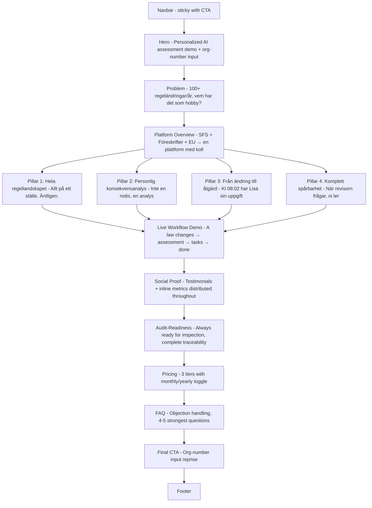
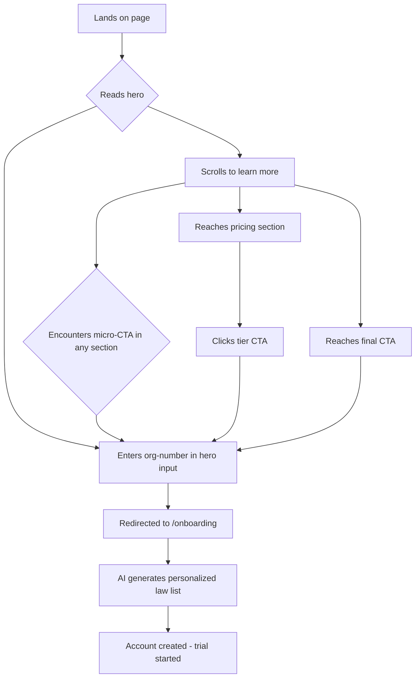
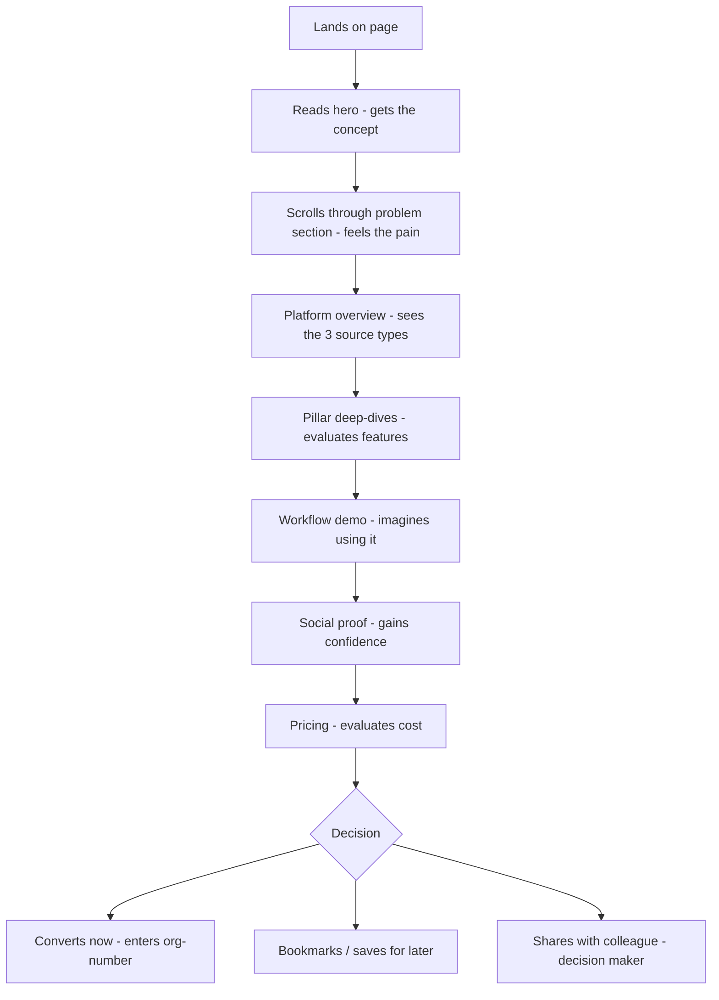

# Laglig.se Landing Page Revamp — UI/UX Specification

## 1. Introduction

This document defines the user experience goals, information architecture, user flows, and visual design specifications for **Laglig.se's landing page revamp**. It serves as the foundation for visual design and frontend implementation, ensuring the public-facing page accurately reflects the product's evolution into an AI-powered compliance operations platform.

### 1.1 Target User Personas

1. **Compliance-Anxious SME Owner** — Runs a 5-50 person company. Knows they *should* track laws but doesn't have time or legal expertise. Motivated by fear of fines and audit exposure. Needs to feel reassured instantly.

2. **HR/Compliance Manager (Mid-Market)** — Works at a 50-500 person company. Already doing compliance work manually (spreadsheets, consultants). Evaluating tools to reduce workload. Needs to see concrete workflow automation, team features, and ROI.

3. **C-Level Decision Maker** — Evaluating on behalf of the organization. Cares about trust signals, security, pricing, and whether this replaces their current consultant/manual process. Scans quickly — needs to "get it" in 10 seconds.

### 1.2 Usability Goals

1. **10-second clarity** — A visitor understands what Laglig does and why it matters within 10 seconds of landing
2. **2-click conversion** — From landing to onboarding in maximum 2 clicks
3. **Trust-first design** — Every section reinforces credibility (premium aesthetic, real product UI, clear data handling)
4. **Scroll momentum** — Each section creates enough intrigue to pull the visitor into the next one
5. **Conversion-optimized flow** — Every section has a clear job in the conversion funnel: Hero captures → Problem agitates → Solution demonstrates → Social proof validates → Pricing converts → CTA closes. No dead-end sections.
6. **Friction elimination** — No unnecessary form fields, no login walls before value is shown, persistent CTA visibility, and micro-commitments (org-number entry) that feel effortless

### 1.3 Design Principles

1. **Show, don't tell** — Use real product UI, interactive demos, and actual screenshots over abstract illustrations and marketing copy
2. **Elevated warmth** — Keep the established warm palette (creams, ambers, sage, emerald accents) but elevate it. Borrow selective elements from the logo's design language — grain texture, gradient technique, premium weight — applied within the existing color system. Warm but sophisticated, not warm and generic.
3. **Platform-first, not AI-first** — Laglig is a compliance operations platform, not an "AI wrapper." Lead with outcomes and domain authority. The intelligence is the engine, not the brand.
4. **Progressive depth** — Hero captures attention, middle sections build understanding, bottom sections close the deal
5. **Seamless brand bridge** — The landing page should feel like a natural extension of the authenticated app experience. Consistent color system, typography, and component language.
6. **Every section earns the next scroll** — If a section doesn't move the visitor closer to conversion, it doesn't belong. Each section should answer a specific objection or build a specific desire.
7. **Persistent but non-intrusive CTA** — The primary action ("Kom igång gratis" / org-number entry) should be reachable at all times without feeling pushy — sticky nav CTA + contextual CTAs at key decision points.

## 2. Information Architecture

### 2.1 Page Section Flow



### 2.2 Section Purpose Map (Conversion Funnel)

| Section | Funnel Stage | Job | Key Emotion |
|---------|-------------|-----|-------------|
| **Navbar** | — | Persistent CTA access, navigation | Orientation |
| **Hero** | ATTENTION | Show the AI agent delivering a personalized assessment. Org-number input as micro-commitment. | "This is different." |
| **Problem** | PROBLEM | Agitate the pain: SFS + föreskrifter + EU = impossible to track manually. 50+ changes/year across sources. | Fear / urgency |
| **Platform Overview** | SOLUTION | Show 3 regulatory sources funneling into one intelligent platform. Relief moment. | "Finally, someone handles this." |
| **Pillar Deep-Dives** | PROOF | Each pillar gets a visual deep-dive with real UI and inline testimonial. | Credibility / desire |
| **Live Workflow Demo** | DEMONSTRATION | Animated sequence: law changes → AI assesses impact → tasks created → employees notified. | "I can see myself using this." |
| **Social Proof** | VALIDATION | Metrics + quotes reinforcing claims made above. | Confidence |
| **Audit-Readiness** | TRUST | Show audit trail UI (Story 6.10), timestamps, export. Enterprise assurance. | Security / peace of mind |
| **Pricing** | DECISION | Clear tiers, yearly discount, trust badges. | Commitment readiness |
| **FAQ** | OBJECTION HANDLING | Answer remaining doubts: security, coverage, free trial, cancellation. | Reassurance |
| **Final CTA** | CLOSE | Reprise org-number input. "Ert företags personliga laglista väntar." | Action |

### 2.3 Key Structural Changes from Current Page

| # | Current Page | Proposed | Rationale |
|---|---|---|---|
| 1 | Hero shows static dashboard mockup | Hero shows **AI agent delivering a personalized assessment** with org-number input | Agent-first; the personalized analysis *is* the differentiator |
| 2 | Logo cloud ("1000+ företag") | **Removed** | Unverifiable vanity metric — replace with real inline proof |
| 3 | 6 equal feature cards | **4 pillars with hierarchy**: Regelbevakning, AI-agent, Uppgifter, Dokument | Reflects actual product architecture; HR & Export live within pillars |
| 4 | "How it Works" (3 steps) standalone | **Merged into hero** sub-message ("3 steg, 2 minuter") | Steps *are* the CTA flow — belong next to the button |
| 5 | Workflow timeline (text-based) | **Interactive product demo** with animated real UI | Show don't tell; strongest conversion driver |
| 6 | Testimonials clustered in one section | **Distributed as inline proof** after each pillar + dedicated section | Claim → Proof pattern |
| 7 | Compliance section (mini kanban) | **Audit-readiness section** with actual audit trail UI (Story 6.10) | Leverages new feature; enterprise selling point |
| 8 | No document management mention | **Documents & traceability pillar** added | Reflects actual product capability |
| 9 | No coverage breadth shown | **3 regulatory sources** (SFS, Föreskrifter, EU) shown explicitly | Coverage = moat; visitors must see the full scope |
| 10 | Generic "law change notification" | **Personalized assessment** as hero moment | "What this means for *your* company" is the #1 differentiator |

### 2.4 Navigation Structure

**Desktop Navbar (sticky):**
- Left: Laglig.se logo
- Center: Produkt · Priser · Resurser (smooth-scroll anchors)
- Right: Logga in (ghost button) · Kom igång gratis (primary pill CTA, always visible)

**Mobile Navbar:**
- Logo + hamburger → sheet drawer with same links
- Sticky bottom CTA bar: "Kom igång gratis" always visible on mobile

### 2.5 The 4 Pillars — Detailed Structure (Outcome-Forward)

#### Pillar 1: Hela regellandskapet
- **Headline:** "Allt på ett ställe. Äntligen."
- **Message:** "SFS, föreskrifter och EU-direktiv — samlat och bevakat."
- **Visual:** Three source columns (SFS 10,000+, Föreskrifter AFS/BFS/SKVFS/MSBFS..., EU GDPR/CBAM/NIS2...) funneling into one unified view
- **Inline proof:** Testimonial about catching a specific regulation change
- **Micro-CTA:** "Se vilka lagar som gäller ert företag"

#### Pillar 2: Personlig konsekvensanalys
- **Headline:** "Inte 'en lag ändrades.' Utan 'det här behöver ni göra.'"
- **Message:** "Varje ändring analyserad utifrån just er verksamhet, era anställda, era skyldigheter."
- **Visual:** Side-by-side: raw amendment vs. personalized assessment showing affected employees and recommended actions
- **Key differentiator:** Generic notification (competitor) vs. personalized consequence analysis (Laglig)
- **Inline proof:** Testimonial about time saved / fines avoided through early personalized warning
- **Micro-CTA:** "Prova med ert org-nummer"

#### Pillar 3: Från ändring till åtgärd
- **Headline:** "Lagen ändras kl 08:00. Kl 08:02 har Lisa sin uppgift."
- **Message:** "Ändringar blir uppgifter med ansvarig och deadline. Automatiskt."
- **Visual:** Real Kanban board UI from the app, showing auto-generated tasks with assignees and deadlines
- **Supporting views:** Calendar view, task assignment, priority levels
- **Inline proof:** Metric about tasks auto-created
- **Micro-CTA:** "Se hur det fungerar"

#### Pillar 4: Komplett spårbarhet
- **Headline:** "När revisorn frågar 'hur gör ni?' — ni ler."
- **Message:** "Allt dokumenterat, tidsstämplat, redo för revision."
- **Visual:** Document management UI + audit trail timeline (Story 6.10)
- **Key selling point:** Timestamps, who-did-what, one-click PDF/Excel export
- **Inline proof:** Testimonial about passing audit with complete traceability
- **Micro-CTA:** "Bygg ert compliance-arkiv"

### 2.6 Hero Section — Personalized Assessment as Hero Moment

**Brand tagline:** "Coolt med koll."

**Headline options (to be tested):**
- "Coolt med koll." + subtitle: "Ert företags hela regellandskap — bevakat, analyserat, hanterat."
- "Alltid steget före — oavsett vilken lag som ändras."
- "Ert företags hela regellandskap. Bevakat, analyserat, hanterat."

**Hero demo concept — platform notification style (not chatbot):**
```
┌─────────────────────────────────────────────────┐
│  Laglig · Konsekvensanalys                       │
│  ─────────────────────────────────────────────   │
│  AFS 2025:2 — Systematiskt arbetsmiljöarbete     │
│                                                  │
│  Påverkar er verksamhet:                         │
│  ■ 3 anställda behöver uppdaterad utbildning     │
│  ■ Deadline: 1 juni 2025                         │
│  ■ 2 uppgifter skapade automatiskt               │
│                                                  │
│  Lisa Andersson · Utbildning krävs               │
│  Erik Holm · Certifikat löper ut                  │
│                                                  │
│  [Visa uppgifter]  [Läs analysen]               │
└─────────────────────────────────────────────────┘
```

**Below hero demo:**
- Org-number input field with "Kom igång gratis" button
- Sub-text: "3 steg · 2 minuter · Inget kort krävs"
- Trust signals: Ingen bindning · GDPR-säkrad · Data i Sverige

### 2.7 Brand Voice & Copy Direction

**Voice formula:** Confident expertise + Swedish wit + zero corporate fluff

| Dimension | What it IS | What it ISN'T |
|---|---|---|
| **Clever** | Wordplay, rhythm, Swedish idioms twisted | Puns that undermine credibility |
| **Confident** | Declarative, short sentences, "we've got this" energy | Arrogant, dismissive of the problem |
| **Warm** | Conversational, human, occasionally cheeky | Cutesy, emoji-heavy, corporate "we're fun!" |
| **Trustworthy** | Domain expertise shows through specificity | Vague promises, hype words |

**Key copy rules:**
- Never say "AI" in primary messaging. Describe the behavior, not the technology. "Laglig analyserar" not "Laglig AI analyserar."
- Be specific — specificity *is* credibility ("3 anställda", "kl 08:02", "AFS 2025:2")
- One clever/witty line per section max. The rest is clear and substantive.
- Trust first, personality second. Never joke about consequences (fines, legal risk).
- Use Swedish wordplay and rhythm where natural ("koll/roll", "krav/brav", "lag/dag")

**Section copy direction:**
- **Problem:** "100+ regeländringar per år. Vem i ert team har det som hobby?"
- **Platform overview:** "SFS. Föreskrifter. EU-direktiv. Vi har koll. Ni har ro."
- **CTA closing:** "Compliance ska inte vara ert problem. Det ska vara ert försprång."
- **FAQ tone:** Real answer first, one cheeky sign-off line. E.g. "Säkrare än ert nuvarande Excel-ark."
- **Footer sign-off:** Echo of "Coolt med koll."

## 3. Wireframes & Key Layouts

### 3.1 Hero Section

```
┌──────────────────────────────────────────────────────────────────┐
│ NAVBAR: [Logo]        Produkt · Priser · Resurser     [Logga in] [Kom igång gratis] │
├──────────────────────────────────────────────────────────────────┤
│                                                                  │
│  LEFT COLUMN (55%)                RIGHT COLUMN (45%)             │
│  ┌────────────────────────┐      ┌───────────────────────────┐   │
│  │ Eyebrow: "Plattformen  │      │  PLATFORM NOTIFICATION    │   │
│  │ för svensk              │      │  ┌─────────────────────┐  │   │
│  │ lagefterlevnad"         │      │  │ Laglig · Konsekvens-│  │   │
│  │                         │      │  │ analys              │  │   │
│  │ H1: "Coolt med koll."  │      │  │                     │  │   │
│  │                         │      │  │ AFS 2025:2          │  │   │
│  │ Subtitle: "Ert företags│      │  │ Påverkar er:        │  │   │
│  │ hela regellandskap —   │      │  │ ■ 3 anställda       │  │   │
│  │ bevakat, analyserat,   │      │  │ ■ Deadline: 1 juni  │  │   │
│  │ hanterat."             │      │  │ ■ 2 uppgifter       │  │   │
│  │                         │      │  │                     │  │   │
│  │ [Org-nr input  ] [CTA] │      │  │ [Uppgifter] [Analys]│  │   │
│  │                         │      │  └─────────────────────┘  │   │
│  │ 3 steg · 2 min ·       │      │                           │   │
│  │ Inget kort              │      │  Warm gradient glow +     │   │
│  │                         │      │  grain texture behind     │   │
│  │ ✓ Ingen bindning       │      │                           │   │
│  │ ✓ GDPR-säkrad          │      │                           │   │
│  │ ✓ Data i Sverige       │      │                           │   │
│  └────────────────────────┘      └───────────────────────────┘   │
└──────────────────────────────────────────────────────────────────┘
```

### 3.2 Problem Section

```
┌──────────────────────────────────────────────────────────────────┐
│  bg-section-warm + subtle grain overlay                          │
│                                                                  │
│  H2: "100+ regeländringar per år.                                │
│       Vem i ert team har det som hobby?"                         │
│                                                                  │
│  ┌──────────────┐  ┌──────────────┐  ┌──────────────┐           │
│  │ SFS           │  │ Föreskrifter │  │ EU            │           │
│  │ 10 000+       │  │ AFS, BFS     │  │ GDPR, CBAM   │           │
│  │ författningar │  │ SKVFS, MSBFS │  │ NIS2...      │           │
│  │               │  │              │  │              │           │
│  │ ~50 ändr/år   │  │ ~30 ändr/år  │  │ ~20 ändr/år  │           │
│  └──────────────┘  └──────────────┘  └──────────────┘           │
│                                                                  │
│  "Tänk om någon redan hade koll. Och berättade vad det            │
│   betyder för just er."                                          │
└──────────────────────────────────────────────────────────────────┘
```

### 3.3 Platform Overview

```
┌──────────────────────────────────────────────────────────────────┐
│                                                                  │
│  H2: "SFS. Föreskrifter. EU-direktiv.                            │
│       Vi har koll. Ni har ro."                                   │
│                                                                  │
│    SFS              Föreskrifter          EU                     │
│     ╲                   │                ╱                        │
│      ╲                  │               ╱                         │
│       ▼                 ▼              ▼                          │
│  ┌────────────────────────────────────────────┐                  │
│  │           Laglig                            │                  │
│  │    Bevakar · Analyserar · Agerar           │                  │
│  └────────────────────────────────────────────┘                  │
│        │               │              │                          │
│        ▼               ▼              ▼                          │
│  [Regellandskap] [Konsekvensanalys] [Uppgifter] [Spårbarhet]    │
│                                                                  │
└──────────────────────────────────────────────────────────────────┘
```

### 3.4 Pillar Deep-Dives (Alternating Pattern)

```
┌──────────────────────────────────────────────────────────────────┐
│  Alternating: text-left/visual-right, then flip per pillar       │
│                                                                  │
│  LEFT (50%)                       RIGHT (50%)                    │
│  ┌───────────────────────┐       ┌────────────────────────────┐  │
│  │ Pillar icon + title    │       │ Real product screenshot     │  │
│  │                        │       │ or embedded component       │  │
│  │ H3 headline (witty)   │       │ with warm gradient border   │  │
│  │ Description paragraph  │       │ + grain texture             │  │
│  │                        │       │                             │  │
│  │ 3-4 bullet features    │       │                             │  │
│  │                        │       │                             │  │
│  │ ┌─ Inline testimonial─┐│       │                             │  │
│  │ │ "Quote..." — Name   ││       │                             │  │
│  │ └────────────────────┘│       │                             │  │
│  │                        │       │                             │  │
│  │ [Micro-CTA button]     │       │                             │  │
│  └───────────────────────┘       └────────────────────────────┘  │
└──────────────────────────────────────────────────────────────────┘
```

### 3.5 Pricing Section

```
┌──────────────────────────────────────────────────────────────────┐
│  H2: "Enkel prissättning. Inga överraskningar."                  │
│                                                                  │
│  [Månadsvis ○───● Årsvis — spara 17%]                            │
│                                                                  │
│  ┌──────────────┐  ┌────────────────┐  ┌──────────────┐          │
│  │  Solo         │  │   Team         │  │  Enterprise  │          │
│  │  399 kr/mån   │  │   899 kr/mån   │  │  Kontakta    │          │
│  │               │  │  ★ POPULÄR     │  │    oss       │          │
│  │ • 1 användare │  │ • 10 användare │  │ • Obegränsat │          │
│  │ • ...         │  │ • ...          │  │ • ...        │          │
│  │               │  │                │  │              │          │
│  │ [Välj Solo]   │  │ [Kom igång]    │  │ [Kontakta]   │          │
│  └──────────────┘  └────────────────┘  └──────────────┘          │
│                                                                  │
│  Trust: Ingen bindning · GDPR · Data i Sverige                   │
└──────────────────────────────────────────────────────────────────┘
```

### 3.6 Interaction Notes

- Hero demo card: subtle entrance animation (fade-up + scale), light glow on hover
- Org-number input: auto-focus on desktop for immediate engagement
- Pillar sections: alternating left/right layout creates visual rhythm
- Pricing toggle: smooth transition with price recalculation animation
- All micro-CTAs scroll-to or navigate to onboarding with org-number pre-filled where possible

## 4. User Flows

### 4.1 Primary Conversion: Visitor → Trial Signup

**User Goal:** Start using Laglig with their company's personalized law list

**Entry Points:** Direct URL, Google search, LinkedIn ad, referral

**Success Criteria:** Visitor enters org-number and reaches onboarding



**Edge Cases:**
- Visitor doesn't have org-number handy → provide "Välj bransch manuellt" fallback
- Visitor is on mobile → bottom sticky CTA ensures conversion is always one tap away
- Visitor wants to see pricing first → nav link jumps directly to pricing section
- Visitor is returning (already has account) → "Logga in" in navbar catches them

### 4.2 Information-Seeker: Visitor → Educated → Later Conversion

**User Goal:** Understand what Laglig does before committing

**Entry Points:** Same as above, but visitor is in research/evaluation mode



**Edge Cases:**
- HR manager needs CEO approval → page needs good og:meta and shareable URL for Slack/Teams forwarding
- Visitor comparing with competitors → FAQ addresses "Varför inte bara en jurist?"

### 4.3 Returning Visitor: Awareness → Conversion

**User Goal:** Convert after previous research visit

```mermaid
graph TD
    A[Returns to laglig.se] --> B{Recognizes the page}
    B --> C[Scrolls to pricing or CTA directly]
    C --> D[Enters org-number]
    D --> E[/onboarding]
```

**Design implication:** Navbar CTA must be prominent enough for < 5 second conversion without scrolling.

### 4.4 Conversion Design Notes

- **Single primary conversion action** (org-number entry) — no competing "book a demo" vs "start trial" vs "contact sales." Enterprise reaches out via pricing section "Kontakta oss."
- **Fallback for missing org-number** — "Välj bransch istället" link below input catches visitors who don't have it handy
- **Shareability** — Good og:image, og:description, clean URL. The HR/compliance manager persona often needs to convince a boss.

## 5. Component Library / Design System

### 5.1 Design System Approach

**Principle: Reuse the app's design system, elevate for marketing context.**

The landing page uses the same Shadcn/ui + Tailwind foundation as the app, with a thin marketing layer on top:

| Layer | Source | Purpose |
|---|---|---|
| **Base components** | Existing app (Button, Card, Badge, Input, Accordion) | Consistency + zero rework |
| **Marketing wrappers** | New landing-specific | Section containers, gradient borders, grain overlays, pillar cards |
| **Typography** | Existing (Safiro + Google Sans Flex) | Same fonts, bolder weight usage for headlines |
| **Colors** | Existing warm palette | Same tokens, new gradient compositions |

### 5.2 New Landing-Specific Components

**SectionContainer**
- Purpose: Wraps each section with consistent padding, max-width, optional background variant
- Variants: `default` (white), `warm` (bg-section-warm), `sage` (bg-section-sage), `cream` (bg-section-cream)
- Usage: Every section wraps in this. Controls vertical rhythm and responsive padding.

**GrainOverlay**
- Purpose: Adds subtle noise/grain texture borrowed from the logo's design language
- Variants: `light` (for warm backgrounds), `medium` (for CTA/dark sections)
- Implementation: CSS pseudo-element with noise SVG or tiny PNG tile
- Usage: Hero background, CTA section, pillar card borders for premium texture

**PillarCard**
- Purpose: Each of the 4 pillar deep-dive sections
- Variants: `left-visual` (text left, screenshot right), `right-visual` (flipped)
- States: Default, in-viewport (triggers entrance animation)
- Usage: 4 instances, alternating variants

**ProductPreviewCard**
- Purpose: Shows real product UI in an elevated frame
- Variants: `notification` (hero assessment card), `screenshot` (embedded app screenshot), `embedded` (live component)
- States: Default, hover (subtle glow intensifies)
- Usage: Hero section, each pillar visual

**InlineTestimonial**
- Purpose: Small testimonial block embedded within pillar sections
- Variants: `compact` (quote + name + role), `metric` (leading stat + quote)
- Usage: Within each pillar, and in social proof section

**MicroCta**
- Purpose: Contextual conversion button within content sections
- Variants: `primary` (filled), `ghost` (outlined)
- States: Default, hover (translateY(-1px) + shadow), focus
- Usage: Below each pillar, in workflow demo, after social proof

**OrgNumberInput**
- Purpose: The conversion input — org-number entry with CTA button
- Variants: `hero` (large, prominent), `inline` (compact), `final` (large, CTA section reprise)
- States: Empty, focused, loading (Bolagsverket lookup), error (invalid number), success (redirect)
- Usage: Hero section, final CTA section, optionally after pricing

**SourceBadge**
- Purpose: Shows regulatory source type (SFS, AFS, EU, etc.)
- Variants: By source type — each gets a subtle color accent
- Usage: Problem section columns, platform overview, pillar 1

### 5.3 Reused App Components (No Changes Needed)

- `Button` — primary, secondary, ghost variants
- `Card` — base card with existing shadow/border styles
- `Badge` — status badges (pricing tier labels)
- `Accordion` — FAQ section
- `Input` — base for OrgNumberInput
- `Switch` — pricing monthly/yearly toggle

## 6. Branding & Style Guide

### 6.1 Visual Identity

**Brand tagline:** "Coolt med koll."
**Brand positioning:** Premium compliance operations platform for Swedish businesses. Confident, warm, witty — never generic SaaS, never "AI wrapper."

### 6.2 Color Palette (Existing Tokens, New Compositions)

| Color Type | Token / Value | Landing Page Usage |
|---|---|---|
| Primary | `hsl(30 15% 12%)` warm dark | CTAs, navbar CTA, hero text |
| Primary-foreground | `hsl(40 20% 98%)` warm off-white | Text on primary backgrounds |
| Background | `hsl(40 20% 98%)` off-white | Page base, default section bg |
| Section-warm | `hsl(45 30% 96%)` beige | Problem section, alternating bgs |
| Section-sage | `hsl(140 25% 95%)` sage green | Audit-readiness section |
| Section-cream | `hsl(35 40% 97%)` cream | Platform overview, alternating bgs |
| Emerald | `emerald-400/500/600` | Success states, check icons, trust signals |
| Amber | `amber-50` to `amber-900` range | Warm accents, highlights, notification cards |
| Muted | `hsl(40 12% 94%)` | Secondary backgrounds, badge fills |
| Border | `hsl(35 10% 88%)` | Card borders, dividers |
| Destructive | `hsl(0 84% 60%)` | Error states (org-number validation) |

**New gradient compositions (existing colors, new layering):**
- Hero glow: `from-amber-200/40 via-orange-100/20 to-rose-100/30` radial behind product preview
- CTA section: `bg-primary` with warm radial overlays (white 0.3-0.4 opacity) + grain
- Pillar card borders: `from-amber-100/60 to-transparent` gradient border effect
- Section transitions: Soft gradient fades between backgrounds (no hard color breaks)

### 6.3 Typography

**Font Families:**
- **Display/Headlines:** Safiro (weight 500) — H1, H2, brand tagline
- **Body:** Google Sans Flex (variable 100-900) — all body text
- **Monospace:** System mono — unlikely on landing page

**Type Scale:**

| Element | Size | Weight | Font | Usage |
|---|---|---|---|---|
| Brand tagline | `text-6xl` → `text-8xl` | Safiro 500 | Safiro | "Coolt med koll." hero only |
| H1 | `text-4xl` → `text-6xl` | Safiro 500 | Safiro | Hero subtitle |
| H2 | `text-3xl` → `text-4xl` | Safiro 500 | Safiro | Section headlines |
| H3 | `text-xl` → `text-2xl` | GS Flex 600 | Google Sans Flex | Pillar titles |
| Body large | `text-lg` | GS Flex 400 | Google Sans Flex | Section intros |
| Body | `text-base` | GS Flex 400 | Google Sans Flex | Descriptions, FAQ |
| Small | `text-sm` | GS Flex 400 | Google Sans Flex | Trust signals, captions |
| Witty line | `text-lg` italic | GS Flex 500 | Google Sans Flex | Personality lines |

### 6.4 Iconography

**Library:** Lucide React (consistent with app)

**Usage rules:**
- Pillar icons: 24-32px, `text-primary` on `bg-primary/10` circle
- Trust checkmarks: `Check` in `text-emerald-500`
- Source badges: Scale (SFS), Building (Föreskrifter), Globe (EU)
- Feature bullets: 16px inline with text
- No decorative icons — every icon is informational

### 6.5 Spacing & Layout

**Grid:** CSS Grid + Flexbox, `max-w-7xl` centered container

**Spacing scale:**
- Section padding: `py-16 md:py-24 lg:py-32`
- Element spacing: `space-y-8 md:space-y-12`
- Card padding: `p-6 md:p-8`
- Grid gaps: `gap-8 md:gap-12 lg:gap-16`

### 6.6 Grain Texture (Brand Elevation Element)

Borrowed from the logo's design language — the single biggest visual upgrade:

- **Implementation:** `::after` pseudo-element, `background-image: url('/grain.svg')`, `opacity: 0.03-0.06`, `mix-blend-mode: multiply`
- **Applied to:** Hero section, CTA section, ProductPreviewCard backgrounds
- **Effect:** Subtle organic texture that prevents flat-digital feel
- **Performance:** Negligible — tiny SVG tile, CSS-only rendering

### 6.7 Brand Voice Summary

| Dimension | IS | ISN'T |
|---|---|---|
| Clever | Swedish wordplay, rhythm, twisted idioms | Puns that undermine credibility |
| Confident | Declarative, short, "we've got this" | Arrogant or dismissive |
| Warm | Conversational, human, occasionally cheeky | Cutesy, emoji-heavy, corporate |
| Trustworthy | Specificity = credibility | Vague promises, hype |

**Copy rules:**
- Never say "AI" in primary messaging — describe behavior, not technology
- Be specific ("3 anställda", "kl 08:02", "AFS 2025:2")
- One witty line per section max, rest is clear substance
- Trust first, personality second — never joke about fines/legal risk
- Swedish wordplay where natural ("koll/roll", "krav/brav")

---

## 7. Accessibility Requirements

### 7.1 Compliance Target

**Standard:** WCAG 2.1 Level AA

### 7.2 Key Requirements

**Visual:**
- Color contrast: Minimum 4.5:1 for body text, 3:1 for large text (H1/H2). All existing warm palette tokens already meet this against the off-white background.
- Focus indicators: Visible focus ring (`ring-2 ring-primary ring-offset-2`) on all interactive elements. Critical for org-number input and CTA buttons.
- Text sizing: All text responds to browser font-size preferences. No fixed px sizes for body text.

**Interaction:**
- Keyboard navigation: Full tab-through of navbar → hero input → all micro-CTAs → pricing → FAQ → final CTA. Logical tab order follows visual flow.
- Screen reader support: All sections have semantic HTML landmarks (`<nav>`, `<main>`, `<section>` with `aria-label`), product preview card has descriptive `aria-label` for the assessment demo content.
- Touch targets: Minimum 44x44px for all buttons and interactive elements. Mobile sticky CTA bar meets this.

**Content:**
- Alternative text: All product screenshots have descriptive alt text explaining what the UI shows. Decorative gradient/grain elements use `aria-hidden="true"`.
- Heading structure: Single H1 (brand tagline or hero headline), logical H2→H3 nesting per section. No skipped levels.
- Form labels: Org-number input has visible label or `aria-label`. Error messages linked via `aria-describedby`.

### 7.3 Testing Strategy

- Automated: axe-core/Lighthouse in CI pipeline
- Manual: Keyboard-only navigation test, screen reader walkthrough (VoiceOver + NVDA)
- Contrast: Verify all grain-overlaid sections still meet contrast ratios (grain at 3-6% opacity should not affect this, but verify)

---

## 8. Responsiveness Strategy

### 8.1 Breakpoints

| Breakpoint | Min Width | Target Devices |
|---|---|---|
| Mobile | 0px | Phones (portrait) |
| Tablet | 768px (md) | Tablets, small laptops |
| Desktop | 1024px (lg) | Laptops, desktops |
| Wide | 1280px (xl) | Large monitors |

### 8.2 Adaptation Patterns

**Layout:**
- Hero: 2-column (desktop) → stacked, text above demo card (mobile)
- Pillar deep-dives: 2-column alternating (desktop) → stacked (mobile), visual always below text
- Problem section: 3-column source cards (desktop) → horizontal scroll or stacked (mobile)
- Pricing: 3-column (desktop) → stacked with Team tier first/highlighted (mobile)
- Platform overview: Horizontal funnel diagram (desktop) → vertical flow (mobile)

**Navigation:**
- Desktop: Full horizontal navbar with inline links + CTA
- Mobile: Logo + hamburger → sheet drawer. Sticky bottom CTA bar ("Kom igång gratis") always visible

**Content priority (mobile):**
- Hero headline + org-number input are immediately visible (no scroll needed)
- Product demo card below fold is acceptable on mobile — the CTA is above fold
- Testimonials collapse to single-quote carousel on mobile
- FAQ accordion unchanged — already mobile-friendly

**Interaction:**
- Desktop: Hover effects on cards, auto-focus on org-number input
- Mobile: No hover effects, larger touch targets (48px min), sticky bottom CTA bar
- Tablet: Hybrid — hover effects active, 2-column layouts maintained where space allows

---

## 9. Animation & Micro-interactions

### 9.1 Motion Principles

- **Purposeful only** — Every animation communicates state, draws attention, or creates continuity. No animation for decoration.
- **Fast and respectful** — 200-400ms for UI transitions, 600ms max for entrance animations. Never block interaction.
- **Reduced motion** — All animations respect `prefers-reduced-motion: reduce`. Fallback to instant state changes.
- **Scroll-triggered, not scroll-jacked** — Sections animate into view on scroll, but the user always controls scroll speed and direction.

### 9.2 Key Animations

- **Hero entrance** — Brand tagline fades up (0→1 opacity, 20px translateY, 600ms ease-out). Product demo card follows with 200ms delay, slight scale (0.95→1). Staggered for visual rhythm.
- **Section reveal** — Each section fades up when entering viewport (IntersectionObserver). 400ms, ease-out. Triggered once only.
- **Product demo card hover** — Subtle glow intensification (box-shadow opacity 0.1→0.2) + translateY(-2px). 200ms ease.
- **Org-number input focus** — Border color transition to primary, subtle ring glow. 150ms.
- **Org-number loading** — Spinner/shimmer in button while Bolagsverket lookup runs. Smooth transition to success state.
- **Pricing toggle** — Switch slides with 200ms ease, price numbers animate (counter or fade-swap). Yearly discount badge scales in.
- **FAQ accordion** — Height animation 300ms ease-in-out (existing Shadcn accordion behavior).
- **Pillar card entrance** — Staggered fade-up for text elements (title → description → bullets → testimonial → CTA), 100ms delay between each. Visual side fades in simultaneously.
- **Micro-CTA hover** — translateY(-1px) + shadow increase. 150ms ease.

---

## 10. Performance Considerations

### 10.1 Performance Goals

- **Page Load (LCP):** < 2.5s on 4G connection. Hero text + CTA must be interactive within 1.5s.
- **Interaction Response (INP):** < 200ms for all interactions (CTA clicks, accordion toggles, pricing switch)
- **Animation FPS:** 60fps for all animations. No layout-triggering animations (use transform/opacity only).
- **CLS:** < 0.1. No layout shifts from fonts loading, images appearing, or dynamic content.

### 10.2 Design Strategies

- **Font loading:** Preload Safiro (critical for hero) and Google Sans Flex. Use `font-display: swap` with size-adjusted fallback to prevent CLS.
- **Product screenshots:** Use Next.js `<Image>` with blur placeholder for all product preview images. WebP format, responsive `srcset`.
- **Grain texture:** Tiny inline SVG (< 1KB) rather than external image. No performance impact.
- **Animations:** CSS transforms/opacity only — no JavaScript-driven layout animations. `will-change: transform` on animated elements.
- **Section lazy-loading:** Below-fold sections can defer non-critical resources (testimonial images, pricing calculator logic).
- **Bundle size:** No new heavy dependencies for the landing page. Reuse existing component library. Intersection Observer is native.

---

## 11. Next Steps

### 11.1 Immediate Actions

1. Review and approve this spec with stakeholders
2. Create/capture product screenshots for pillar visuals and hero demo card
3. Finalize hero headline copy — A/B test "Coolt med koll" vs alternatives
4. Implement GrainOverlay component and validate visual effect
5. Build OrgNumberInput component with Bolagsverket lookup integration
6. Develop section-by-section, starting with Hero → Problem → Platform Overview
7. Write final Swedish copy for all sections following brand voice guidelines
8. Mobile responsiveness pass after desktop implementation
9. Accessibility audit (axe-core + manual keyboard/screen reader test)
10. Performance audit (Lighthouse, Core Web Vitals)

### 11.2 Design Handoff Checklist

- [ ] All user flows documented
- [ ] Component inventory complete
- [ ] Accessibility requirements defined
- [ ] Responsive strategy clear
- [ ] Brand guidelines incorporated
- [ ] Performance goals established
- [ ] Copy direction and brand voice defined
- [ ] Wireframes for all major sections
- [ ] Conversion funnel mapped
- [ ] Existing component reuse identified

---

## Change Log

| Date | Version | Description | Author |
|------|---------|-------------|--------|
| 2026-03-16 | 0.1 | Initial draft — landing page revamp spec | Sally (UX Expert) |
